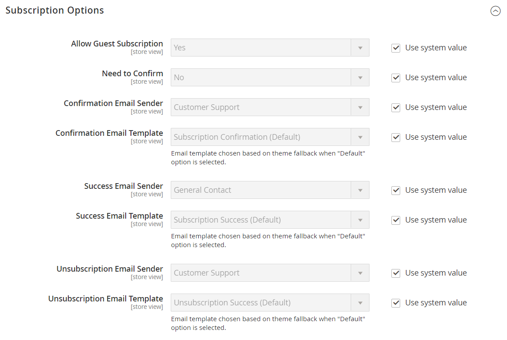

# [!UICONTROL Customers] > [!UICONTROL Newsletter]

{{config}}

>[!NOTE]
>
>このニュースレターは、顧客向けニュースや割引などのマーケティングメールを送信できるマーケティング機器の一部です。 登録された顧客は、自分の購読を自分の [アカウントダッシュボード](../../customers/account-dashboard-my-account.md).

## [!UICONTROL General Options]

<!-- zoom -->

| フィールド | [範囲](../../getting-started/websites-stores-views.md#scope-settings) | 説明 |
|--- |--- |--- |
| [!UICONTROL Enabled] | ストア表示 | ストア表示の範囲でニュースレターが有効になっているかどうかを判断します。 オプション： `Yes` / `No` |

{style="table-layout:auto"}

## [!UICONTROL Subscription Options]

<!-- zoom -->

<!-- [Subscription Options](https://docs.magento.com/user-guide/marketing/newsletter-configuration.html) -->

| フィールド | [範囲](../../getting-started/websites-stores-views.md#scope-settings) | 説明 |
|--- |--- |--- |
| [!UICONTROL Allow Guest Subscription] | ストア表示 | 未登録のゲストがニュースレターを購読できるかどうかを指定します。 オプション： `Yes` / `No` |
| [!UICONTROL Need to Confirm] | ストア表示 | 購読リクエストを確認する必要があるかどうかを指定します。 この二重のオプトイン方法は、ユーザーが同意なしに購読登録されるのを防ぐ検証方法です。 オプション： `Yes` / `No` |
| [!UICONTROL Confirmation Email Sender] | ストア表示 | 購読リクエストを確認するために送信された E メールの送信者として表示されるストアの連絡先を識別します。 |
| [!UICONTROL Confirmation Email Template] | ストア表示 | ニュースレターの購読リクエストを確認するために送信される通知に使用する電子メールテンプレートを決定します。 デフォルトのテンプレート： `Newsletter subscription confirmation` |
| 成功したメール送信者 | ストア表示 | ニュースレターを正常に購読した人に送信された電子メールの送信者として表示されるストアの連絡先を識別します。 |
| [!UICONTROL Success Email Template] | ストア表示 | ニュースレターを正常に購読したユーザーに送信する通知に使用する電子メールテンプレートを決定します。 デフォルトのテンプレート： `Newsletter subscription success` |
| [!UICONTROL Unsubscription Email Sender] | ストア表示 | ニュースレターの購読の終了をリクエストする人に送信された電子メールの送信者として表示されるストアの連絡先を識別します。 |
| [!UICONTROL Unsubscription Email Template] | ストア表示 | ニュースレターの購読の終了をリクエストするユーザーに送信する通知に使用する電子メールテンプレートを決定します。 デフォルトのテンプレート： `Newsletter unsubscription success` |

{style="table-layout:auto"}
