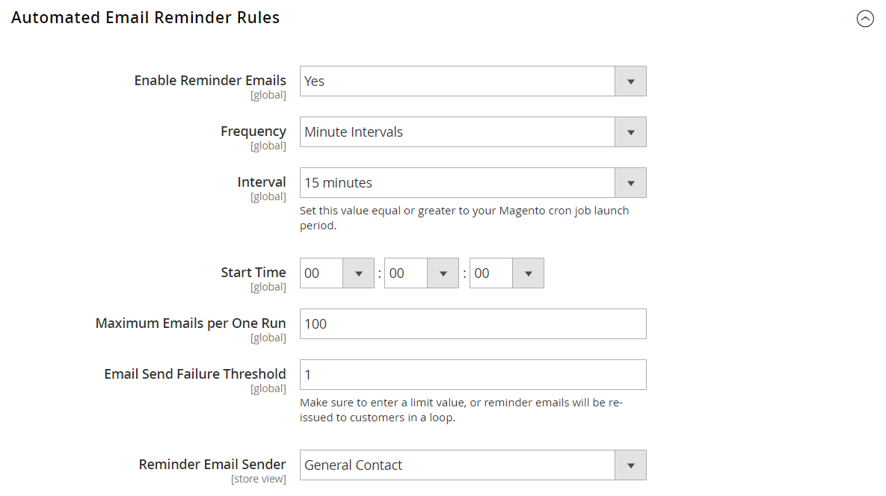

# [!UICONTROL Customers] > [!UICONTROL Promotions]

{{config}}

## [!UICONTROL Automated Email Reminder Rules]

{{ee-feature}}

<!-- zoom -->

<!-- [Automated Email Reminder Rules](https://experienceleague.adobe.com/en/docs/commerce-admin/marketing/communications/email-reminders/email-reminder-rules#configure-email-reminders) -->

| フィールド | [範囲](../../getting-started/websites-stores-views.md#scope-settings) | 説明 |
|--- |--- |--- |
| [!UICONTROL Enable Reminder Emails] | グローバル | 自動メールリマインダーを有効にします。 これを「いいえ」に設定すると、残りの設定は無視されます。 オプション：`Yes` / `No` |
| [!UICONTROL Frequency] | グローバル | 自動メールリマインダーの対象となる新規顧客をCommerceが確認する頻度を示します。 オプション： **`Minute Intervals`**– 選択した間隔に従って電子メールを送信します。 （5分、10分、15分、20分、または30分） **`Hourly`** – 指定した時間の後の分に、毎時間メールを送信します。 0 ～ 59の値を入力してください。 **`Daily`**– 開始時刻から毎日メールを送信します。 |
| [!UICONTROL Interval] | グローバル | 間隔は、cron.phpの起動期間以上である必要があります。 オプション：`5 minutes` / `10 minutes` / `15 minutes` / `20 minutes` / `30 minutes` |
| [!UICONTROL Start Time] | グローバル | メールが送信される日、分、秒を設定します。 サーバーのシステム時間に基づいて、24時間形式で指定されます。 |
| [!UICONTROL Maximum Emails per One Run] | グローバル | スケジュールされたブロックで送信されるメールの数を制限します。 |
| [!UICONTROL Email Send Failure Threshold] | グローバル | リマインダーが特定の電子メールアドレスに通知を送信しようとし、失敗した回数。 値が0に設定されている場合、しきい値はなく、失敗しても通知は引き続き送信されます。 |
| [!UICONTROL Reminder Email Sender] | ストアビュー | メールの送信者として表示されるストア ID。 |

{style="table-layout:auto"}

## [!UICONTROL Auto Generated Specific Coupon Codes]

<!-- zoom -->

<!-- [Auto Generated Specific Coupon Codes](https://experienceleague.adobe.com/en/docs/commerce-admin/marketing/promotions/cart-rules/price-rules-cart-coupon#configure-coupon-codes)  -->

| フィールド | [範囲](../../getting-started/websites-stores-views.md#scope-settings) | 説明 |
|--- |--- |--- |
| [!UICONTROL Code Length] | グローバル | 接頭辞、接尾辞、区切り記号を除いたクーポンコードの長さを定義します。 |
| [!UICONTROL Code Format] | グローバル | クーポンコード形式を定義します。 オプションは次のとおりです。 **`Alphanumeric`**– 文字と数字の任意の組み合わせ。 **`Alphabetical`** – 文字のみ。 **`Numeric`**– 数字のみ。 |
| [!UICONTROL Code Prefix] | グローバル | すべてのクーポンコードの先頭に追加される値。 接頭辞を使用しない場合は、フィールドを空白のままにします。 |
| [!UICONTROL Code Suffix] | グローバル | すべてのコードの末尾に追加される値。 接尾辞を使用しない場合は、フィールドを空白のままにします。 |
| [!UICONTROL Dash Every X Characters] | グローバル | すべてのクーポンコードにダッシュ（ – ）を挿入する間隔。 ダッシュを使用しない場合は、フィールドを空白のままにします。  _&#x200B;**注意：**&#x200B;_ ダッシュのみで異なるクーポンコードは、異なるコードと見なされます。 |

{style="table-layout:auto"}
