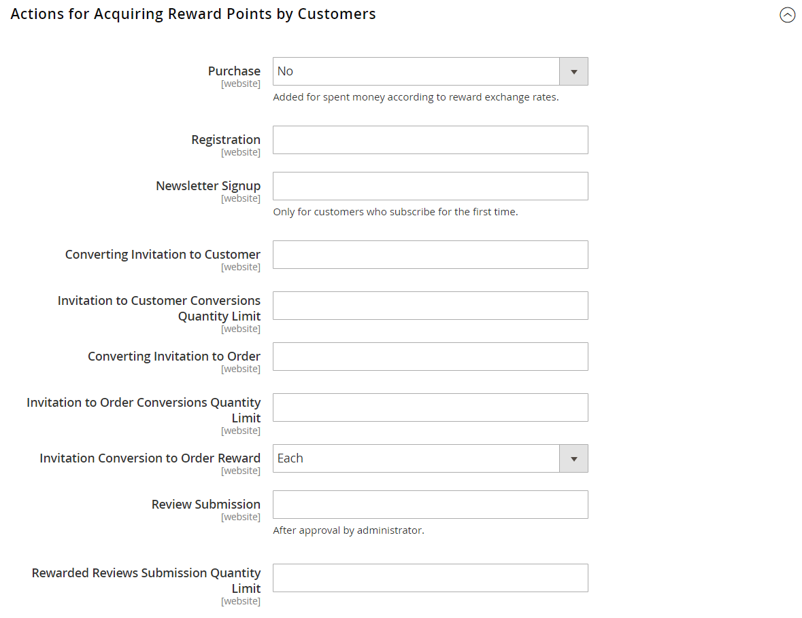

# [!UICONTROL Customers] > [!UICONTROL Reward Points]

{{ee-feature}}

{{config}}

>[!NOTE]
>
>[&#x200B; 報酬為替レート &#x200B;](../../merchandising-promotions/reward-exchange-rates.md) チェックアウト時に顧客と管理者が報酬ポイントを引き換えるには、設定が必要です。

## [!UICONTROL Reward Points]

<!-- zoom -->

<!-- [Reward Points](https://experienceleague.adobe.com/ja/docs/commerce-admin/marketing/merchandising/reward-points/rewards-loyalty#enable-reward-point-operations-for-your-store) -->

| フィールド | [&#x200B; 範囲 &#x200B;](../../getting-started/websites-stores-views.md#scope-settings) | 説明 |
|--- |--- |----------------------------------------------------------------------------------------------------------------------------------------------------------------------------------------------------------------------------------------------------------------------------------------------------------------------------------------------------------------------------------------------------------------------------------------------------------------------------------------------------------------------------------------------------------------------|
| [!UICONTROL Enable Reward Points Functionality] | グローバル | 報酬ポイントをアクティブまたは非アクティブにします。 オプション：`Yes`/`No`。 |
| [!UICONTROL Enable Reward Points Functionality on Storefront] | Web サイト | 有効にすると、顧客はアクティビティを通じてポイントを獲得し、チェックアウト時に引き換えることができます。 無効にした場合、管理者ユーザーのみが顧客の代わりにポイントを割り当てて引き換えることができます。 オプション：`Yes`/`No`。 |
| [!UICONTROL Customers May See Reward Points History] | Web サイト | 有効にすると、顧客は、アカウントダッシュボードで報酬ポイントの発生、償還および期限切れごとに詳細な履歴を表示できます。 オプション：`Yes` / `No` |
| [!UICONTROL Reward Points Balance Redemption Threshold] | Web サイト | 顧客が注文に交換する前に、最小ポイント残高を達成する必要があります。 空白のままにします。 |
| [!UICONTROL Cap Reward Points Balance At] | Web サイト | 顧客がこの最大ポイント残高を超えて積み立てないようにします。 最大値に関しては空白のままにします。 |
| [!UICONTROL Reward Points Expire in (days)] | Web サイト | 報酬ポイントの有効期間（日数）を示します。 別々のアクティビティで獲得したポイントのバッチごとに、別々の有効期間があります。 報酬ポイント履歴の各バッチには、ポイントの有効期限が切れるまでの残り日数が示されます。 履歴は、顧客のアカウントダッシュボード（有効な場合）や管理者から表示できます。 有効期限がない場合は、空白のままにします。 |
| [!UICONTROL Reward Points Expiry Calculation] | Web サイト | 報酬ポイントの有効期限が切れるタイミングを決定するために使用する方法を決定します。 オプション： **`Static`**– 設定で設定された日数に基づいて、報酬ポイントの残りの有効期間を決定します。 設定の有効期限が変更された場合、既存のポイントの有効期限は変更されません。 **`Dynamic`** – 報酬ポイント残高が増加した場合の残り日数を計算します。 設定の有効期限制限が変更されると、それに応じて、既存のすべてのポイントの有効期限計算が更新されます。 |
| [!UICONTROL Refund Reward Points Automatically] | グローバル | 利用可能な報酬ポイントが自動的に払い戻されるかどうかを決定します。 オプション：`Yes` / `No` |
| [!UICONTROL Deduct Reward Points from Refund Amount Automatically] | グローバル | この機能が有効化されている場合、購入を通じて獲得した報酬ポイントが注文払い戻し時に完全に無効になるか、一部が無効になるかを決定します。 その注文が返金される際に影響を受けるのは、その注文で獲得したポイントのみです。 オプション：`Yes`/`No`。 |
| [!UICONTROL Landing Page] | ストア表示 | 報酬ポイント プログラムについて説明するCMS ページを指定します。 ポイントを獲得できるストアの場所に、デフォルトの報酬ページへのリンクが表示されます。 |

{style="table-layout:auto"}

## [!UICONTROL Actions for Acquiring Reward Points by Customers]

<!-- zoom -->

<!-- [Actions for Acquiring Reward Points by Customers](https://experienceleague.adobe.com/ja/docs/commerce-admin/marketing/merchandising/reward-points/rewards-loyalty#enable-reward-point-operations-for-your-store) -->

| フィールド | [&#x200B; 範囲 &#x200B;](../../getting-started/websites-stores-views.md#scope-settings) | 説明 |
|--- |--- |----------------------------------------------------------------------------------------------------------------------------------------------------------------------------------------------------------------------------------------------------------------------------------------------------------------------------------------------------------------------------------------------------------------------------------------------------------------------------------------------------------------------------------------------------------------------------------------------------|
| [!UICONTROL Purchase] | Web サイト | 設定された [&#x200B; 報酬為替レート &#x200B;](../../merchandising-promotions/reward-exchange-rates.md) に基づいて、購入に対して報酬ポイントを獲得するかどうかを決定します。 オプション：`Yes` / `No` |
| [!UICONTROL Registration] | Web サイト | 顧客アカウントを開設するために獲得したポイント数を指定します。 |
| [!UICONTROL Newsletter Signup] | Web サイト | ニュースレターを購読する登録済みのお客様が獲得したポイント数を指定します。 （ご宿泊のお客様はポイントをご利用いただけません。 顧客が購読解除してから再度購読した場合、2 回目の購読ではポイントは獲得されません。 |
| [!UICONTROL Converting Invitation to Customer] | Web サイト | 招待状を送信した顧客が顧客アカウントを開設したときに獲得したポイント数を指定します。 |
| [!UICONTROL Invitation to Customer Conversions Quantity Limit] | Web サイト | 招待状を送信した顧客のポイント獲得に使用できる招待状コンバージョンの数を制限します。 制限なしには空白のままにします。 |
| [!UICONTROL Converting Invitation to Order] | Web サイト | 受信者が最初に注文したときに招待を送信した顧客が獲得したポイント数を指定します。 |
| [!UICONTROL Invitation to Order Conversions Quantity Limit] | Web サイト | 招待状を送信した人物に対してポイントを獲得できる注文コンバージョンの数を制限します。 空白の場合、上限はありません。 |
| [!UICONTROL Invitation Conversion to Order Reward] | Web サイト | 招待者が購入したときに、顧客が報酬ポイントを獲得できる頻度を示します。 オプション： **`Each`**– 顧客は、招待者が注文した各請求済み注文に対して報酬ポイントを受け取ります。 報酬ポイントは、web サイトと顧客グループの必要な組み合わせに設定された為替レートに従って付与されます。 **`First`** – 顧客は、招待者が最初に注文した請求済み注文に対してのみ報酬ポイントを受け取ります。 複数の招待ユーザーが注文を登録して行った場合は、最初の注文の金額のみが報酬ポイントに変換され、顧客に付与されます。 |
| [!UICONTROL Review Submission] | Web サイト | 公開用に承認されたレビューを送信した顧客が獲得したポイント数を決定します。 |
| [!UICONTROL Rewarded Reviews Submission Quantity Limit] | Web サイト | 顧客ごとのポイント獲得に使用できるレビューの数を制限します。 制限なしには空白のままにします。 |

{style="table-layout:auto"}

## [!UICONTROL Email Notification Settings]

<!-- zoom -->

<!-- [Email Notification Settings](https://experienceleague.adobe.com/ja/docs/commerce-admin/marketing/merchandising/reward-points/rewards-loyalty#enable-reward-point-operations-for-your-store) -->

| フィールド | [&#x200B; 範囲 &#x200B;](../../getting-started/websites-stores-views.md#scope-settings) | 説明 |
|--- |--- |--- |
| [!UICONTROL Email Sender] | ストア表示 | 残高更新および有効期限通知メールの送信者として表示される店舗連絡先を決定します。 |
| [!UICONTROL Subscribe Customers by Default] | グローバル | 残高更新と有効期限通知の両方の電子メールに対する顧客の既定のサブスクリプション ステータスを決定します。 |
| [!UICONTROL Balance Update Email] | ストア表示 | 顧客のポイント残高が更新されるたびに顧客に送信される通知に使用されるテンプレートを決定します。 既定のテンプレート：`Reward Points Balance Update` |
| [!UICONTROL Reward Points Expiry Warning Email] | ストア表示 | ポイントのバッチの有効期限警告制限に達した場合に顧客が受け取るメールのテンプレートを決定します。 既定のテンプレート：`Reward Points Expiry Warning` |
| [!UICONTROL Expiry Warning before (days)] | グローバル | 通知を送信する、有効期限が切れるまでの日数を指定します。 空白のままにすると、有効期限通知は送信されません。 入力した日数がポイントの残りのライフタイムよりも大きい場合、通知は送信されません。 |

{style="table-layout:auto"}
