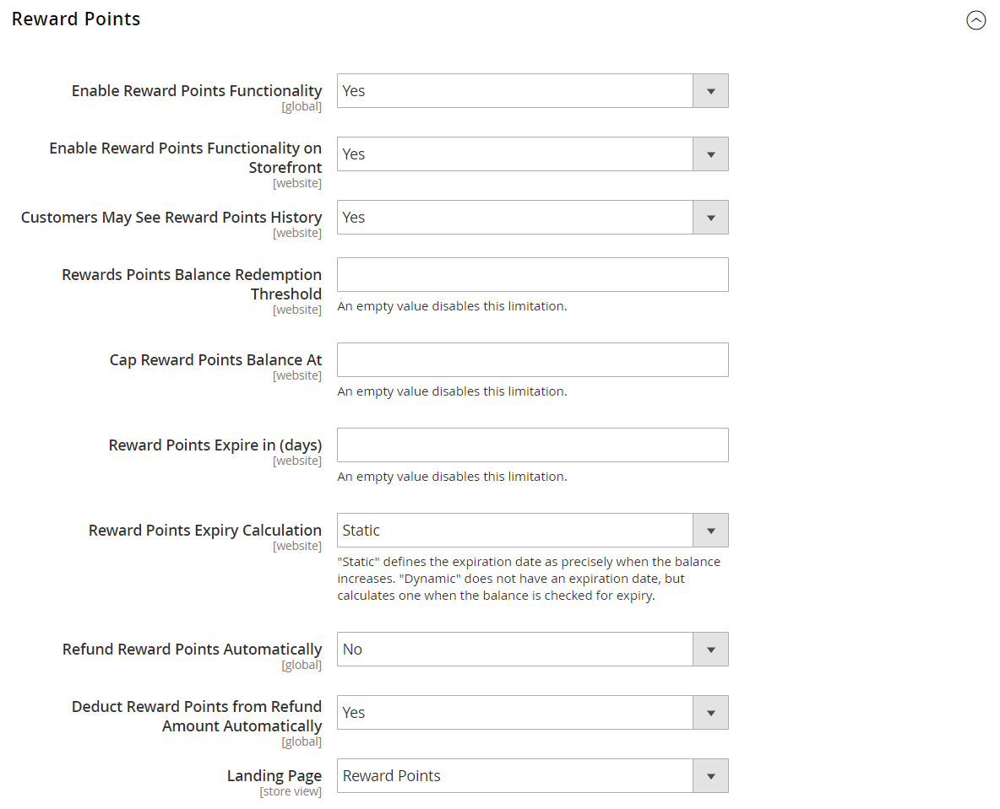
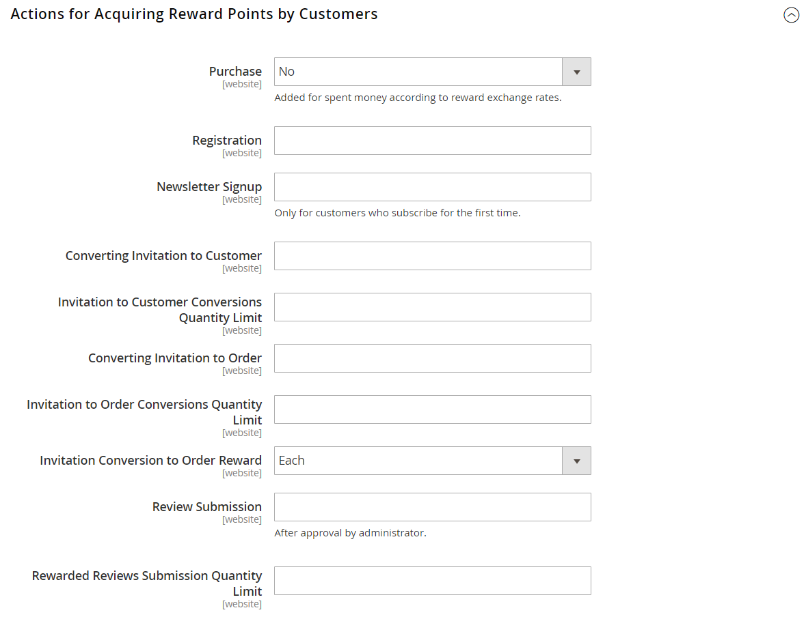

# [!UICONTROL Customers] > [!UICONTROL Reward Points]

{{ee-feature}}

{{config}}

>[!NOTE]
>
>チェックアウト時にお客様および管理者が報酬ポイントを引き換えるには、[報酬交換率](../../merchandising-promotions/reward-exchange-rates.md)の設定が必要です。

## [!UICONTROL Reward Points]

<!-- zoom -->

<!-- [Reward Points](https://experienceleague.adobe.com/en/docs/commerce-admin/marketing/merchandising/reward-points/rewards-loyalty#enable-reward-point-operations-for-your-store) -->

| フィールド | [範囲](../../getting-started/websites-stores-views.md#scope-settings) | 説明 |
|--- |--- |----------------------------------------------------------------------------------------------------------------------------------------------------------------------------------------------------------------------------------------------------------------------------------------------------------------------------------------------------------------------------------------------------------------------------------------------------------------------------------------------------------------------------------------------------------------------|
| [!UICONTROL Enable Reward Points Functionality] | グローバル | 報酬ポイントを有効化または無効化します。 オプション：`Yes` / `No`。 |
| [!UICONTROL Enable Reward Points Functionality on Storefront] | web サイト | これを有効にすると、顧客はアクティビティを通じてポイントを獲得し、チェックアウト時に引き換えることができます。 無効にした場合、顧客に代わってポイントを割り当てて引き換えることができるのは管理者ユーザーのみです。 オプション：`Yes` / `No`。 |
| [!UICONTROL Customers May See Reward Points History] | web サイト | 有効にすると、顧客はアカウントダッシュボードでポイントの見越金、引き換え、有効期限の詳細な履歴を確認できます。 オプション：`Yes` / `No` |
| [!UICONTROL Reward Points Balance Redemption Threshold] | web サイト | 顧客は、注文に引き換える前に、最小限のポイント残高を達成する必要があります。 最低限は空白のままにしておきます。 |
| [!UICONTROL Cap Reward Points Balance At] | web サイト | お客様がこの最大ポイント残高を超えて獲得するのを防ぎます。 空白を最大にしないでください。 |
| [!UICONTROL Reward Points Expire in (days)] | web サイト | 報酬ポイントの有効期間を日数で示します。 それぞれの活動で獲得したポイントは、それぞれ生涯が異なります。 報酬ポイント履歴の各バッチは、ポイントの有効期限が切れるまでの残り日数を示します。 履歴は、顧客のアカウントダッシュボード、有効になっている場合、および管理者から表示できます。 有効期限がないので空白のままにします。 |
| [!UICONTROL Reward Points Expiry Calculation] | web サイト | 報酬ポイントの有効期限を決定するために使用する方法を指定します。 オプション： **`Static`**– 設定で設定された日数に基づいて、報酬ポイントの残りの有効期間を決定します。 設定の有効期限が変更された場合、既存のポイントの有効期限は変更されません。 **`Dynamic`** – 報酬ポイント残高が増加するたびに、残りの日数を計算します。 設定の有効期限が変更された場合、すべての既存ポイントの有効期限の計算は、それに応じて更新されます。 |
| [!UICONTROL Refund Reward Points Automatically] | グローバル | 利用可能な報酬ポイントが自動的に返金されるかどうかを指定します。 オプション：`Yes` / `No` |
| [!UICONTROL Deduct Reward Points from Refund Amount Automatically] | グローバル | この機能が有効になっている場合、購入によって獲得した報酬ポイントが注文の払い戻しによって完全または部分的に無効になるかどうかを判断します。 その注文が返金されたときに影響を受けるのは、獲得した注文からの報酬ポイントのみです。 オプション：`Yes` / `No`。 |
| [!UICONTROL Landing Page] | ストアビュー | 報酬ポイントプログラムについて説明するCMS ページを指定します。 デフォルトの報酬ページへのリンクは、ポイントを獲得できるストア内の場所に表示されます。 |

{style="table-layout:auto"}

## [!UICONTROL Actions for Acquiring Reward Points by Customers]

<!-- zoom -->

<!-- [Actions for Acquiring Reward Points by Customers](https://experienceleague.adobe.com/en/docs/commerce-admin/marketing/merchandising/reward-points/rewards-loyalty#enable-reward-point-operations-for-your-store) -->

| フィールド | [範囲](../../getting-started/websites-stores-views.md#scope-settings) | 説明 |
|--- |--- |----------------------------------------------------------------------------------------------------------------------------------------------------------------------------------------------------------------------------------------------------------------------------------------------------------------------------------------------------------------------------------------------------------------------------------------------------------------------------------------------------------------------------------------------------------------------------------------------------|
| [!UICONTROL Purchase] | web サイト | 設定された[&#x200B; ポイント換算レート &#x200B;](../../merchandising-promotions/reward-exchange-rates.md)に基づいて、購入に対するポイントを獲得するかどうかを決定します。 オプション：`Yes` / `No` |
| [!UICONTROL Registration] | web サイト | 顧客アカウントを開設するために獲得したポイント数を指定します。 |
| [!UICONTROL Newsletter Signup] | web サイト | ニュースレターを購読する登録済みの顧客が獲得したポイント数を指定します。 （ゲストのサブスクリプションではポイントは利用できません）。 顧客が購読を解除した後、再度購読した場合、2回目の購読ではポイントは獲得されません。 |
| [!UICONTROL Converting Invitation to Customer] | web サイト | 招待状を送信した顧客が顧客アカウントを開いたときに獲得するポイント数を指定します。 |
| [!UICONTROL Invitation to Customer Conversions Quantity Limit] | web サイト | 招待を送信する顧客のポイントを獲得するために使用できる招待コンバージョンの数を制限します。 制限なしで空白のままにします。 |
| [!UICONTROL Converting Invitation to Order] | web サイト | 受信者が最初の注文を行ったときに招待状を送信する顧客が獲得したポイント数を指定します。 |
| [!UICONTROL Invitation to Order Conversions Quantity Limit] | web サイト | 招待状を送信するユーザーに対してポイントを獲得できる注文コンバージョンの数を制限します。 空白の場合、最大制限はありません。 |
| [!UICONTROL Invitation Conversion to Order Reward] | web サイト | 顧客が購入した際に、報酬ポイントを獲得できる頻度を示します。 オプション： **`Each`**– お客様は、招待者が行った請求済み注文ごとに報酬ポイントを受け取ります。 報酬ポイントは、web サイトと顧客グループの必要な組み合わせに設定された為替レートに応じて付与されます。 **`First`** – お客様は、招待者が最初に請求した注文に対してのみ報酬ポイントを受け取ります。 複数の招待者が登録して注文した場合、最初の注文の金額のみが報酬ポイントに変換され、顧客に付与されます。 |
| [!UICONTROL Review Submission] | web サイト | 公開が承認されたレビューを提出した顧客が獲得したポイント数を指定します。 |
| [!UICONTROL Rewarded Reviews Submission Quantity Limit] | web サイト | 顧客あたりのポイントの獲得に使用できるレビューの数を制限します。 制限なしで空白のままにします。 |

{style="table-layout:auto"}

## [!UICONTROL Email Notification Settings]

<!-- zoom -->

<!-- [Email Notification Settings](https://experienceleague.adobe.com/en/docs/commerce-admin/marketing/merchandising/reward-points/rewards-loyalty#enable-reward-point-operations-for-your-store) -->

| フィールド | [範囲](../../getting-started/websites-stores-views.md#scope-settings) | 説明 |
|--- |--- |--- |
| [!UICONTROL Email Sender] | ストアビュー | 残高の更新と有効期限の通知メールの送信者として表示されるストア連絡先を指定します。 |
| [!UICONTROL Subscribe Customers by Default] | グローバル | 残高の更新と有効期限の通知メールの両方について、顧客のデフォルトのサブスクリプションステータスを決定します。 |
| [!UICONTROL Balance Update Email] | ストアビュー | 顧客のポイント残高が更新されるたびに顧客に送信される通知に使用されるテンプレートを決定します。 既定のテンプレート：`Reward Points Balance Update` |
| [!UICONTROL Reward Points Expiry Warning Email] | ストアビュー | ポイントのバッチの有効期限の警告の上限に達したときに顧客が受け取るメールのテンプレートを指定します。 既定のテンプレート：`Reward Points Expiry Warning` |
| [!UICONTROL Expiry Warning before (days)] | グローバル | 通知を送信するためのポイント有効期限までの日数を指定します。 有効期限の通知を送信しない場合は、空白のままにします。 入力した日数がポイントの残りの有効期間を超える場合、通知は送信されません。 |

{style="table-layout:auto"}
