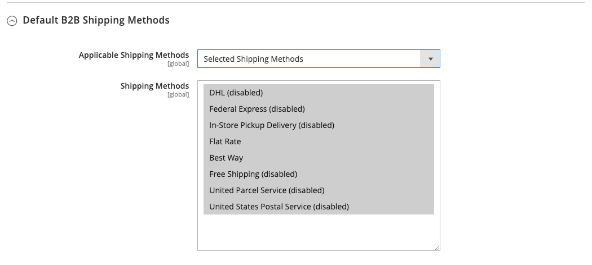
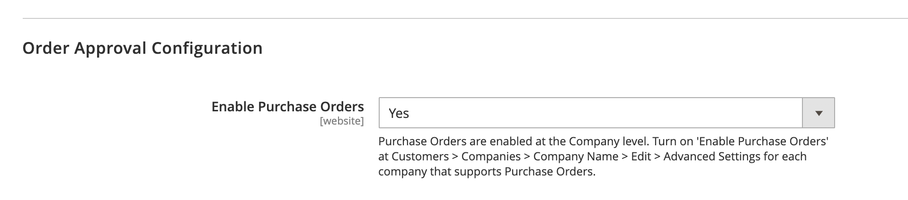

# [!UICONTROL General] > [!UICONTROL B2B Features]

{{b2b-feature}}

{{config}}

>[!TIP]
>
>Adobe Commerce B2B をインストールして有効化すると、会社固有の機能を使用して購入体験をパーソナライズできます。 Adobe Commerce B2B は、B2B モデルと B2C モデルの両方をサポートする統合ソリューションです。 B2B 機能について詳しくは、 [_Adobe Commerce B2B ユーザーガイド_](https://experienceleague.adobe.com/docs/commerce-admin/b2b/introduction.html).

## [!UICONTROL B2B Features]

<!-- zoom -->

| フィールド | [範囲](../../getting-started/websites-stores-views.md#scope-settings) | 説明 |
|------- |----------------------------------------------------------------------- |------------ |
| [[!UICONTROL Enable Company]](../../b2b/account-companies.md) | Web サイト | 有効にすると、顧客はアカウントダッシュボードから会社の割り当てを管理でき、デフォルトでカタログ共有機能と B2B 見積機能も有効になります。 オプション： `Yes` / `No` |
| [[!UICONTROL Enable Quick Order]](../../b2b/quick-order.md) | Web サイト | 有効にすると、顧客およびゲストは SKU または製品名に基づいてすばやく注文できるようになります。 オプション： `Yes` / `No` |
| [[!UICONTROL Enable Requisition List]](../../b2b/configure-requisition-lists.md) | Web サイト | 有効化すると、顧客は自分のアカウントダッシュボードから購買依頼リストを作成および管理できます。 |

{style="table-layout:auto"}

<!-- zoom -->

会社機能が有効になっている場合、追加のフィールドを共有カタログと B2B 見積もりに使用できます。

| フィールド | [範囲](../../getting-started/websites-stores-views.md#scope-settings) | 説明 |
|------- |----------------------------------------------------------------------- |------------ |
| [[!UICONTROL Enable Shared Catalog]](../../b2b/catalog-shared.md) | Web サイト | 有効にすると、グローバルに利用できる、または特定の会社に限定して利用できるカスタム価格のキュレートされたカタログを作成できます。 オプション： `Yes` / `No` |
| [!UICONTROL Enable Shared Catalog direct products price assigning] | Web サイト | いつ _[!UICONTROL Enable Shared Catalog]_フィールドの設定： `Yes`、このオプションは使用できます。 有効にすると、共有カタログに割り当てられた製品のみが価格インデックスに保存されます。 共有カタログに割り当てられていない製品は、ストアフロントに表示されません。 オプション： `Yes` / `No` |
| [[!UICONTROL Enable B2B Quote]](../../b2b/configure-quotes.md) | Web サイト | これを有効にすると、会社の購入者は、買い物かごから見積依頼を送信できるようになります。 オプション： `Yes` / `No` |

{style="table-layout:auto"}

### [!UICONTROL Default B2B Payment Methods]

<!-- zoom -->

| フィールド | [範囲](../../getting-started/websites-stores-views.md#scope-settings) | 説明 |
|------- |----------------------------------------------------------------------- |------------ |
| [!UICONTROL Applicable Payment Methods] | グローバル | B2B 購入者が使用できる支払い方法の選択を決定します。 オプション： `All Payment Methods` / `Specific Payment Methods` |
| [!UICONTROL Payment Methods] | グローバル | B2B 購入者が使用できる各支払方法を指定します。 |

{style="table-layout:auto"}

### [!UICONTROL Default B2B Shipping Methods]

<!-- zoom -->

| フィールド | [範囲](../../getting-started/websites-stores-views.md#scope-settings) | 説明 |
|------- |----------------------------------------------------------------------- |------------ |
| [!UICONTROL Applicable Shipping Methods] | グローバル | B2B 購入者がデフォルトで使用できる発送方法の選択を決定します。 オプション： `All Shipping Methods` / `Specific Shipping Methods` |
| [!UICONTROL Shipping Methods] | グローバル | B2B 購入者がデフォルトで使用できる各発送方法を指定します。  **_注意：_**また、特定のの発送方法を制限することもできます [会社アカウント](../../b2b/account-companies.md). |

{style="table-layout:auto"}

## [!UICONTROL Order Approval Configuration]

<!-- zoom -->

| フィールド | [範囲](../../getting-started/websites-stores-views.md#scope-settings) | 説明 |
|------- |----------------------------------------------------------------------- |------------ |
| [[!UICONTROL Enable Purchase Orders]](../../stores-purchase/purchase-order.md) | Web サイト | 有効化すると、企業は発注書を作成できるようになります。 オプション： `Yes` / `No` |

{style="table-layout:auto"}

