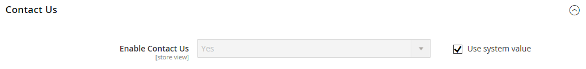

# [!UICONTROL General] > [!UICONTROL Contacts]

{{config}}

## [!UICONTROL Contact Us]

<!-- zoom -->

<!-- [Contact Us](https://experienceleague.adobe.com/ja/docs/commerce-admin/start/setup/store-details#contact-us-form) -->

| フィールド | [ 範囲 ](../../getting-started/websites-stores-views.md#scope-settings) | 説明 |
|--- |--- |--- |
| [!UICONTROL Enable Contact Us] | ストア表示 | [_お問い合わせ_](../../getting-started/store-details.md#contact-us-form) ページを有効にし、フッターにリンクを配置します。 |

{style="table-layout:auto"}

## [!UICONTROL Email Options]

<!-- zoom -->

<!-- [Email Options](https://experienceleague.adobe.com/ja/docs/commerce-admin/start/setup/store-details#contact-us-form) -->

| フィールド | [ 範囲 ](../../getting-started/websites-stores-views.md#scope-settings) | 説明 |
|--- |--- |--- |
| [!UICONTROL Send Emails To] | ストア表示 | _お問い合わせ_ ページからすべての応答を受信するメールアドレスを識別します |
| [!UICONTROL Email Sender] | ストア表示 | _お問い合わせ_ ページからの電子メール照会に対するすべての応答に使用する店舗連絡先を識別します。 既定の送信者：`Custom Email 2` |
| [!UICONTROL Email Template] | ストア表示 | _お問い合わせ_ ページからの電子メールによる問い合わせへのすべての回答の基礎として使用するテンプレートを指定します。 既定のテンプレート：`Contact Form` |

{style="table-layout:auto"}
