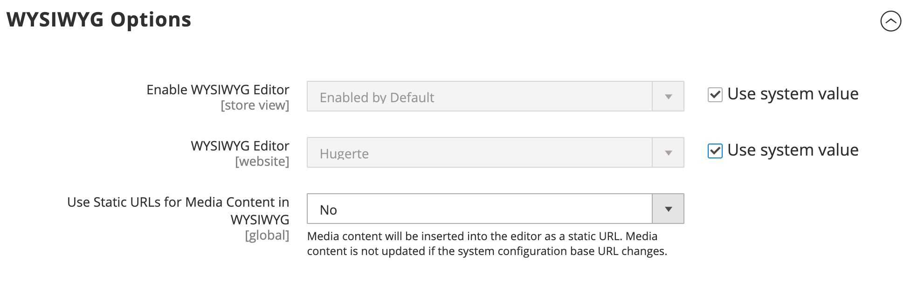

# [!UICONTROL General] > [!UICONTROL Content Management]

{{config}}

## [!UICONTROL WYSIWYG Options]

### [!UICONTROL TinyMCE 6]

<!-- zoom -->

<!-- [WYSIWYG Options](https://experienceleague.adobe.com/en/docs/commerce-admin/content-design/wysiwyg/editor) -->

| フィールド | [範囲](../../getting-started/websites-stores-views.md#scope-settings) | 説明 |
|--- |--- |---------------------------------------------------------------------------------------------------------------------------------------------------------------------------------------------------------------------------------------------------------------------------------------------------------------------------------------------------------------------------------------------------------------------------------------------------------------------------------------------------------------------------------------------------------------------------------------------------------------------------------------------------------------------------------------------------------------------------------------------------|
| [!UICONTROL Enable WYSIWYG Editor] | ストアビュー | ストアでエディターが有効かどうかを指定します。 オプション：デフォルトで有効/デフォルトで無効/完全に無効 |
| [!UICONTROL WYSIWYG Editor] | web サイト | WYSIWYG エディターに使用されるTinyMCE エディターのバージョンを指定します。 オプション： **`TinyMCE 6`**- （デフォルト） TinyMCE バージョン 6をデフォルトのWYSIWYG エディターとして使用します。  _**&#x200B;注意：**_Adobe CommerceおよびMagento Open Source 2.4.5のTinyMCE 5.10 ライブラリをアップデートすると、一部の種類のURLを使用して画像やリンクを更新する際に任意のJavaScriptが実行される脆弱性が解決されます。 TinyMCE 3は2.4.0 リリースで廃止され、2.4.3 リリースで削除されました。 TinyMCE 4は2.4.4 リリースで削除されました。 |
| [!UICONTROL Use Static URLs for Media Content in WYSIWYG] | グローバル | WYSIWYG エディターから参照されるメディアコンテンツに[静的URL](../../content-design/catalog-urls-dynamic-media.md)を使用するかどうかを指定します。 この設定は、商品、カテゴリ、ページ、ブロックなど、WYSIWYG エディターが使用できるすべての場所に適用されます。 オプション： **`Yes`**- WYSIWYG エディターと共に挿入されるメディアコンテンツの静的URLを使用します。 静的URLは絶対であり、ストアの[ ベース URL](../../stores-purchase/store-urls.md)が変更された場合は壊れます。 **`No`** （デフォルト） - `{{media url="..."}}` ディレクティブに基づいて、WYSIWYG エディターで挿入されるメディアコンテンツに動的URLを使用します。 動的URLは相対URLであり、ストアのベース URLが変更されても壊れません。 |

{style="table-layout:auto"}

>[!NOTE]
>
>TinyMCEは、Magento 2.4.6以降のバージョンのデフォルトのWYSIWYG エディターとしてHugerteに置き換えられました。

### [!UICONTROL HugeRTE]

<!-- zoom -->

<!-- [WYSIWYG Options](https://experienceleague.adobe.com/en/docs/commerce-admin/content-design/wysiwyg/editor) -->

| フィールド | [範囲](../../getting-started/websites-stores-views.md#scope-settings) | 説明 |
|--- |--- |---------------------------------------------------------------------------------------------------------------------------------------------------------------------------------------------------------------------------------------------------------------------------------------------------------------------------------------------------------------------------------------------------------------------------------------------------------------------------------------------------------------------------------------------------------------------------------------------------------------------------------------------------------------------------------------------------------------------------------------------------|
| [!UICONTROL Enable WYSIWYG Editor] | ストアビュー | ストアでエディターが有効かどうかを指定します。 オプション：デフォルトで有効/デフォルトで無効/完全に無効 |
| [!UICONTROL WYSIWYG Editor] | web サイト | WYSIWYG エディターに使用されるHugerte エディターのバージョンを指定します。 |
| [!UICONTROL Use Static URLs for Media Content in WYSIWYG] | グローバル | WYSIWYG エディターから参照されるメディアコンテンツに[静的URL](../../content-design/catalog-urls-dynamic-media.md)を使用するかどうかを指定します。 この設定は、商品、カテゴリ、ページ、ブロックなど、WYSIWYG エディターが使用できるすべての場所に適用されます。 オプション： **`Yes`**- WYSIWYG エディターと共に挿入されるメディアコンテンツの静的URLを使用します。 静的URLは絶対であり、ストアの[ ベース URL](../../stores-purchase/store-urls.md)が変更された場合は壊れます。 **`No`** （デフォルト） - `{{media url="..."}}` ディレクティブに基づいて、WYSIWYG エディターで挿入されるメディアコンテンツに動的URLを使用します。 動的URLは相対URLであり、ストアのベース URLが変更されても壊れません。 |

{style="table-layout:auto"}

## [!UICONTROL CMS Page Hierarchy]

{{ee-feature}}

<!-- zoom -->

<!--[CMS Page Hierarchy](https://experienceleague.adobe.com/en/docs/commerce-admin/content-design/elements/pages/page-hierarchy) -->

| フィールド | [範囲](../../getting-started/websites-stores-views.md#scope-settings) | 説明 |
|--- |--- |--- |
| [!UICONTROL Enable Hierarchy Functionality] | グローバル | コンテンツページのページ階層の使用を有効にします。 オプション：`Yes` / `No` |
| [!UICONTROL Enable Hierarchy Metadata] | グローバル | 階層内のページにメタデータを関連付けることができます。 オプション：`Yes` / `No` |
| [!UICONTROL Default Layout for Hierarchy Menu] | グローバル | デフォルトのメニュースタイルを指定します。 オプション：`Content` / `Left Column` / `Right Column` |

{style="table-layout:auto"}

## [!UICONTROL Advanced Content Tools]

<!-- zoom -->

<!-- [Advanced Content Tools](https://experienceleague.adobe.com/en/docs/commerce-admin/page-builder/walkthrough/3-catalog-content) -->

| フィールド | [範囲](../../getting-started/websites-stores-views.md#scope-settings) | 説明 |
|--- |--- |--- |
| [!UICONTROL Enable Page Builder] | グローバル | [!DNL Page Builder]個の高度なコンテンツ ツールが使用可能かどうかを決定します。 オプション： **`Yes`**- [!DNL Page Builder] ワークスペースは、ページ、ブロック、製品、カテゴリの「コンテンツ」セクションに表示されます。 **`No`** – 標準のCMS編集ツールが、ページ、ブロック、製品、およびカテゴリの&#x200B;_[!UICONTROL Content]_セクションに表示されます。 |
| [!UICONTROL Enable Page Builder Content Preview] | グローバル | 製品とカテゴリに対して[!DNL Page Builder] コンテンツのプレビューが有効かどうかを指定します。 オプション：`Yes` / `No`  **_メモ:_**&#x200B;これはデフォルトで`Yes`に設定されていますが、プレビューをオフにすると、製品またはカテゴリーフォーム内にプレビューが読み込まれるときに発生するパフォーマンスの問題を回避できます。 |
| [!UICONTROL Google Maps API Key] | グローバル | Google アカウントの[!DNL Google Maps] API キー。 |
| [!UICONTROL Test Key] |  | [!DNL Google Maps] API キーを検証します。 |
| [!UICONTROL Google Maps Style] | グローバル | ここに[!DNL Google Maps] スタイルのJSON コードを貼り付けて、Map コンテンツタイプのルックアンドフィールを変更します。 |
| [!UICONTROL Default Column Grid Size] | グローバル | [!DNL Page Builder] グリッドの既定の列数を指定します。 |
| [!UICONTROL Maximum Column Grid Size] | グローバル | [!DNL Page Builder] グリッドの最大列数を指定します。 |

{style="table-layout:auto"}

>[!TIP]
>
>Adobe Experience Manager Page Builderなら、ビジュアルstorytellingを強化し、顧客エンゲージメントとロイヤルティを促進する、豊富なコンテンツを備えたカスタムレイアウトのページを容易に作成できます。 これらの機能は、品質を向上させ、カスタムページの作成にかかる時間とコストを削減するように設計されています。 これらの機能の詳細と、Adobe CommerceまたはMagento Open Source ストアの魅力的なコンテンツを作成するためにそれらを使用する方法については、[_ページビルダーユーザーガイド_](../../page-builder/guide-overview.md)&#x200B;を参照してください。
