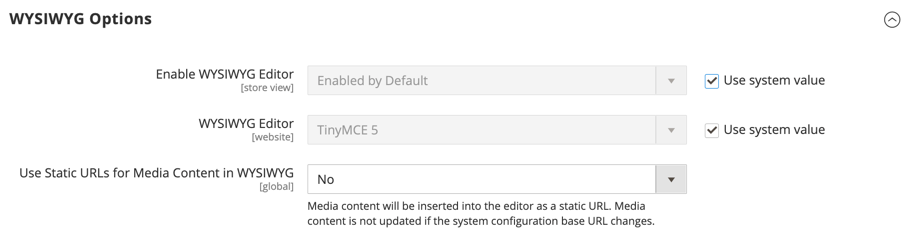

# [!UICONTROL General] > [!UICONTROL Content Management]

{{config}}

## [!UICONTROL WYSIWYG Options]

<!-- zoom -->

<!-- [WYSIWYG Options](https://experienceleague.adobe.com/en/docs/commerce-admin/content-design/wysiwyg/editor) -->

| フィールド | [ 範囲 ](../../getting-started/websites-stores-views.md#scope-settings) | 説明 |
|--- |--- |--- |
| [!UICONTROL Enable WYSIWYG Editor] | ストア表示 | ストアに対してエディターが有効かどうかを判断します。 オプション：デフォルトで有効/デフォルトで無効/完全に無効 |
| [!UICONTROL WYSIWYG Editor] | Web サイト | WYSIWYG Editor に使用される TinyMCE Editor のバージョンを指定します。 Options:  **`TinyMCE 5`**- （デフォルト） TinyMCE バージョン 5 をデフォルトのWYSIWYGエディタとして使用します。  _ **&#x200B; 注意：**&#x200B;_Adobe CommerceおよびMagento Open Source 2.4.5 の TinyMCE 5.10 ライブラリを更新すると、一部の種類の URL を使用して画像やリンクを更新する際に、JavaScriptが任意に実行されてしまう脆弱性が修正されます。 TinyMCE 3 は 2.4.0 リリースで非推奨（廃止予定）となり、2.4.3 リリースで削除されました。 TinyMCE 4 は 2.4.4 リリースで削除されました。 |
| [!UICONTROL Use Static URLs for Media Content in WYSIWYG] | グローバル | WYSIWYG エディターから参照されるメディアコンテンツに [ 静的 URL](../../content-design/catalog-urls-dynamic-media.md) を使用するかどうかを指定します。 この設定は、商品、カテゴリ、ページ、ブロックなど、WYSIWYG Editor を使用できるすべての場所に適用されます。 オプション： **`Yes`**- WYSIWYG エディターで挿入されるメディアコンテンツに静的 URL を使用します。 静的 URL は絶対 URL で、ストアの [ ベース URL](../../stores-purchase/store-urls.md) が変更された場合は壊れます。 **`No`** （デフォルト） - `{{media url="..."}}` ディレクティブに基づいて、WYSIWYG エディターで挿入されるメディアコンテンツに動的 URL を使用します。 動的 URL は相対 URL で、ストアのベース URL が変更された場合でも破損しません。 |

{style="table-layout:auto"}

## [!UICONTROL CMS Page Hierarchy]

{{ee-feature}}

<!-- zoom -->

<!--[CMS Page Hierarchy](https://experienceleague.adobe.com/en/docs/commerce-admin/content-design/elements/pages/page-hierarchy) -->

| フィールド | [ 範囲 ](../../getting-started/websites-stores-views.md#scope-settings) | 説明 |
|--- |--- |--- |
| [!UICONTROL Enable Hierarchy Functionality] | グローバル | コンテンツページに対してページ階層の使用をアクティベートします。 オプション：`Yes` / `No` |
| [!UICONTROL Enable Hierarchy Metadata] | グローバル | メタデータを階層内のページに関連付けることができます。 オプション：`Yes` / `No` |
| [!UICONTROL Default Layout for Hierarchy Menu] | グローバル | 既定のメニュースタイルを決定します。 オプション：`Content`/`Left Column`/`Right Column` |

{style="table-layout:auto"}

## [!UICONTROL Advanced Content Tools]

<!-- zoom -->

<!-- [Advanced Content Tools](https://experienceleague.adobe.com/en/docs/commerce-admin/page-builder/walkthrough/3-catalog-content) -->

| フィールド | [ 範囲 ](../../getting-started/websites-stores-views.md#scope-settings) | 説明 |
|--- |--- |--- |
| [!UICONTROL Enable Page Builder] | グローバル | [!DNL Page Builder] の高度なコンテンツツールが使用可能かどうかを判断します。 オプション： **`Yes`**- [!DNL Page Builder] ワークスペースは、ページ、ブロック、製品、カテゴリの「コンテンツ」セクションに表示されます。 **`No`** – 標準のCMS編集ツールは、ページ、ブロック、商品、カテゴリの _[!UICONTROL Content]_&#x200B;のセクションに表示されます。 |
| [!UICONTROL Enable Page Builder Content Preview] | グローバル | 製品およびカテゴリに対して [!DNL Page Builder] コンテンツプレビューを有効にするかどうかを決定します。 オプション：`Yes` / `No`  **_メモ：_**&#x200B;デフォルトでは `Yes` に設定されていますが、プレビューをオフにすると、製品またはカテゴリフォーム内でプレビューを読み込むことによるパフォーマンスの問題を防ぐことができます。 |
| [!UICONTROL Google Maps API Key] | グローバル | Google アカウントからの [!DNL Google Maps] API キー。 |
| [!UICONTROL Test Key] |  | [!DNL Google Maps] API キーを検証します。 |
| [!UICONTROL Google Maps Style] | グローバル | ここに [!DNL Google Maps] スタイルの JSON コードを貼り付けて、Map コンテンツタイプのルックアンドフィールを変更します。 |
| [!UICONTROL Default Column Grid Size] | グローバル | [!DNL Page Builder] グリッドの既定の列数を決定します。 |
| [!UICONTROL Maximum Column Grid Size] | グローバル | [!DNL Page Builder] グリッドの列の最大数を決定します。 |

{style="table-layout:auto"}

>[!TIP]
>
>ページビルダーを使用すると、視覚的なストーリーテリングを強化し、顧客エンゲージメントとロイヤルティを高めるカスタムレイアウトを使用して、コンテンツに富んだページを簡単に作成できます。 これらの機能は、品質を向上し、カスタムページの作成に要する時間とコストを削減するように設計されています。 これらの機能の詳細と、それらを使用してAdobe CommerceやMagento Open Sourceストア向けの魅力的なコンテンツを作成する方法については、『 [_ページビルダーユーザーガイド_](../../page-builder/guide-overview.md) 』を参照してください。
