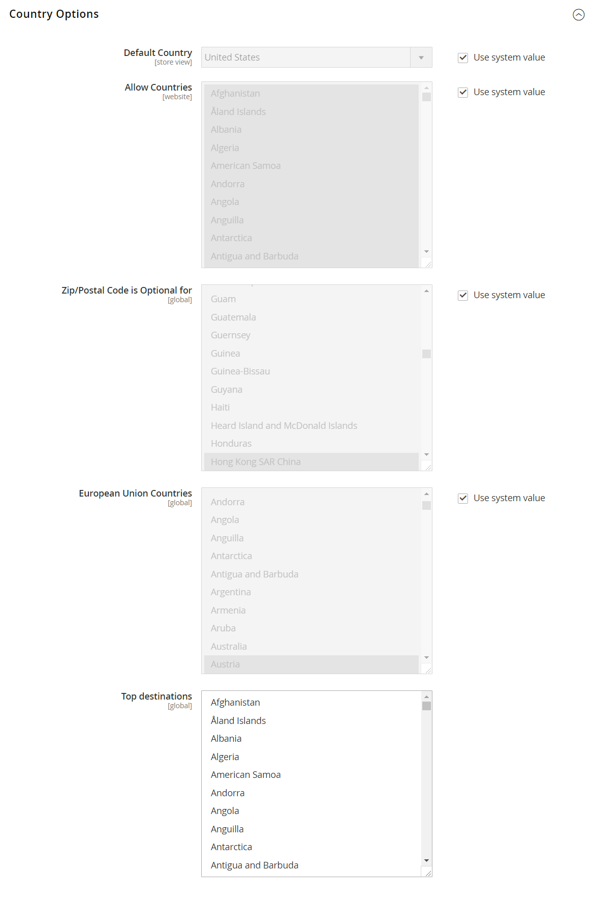
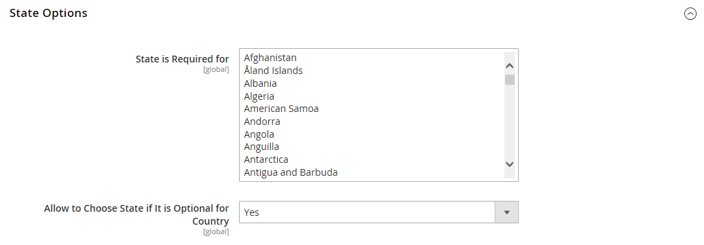
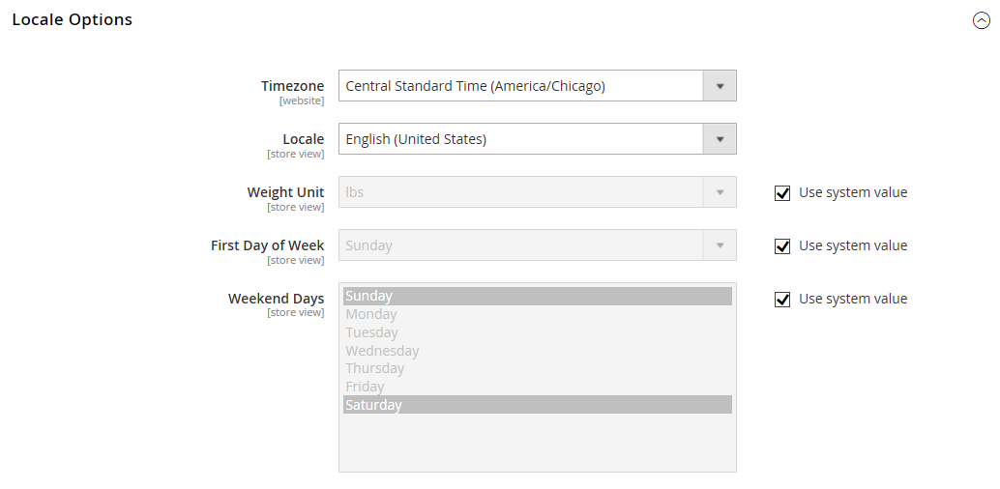
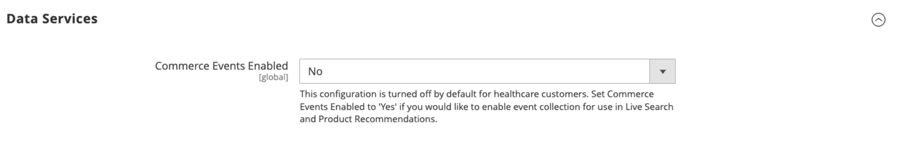

# [!UICONTROL General] > [!UICONTROL General]

{{config}}

## [!UICONTROL Country Options]

これらの設定フィールドとオプションについて詳しくは、[国オプション &#x200B;](../../getting-started/store-details.md#country-options)を参照してください。

<!-- zoom -->

| フィールド | [範囲](../../getting-started/websites-stores-views.md#scope-settings) | 説明 |
|--- |--- |--- |
| [!UICONTROL Default Country] | ストアビュー | お店がある国です。 |
| [!UICONTROL Allow Countries] | web サイト | 注文を受け付ける国。 |
| [!UICONTROL Zip/Postal Code is Optional for] | グローバル | 配送先住所に郵便番号を必要としない国。 |
| [!UICONTROL European Union Countries] | グローバル | EUに加盟している国。 |
| [!UICONTROL Top Destinations] | ストアビュー | 販売の対象となる主な国。 |

{style="table-layout:auto"}

## [!UICONTROL State Options]

これらの設定フィールドとオプションについて詳しくは、[状態オプション &#x200B;](../../getting-started/store-details.md#state-options)を参照してください。

<!-- zoom -->

| フィールド | [範囲](../../getting-started/websites-stores-views.md#scope-settings) | 説明 |
|--- |--- |--- |
| [!UICONTROL State is required for] | グローバル | 地域または州を郵送先住所に含める必要がある国（ビジネスを行う国）。 |
| [!UICONTROL Allow to Choose State if It is Optional for Country] | グローバル | 必須でない国の場合、_地域/州_ フィールドが顧客の住所に含まれているかどうかを判断します。   **`Yes`**– 国で必要でない場合でも、顧客アドレスに&#x200B;_地域/州_ フィールドを含めます。 **`No`** – 国で必要とされない場合、地域/州フィールドを顧客アドレスから省略します。 |

{style="table-layout:auto"}

## [!UICONTROL Locale Options]

これらの設定フィールドとオプションについて詳しくは、[&#x200B; ロケールオプション &#x200B;](../../getting-started/store-details.md#locale-options)を参照してください。

<!-- zoom -->

| フィールド | [範囲](../../getting-started/websites-stores-views.md#scope-settings) | 説明 |
|--- |--- |--- |
| [!UICONTROL Timezone] | web サイト | Web サイトが提供する主要市場のタイムゾーン。 通常、タイムゾーンは、自社の物理的な場所で使用されるものと同じです。 |
| [!UICONTROL Locale] | ストアビュー | ストアビューが提供する市場で使用される言語、通貨、測定システム。 |
| [!UICONTROL Weight Unit] | ストアビュー | ロケールからの出荷に通常使用される測定単位。 オプション：`lbs` / `kgs` |
| [!UICONTROL First Day of Week] | ストアビュー | ストアビューが提供する市場の週の最初の日と見なされる日。 |
| [!UICONTROL Weekend Days] | ストアビュー | ストアビューが提供する市場での週末に落ちる日。 |

{style="table-layout:auto"}

## [!UICONTROL Website Restrictions]

{{ee-feature}}

<!-- zoom -->

これらの設定の変更について詳しくは、_マーチャンダイジングとプロモーション ガイド_&#x200B;の[&#x200B; アクセス制限](../../merchandising-promotions/event-configure.md#access-restrictions)を参照してください。

| フィールド | [範囲](../../getting-started/websites-stores-views.md#scope-settings) | 説明 |
|--- |--- |--- |
| [!UICONTROL Access Restriction] | web サイト | Web サイトが制限モードで動作しているかどうかを確認します。   **`Yes`**– 以下のフィールドに設定されている方法で、Web サイトへのアクセスが制限されています。 **`No`**  – 制限は無効になっており、次の設定は影響しません。 |
| [!UICONTROL Restriction Mode] | web サイト | Web サイトに適用されるアクセス制限の種類を決定します。   **`Website Closed`**- ストアフロントへのすべてのアクセスが制限され、ストアフロント URLは一時的にランディングページにリダイレクトされます。 この設定は、サイトのメンテナンス中または起動前に便利です。 **`Private Sales: Login Only`** - ストアフロントにアクセスするには、登録されたお客様のみがログインできます。 ストアフロントのURLはすべて、指定したランディングページまたはログインフォームに一時的にリダイレクトされます。 ユーザーは、このモードでアカウントを作成できません。 **`Private Sales: Login and Register`**- ユーザーはストアフロントにアクセスするためにログインする必要があります。 ユーザーがログインするまで、すべてのストアフロント URLは一時的にログインフォームにリダイレクトされます。 ユーザーは、サイトがこのモードになっている間にアカウントを登録できます。 |
| [!UICONTROL Startup Page] | ストアビュー | Web サイトがプライベートセールスモードの場合、この設定は、顧客がログインするまで表示されるページを決定します。    **`To login form`**- ユーザーは、ログインするまでログインフォームにリダイレクトされます。 **`To landing page`** - ユーザーは、ログインするまで、以下に指定された静的ページにリダイレクトされます。   **_重要！_**&#x200B;顧客がログインしてサイト全体にアクセスできるように、指定したランディングページからログインページへのリンクを必ず含めてください。 |
| [!UICONTROL Landing Page] | ストアビュー | Web サイトがプライベートセールスモードの場合に表示される最初のページを指定します。 |
| [!UICONTROL HTTP Response] | web サイト | Web サイトが閉じられ、ボット、web クローラー、またはスパイダーによって接続が試行されたときに送信されるHTTP レスポンスを指定します。   **`503 Service unavailable`**- ページは利用できませんが、スパイダーはインデックスを更新しないでください。 **`200 OK`** - ランディングページが正しく、スパイダーがサイト上の唯一のページとして扱う必要があります。 |
| [!UICONTROL Enable Autocomplete on login/forgot password forms] | web サイト | _ログイン_&#x200B;および&#x200B;_パスワードを忘れた_ フォームのフィールドが以前のエントリから自動的に入力されるかどうかを指定します。 オプション：`Yes` / `No` |

{style="table-layout:auto"}

## [!UICONTROL Store Information]

<!-- zoom -->

これらの設定の変更について詳しくは、_入門ガイド_&#x200B;の[&#x200B; ストア情報](../../getting-started/store-details.md)を参照してください。

| フィールド | [範囲](../../getting-started/websites-stores-views.md#scope-settings) | 説明 |
|--- |--- |--- |
| [!UICONTROL Store Name] | ストアビュー | ストアビューに関連付けられているストアの名前。 |
| [!UICONTROL Store Phone Number] | ストアビュー | （ストアビューに関連付けられた）ストアのプライマリ電話番号が営業用に開いています。 例：月 – 金、9-5、土9 – 正午（太平洋標準時） |
| 国 | web サイト | Web サイトを運営する会社の国。 |
| [!UICONTROL Region/State] | web サイト | web サイトを運営するビジネスの地域または状態。 |
| [!UICONTROL ZIP/Postal Code] | web サイト | Web サイトを運営する会社の郵便番号。 |
| [!UICONTROL City] | web サイト | Web サイトを運営する会社の市区町村です。 |
| [!UICONTROL Street Address] | web サイト | ウェブサイトを運営する会社の住所。 |
| [!UICONTROL Street Address Line 2|]Web サイト | 必要に応じて、ビジネスの住所の2行目。 |
| [!UICONTROL VAT Number] | web サイト | Commerce インストールを所有する法人の付加価値税番号（該当する場合）。 |
| [!UICONTROL Validate VAT Number] |  | 付加価値税識別番号を確認します。 |

{style="table-layout:auto"}

## [!UICONTROL Single-Store Mode]

<!-- zoom -->

これらの設定の変更について詳しくは、_入門ガイド_&#x200B;の[単一ストアモード &#x200B;](../../getting-started/websites-stores-views.md#single-store-mode)を参照してください。

| フィールド | [範囲](../../getting-started/websites-stores-views.md#scope-settings) | 説明 |
|--- |--- |--- |
| [!UICONTROL Enable Single-Store Mode] | グローバル | 単一ストアのインストールを有効にすると、設定スコープボックスと関連するフィールドラベルが非表示になります。オプション：`Yes` / `No`  **_Note:_**&#x200B;複数のビューを持つストアでは、単一ストアモードは無視されます。  単一ストアモードを有効にすると、すべてのカタログおよび製品ストア固有のデータがデフォルトのストアビューからすべてのストアビュー範囲にコピーされます。 ストアにストアビューが1つしかない場合にのみ、カタログと商品データをコピーします。 ストアに無効なストアビューが1つあり、有効なストアビューが1つある場合、カタログと製品データはコピーされません。  シングルストアモードを有効にすると、コンテンツ固有のデータに対するストアビュー固有の設定設定が無視されます。 代わりに、グローバルレベルのスコープで定義された設定設定を使用して、管理UIとストアフロント間の一貫性を確保します。 |

{style="table-layout:auto"}

## [!UICONTROL Data Services]

<!-- zoom -->

| フィールド | [範囲](../../getting-started/websites-stores-views.md#scope-settings) | 説明 |
|--- |--- |--- |
| [!UICONTROL Commerce Events Enabled] | グローバル | ヘルスケアのお客様で、[Data Services HIPAA](https://experienceleague.adobe.com/ja/docs/commerce/data-connection/hipaa-readiness)拡張機能をインストールしている場合、この設定はデフォルトでオフになっています。 これにより、ライブサーチや商品レコメンデーションで使用されるストアフロントイベントデータが取得されなくなります。 これは、ストアフロントのイベントデータがクライアントサイドで生成されるためです。 [Live Search](https://experienceleague.adobe.com/ja/docs/commerce/live-search/overview)および[商品レコメンデーション &#x200B;](https://experienceleague.adobe.com/ja/docs/commerce/product-recommendations/guide-overview) サービスで使用するためにストアフロントイベントデータを引き続き取得して送信するには、**Commerce Events Enabled**&#x200B;を`Yes`に設定します。 |

{style="table-layout:auto"}
