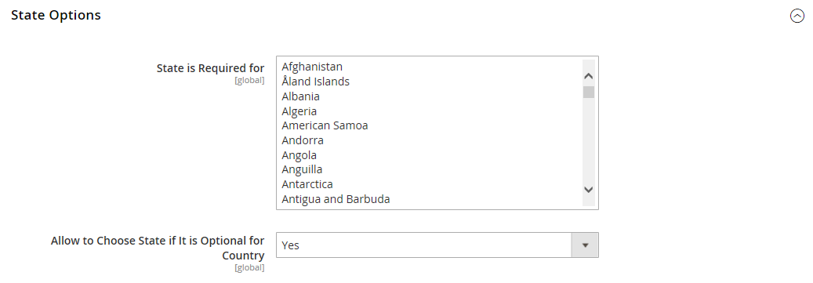

# [!UICONTROL General] > [!UICONTROL General]

{{config}}

## [!UICONTROL Country Options]

詳しくは、 [国のオプション](../../getting-started/store-details.md#country-options) を参照してください。

<!-- zoom -->

| フィールド | [範囲](../../getting-started/websites-stores-views.md#scope-settings) | 説明 |
|--- |--- |--- |
| [!UICONTROL Default Country] | ストア表示 | 店舗の所在国。 |
| [!UICONTROL Allow Countries] | Web サイト | 注文を受け入れる国。 |
| [!UICONTROL Zip/Postal Code is Optional for] | グローバル | 配送先住所に郵便番号が必要ない国。 |
| [!UICONTROL European Union Countries] | グローバル | EU 加盟国。 |
| [!UICONTROL Top Destinations] | ストア表示 | 販売のターゲットとする主要国。 |

{style="table-layout:auto"}

## [!UICONTROL State Options]

詳しくは、 [状態オプション](../../getting-started/store-details.md#state-options) を参照してください。

<!-- zoom -->

| フィールド | [範囲](../../getting-started/websites-stores-views.md#scope-settings) | 説明 |
|--- |--- |--- |
| [!UICONTROL State is required for] | グローバル | 郵送先住所に地域または都道府県を含める必要がある国（ビジネスを行う場所）。 |
| [!UICONTROL Allow to Choose State if It is Optional for Country] | グローバル | 必須でない国の場合は、が _地域/州（米国）_ 顧客の郵送先住所にフィールドが含まれます。   **`Yes`**— を含む _地域/州（米国）_ フィールドに値を入力します（国で不要な場合も含む）。 **`No`**  — 国で不要な場合は、地域/都道府県フィールドを顧客の住所から除外します。 |

{style="table-layout:auto"}

## [!UICONTROL Locale Options]

詳しくは、 [ロケールオプション](../../getting-started/store-details.md#locale-options) を参照してください。

<!-- zoom -->

| フィールド | [範囲](../../getting-started/websites-stores-views.md#scope-settings) | 説明 |
|--- |--- |--- |
| [!UICONTROL Timezone] | Web サイト | Web サイトが提供するプライマリーマーケットのタイムゾーン。 通常、タイムゾーンは、ビジネスの物理的な場所で使用されるタイムゾーンと同じです。 |
| [!UICONTROL Locale] | ストア表示 | ストアビューが提供する市場で使用される言語、通貨、測定システム。 |
| [!UICONTROL Weight Unit] | ストア表示 | 通常、ロケールからの出荷に使用される測定単位。 オプション： `lbs` / `kgs` |
| [!UICONTROL First Day of Week] | ストア表示 | ストアビューが提供する市場での週の最初の曜日と見なされる日。 |
| [!UICONTROL Weekend Days] | ストア表示 | 週末に下がる日は、店舗ビューで提供されます。 |

{style="table-layout:auto"}

## [!UICONTROL Website Restrictions]

{{ee-feature}}

<!-- zoom -->

これらの設定の変更について詳しくは、 [アクセス制限](../../merchandising-promotions/event-configure.md#access-restrictions) （内） _マーチャンダイジングとプロモーションガイド_.

| フィールド | [範囲](../../getting-started/websites-stores-views.md#scope-settings) | 説明 |
|--- |--- |--- |
| [!UICONTROL Access Restriction] | Web サイト | Web サイトが制限モードで動作しているかどうかを判断します。   **`Yes`**- Web サイトへのアクセスは、以下のフィールドで設定された方法で制限されます。 **`No`**  — 制限は無効になっており、次の設定は無効です。 |
| [!UICONTROL Restriction Mode] | Web サイト | Web サイトに適用されるアクセス制限のタイプを決定します。   **`Website Closed`**— ストアフロントへのすべてのアクセスが制限され、ストアフロント URL は一時的にランディングページにリダイレクトされます。 この設定は、サイトのメンテナンス中や起動前に役立ちます。 **`Private Sales: Login Only`** ：ストアフロントにアクセスできるのは、登録ユーザーのみです。 すべてのストアフロント URL は、指定されたランディングページまたはログインフォームに一時的にリダイレクトされます。 このモードでは、ユーザーはアカウントを作成できません。 **`Private Sales: Login and Register`**— ストアフロントにアクセスするには、ユーザーがログインする必要があります。 すべてのストアフロント URL は、ユーザーがログインするまで、一時的にログインフォームにリダイレクトされます。 サイトがこのモードの間、ユーザーはアカウントに登録できます。 |
| [!UICONTROL Startup Page] | ストア表示 | Web サイトが Private Sales モードの場合、この設定により、顧客がログインするまで表示されるページが決まります。    **`To login form`**：ユーザーは、ログインするまでログインフォームにリダイレクトされます。 **`To landing page`** ：ユーザーは、ログインするまで、以下で指定した静的ページにリダイレクトされます。   **_重要！_**ユーザーがログインして完全なサイトにアクセスできるように、指定したランディングページからのログインページへのリンクを必ず含めてください。 |
| [!UICONTROL Landing Page] | ストア表示 | Web サイトがプライベートセールスモードの場合に表示される最初のページを決定します。 |
| [!UICONTROL HTTP Response] | Web サイト | Web サイトが閉じられ、ボット、クローラーまたはスパイダーによって接続が試行されたときに送信される HTTP 応答を決定します。   **`503 Service unavailable`**— ページは使用できませんが、スパイダーはインデックスを更新しないでください。 **`200 OK`**  — ランディングページは正しく、サイト上で唯一のページとしてスパイダーによって処理される必要があります。 |
| [!UICONTROL Enable Autocomplete on login/forgot password forms] | Web サイト | のフィールドが _ログイン_ および _パスワードを忘れた場合_ フォームは、前のエントリから自動的に入力されます。 オプション： `Yes` / `No` |

{style="table-layout:auto"}

## [!UICONTROL Store Information]

<!-- zoom -->

これらの設定の変更について詳しくは、 [ストア情報](../../getting-started/store-details.md) （内） _はじめに_.

| フィールド | [範囲](../../getting-started/websites-stores-views.md#scope-settings) | 説明 |
|--- |--- |--- |
| [!UICONTROL Store Name] | ストア表示 | ストアビューに関連付けられているストアの名前。 |
| [!UICONTROL Store Phone Number] | ストア表示 | 店舗の（店舗ビューに関連付けられた）主な電話番号は、営業用に開いています。 例：月 — 金、9-5、土 9-noun PST |
| 国 | Web サイト | Web サイトを運用するビジネスの国。 |
| [!UICONTROL Region/State] | Web サイト | Web サイトを運用するビジネスの地域または州。 |
| [!UICONTROL ZIP/Postal Code] | Web サイト | Web サイトを運営するビジネスの郵便番号。 |
| [!UICONTROL City] | Web サイト | Web サイトを運営するビジネスの市区町村の場所。 |
| [!UICONTROL Street Address] | Web サイト | Web サイトを運営するビジネスの住所または郵送先住所。 |
| [!UICONTROL Street Address Line 2|]Web サイト | 必要に応じて、ビジネス街の住所の 2 行目。 |
| [!UICONTROL VAT Number] | Web サイト | コマースインストールを所有するビジネスの付加価値税番号（該当する場合）。 |
| [!UICONTROL Validate VAT Number] |  | 付加価値税 ID 番号を検証します。 |

{style="table-layout:auto"}

## [!UICONTROL Single-Store Mode]

<!-- zoom -->

これらの設定の変更について詳しくは、 [シングルストアモード](../../getting-started/websites-stores-views.md#single-store-mode) （内） _はじめに_.

| フィールド | [範囲](../../getting-started/websites-stores-views.md#scope-settings) | 説明 |
|--- |--- |--- |
| [!UICONTROL Enable Single-Store Mode] | グローバル | シングルストアでのインストールを有効にした場合、設定の「範囲」ボックスと関連するフィールドラベルの「オプション」が非表示になります。 `Yes` / `No`  **_注意：_**複数のビューを持つストアでは、シングルストアモードは無視されます。 |

{style="table-layout:auto"}
