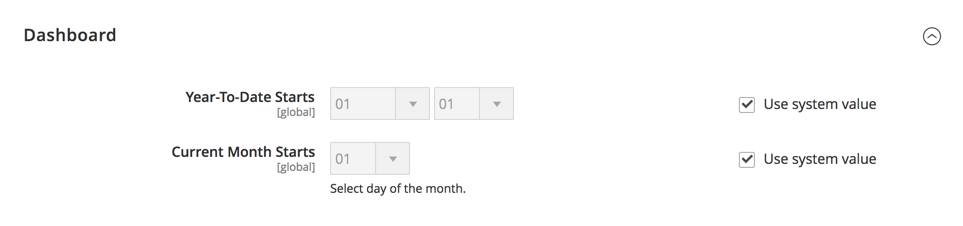

# [!UICONTROL General] > [!UICONTROL Reports]

{{config}}

## [!UICONTROL Dashboard]

<!-- zoom -->

<!-- [Dashboard](https://experienceleague.adobe.com/en/docs/commerce-admin/start/admin/tools/admin-dashboard) -->

| フィールド | [ 範囲 ](../../getting-started/websites-stores-views.md#scope-settings) | 説明 |
|--- |--- |--- |
| [!UICONTROL Year-to-Date Starts] | グローバル | 年累計計算の基になる月と日を指定します。 |
| [!UICONTROL Current Month Starts] | グローバル | 今月の初めを示すために計算で使用される日付を指定します。 |

{style="table-layout:auto"}

## [!UICONTROL General Options]

<!-- zoom -->

>[!NOTE]
>
>ビジネス機能でレポートが必要ない場合は、レポート機能を無効にして、ストアのパフォーマンスを強化することをお勧めします。 ただし、動的な顧客セグメントなど、一部の機能が正しく機能するためにレポートデータに依存している場合があります。

| フィールド | [ 範囲 ](../../getting-started/websites-stores-views.md#scope-settings) | 説明 |
|--- |--- |--- |
| [!UICONTROL Enable Reports] | グローバル | レポートイベントを有効または無効にします。 |
| [!UICONTROL Enable "Product View" Report] | グローバル | 閲覧された製品ページの統計情報の収集を有効または無効にします。 |
| [!UICONTROL Enable "Send Product Link To Friend" Report] | グローバル | フレンドに送信された製品リンクの統計情報の収集を有効または無効にします。 |
| [!UICONTROL Enable "Add Product To Compare List" Report] | グローバル | 比較リストに追加された商品の統計の収集を有効または無効にします。 |
| [!UICONTROL Enable "Product Added To Cart" Report] | グローバル | 買い物かごに追加された商品に関する統計情報の収集を有効または無効にします。 |
| [!UICONTROL Enable "Product Added To Wishlist" Report] | グローバル | ウィッシュリストに追加された商品の統計情報の収集を有効または無効にします。 |
| [!UICONTROL Enable "Share WishList" Report] | グローバル | 共有ウィッシュリストの統計の収集を有効または無効にします。 |

{style="table-layout:auto"}
