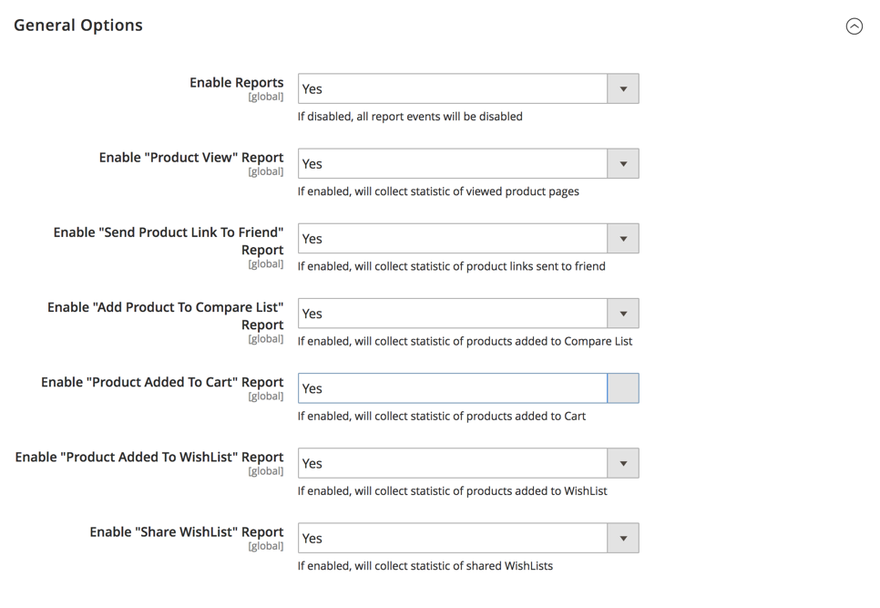

# [!UICONTROL General] > [!UICONTROL Reports]

{{config}}

## [!UICONTROL Dashboard]

<!-- zoom -->

<!-- [Dashboard](https://experienceleague.adobe.com/en/docs/commerce-admin/start/admin/tools/admin-dashboard) -->

| フィールド | [範囲](../../getting-started/websites-stores-views.md#scope-settings) | 説明 |
|--- |--- |--- |
| [!UICONTROL Year-to-Date Starts] | グローバル | 年ごとの計算の基となる月と日を指定します。 |
| [!UICONTROL Current Month Starts] | グローバル | 計算で使用される月の日付を指定して、現在の月の先頭をマークします。 |

{style="table-layout:auto"}

## [!UICONTROL General Options]

<!-- zoom -->

>[!NOTE]
>
>ビジネス機能でレポートが不要な場合は、レポート機能を無効にしてストアのパフォーマンスを向上させることをお勧めします。 ただし、動的な顧客セグメントなどの一部の機能は、レポートデータを使用して適切に機能します。

| フィールド | [範囲](../../getting-started/websites-stores-views.md#scope-settings) | 説明 |
|--- |--- |--- |
| [!UICONTROL Enable Reports] | グローバル | レポートイベントを有効または無効にします。 |
| [!UICONTROL Enable "Product View" Report] | グローバル | 表示された製品ページの統計情報の収集を有効または無効にします。 |
| [!UICONTROL Enable "Send Product Link To Friend" Report] | グローバル | 友達に送信された製品リンクの統計情報の収集を有効または無効にします。 |
| [!UICONTROL Enable "Add Product To Compare List" Report] | グローバル | 比較リストに追加された製品の統計情報の収集を有効または無効にします。 |
| [!UICONTROL Enable "Product Added To Cart" Report] | グローバル | 買い物かごに追加された製品の統計情報の収集を有効または無効にします。 |
| [!UICONTROL Enable "Product Added To Wishlist" Report] | グローバル | ウィッシュリストに追加された製品の統計情報の収集を有効または無効にします。 |
| [!UICONTROL Enable "Share WishList" Report] | グローバル | 共有ウィッシュリストの統計情報の収集を有効または無効にします。 |

{style="table-layout:auto"}
