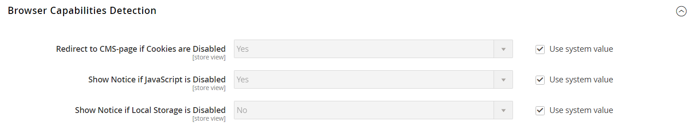

# [!UICONTROL General] > [!UICONTROL Web]

{{config}}

## [!UICONTROL URL Options]

<!-- zoom -->

<!-- [URL Options configuration settings](https://docs.magento.com/user-guide/stores/store-urls.html) -->

| フィールド | 範囲 | 説明 |
|  ---  |  ---  |  ---  |
| [!UICONTROL Add Store Code to URLs] | グローバル | Web Server Rewrites が有効な場合、は現在のビューのストア・コードを URL に挿入します。 オプション： `Yes` / `No`.  このフィールドが次のように設定されている場合 `Yes`を使用する場合は、URL の書き換えが正しくマッピングされ、すべてのページが正常に開かれるように、ブラウザー URL にストアコードを含める必要があります。 これは避ける _404 ページが見つかりません_ エラー。 |
| [!UICONTROL Auto-redirect to Base URL] | ストア表示 | （シングルストア設定の場合）サイトに壊れたリンクがある場合、は、「404 Page Not Found」というメッセージを含んだページではなく、ベース URL にトラフィックをリダイレクトします。 オプション：` No` / `Yes (302 Found)` / `Yes (301 Moved Permanently)`  **_重要：_**マルチストア設定では、ベース URL への自動リダイレクトを使用しないでください。 |
| [!UICONTROL Catalog media URL format] | グローバル | は、 [URL フォーマット](../../catalog/catalog-urls.md) 製品とカテゴリに割り当てられています。 オプション：画像バリアントごとの一意のハッシュ（レガシーモード）は、変換されたファイル名を一意のハッシュ値として定義します。 クエリパラメーターに基づく画像の最適化では、次のことを定義します [画像の最適化](../../content-design/media-gallery-image-optimization.md) クエリパラメーターに応じて処理します。 |

{style="table-layout:auto"}

## [!UICONTROL Search Engine Optimization]

<!-- zoom -->

<!-- [Search Engine Optimization configuration settings](https://docs.magento.com/user-guide/marketing/url-rewrite.html) -->

| フィールド | [範囲](../../getting-started/websites-stores-views.md#scope-settings) | 説明 |
|--- |--- |--- |
| [!UICONTROL Use Web Server Rewrites] | ストア表示 | 通常、PHP ベースのシステムにはというファイルが含まれます。 `index.php` ルートフォルダーのフォルダーに移動します。 デフォルトでは、URL 内で、ルートフォルダー名の直後にファイル名が表示されます。 このオプションを有効にすると、システムは省略されます `index.php` URL から。 この使いやすさのベストプラクティスにより、各 URL がより簡潔になり、パフォーマンスやサイトのランクには影響しません。 オプション： `Yes` / `No` |

{style="table-layout:auto"}

## [!UICONTROL Base URLs]

<!-- zoom -->

<!-- [Base URLS configuration settings](https://docs.magento.com/user-guide/stores/store-urls.html) -->

| フィールド | [範囲](../../getting-started/websites-stores-views.md#scope-settings) | 説明 |
|--- |--- |--- |
| [!UICONTROL Base URL] | ストア表示 | 暗号化（SSL）チャネルで動作していないCommerce ルートフォルダーのフルアドレス。 URL の末尾はスラッシュにする必要があります。 |
| [!UICONTROL Base Link URL] | ストア表示 | ベース URL のプレースホルダーとして使用されるマークアップタグ。 |
| [!UICONTROL Base URL for Static View Files] | ストア表示 | CSS、フォント、画像、JavaScript など、テーマで使用される静的ファイルの場所を指すパス。 プレースホルダーは、ベース URL を表すために使用されます。 Commerce インストールに同じフォルダー構造を持つ複数のサイトがある場合、サイトごとに異なるフォルダーを使用できます。 静的ビューファイルのベース URL を入力する前に、設定範囲を正しいサイトに設定してください。 Commerceのインストール環境の外部でフォルダーを指定することもできます。 |
| [!UICONTROL Base URL for User Media Files] | ストア表示 | カタログ イメージおよびその他のメディア ファイルの場所を指すパス。 プレースホルダーは、ベース URL を表すために使用されます。 Commerceのインストールに同じフォルダー構造の複数のサイトがある場合、それぞれに異なるメディアフォルダーを使用できます。 これにより、各メディア フォルダを個別にバックアップおよびロールバックできます。 Commerceのインストール環境の外部でメディアフォルダーを指定することもできます。 |

{style="table-layout:auto"}

## [!UICONTROL Base URLs (Secure)]

<!-- zoom -->

<!-- [Base URLs (Secure) configuration settings](https://docs.magento.com/user-guide/stores/store-urls.html) -->

| フィールド | [範囲](../../getting-started/websites-stores-views.md#scope-settings) | 説明 |
|--- |--- |--- |
| [!UICONTROL Secure Base URL] | ストア表示 | 暗号化されたセキュア （SSL/TLS） プロトコルで配信されるCommerce ルートフォルダーのフルアドレス。 URL の末尾はスラッシュにする必要があります。 |
| [!UICONTROL Secure Base Link URL] | ストア表示 | 安全なチャネルで実行されるベース URL のプレースホルダーとして使用されるマークアップタグ。 |
| [!UICONTROL Secure Base URL for Static View Files] | ストア表示 | テーマで使用される CSS、フォント、画像、JavaScript などの静的ファイルの場所を指すマークアップタグ。 ファイルは、安全でないチャネルまたは安全なチャネルのどちらかに置くことができます。 Commerce インストールに同じフォルダー構造を持つ複数のサイトがある場合、サイトごとに異なるフォルダーを使用できます。 静的ビューファイルのベース URL を入力する前に、設定範囲を正しいサイトに設定してください。 Commerceのインストール環境の外部でフォルダーを指定することもできます。 |
| [!UICONTROL Secure Base URL for User Media Files] | ストア表示 | カタログ イメージおよびその他のメディア ファイルの場所を指すパス。 ファイルは、安全でないチャネルまたは安全なチャネルのどちらかに置くことができます。 プレースホルダーは、ベース URL を表すために使用されます。 Commerceのインストールに同じフォルダー構造の複数のサイトがある場合、それぞれに異なるメディアフォルダーを使用できます。 これにより、各メディア フォルダを個別にバックアップおよびロールバックできます。 Commerceのインストール環境の外部でメディアフォルダーを指定することもできます。 |
| [!UICONTROL Use Secure URLs on Storefront] | ストア表示 | ドメインにセキュリティ証明書がある場合は、SSL 暗号化付きまたは SSL 暗号化なしでストアフロントを実行するように選択できます。 オプション： **`Yes`**- ストア URL はで始まります。 `https` 暗号化されたセキュアなプロトコルでページが配信されることを示します。 **`No`** - ストア URL はで始まります。 `http` ページがセキュアプロトコルなしで配信されることを示します。 |
| [!UICONTROL Use Secure URLs in Admin] | グローバル | ドメインにセキュリティ証明書がある場合は、SSL 暗号化の有無にかかわらず、ストア管理を実行するように選択できます。 オプション：  **`Yes`**– 管理者 URL はで始まります `https` 暗号化されたセキュアなプロトコルでページが配信されることを示します。 **`No`**  – 管理者 URL はで始まります `http` ページがセキュアプロトコルなしで配信されることを示します。  ストアと管理者の両方でセキュア URL が有効になっている場合、2 つの追加フィールドが有効になるように表示され、設定されます `HSTS`. |
| [!UICONTROL Enable HTTP Strict Transport Security (HSTS)] | ストア表示 | 有効な場合、 [`HSTS`][1] 「man in the middle」攻撃に対するセキュリティの尺度を提供し、「invalid certificate」メッセージを上書きするのを防ぎます。 オプション： `Yes` / `No` |
| [!UICONTROL Upgrade Insecure Requests] | ストア表示 | 有効にすると、保護されていないファイルが変換されます（`HTTP`）、ブラウザーからセキュアな（`HTTPS`）プロトコルで指定します。 オプション： `Yes` / `No` |
| [!UICONTROL Offloader Header] | グローバル | を指定します `offloader_header` サーバー設定の値を使用して、クライアントとロードバランサー間のプロトコルを識別します。 ほとんどのCommerce インストールでは、デフォルト値が使用されます。 `X-Forwarded-Proto` （XFP）：プロトコルを次のいずれかとして識別します `HTTP` または `HTTPS`. |

{style="table-layout:auto"}

## [!UICONTROL Default Pages]

<!-- zoom -->

<!-- [Default Pages configuration settings](https://docs.magento.com/user-guide/cms/pages-default.html) -->

| フィールド | [範囲](../../getting-started/websites-stores-views.md#scope-settings) | 説明 |
|--- |--- |--- |
| [!UICONTROL Default Web URL] | ストア表示 | ベース URL に関連付けられているランディングページを示します。 これは、Commerce コンテンツ管理システム（CMS）からのページを示すために、デフォルトで「cms」に設定されます。 また、ブログなど、別のタイプのランディングページを使用することもできます。 例えば、サーバーにブログがインストールされている場合 `magento/blog`を選択した場合は、「blog」フォルダーの名前を、選択したページへの相対パスとして入力します。 |
| [!UICONTROL CMS Home Page] | ストア表示 | ストアのホームページを選択するには、リストから CMS ページを選択するだけです。 デフォルトでは、CMS のホームページには、ストアで使用可能な CMS ページの選択全体が一覧表示されます。 |
| [!UICONTROL Default No-route URL] | ストア表示 | には、の場合に表示されるデフォルトのページの URL が含まれます。 `404 Page not Found` エラーが発生しました。 デフォルト値はです `cms/noroute/index`. |
| [!UICONTROL CMS No Route Page] | ストア表示 | 404 ページが見つからないというエラーが発生した場合に表示する特定の CMS ページを識別します。 デフォルトのページは「404 Not Found」です。 |
| [!UICONTROL CMS No Cookies Page] | ストア表示 | ブラウザーで Cookie が有効になっていない場合に表示される特定の CMS ページを識別します。 このページでは、cookie が使用される理由と、各ブラウザーで cookie を有効にする方法について説明します。 デフォルトのページでは、Cookie を有効にします。 |
| [!UICONTROL Show Breadcrumbs for CMS Pages] | ストア表示 | カタログ内のすべての CMS ページにパンくずリストを表示するかどうかを決定します。 オプション： `Yes` / `No` |

{style="table-layout:auto"}

## [!UICONTROL Default Layouts]

<!-- zoom -->

<!--[Default Layouts](https://docs.magento.com/user-guide/design/page-layout.html) -->

| フィールド | [範囲](../../getting-started/websites-stores-views.md#scope-settings) | 説明 |
|--- |--- |--- |
| [!UICONTROL Default Product Layout] | グローバル | は [layout](../../content-design/page-layout.md) これは、製品ページにデフォルトで使用されます。 オプション：  **`No layout updates`**- デフォルトでは、製品ページのレイアウトのアップデートは利用できません。 **`Empty`** - デフォルトでは、は製品ページに空白のレイアウトを使用します。  **`1 column`**- デフォルトでは、は製品ページに 1 列のレイアウトを使用します。 **`2 columns with left bar`** - デフォルトでは、は、製品ページ用にサイドバーが左側にある 2 列のレイアウトを使用します。  **`2 columns with right bar`**- デフォルトでは、は、製品ページ用にサイドバーが右側にある 2 列のレイアウトを使用します。 **`3 columns`** - デフォルトでは、は製品ページに対して左右にサイドバーを持つ 3 列のレイアウトを使用します。 **`Page -- Full Width`**- （必須 [!DNL Page Builder]）が使用されます。デフォルトでは、は製品ページ用に「ページ – 全幅」レイアウトを使用します。 **`Category - Full Width`** - （必須 [!DNL Page Builder]）が使用されます。デフォルトでは、は製品ページにカテゴリ – 全幅レイアウトを使用します。  **`Product - Full Width`**- （必須 [!DNL Page Builder]）が使用されます。デフォルトでは、は製品ページ用に製品 – 全幅レイアウトを使用します。 |
| [!UICONTROL Default Category Layout] | グローバル | は [layout](../../content-design/page-layout.md) これは、カテゴリページにデフォルトで使用されます。 オプション：  **`No layout updates`**- デフォルトでは、カテゴリページに対するレイアウトの更新は使用できません。 **`Empty`** - デフォルトでは、はカテゴリページに空白のレイアウトを使用します。  **`1 column`**- デフォルトでは、はカテゴリページに 1 列レイアウトを使用します。 **`2 columns with left bar`** - デフォルトでは、は、カテゴリページ用にサイドバーが左側にある 2 列のレイアウトを使用します。  **`2 columns with right bar`**- デフォルトでは、は、カテゴリページ用にサイドバーが右側にある 2 列のレイアウトを使用します。 **`3 columns`** - デフォルトでは、は、カテゴリページに対して左右にサイドバーを持つ 3 列のレイアウトを使用します。 **`Page - Full Width`**- （必須 [!DNL Page Builder]）が使用されます。デフォルトでは、はカテゴリページにページ – 全幅レイアウトを使用します。 **`Category - Full Width`** - （必須 [!DNL Page Builder]）が使用されます。デフォルトでは、はカテゴリページに対してカテゴリ – 全幅レイアウトを使用します。  **`Product - Full Width`**- （必須 [!DNL Page Builder]）が使用されます。デフォルトでは、はカテゴリページに製品 – 全幅レイアウトを使用します。 |
| 既定のページ レイアウト | グローバル | は [layout](../../content-design/page-layout.md) これは、CMS ページにデフォルトで使用されます。 オプション：  **`No layout updates`**- デフォルトでは、CMS ページのレイアウトの更新は利用できません。 **`Empty`** - デフォルトでは、は CMS ページに空白のレイアウトを使用します。  **`1 column`**- デフォルトでは、は CMS ページに 1 列のレイアウトを使用します。 **`2 columns with left bar`** - デフォルトでは、は、CMS ページ用にサイドバーが左側にある 2 列のレイアウトを使用します。 **`2 columns with right bar`**- デフォルトでは、は、CMS ページ用にサイドバーが右側にある 2 列のレイアウトを使用します。 **`3 columns`** - デフォルトでは、は CMS ページに対して左右にサイドバーを持つ 3 列のレイアウトを使用します。 **`Page - Full Width`**- （必須 [!UICONTROL Page Builder]）が使用されます。デフォルトでは、は CMS ページに Page - Full Width レイアウトを使用します。 **`Category - Full Width`** - （必須 [!UICONTROL Page Builder]）が使用されます。デフォルトでは、は CMS ページに対して「カテゴリ – 全幅」レイアウトを使用します。  **`Product - Full Width`**- （必須 [!DNL Page Builder]）が使用されます。デフォルトでは、は CMS ページに製品 – 全幅レイアウトを使用します。 |

{style="table-layout:auto"}

## [!UICONTROL Default Cookie Settings]

<!-- zoom -->

<!-- [Default Cookie configuration settings](https://docs.magento.com/user-guide/stores/compliance-cookie-law.html) -->

| フィールド | [範囲](../../getting-started/websites-stores-views.md#scope-settings) | 説明 |
|--- |--- |--- |
| [!UICONTROL Cookie Lifetime] | ストア表示 | cookie が自動的に削除されるまでに、その cookie が存在できる期間を決定します。 デフォルト値は 3600 秒（1 時間）です |
| [!UICONTROL Cookie Path] | ストア表示 | Commerce Cookie を使用できるサーバー上のフォルダーを指定します。 インストール内のすべての場所でCommerce Cookie を使用できるようにするには、Cookie のパスをスラッシュ 1 つに設定します。 `/`. この値には、cookie のパスのみを含めることができます。 **_できません_** その他の cookie パラメーターが含まれます。 |
| [!UICONTROL Cookie Domain] | ストア表示 | サブドメインでCommerce Cookie を使用できるかどうかを決定します。 例えば、次をサポートします `mysubdomain`.domain.comの場合、ドメイン名の先頭にピリオドを付けて、のように入力します。 `.domain.com`. この値には、cookie ドメインのみを含めることができます。 **_できません_** その他の cookie パラメーターが含まれます。 |
| [!UICONTROL Use HTTP Only] | ストア表示 | Commerce Cookie を保護されていないチャネル（http）でのみ使用するか、暗号化されたチャネル（https）でも使用するかを指定します。 オプション： `Yes` / `No` |
| [!UICONTROL Cookie Restriction Mode] | Web サイト | cookie 制限モードが有効かどうかを判断します。 オプション： `Yes` / `No` |

{style="table-layout:auto"}

## [!UICONTROL Session Validation Settings]

<!-- zoom -->

<!-- [Session Validation configuration settings](https://docs.magento.com/user-guide/stores/security-session-validation.html) -->

| フィールド | [範囲](../../getting-started/websites-stores-views.md#scope-settings) | 説明 |
|--- |--- |--- |
| [!UICONTROL Validate REMOTE_ADDR] | グローバル | リクエストの IP アドレスが一致することを確認します `$_SESSION` データ。 別の IP アドレスが検出されると、セッションは終了します。 オプション： `Yes` / `No` |
| [!UICONTROL Validate HTTP_VIA] | グローバル | 受信プロキシデータを検証し、リクエストのプロキシアドレスが一致することを確認します `$_SESSION` データ。 別のプロキシ アドレスが検出されると、セッションは終了します。 オプション： `Yes` / `No` |
| [!UICONTROL Validate HTTP_x_FORWARDED_FOR] | グローバル | 送信プロキシ データを検証し、要求の転送先アドレスが一致するかどうかを確認します  `$_SESSION` データ。 転送先アドレスに別のアドレスが検出されると、セッションは終了します。 オプション： `Yes` / `No` |
| [!UICONTROL Validate HTTP_USER_AGENT] | グローバル | `USER_AGENT` web サイトへのアクセスに使用されるブラウザーまたはデバイスを指します。 ブラウザーの名前とバージョン、およびオペレーティングシステムが一致するかどうかを確認します `$_SESSION` データ。 同じセッション内のあるリクエストから別のリクエストに異なるユーザーエージェントが検出された場合、セッションは終了します。 オプション： `Yes` / `No` |

{style="table-layout:auto"}

## [!UICONTROL Browser Capabilities Detection]

<!-- zoom -->

<!-- [Browser Capabilities Detection configuration settings](https://docs.magento.com/user-guide/stores/security-browser-capabilities-detection.html) -->

| フィールド | [範囲](../../getting-started/websites-stores-views.md#scope-settings) | 説明 |
|--- |--- |--- |
| [!UICONTROL Redirect to CMS-page if Cookies are Disabled] | ストア表示 | ブラウザーで Cookie が無効になっている場合は、CMS の Cookie が無効ページに自動的にリダイレクトされます。 オプション： `Yes` / `No` |
| [!UICONTROL Show Notice if JavaScript is Disabled] | ストア表示 | ブラウザーで JavaScript が無効になっている場合は、JavaScript オプションを有効にするようユーザーに促す次の通知が表示されます。 `Yes` / `No` （無効） |
| [!UICONTROL Show Notice if Local Storage is Disabled] | ストア表示 | ローカルキャッシュが無効な場合にメッセージを表示します。 オプション： `Yes` / `No` |

{style="table-layout:auto"}

[1]: https://cheatsheetseries.owasp.org/cheatsheets/HTTP_Strict_Transport_Security_Cheat_Sheet.html
