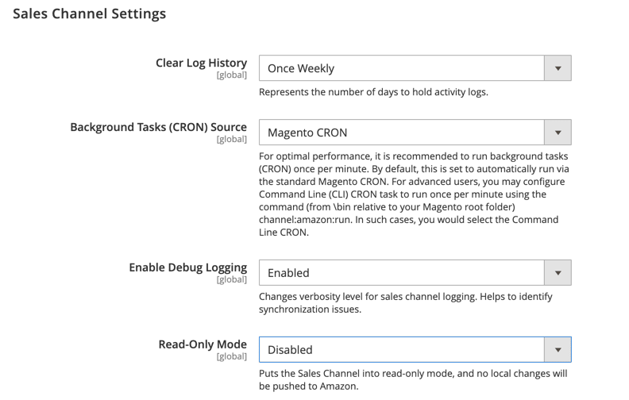

# [!UICONTROL Sales Channels] > [!UICONTROL Global Settings]

{{config}}

これらの設定は、[[!DNL Amazon Sales Channel]](https://experienceleague.adobe.com/docs/commerce-channels/amazon/getting-started/install.html?lang=ja)がインストールされている場合に使用できます。

<!-- zoom -->

| フィールド | [範囲](../getting-started/websites-stores-views.md#scope-settings) | 説明 |
|-----|---------|------|
| [!UICONTROL Clear Log History] | グローバル | オプション：  **`Once Daily`**: ストアのアクティビティ履歴を1日1回クリアするには、このオプションを選択します。  **`Once Weekly`**：このオプションを選択すると、1週間に1回、ストアのアクティビティ履歴をクリアできます。  **`Once Monthly`**: （デフォルト）このオプションを選択すると、ストアのアクティビティ履歴を1か月に1回消去できます。 |
| [!UICONTROL Background Tasks (CRON) Source] | グローバル | 「`Magento CRON`」を選択して、[!DNL Amazon Sales Channel]がCommerceのcron設定を使用して、Amazon Seller Centralとの通信およびデータ同期の間隔を決定することを指定します。 |
| [!UICONTROL Enable Debug Logging] | グローバル | トラブルシューティングが必要な場合に追加の同期データを収集するには、`Enabled`を選択します。  このオプションはデフォルトでは無効になっており、継続的なログはパフォーマンスに悪影響を及ぼすため、トラブルシューティングに必要な場合にのみ有効にする必要があります。 トラブルシューティングに対して有効にした場合、完了時に無効にする必要があります。 |
| [!UICONTROL Read-Only Mode] | グローバル | `Enabled`を選択して、すべての送信する状態を変更するAPI要求をブロックします。 読み取り専用モードが無効になるまで、変更の可能性は保存されますが、送信されません。 データ転送を再度開始するには、`Disabled`を選択します。   データベースがインスタンスの新しいコピーに移行されると（ストアのURLが設定で変更されたときに検出されます）、読み取り専用モードが自動的に有効になります。  これは、_ステージング_&#x200B;や&#x200B;_QA_&#x200B;など、実稼動インスタンスのコピーで使用するように設計されており、実稼動インスタンスでは使用しないでください。  **_注&#x200B;_**：有効にするには、[!UICONTROL Read-Only Mode]で設定キャッシュをクリアする必要があります。 |

{style="table-layout:auto"}
