# [!UICONTROL Sales] > [!UICONTROL Payment Methods] > [!UICONTROL Braintree]

>[!IMPORTANT]
>
>**Commerce 2.4への移行：** 
>2.4.0より前のバージョンのAdobe CommerceとMagento Open Sourceの場合は、コア統合を置き換えるために、[Commerce Marketplace](https://marketplace.magento.com/catalogsearch/result/?q=braintree)から公式のBraintree payment integration拡張機能をインストールして設定することをお勧めします。2.4.0以降、この拡張機能はコアリリースに含まれるようになりました。
>  >Commerce 2.4に移行する際、マーチャントはMarketplace （`paypal/module-braintree`または`gene/module-braintree`）で配布されている拡張機能をアンインストールし、コードを更新して`Magento_Braintree`ではなく`PayPal_Braintree`名前空間を使用する必要があります。Commerce用のバンドル拡張機能とCommerce Marketplaceに配布された拡張機能の設定は保持されます。これらのバージョンの拡張機能に対して行われた支払いは、通常どおり取得、無効化、または返金されます。
>  >Commerce 2.4.0にアップグレードする場合、以前の2.3.x バージョンで推奨されるCommerce Marketplace拡張機能を使用しない場合、マルチアドレス機能は2.4.0 バージョンのBraintreeでは機能しません。買い物客が「_複数のアドレスに配信_」を選択すると、Braintreeの支払い方法は表示されません。2.3.xで以前に推奨されていたCommerce Marketplace拡張機能には、この複数のアドレスの問題があります。

{{config}}

>[!IMPORTANT]
>
>カードの予期しない請求に関するサポートが必要な場合は、[&#x200B; サブスクリプションの解約](https://helpx.adobe.com/jp/manage-account/using/cancel-subscription.html) ページにアクセスしてサポートを受けてください。

## [!UICONTROL Basic Braintree Settings]

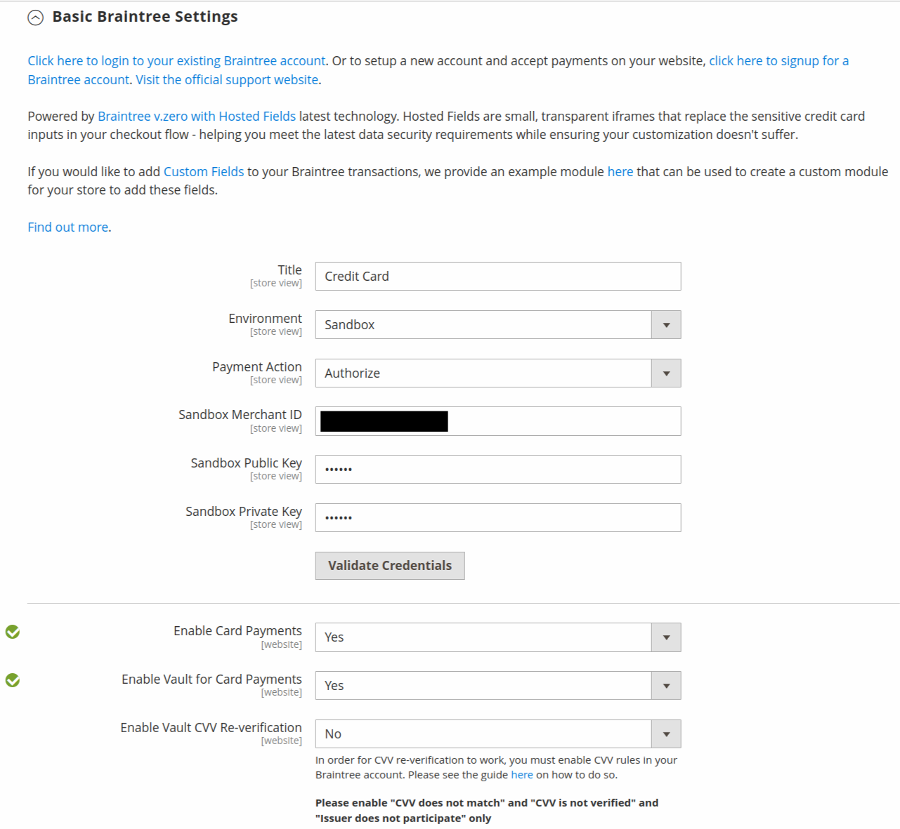<!-- zoom -->

| フィールド | [範囲](../../getting-started/websites-stores-views.md#scope-settings) | 説明 |
|--- |--- |--- |
| [!UICONTROL Title] | ストアビュー | デフォルト値：`Credit Card` （Braintree） |
| [!UICONTROL Environment] | ストアビュー | オプション：`Sandbox` / `Production` |
| [!UICONTROL Payment Action] | ストアビュー | 支払いが処理されたときにBraintreeが実行するアクションを指定します。 オプション： **`Authorize`**– お客様のクレジットカードの資金は承認されますが、アカウントからは転送されません。 ストア管理者で注文が作成されます。 後で売上を取得し、請求書を作成できます。 **`Intent Sale`** （以前のリリースでは`Authorize and Capture`） – お客様のクレジットカードの資金はBraintreeによって承認および取得され、注文と請求書はストア管理者で作成されます。 |
| [!UICONTROL Sandbox Merchant ID] | ストアビュー | これは、サンドボックスゲートウェイアカウント全体の一意のIDです。 _パブリック ID_&#x200B;または&#x200B;_プロダクション ID_&#x200B;とも呼ばれ、マーチャント IDはプロダクション ゲートウェイとサンドボックス ゲートウェイで異なります。 このフィールドは、_[!UICONTROL Environment]_&#x200B;フィールドが`Sandbox`に設定されている場合に表示されます。 |
| [!UICONTROL Sandbox Public Key] | ストアビュー | これは、暗号化されたデータへのアクセスを制限する、ユーザー固有の公開IDです。 サンドボックス Braintree ゲートウェイに関連付けられている各ユーザーには、独自のサンドボックス公開鍵があります。 このフィールドは、_[!UICONTROL Environment]_&#x200B;フィールドが`Sandbox`に設定されている場合に表示されます。 |
| [!UICONTROL Sandbox Private Key] | ストアビュー | これは、暗号化されたデータへのアクセスを制限する、ユーザー固有のプライベート IDです。 サンドボックス Braintree ゲートウェイに関連付けられている各ユーザーには、サンドボックス用の独自の秘密鍵があります。 このフィールドは、_[!UICONTROL Environment]_&#x200B;フィールドが`Sandbox`に設定されている場合に表示されます。 |
| [!UICONTROL Merchant ID] | ストアビュー | これは、ゲートウェイに存在する可能性のある複数の加盟店アカウントを含め、ゲートウェイアカウント全体の一意のIDです。 _パブリック ID_&#x200B;または&#x200B;_プロダクション ID_&#x200B;とも呼ばれ、マーチャント IDはプロダクション ゲートウェイとサンドボックス ゲートウェイで異なります。 このフィールドは、_[!UICONTROL Environment]_&#x200B;フィールドが`Production`に設定されている場合に表示されます。 |
| [!UICONTROL Public Key] | ストアビュー | これは、暗号化されたデータへのアクセスを制限する、ユーザー固有の公開IDです。 Braintree ゲートウェイに関連付けられた各ユーザーには、独自の公開鍵があります。 このフィールドは、_[!UICONTROL Environment]_&#x200B;フィールドが`Production`に設定されている場合に表示されます。 |
| [!UICONTROL Private Key] | ストアビュー | これは、暗号化されたデータへのアクセスを制限する、ユーザー固有のプライベート IDです。 Braintree ゲートウェイに関連付けられた各ユーザーには、独自の秘密鍵があります。 このフィールドは、_[!UICONTROL Environment]_&#x200B;フィールドが`Production`に設定されている場合に表示されます。 |
| [!UICONTROL Enable Card Payments] | web サイト | Braintreeのクレジットカードの支払い方法が支払い方法として利用できるかどうかを指定します。 オプション：`Yes` / `No` |
| [!UICONTROL Enable Vault for Card Payments] | web サイト | 有効にすると、は顧客の支払い情報を安全に保存できるので、顧客は購入するたびにクレジットカード情報を再入力する必要がありません。 オプション：`Yes` / `No` |
| [!UICONTROL Enable Vault CVV Re-verification] | web サイト | 有効にすると、Braintree アカウントで設定されたCVV ルールの検証が行われます。 オプション：`Yes` / `No` |

{style="table-layout:auto"}

## [!UICONTROL Advanced Braintree Settings]

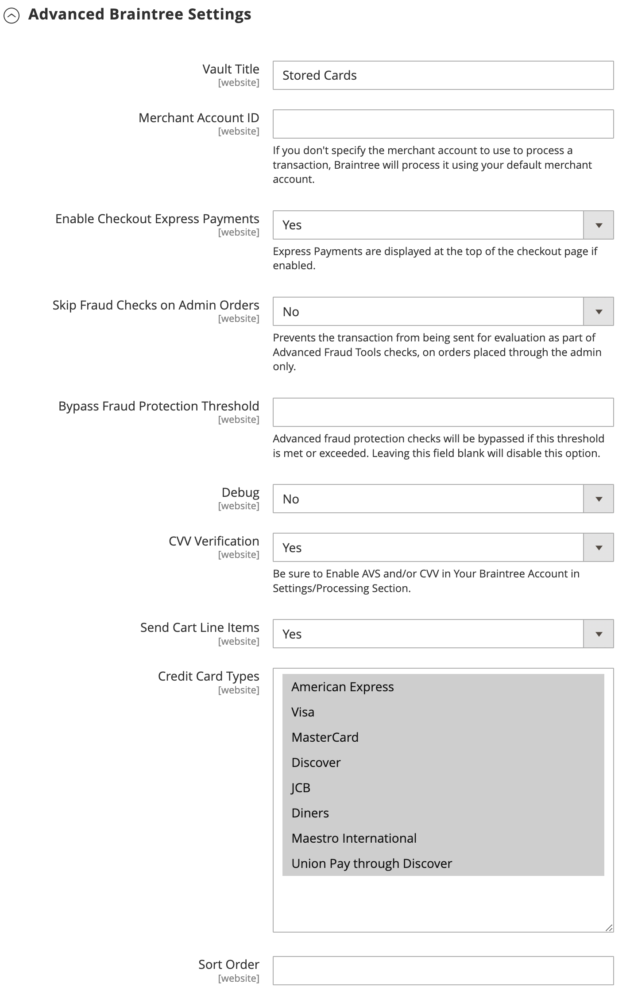{width="550" zoomable="yes"}

| フィールド | [範囲](../../getting-started/websites-stores-views.md#scope-settings) | 説明 |
|--- |--- |--- |
| [!UICONTROL Vault Title] | web サイト | 顧客カード情報が保存される保管スペースを識別する、参照用の説明的なタイトル。 |
| [!UICONTROL Merchant Account ID] | web サイト | このWeb サイトのBraintree トランザクションに関連付ける加盟店アカウント ID。 空白のままにすると、Braintree アカウントのデフォルトの加盟店アカウントが使用されます。 |
| [!UICONTROL Enable Checkout Express Payments] | web サイト | PayPal、PayLater、Apple Pay、Google Payなど、チェックアウトプロセスの開始時にExpress Payment オプションを使用することで、より迅速なチェックアウト体験を提供します。 オプション：`Yes` / `No` |
| [!UICONTROL Skip Fraud Checks on Admin Orders] | web サイト | `Yes`に設定されている場合にのみ、管理者を通じて行われた注文に対して、[!DNL Advanced Fraud Tools] チェックの一部としてトランザクションを評価用に送信しないようにします。  オプション：`Yes` / `No` |
| [!UICONTROL Bypass Fraud Protection Threshold] | web サイト | しきい値を満たすか、しきい値を超えた場合、`Advanced Fraud Protection` チェックはバイパスされます。 このフィールドを空白にすると、このオプションは無効になります。 |
| [!UICONTROL Debug] | web サイト | Braintree システムとストア間の通信がログファイルに記録されるかどうかを指定します。 オプション：`Yes` / `No` |
| [!UICONTROL CVV Verification] | web サイト | お客様がクレジットカードの裏面から3桁のセキュリティコードを提供する必要があるかどうかを判断します。 オプション：`Yes` / `No` |
| [!UICONTROL Send Card Line Items] | web サイト | すべての支払い方法にカートのラインアイテムを送信します。 オプション：`Yes` / `No` |
| [!UICONTROL Credit Card Types] | web サイト | Braintreeを通じて支払いとして受け入れる各クレジットカードを指定します。 カードの組み合わせを選択するには、`Ctrl` （またはMacの`Command`）を押し続けます。 オプション：`American Express` / `Visa` / `MasterCard` / `Discover` / `JCB` / `Diners` / `Maestro International` |
| [!UICONTROL Sort Order] | web サイト | Braintreeがチェックアウト時に他の支払い方法と共に表示される注文を指定します。 |

## [!UICONTROL Braintree Webhooks Settings]

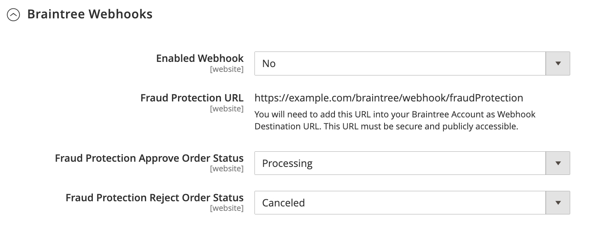<!-- zoom -->

| フィールド | [範囲](../../getting-started/websites-stores-views.md#scope-settings) | 説明 |
|--- |--- |--- |
| [!UICONTROL Enable Webhook] | web サイト | Webhook機能を有効にして、不正利用防止、ACH支払い、ローカル支払い方法、および紛争を行います。 オプション：`Yes` / `No` |
| [!UICONTROL Fraud Protection URL] | web サイト | このURLを[!UICONTROL Webhook Destination URL]としてBraintree アカウントに追加します。 **このURLは安全で一般にアクセスできる必要があります。** |
| [!UICONTROL Fraud Protection Approve Order Status] | web サイト | Braintreeで不正利用防止が承認されると、選択した注文ステータスがCommerce注文に割り当てられます。 このステータスは、ACH支払い方法が使用されている注文のステータスと、Braintreeで`SETTLED`に移行する場合に更新するために使用されます。 |
| [!UICONTROL Fraud Protection Reject Order Status] | web サイト | Braintreeで不正利用防止が拒否されると、選択した注文ステータスがCommerce注文に割り当てられます。 このステータスは、ACH支払い方法が使用されている注文のステータスを更新するために使用され、Braintreeで`SETTLEMENT`が`DECLINED`の場合に使用されます。 |

{style="table-layout:auto"}

## [!UICONTROL Country Specific Settings]

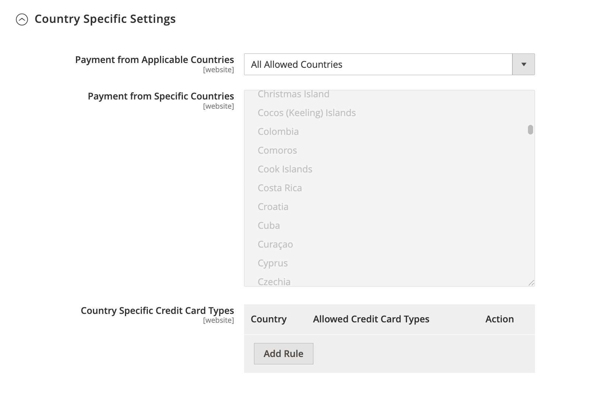<!-- zoom -->

| フィールド | [範囲](../../getting-started/websites-stores-views.md#scope-settings) | 説明 |
|--- |--- |--- |
| [!UICONTROL Payment from Applicable Countries] | web サイト | Braintreeが処理する決済をすべての国から受け付けるか、特定の国から受け付けるかを指定します。 オプション：`All Allowed Countries` / `Specific Countries` |
| [!UICONTROL Payment from Specific Countries] | web サイト | 該当する場合は、Braintreeで処理される支払いを受け入れる特定の国を特定します。 |
| [!UICONTROL Country Specific Credit Card Types] | web サイト | Braintreeで処理される支払いに対して国ごとに受け入れられるクレジットカードを識別します。 レコードは各国ごとに保存されます。 オプション： **`Country`**– 国を選択します。 **`Allowed Card Types`** – 国からBraintreeを通じて支払いに受け入れられる各クレジットカードを選択します。 **`Add`**– 別の国のクレジットカードを許可する行を追加します。 **`Action`** – 国で許可されているクレジットカードの記録を削除します。 |

{style="table-layout:auto"}

## [!UICONTROL ACH through Braintree]

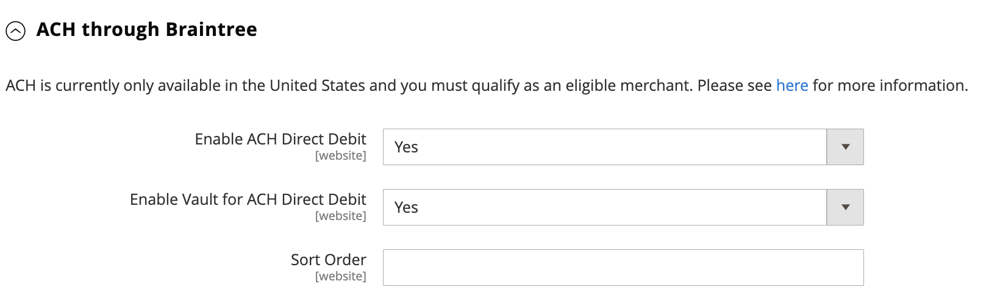<!-- zoom -->

| フィールド | [範囲](../../getting-started/websites-stores-views.md#scope-settings) | 説明 |
|--- |--- |--- |
| [!UICONTROL Enabled ACH Direct Debit] | web サイト | [!DNL ACH Direct Debit]がBraintreeを通じた支払い方法として含まれているかどうかを確認します。 オプション：`Yes` / `No` |
| [!UICONTROL Enable Vault for ACH Direct Debit] | web サイト | お客様は、将来の使用のために、1回限りのACH Direct Debit支払い方法を保管できます。 支払いの詳細が認証されると、顧客はデータを再入力したり、支払い情報を再認証したりすることなく、ACH Direct Debit支払い方法を使用できます。 オプション：`Yes` / `No` |
| [!UICONTROL Sort Order] | web サイト | チェックアウト時に[!DNL ACH Direct Debit]が他の支払い方法と共に表示される注文を決定します。 |

{style="table-layout:auto"}

## [!UICONTROL Apple Pay through Braintree]

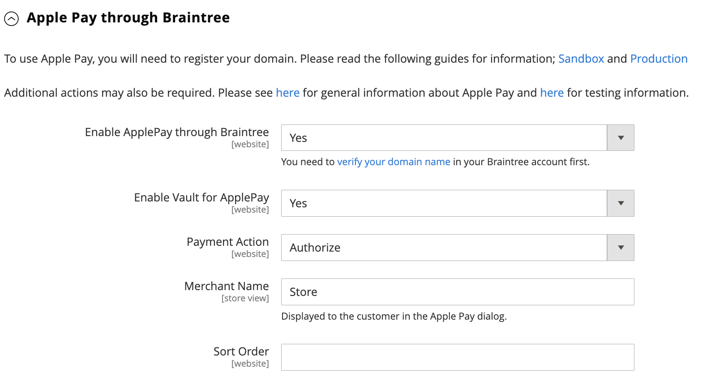<!-- zoom -->

| フィールド | [範囲](../../getting-started/websites-stores-views.md#scope-settings) | 説明 |
|--- |--- |--- |
| [!UICONTROL Enable ApplePay through Braintree] | web サイト | Apple PayがBraintreeを通じた支払い方法として含まれているかどうかを確認します。 オプション：`Yes` / `No`    ドメインは、最初に[Braintree アカウントで確認する必要があります](https://developer.paypal.com/braintree/docs/guides/apple-pay/configuration/javascript/v3)。 |
| [!UICONTROL Enable Vault for ApplePay] | web サイト | お客様は、後で使用するためにApple Payの支払い方法を保管できます。 支払いの詳細が認証されると、顧客はデータを再入力したり、支払い情報を再認証したりすることなく、Apple Payを使用できるようになります。 オプション：`Yes` / `No` |
| [!UICONTROL Payment Action] | web サイト | 支払いが処理されたときにBraintreeが実行するアクションを指定します。 オプション： **`Authorize`**– お客様のカードの資金は承認されますが、お客様のアカウントから転送されません。 ストア管理者で注文が作成されます。 後で売上を取得し、請求書を作成できます。 **`Intent Sale`** – お客様のカードの資金は、Braintreeによって承認およびキャプチャされ、注文と請求書がストア管理者に作成されます。 **_Note:_**&#x200B;これは2.3.x以前のリリースの`Authorize and Capture`でした。 |
| [!UICONTROL Merchant Name] | ストアビュー | ApplePay ポップアップで顧客に表示されるラベル。 |
| [!UICONTROL Sort Order] | web サイト | チェックアウト時にApple Payが他の支払い方法と共に表示される注文を指定します。 |

{style="table-layout:auto"}

## [!UICONTROL Local Payment Methods]

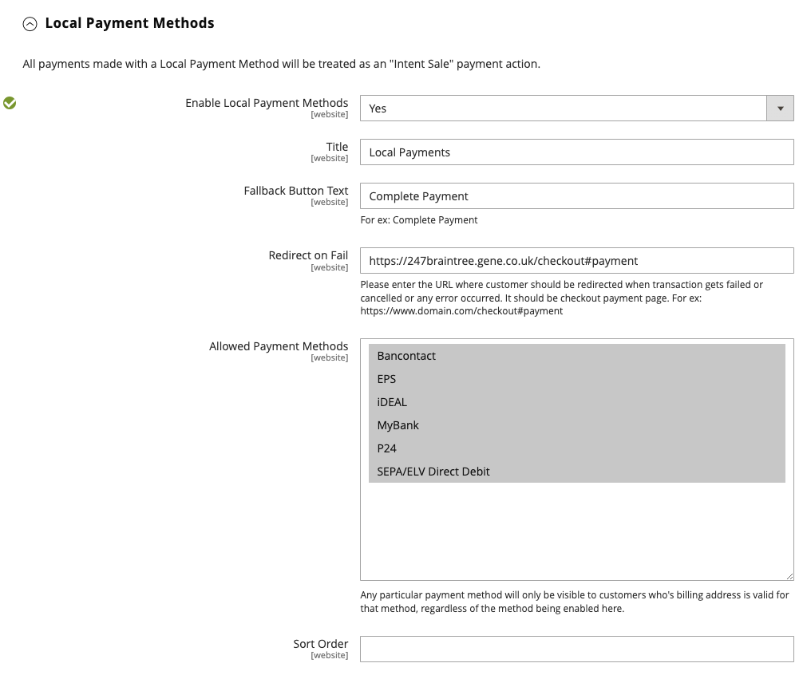<!-- zoom -->

| フィールド | [範囲](../../getting-started/websites-stores-views.md#scope-settings) | 説明 |
|--- |--- |--- |
| [!UICONTROL Enabled Local Payment Methods] | web サイト | Braintreeを通じて、ローカル支払い方法が支払い方法として含まれているかどうかを確認します。 オプション：`Yes` / `No` |
| [!UICONTROL Title] | web サイト | チェックアウト支払い方法セクションに表示されるラベル。 デフォルト値：`Local Payments` |
| [!UICONTROL Fallback Button Text] | web サイト | フォールバック Braintree ページに表示されるボタンに使用するテキストを入力します。このページでは、お客様をweb サイトに戻します。 デフォルト値：`Complete Checkout` |
| [!UICONTROL Redirect on Fail] | web サイト | ローカルの支払い方法トランザクションがキャンセルされたか、失敗したか、エラーが発生したときに、顧客をリダイレクトするURLを指定します。 チェックアウト支払いページである必要があります（例：`https://www.domain.com/checkout#payment`）。 |
| [!UICONTROL Allowed Payment Method] | web サイト | 有効にするローカル支払い方法を選択します。 オプション：`Bancontact` / `EPS` / `iDeal` / `MyBank` / `P24` / `SEPA/ELV Direct Debit` |
| [!UICONTROL Sort Order] | web サイト | チェックアウト時に、ローカル支払い方法が他の支払い方法と共に表示される順序を決定します。 |

{style="table-layout:auto"}

>[!NOTE]
>
>バンドルされたBraintree拡張機能は、[Braintree開発者ドキュメント &#x200B;](https://developer.paypal.com/braintree/docs/guides/local-payment-methods/overview)に記載されているすべてのローカル支払い方法をサポートしていません。 その他のローカル支払い方法は、今後のリリースでサポートされる予定です。

## [!UICONTROL GooglePay through Braintree]

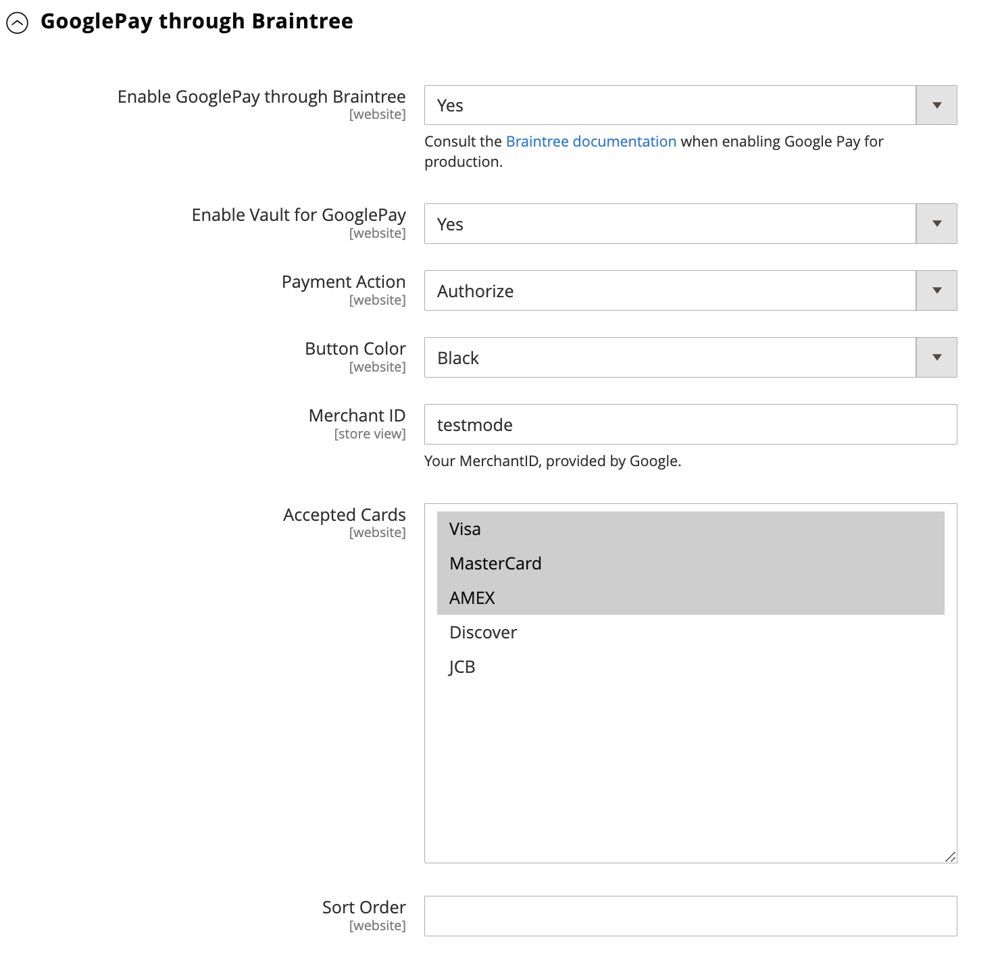<!-- zoom -->

| フィールド | [範囲](../../getting-started/websites-stores-views.md#scope-settings) | 説明 |
|--- |--- |--- |
| [!UICONTROL Enabled GooglePay through Braintree] | web サイト | Braintreeを通じて、[!DNL Google Pay]支払いが支払い方法として含まれているかどうかを確認します。 オプション：`Yes` / `No` |
| [!UICONTROL Enable Vault for GooglePay] | web サイト | お客様は、後で使用するためにGoogle Payの支払い方法を保管できます。 支払いの詳細が認証されると、顧客はデータを再入力したり、支払い情報を再認証したりすることなく、Google Payを使用できるようになります。 オプション：`Yes` / `No` |
| [!UICONTROL Payment Action] | web サイト | 支払いが処理されたときにBraintreeが実行するアクションを指定します。 オプション： **`Authorize`**– お客様のカードの資金は承認されますが、お客様のアカウントから転送されません。 ストア管理者で注文が作成されます。 後で売上を取得し、請求書を作成できます。 **`Intent Sale`** – お客様のカードの資金は、Braintreeによって承認およびキャプチャされ、注文と請求書がストア管理者に作成されます。 **_Note:_**&#x200B;これは2.3.x以前のリリースの`Authorize and Capture`でした。 |
| [!UICONTROL Button Color] | web サイト | [!DNL Google Pay] ボタンの色を指定します。 オプション：`White` / `Black` |
| [!UICONTROL Merchant ID] | ストアビュー | GOOGLEから提供されたIDは、ここに入力する必要があります。 |
| [!UICONTROL Accepted Cards] | web サイト | 顧客が[!DNL Google Pay]を使用して注文を行う際に使用できるカードの種類を選択します。 |
| [!UICONTROL Sort Order] | web サイト | チェックアウト時にGoogle Payが他の支払い方法と共に表示される注文を指定します。 |

{style="table-layout:auto"}

## [!UICONTROL Venmo through Braintree]

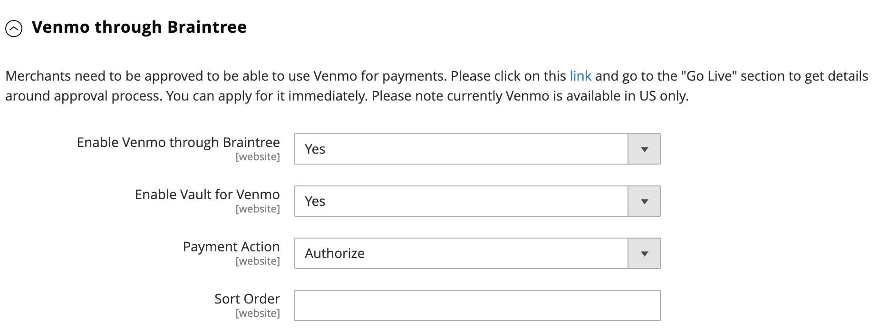<!-- zoom -->

| フィールド | [範囲](../../getting-started/websites-stores-views.md#scope-settings) | 説明 |
|--- |--- |--- |
| [!UICONTROL Enable Venmo through Braintree] | web サイト | [!DNL Venmo]がBraintreeを通じた支払い方法として含まれているかどうかを確認します。 オプション：`Yes` / `No` |
| [!UICONTROL Enable Vault for Venmo] | web サイト | お客様は、将来の使用のためにVenmoの支払い方法を保管することができます。 支払い詳細が保管されると、顧客はデータを再入力したり、支払い情報を再認証したりすることなく、Venmoの支払い方法を使用できます。 オプション：`Yes` / `No` |
| [!UICONTROL Payment Action] | web サイト | 支払いが処理されたときにBraintreeが実行するアクションを指定します。 オプション： **`Authorize`**– お客様のカードの資金は承認されますが、お客様のアカウントから転送されません。 ストア管理者で注文が作成されます。 後で売上を取得し、請求書を作成できます。 **`Intent Sale`** – お客様のカードの資金は、Braintreeによって承認およびキャプチャされ、注文と請求書がストア管理者に作成されます。 **_Note:_**&#x200B;これは、2.3.x以前のリリースの_&#x200B;認証とキャプチャ _でした。 |
| [!UICONTROL Sort Order] | web サイト | チェックアウト時にVenmoが他の支払い方法と共に表示される注文を決定します。 |

{style="table-layout:auto"}

## [!UICONTROL PayPal through Braintree]

Braintree Config 1経由の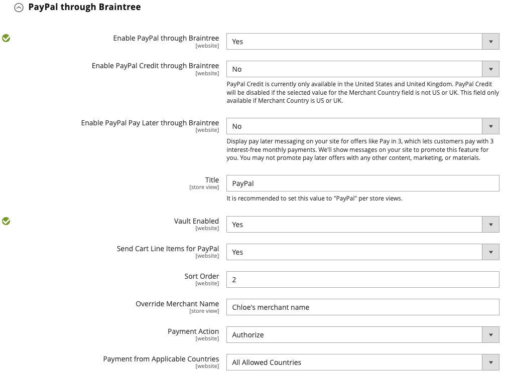{width="550" zoomable="yes"}
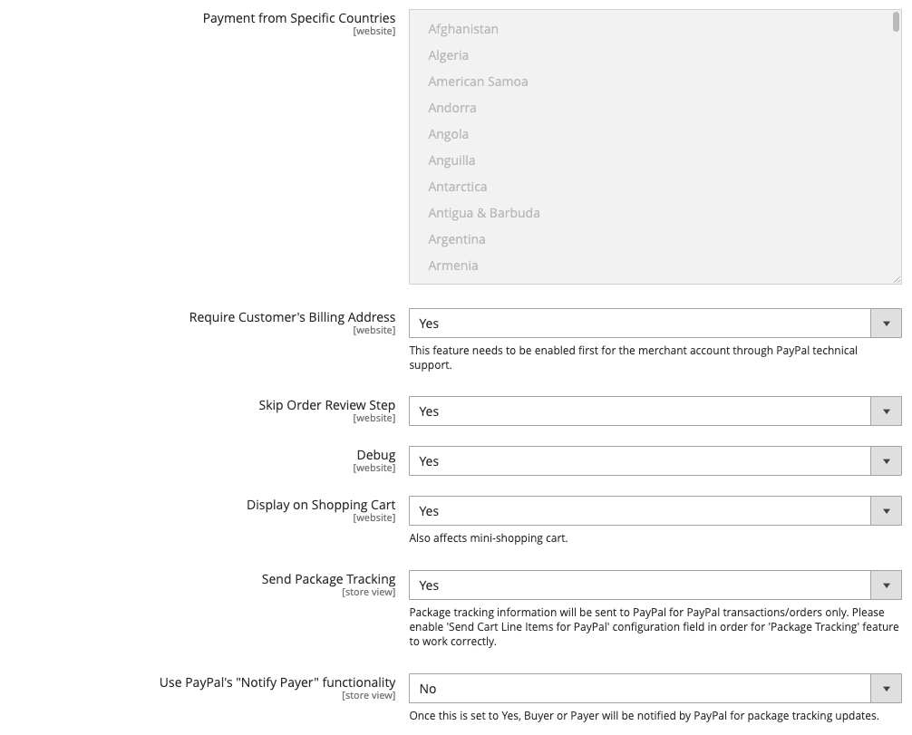{width="550" zoomable="yes"}を使用したPayPal

| フィールド | [範囲](../../getting-started/websites-stores-views.md#scope-settings) | 説明 |
|--- |--- |--- |
| [!UICONTROL Enable PayPal through Braintree] | web サイト | Braintreeを通じてPayPalを支払い方法として含めるかどうかを指定します。 オプション：`Yes` / `No` |
| [!UICONTROL Enable PayPal Credit through Braintree] | web サイト | Braintreeを通じた支払い方法としてPayPal クレジットが含まれているかどうかを確認します。 オプション：`Yes` / `No`。 `Enable PayPal through Braintree`が`Yes`に設定されている場合、このフィールドが表示されます |
| [!UICONTROL Enable PayPal PayLater through Braintree] | web サイト | Braintreeを通じてPayPal PayLaterを支払い方法として含めるかどうかを指定します。 オプション：`Yes` / `No`。 `Enable PayPal through Braintree`が`Yes`に設定されている場合、このフィールドが表示されます |
| [!UICONTROL Title] | ストアビュー | チェックアウト時にBraintreeを通じてお客様に対してPayPalを識別するラベル。 デフォルト値：`PayPal` |
| [!UICONTROL Vault Enabled] | web サイト | 有効にすると、お客様の支払い情報を安全に保存できるので、お客様は購入ごとにPayPal情報を再入力する必要がありません。 オプション：`Yes` / `No` |
| [!UICONTROL Send Cart Line Items for PayPal] | web サイト | 行項目（注文項目）を、ギフトカード、商品のギフトラッピング、注文のギフトラッピング、注文のギフトラッピング、店舗のクレジット、配送、および行項目としての税金と共にPayPalに送信します。 オプション：`Yes` / `No` |
| [!UICONTROL Sort Order] | web サイト | Braintreeを通じてPayPalがチェックアウト時に他の支払い方法と共に表示される注文を決定する番号。 |
| [!UICONTROL Override Merchant Name] | ストアビュー | 各ストアビューのマーチャントを識別するために使用できる代替名。 |
| [!UICONTROL Payment Action] | web サイト | 支払いが処理されたときにBraintreeを通じてPayPalが実行するアクションを指定します。 オプション： **`Authorize`**– お客様のカードの資金は承認されますが、お客様のアカウントから転送されません。 ストア管理者で注文が作成されます。 後で売上を取得し、請求書を作成できます。 **`Authorize and Capture`** – お客様のカードの資金は、Braintreeを通じてPayPalによって承認および取得され、注文と請求書がストア管理者に作成されます。 |
| [!UICONTROL Payment from Applicable Countries] | web サイト | Braintreeを通じてPayPalが処理する決済をすべての国から受け付けるか、特定の国から受け付けるかを指定します。 オプション：`All Allowed Countries` / `Specific Countries` |
| [!UICONTROL Payment from Specific Countries] | web サイト | 該当する場合は、Braintreeで処理される支払いを受け入れる特定の国を特定します。 |
| [!UICONTROL Require Customer's Billing Address] | web サイト | お客様の請求先住所が注文の送信に必要かどうかを判断します。 オプション：`Yes` / `No` |
| [!UICONTROL Skip Order Review Step] | web サイト | 支払いを完了する前に、お客様をレビューページにリダイレクトするかどうかを決定します。 オプション：`Yes` / `No` |
| [!UICONTROL Debug] | web サイト | Braintree システムを介したPayPalとストアとの通信がログファイルに記録されるかどうかを指定します。 オプション：`Yes` / `No` |
| [!UICONTROL Display on Shopping Cart] | web サイト | [&#x200B; ミニカート &#x200B;](../../stores-purchase/cart-configuration.md#mini-cart)と[&#x200B; ショッピングカート &#x200B;](../../stores-purchase/cart.md) ページにPayPal ボタンが表示されるかどうかを判断します。 オプション：`Yes` / `No` |
| [!UICONTROL Send Package Tracking] | web サイト | パッケージの追跡情報は、PayPalの取引/注文の場合にのみPayPalに送信されます。 [!UICONTROL Package Tracking]機能が正しく動作するには、[!UICONTROL Send Cart Line Items for PayPal]設定フィールドを有効にする必要があります。 オプション：`Yes` / `No` |
| [!UICONTROL Use PayPal's "Notify Payer" functionality] | web サイト | 「はい」に設定すると、購入者または支払い者にパッケージのトラッキング更新に関する通知がPayPalから送信されます。 オプション：`Yes` / `No` |

{style="table-layout:auto"}

>[!NOTE]
>
>**[!DNL PayPal Credit]**&#x200B;または&#x200B;**[!DNL PayPal PayLater]**&#x200B;を有効にできます。 両方のメソッドを同時に有効にすることはできません。

### [!UICONTROL Styling]

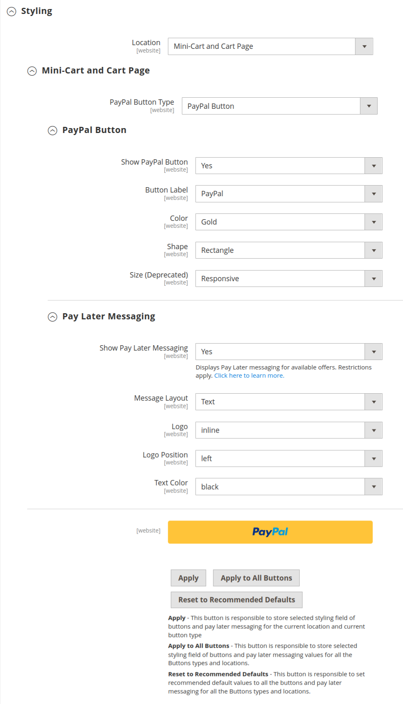<!-- zoom -->

| フィールド | [範囲](../../getting-started/websites-stores-views.md#scope-settings) | 説明 |
|--- |--- |--- |
| [!UICONTROL Location] | web サイト | ストアフロントでPayPalのボタンとメッセージを表示する場所を指定します。 オプション：`Mini-Cart and Cart Page` / `Checkout Page` / `Product Page` |

{style="table-layout:auto"}

**[!UICONTROL Mini-Cart and Cart Page]**

このセクションのオプションと設定は、_[!UICONTROL Location]_&#x200B;フィールドの設定によって異なります。

| フィールド | [範囲](../../getting-started/websites-stores-views.md#scope-settings) | 説明 |
|--- |--- |--- |
| [!UICONTROL PayPal Button Type] | web サイト | ボタンを次の3種類のいずれかに設定します：`PayPal Button` / `PayPal Pay Later Button` / `PayPal Credit Button` |

**[!UICONTROL PayPal Button]**

このセクションのオプションと設定は、_[!UICONTROL PayPal Button Type]_&#x200B;フィールドで選択したボタンの種類によって異なります。

| フィールド | [範囲](../../getting-started/websites-stores-views.md#scope-settings) | 説明 |
|--- |--- |--- |
| [!UICONTROL Show PayPal Button] | web サイト | 選択した場所のPayPal ボタンの場所を指定します。 オプション：`Yes` / `No` |
| [!UICONTROL Button Label] | web サイト | PayPal ボタンのラベルを指定します。 オプション：`Paypal` / `Checkout` / `Buy Now` / `Pay` |
| [!UICONTROL Color] | web サイト | PayPal ボタンの色を指定します。 オプション：`Blue` / `Black` / `Gold` / `Silver` |
| [!UICONTROL Shape] | web サイト | PayPal ボタンの形状を指定します。 オプション：`Pill` / `Rectangle` |
| [!UICONTROL Size(Deprecated)] | web サイト | PayPal ボタンのサイズを決定します。 オプション：`Medium` / `Large` / `Responsive` |

{style="table-layout:auto"}

>[!NOTE]
>
>**[!DNL Size(Deprecated)]**&#x200B;設定フィールドは廃止され、PayPal ボタンのスタイル設定には使用されません。

これらのオプションを設定すると、PayPal ボタンとPayLater メッセージのプレビューが表示されます。 設定の適用や値のリセットに使用できるコントロールがあります。

| フィールド | [範囲](../../getting-started/websites-stores-views.md#scope-settings) | 説明 |
|--- |--- |--- |
| [!UICONTROL Apply] | web サイト | ボタンとPayLater メッセージの選択したスタイル設定を保存し、現在の場所と現在のボタンタイプに適用します。 |
| [!UICONTROL Apply to All Buttons] | web サイト | ボタンとPayLater メッセージの値に対して選択したスタイル設定を保存し、すべてのボタンタイプと場所に適用します。 |
| [!UICONTROL Reset to Recommended Defaults] | web サイト | ボタンとPayLater メッセージの推奨されるデフォルト値にスタイル設定を戻し、すべてのボタンのタイプと場所に適用します。 |

{style="table-layout:auto"}

## [!UICONTROL Pay Later Messaging]

**[!UICONTROL Product Page]**

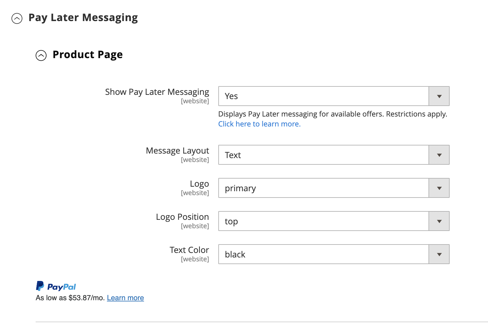<!-- zoom -->

| フィールド | [範囲](../../getting-started/websites-stores-views.md#scope-settings) | 説明 |
|--- |--- |------------------------------------------------------------------------------------------------------------------------------------------------------------------------------------------------------------------------------------------|
| [!UICONTROL Show PayLater Messaging] | web サイト | 選択した場所でPayLater メッセージを有効にします。 オプション：`Yes` / `No`。 利用可能なオファーに対する後払いメッセージを表示します。 制限が適用されます。 [詳細については、ここをクリックしてください。](https://developer.paypal.com/studio/checkout/pay-later/us) |
| [!UICONTROL Message Layout] | web サイト | PayLater メッセージのレイアウトを決定します。 オプション：`Text` / `Flex` |
| [!UICONTROL Logo] | web サイト | 後払いメッセージに使用するロゴの種類を指定します。 オプション：`Inline` / `Primary` / `Alternative` / `None` |
| [!UICONTROL Logo Position] | web サイト | 後払いメッセージのロゴの位置を指定します。 オプション：`Left` / `Right` / `Top` |
| [!UICONTROL Text Color] | web サイト | 後払いメッセージのテキストカラーを指定します。 オプション：`Black` / `White` / `Monochrome` / `Grayscale` |

{style="table-layout:auto"}

**[!UICONTROL Cart]**

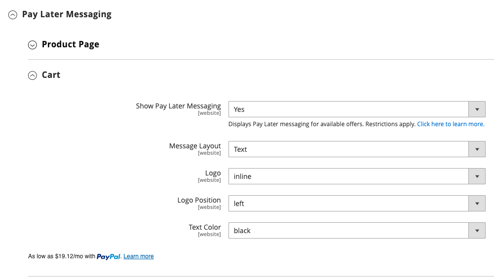<!-- zoom -->

| フィールド | [範囲](../../getting-started/websites-stores-views.md#scope-settings) | 説明 |
|--- |--- |------------------------------------------------------------------------------------------------------------------------------------------------------------------------------------------------------------------------------------------|
| [!UICONTROL Show PayLater Messaging] | web サイト | 選択した場所でPayLater メッセージを有効にします。 オプション：`Yes` / `No`。 利用可能なオファーに対する後払いメッセージを表示します。 制限が適用されます。 [詳細については、ここをクリックしてください。](https://developer.paypal.com/studio/checkout/pay-later/us) |
| [!UICONTROL Message Layout] | web サイト | PayLater メッセージのレイアウトを決定します。 オプション：`Text` / `Flex` |
| [!UICONTROL Logo] | web サイト | 後払いメッセージに使用するロゴの種類を指定します。オプション：`Inline` / `Primary` / `Alternative` / `None` |
| [!UICONTROL Logo Position] | web サイト | 後払いメッセージのロゴの位置を指定します。 オプション：`Left` / `Right` / `Top` |
| [!UICONTROL Text Color] | web サイト | 後払いメッセージのテキストカラーを指定します。 オプション：`Black` / `White` / `Monochrome` / `Grayscale` |

{style="table-layout:auto"}

**[!UICONTROL Checkout]**

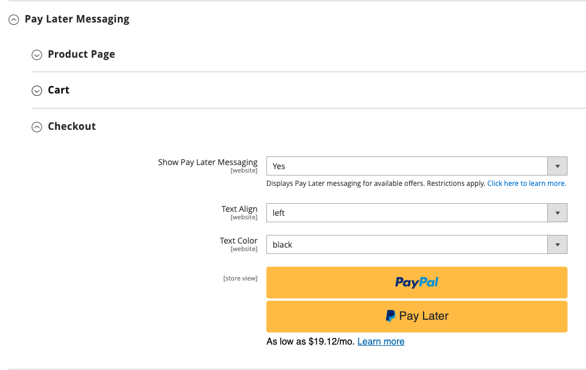<!-- zoom -->

| フィールド | [範囲](../../getting-started/websites-stores-views.md#scope-settings) | 説明 |
|--------------------------------------|--- |-------------------------------------------------------------------------------------------------------------------------------------------------------------------------------------------------------------------------------------------|
| [!UICONTROL Show PayLater Messaging] | web サイト | 選択した場所でPayLater メッセージを有効にします。 オプション：`Yes` / `No`。 利用可能なオファーに対する後払いメッセージを表示します。 制限が適用されます。 [詳細については、ここをクリックしてください。](https://developer.paypal.com/studio/checkout/pay-later/us) |
| [!UICONTROL Text Align] | web サイト | PayLater メッセージのレイアウトを決定します。 オプション：`Left` / `Center` / `Right` |
| [!UICONTROL Text Color] | web サイト | 後払いメッセージのテキストカラーを指定します。 オプション：`Black` / `White` |

{style="table-layout:auto"}

## 3d セキュアな検証設定

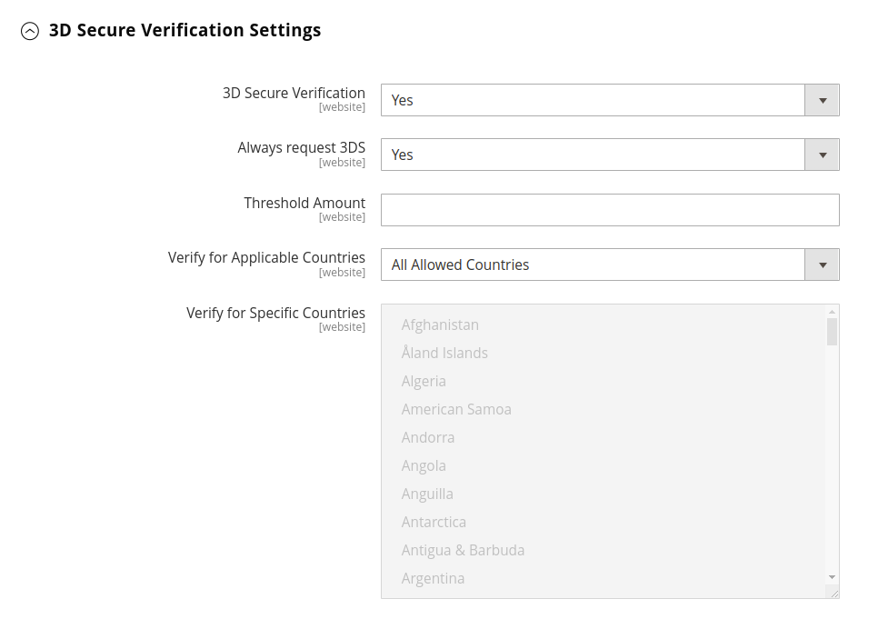<!-- zoom -->

| フィールド | [範囲](../../getting-started/websites-stores-views.md#scope-settings) | 説明 |
|--- |--- |--- |
| [!UICONTROL 3D Secure Verification] | web サイト | お客様が&#x200B;_VISAによる認証_&#x200B;などのプログラムに登録されている場合に、トランザクションが追加の検証プロセスに合格する必要があるかどうかを判断します。 オプション：`Yes` / `No` |
| [!UICONTROL Always request 3DS] | web サイト | すべてのトランザクションに対して、常に3D セキュアリクエストに挑戦します。 オプション：`Yes` / `No` |
| [!UICONTROL Threshold Amount] | web サイト | 1回の注文で処理を許可する最大注文金額を指定します。 Braintreeでは、注文金額がこの基準額を超えると、認証が拒否されます。 |
| [!UICONTROL Verify for Applicable Countries] | web サイト | 支払いを確認する必要がある国を指定します。 オプション：`All Allowed Countries` / `Specific Countries` |
| [!UICONTROL Verify for Specific Countries] | web サイト | 該当する場合は、Braintreeによる支払いを確認する必要がある国を特定します。 |

{style="table-layout:auto"}

## [!UICONTROL Dynamic Descriptors]

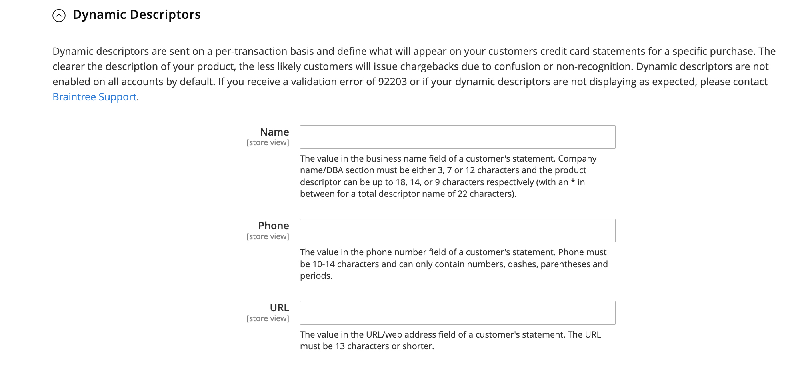<!-- zoom -->

| フィールド | [範囲](../../getting-started/websites-stores-views.md#scope-settings) | 説明 |
|--- |--- |--- |
| [!UICONTROL Name] | ストアビュー | 名前記述子には、アスタリスク（*）で区切られた2つの部分があります。 記述子の最初の部分は会社またはDBAを識別し、2番目の部分は製品を識別します。 例：`company*myproduct`   会社の長さと記述子の製品の部分は、次の方法で割り当てることができます。合計22文字までの長さ： **`Option 1`**– 会社は3文字でなければなりません/製品は18文字までです **`Option 2`** – 会社は7文字までです/製品は14文字までです&#x200B; **`Option 3`**– 会社は12文字までです/製品は9文字までです |
| [!UICONTROL Phone] | ストアビュー | 電話記述子は、10～14文字の長さである必要があり、数字、ダッシュ、括弧、ピリオドのみを含めることができます。 例：`9999999999` `(999) 999-9999` `999.999.9999` |
| [!UICONTROL URL] | ストアビュー | URL記述子はドメイン名を表し、最大13文字までです。 例：`company.com` |

{style="table-layout:auto"}
