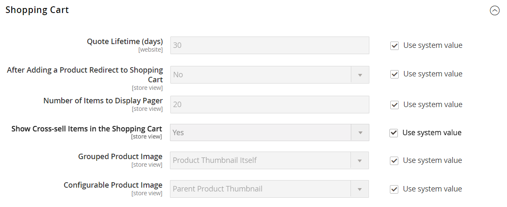

# [!UICONTROL Sales] > [!UICONTROL Checkout]

{{config}}

## [!UICONTROL Checkout Options]

<!-- zoom -->

<!--[Checkout Options](https://experienceleague.adobe.com/en/docs/commerce-admin/stores-sales/point-of-purchase/checkout/checkout-process#checkout-options) -->

| フィールド | [範囲](../../getting-started/websites-stores-views.md#scope-settings) | 説明 |
|------------------------------------------------------------------|--- |----------------------------------------------------------------------------------------------------------------------------------------------------------------------------------------------------------------------------------------------------------------------------------------------------------------------------------------------------------------------------------------------------------------------------------------------------------------------|
| [!UICONTROL Enable Guest Checkout Login] | ストアビュー | この設定を有効にすると、未認証のユーザー（ストアフロントおよびAPI）は、電子メールアドレスが既に顧客アカウントに関連付けられている場合にクエリを実行できます。 これは、入力されたメールアドレスが既に顧客アカウントに登録されている場合に、サインインプロンプトを表示することで、ゲストのチェックアウトワークフローを強化するために使用できますが、未認証のユーザーに情報を公開する代わりに発生します。  オプション：`Yes` / `No` |
| [!UICONTROL Enable Onepage Checkout] | ストアビュー | [1 ページのチェックアウト &#x200B;](../../stores-purchase/checkout-process.md#checkout-options)が既定のチェックアウト形式であるかどうかを判断します。 オプション：`Yes` / `No` |
| [!UICONTROL Allow Guest Checkout] | ストアビュー | ゲストがストアにアカウントを登録せずに[&#x200B; チェックアウトを行えるかどうかを判断します。](../../stores-purchase/checkout-guest.md) オプション：`Yes` / `No` |
| [!UICONTROL Enable Terms and Conditions] | ストアビュー | 顧客が購入する前に、販売の[利用条件](../../stores-purchase/terms-and-conditions.md)に同意する必要があるかどうかを判断します。 オプション：`Yes` / `No` |
| [!UICONTROL Display Billing Address On] | ストアビュー | チェックアウト時の請求先住所の場所を指定します。 オプション：`Payment Method` / `Payment Page` |
| [!UICONTROL Maximum Number of Items to Display in Order Summary] | ストアビュー | チェックアウト時に&#x200B;_注文概要_&#x200B;に表示できるアイテムの最大数を指定します。 デフォルトは`10`です。 |
| [!UICONTROL Enable Address Search] | web サイト |  （Adobe Commerceのみ）お客様が送料とレビューと支払いの手順に[&#x200B; アドレス検索](../../stores-purchase/checkout-address-search.md)機能を使用できるかどうかを判断します。 これが有効になっている場合は、「顧客アドレス数の制限」を使用して、チェックアウト時にこの機能をアクティブ化するために必要な保存アドレス数を設定します。 オプション：`Yes` / `No` |
| 顧客アドレス数の制限 | web サイト |  （Adobe Commerceのみ）アドレス検索が有効になっている場合、チェックアウト時にこの機能を有効にするために必要な保存済みアドレスの数を決定します。 お客様の保存済みアドレス数がこの数を満たすか超える場合、デフォルトのアドレスのみが&#x200B;_送料_&#x200B;および&#x200B;_レビューと支払い_&#x200B;の手順でレンダリングされます。 お客様は、検索機能を使用して、選択したアドレスを変更できます。 デフォルトは`10`です。 |

{style="table-layout:auto"}

## [!UICONTROL Shopping Cart]

<!-- zoom -->

<!--[Shopping Cart](https://experienceleague.adobe.com/en/docs/commerce-admin/stores-sales/point-of-purchase/cart/cart-configuration) -->

| フィールド | [範囲](../../getting-started/websites-stores-views.md#scope-settings) | 説明 |
|--- |--- |--- |
| [!UICONTROL Quote Lifetime (days)] | web サイト | 見積もり価格[&#128279;](../../stores-purchase/cart-configuration.md#quote-lifetime)の有効期間を日数で指定します。 |
| [!UICONTROL After Adding a Product Redirect to Shopping Cart] | ストアビュー | 商品がカートに追加された直後に[&#x200B; ショッピングカートページが表示されるかどうかを判断します](../../stores-purchase/cart-configuration.md#redirect-to-cart)。 オプション：`Yes` / `No` |
| [!UICONTROL Number of Items to Display Pager] | ストアビュー | ページがトリガーされる前に、ショッピングカート内のアイテムの数を指定します。 デフォルト値：`20` |
| [!UICONTROL Show Cross-sell Items in the Shopping Cart] | ストアビュー | [&#x200B; クロスセル商品](../../catalog/related-products-up-sells-cross-sells.md#cross-sells)がショッピングカートに表示されているかどうかを示し、顧客に追加の販売オプションを提供します。 オプション：`Yes` （既定値） / `No` |
| [!UICONTROL Grouped Product Image] | ストアビュー | ショッピングカート内の[&#x200B; グループ化された製品](../../catalog/product-create-grouped.md)に表示される[&#x200B; サムネイル &#x200B;](../../stores-purchase/cart-configuration.md#cart-thumbnails)画像を決定します。 オプション：`Product Thumbnail Itself` / `Parent Product Thumbnail` |
| [!UICONTROL Configurable Product Image] | ストアビュー | ショッピングカート内の設定可能な製品に表示される[&#x200B; サムネイル &#x200B;](../../stores-purchase/cart-configuration.md#cart-thumbnails)画像を決定します。 オプション：`Product Thumbnail Itself` / `Parent Product Thumbnail` |
| [!UICONTROL Preview Quote Lifetime (minutes)] | ストアビュー | ショッピングカートからプレビューした場合の見積もりの最大経過時間を分単位で指定します。 |
| [!UICONTROL Enable Clear Shopping Cart] | web サイト | 買い物かごに、ユーザーが1回の操作で買い物かごの内容をクリアするオプションが表示されているかどうかを指定します。 オプション：`Yes` / `No` |

{style="table-layout:auto"}

## [!UICONTROL My Cart Link]

<!-- zoom -->

<!-- [*My Cart Link*](https://experienceleague.adobe.com/en/docs/commerce-admin/stores-sales/point-of-purchase/cart/cart-configuration#mini-cart) -->

| フィールド | [範囲](../../getting-started/websites-stores-views.md#scope-settings) | 説明 |
|--- |--- |--- |
| [!UICONTROL Display Cart Summary] | web サイト | 「マイカート」リンクの後に括弧内に表示される値を指定します。 オプション：`Display number of items in cart` / `Display item quantities` |

{style="table-layout:auto"}

## ミニカート

<!-- zoom -->

<!-- [*Mini Cart*](https://experienceleague.adobe.com/en/docs/commerce-admin/stores-sales/point-of-purchase/cart/cart-configuration#mini-cart) -->

| フィールド | [範囲](../../getting-started/websites-stores-views.md#scope-settings) | 説明 |
|--- |--- |--- |
| [!UICONTROL Display Mini Cart] | ストアビュー | ヘッダーのカートアイコンをクリックしたときに、ミニカートがストアページに表示されるかどうかを指定します。 ミニカートの表示はテーマによって異なります。 オプション：`Yes` / `No` |
| [!UICONTROL Number of Items to Display Scrollbar] | ストアビュー | スクロールバーがトリガーされる前に、ミニカートに表示できるアイテムの数を指定します。 既定：`5` |
| [!UICONTROL Maximum Number of Items to Display] | ストアビュー | ミニカートに表示できるアイテムの最大数を指定します。 既定：`10` |

{style="table-layout:auto"}

## [!UICONTROL Payment Failed Emails]

<!-- zoom -->

<!-- [*Payment Failed Emails*](https://experienceleague.adobe.com/en/docs/commerce-admin/stores-sales/point-of-purchase/checkout/checkout-payment-failed-emails) -->

| フィールド | [範囲](../../getting-started/websites-stores-views.md#scope-settings) | 説明 |
|--- |--- |--- |
| [!UICONTROL Payment Failed Email Receiver] | ストアビュー | 支払い失敗メールを受け取ったストア連絡先を識別します。 既定の受信者：`General Contact` |
| [!UICONTROL Payment Failed Email Sender] | ストアビュー | 支払い失敗メールのメッセージ送信者として表示されるストア連絡先を識別します。 既定の送信者：`General Contact` |
| [!UICONTROL Payment Failed Template] | ストアビュー | 支払い失敗メールに使用されるテンプレートを識別します。 既定のテンプレート：`Payment Failed` |
| [!UICONTROL Send Payment Failed Copy To] | ストアビュー | 支払い失敗メールのコピーを受け取るユーザーのメールアドレスを指定します。 複数のアドレスをコンマで区切ります。 |
| [!UICONTROL Send Payment Failed Copy Method] | ストアビュー | コピーの送信に使用するメール方法を示します。 オプション： **`Bcc`**– 顧客に送信されるのと同じメールのヘッダーに受信者を含めることで、盲目的の礼儀コピーを送信します。 BCC受信者は、お客様には表示されません。 **`Separate Email`** - コピーを別の電子メールとして送信します。 |

{style="table-layout:auto"}
