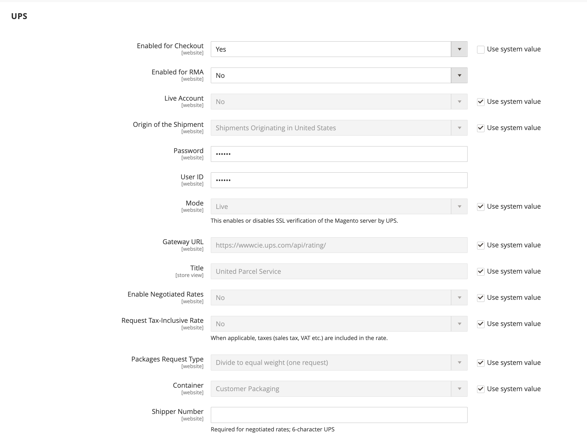
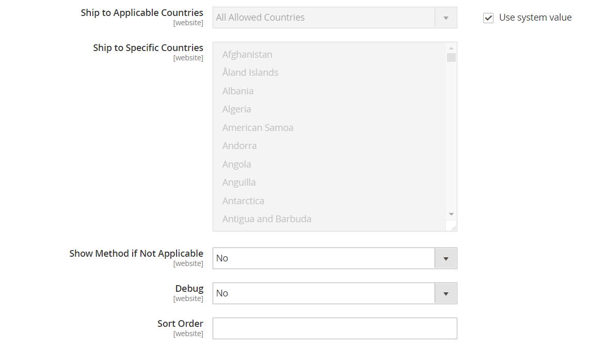
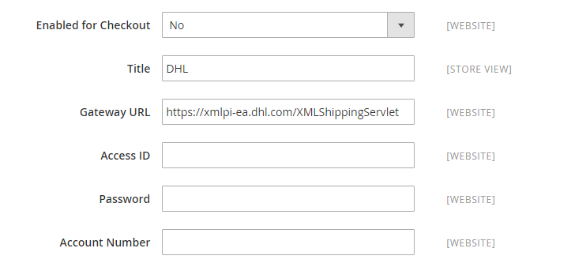

# [!UICONTROL Sales] > [!UICONTROL Delivery Methods]

{{config}}

## [!UICONTROL Basic Delivery Methods]

### [!UICONTROL Flat Rate]

<!-- zoom -->

<!-- [Flat Rate](https://docs.magento.com/user-guide/shipping/shipping-flat-rate.html) -->

| フィールド | [範囲](../../getting-started/websites-stores-views.md#scope-settings) | 説明 |
|--- |--- |--- |
| [!UICONTROL Enabled] | Web サイト | 有効にすると、「定額レート」が _送料と税金の見積もり_ 「 」セクションと「 」セクション _送料_ セクションをチェックアウト中にクリックします。 オプション： `Yes` / `No` |
| [!UICONTROL Title] | ストア表示 | チェックアウト時にこの発送方法に使用される名前。 |
| [!UICONTROL Method Name] | ストア表示 | 送料の見積もりを作成するために使用される計算方法を表す名前です。 方法名は、買い物かご内の計算済み推定レートの横に表示されます。 デフォルト値は `Fixed`. |
| [!UICONTROL Type] | Web サイト | 定率の決定に使用する計算のタイプを示します。 オプション：  **`None`**— 計算は使用されません。 [ 定額料金 ] を 0 に設定します。これは、送料無料と同じです。 **`Per Order`**  — 注文全体に対して 1 回の定額料金を請求します。  **`Per Item`**— 買い物かご内の各品目に対して、個別の定額料金を請求します。 合計数量に異なる品目の組み合わせが含まれる場合でも、この率に買い物かご内の品目数が掛けられます。 |
| [!UICONTROL Price] | Web サイト | 定額配送で顧客に請求する価格。 |
| [!UICONTROL Calculate Handling Fee] | Web サイト | 手数料が含まれる場合は、その計算方法を決定します。 オプション： `Fixed` / `Percent` |
| [!UICONTROL Handling Fee] | Web サイト | 手数料の請求額を入力します。金額の計算方法に基づきます。 例えば、料金が固定料金に基づく場合は、金額を小数で入力します（例： 4.90）。ただし、手数料が注文のパーセンテージに基づいている場合は、金額をパーセンテージで入力します。 例えば、注文の 6%を請求する場合は、値に「 」と入力します。 `.06`. |
| [!UICONTROL Displayed Error Message] | ストア表示 | お客様が定額レートを選択したが、何らかの理由でメソッドが使用できない場合に表示されるメッセージ。 |
| [!UICONTROL Ship to Applicable Countries] | Web サイト | 定額配送を提供する国を示します。 オプション：  **`All Allowed Countries`**— 店舗構成で指定された国のお客様は、定額配送を使用できます。 **`Specific Countries`**  — 特定の国からのお客様は、定額配送を使用できます。 |
| [!UICONTROL Ship to Specific Countries] | Web サイト | 顧客が定額配送を使用できる各国を特定します。 |
| [!UICONTROL Show Method if Not Applicable] | Web サイト | 方法が購入に適用されない場合に、「定額料金」がチェックアウト時にオプションとして表示されるかどうかを指定します。 オプション： `Yes` / `No` |
| [!UICONTROL Sort Order] | Web サイト | チェックアウト時に他の配信方法と共にリストされた場合に表示される定額料金の順序を決定する数値です。 |

{style="table-layout:auto"}

### [!UICONTROL Free Shipping]

<!-- zoom -->

<!-- [Free Shipping](https://docs.magento.com/user-guide/shipping/shipping-free.html) -->

| フィールド | [範囲](../../getting-started/websites-stores-views.md#scope-settings) | 説明 |
|--- |--- |--- |
| [!UICONTROL Enabled] | Web サイト | 有効にすると、「Free Shipping」がチェックアウト時に「Shipping」セクションのオプションとして表示されます。 オプション： `Yes` / `No` |
| [!UICONTROL Title] | ストア表示 | チェックアウト時にこの発送方法に使用される名前。 |
| メソッド名 | ストア表示 | 送料の見積もりを作成するために使用される計算方法を表す名前です。 方法名は、買い物かご内の計算済み推定レートの横に表示されます。 デフォルト値は `Free`. |
| 最小注文額 | Web サイト | 注文に送料無料を適用するために必要な最小購入。 |
| 税額を含む | Web サイト | 最小受注額の計算に税金が含まれるかどうかを決定します。 オプション：  **はい**  — 最小受注額（小計+税金 — 割引）の計算時に税金が含まれます。 **いいえ**  — 最小受注額（小計 — 割引）の計算時に、税金は税に含まれません。 |
| 表示されたエラーメッセージ | ストア表示 | 顧客が送料無料を選択したが、何らかの理由で方法が使用できない場合に表示されるメッセージ。 |
| 該当国への出荷 | Web サイト | 送料無料を提供する国を指定します。 オプション：  **すべての許可された国**  — ストア設定で指定された国のお客様は、無料配送を使用できます。  **特定の国**  — 特定の国のお客様は、無料配送をご利用いただけます。 |
| 特定の国に出荷 | Web サイト | 顧客が送料無料を使用できる各国を特定します。 |
| 該当しない場合はメソッドを表示 | Web サイト | 方法が購入に適用されない場合に、チェックアウト時に「無料配送」がオプションとして表示されるかどうかを指定します。 オプション： `Yes` / `No` |
| [!UICONTROL Sort Order] | Web サイト | チェックアウト時に他の配送方法と共に一覧表示された場合に、送料無料が表示される順序を決定する数値。 |

{style="table-layout:auto"}

### [!UICONTROL Table Rates]

<!-- zoom -->

<!-- [Table Rates](https://docs.magento.com/user-guide/shipping/shipping-table-rate.html) -->

| フィールド | [範囲](../../getting-started/websites-stores-views.md#scope-settings) | 説明 |
|--- |--- |--- |
| [!UICONTROL Enabled] | Web サイト | 有効にすると、「表レート」が、買い物かごの「送料および税金の見積もり」セクションと、チェックアウト時の「出荷」セクションにオプションとして表示されます。 オプション： `Yes` / `No` |
| [!UICONTROL Title] | ストア表示 | チェックアウト時にこの発送方法に使用される名前。 |
| メソッド名 | ストア表示 | 送料の見積もりを作成するために使用される計算方法を表す名前です。 方法名は、買い物かご内の計算済み推定レートの横に表示されます。 デフォルト値は `Table Rate`. |
| [!UICONTROL Condition] | Web サイト | 計算の基となる条件を決定します。 アップロードされる CSV ファイルの形式は、各条件に固有です。 オプション： `Weight vs. Destination` / `Price vs. Destination` / `# of Items vs. Destination` |
| [!UICONTROL Include Virtual Products in Price Calculation] | Web サイト | 出荷が不要な仮想製品を表レート価格の計算に含めるかどうかを指定します。 |
| [!UICONTROL Calculate Handling Fee] | Web サイト | 手数料が含まれる場合は、その計算方法を決定します。 オプション： `Fixed` / `Percent` |
| [!UICONTROL Handling Fee] | Web サイト | 送料に追加される手数料の金額で、出荷の処理の費用をカバーします。 値を小数で入力します。 例えば、料金がパーセンテージに基づく場合、6 %ではなく 0.06 %と入力します。 固定金額の場合は、 `6.00`. |
| [!UICONTROL Displayed Error Message] | ストア表示 | 顧客がテーブル・レートを選択したが、何らかの理由でメソッドが使用できない場合に表示されるメッセージ。 |
| [!UICONTROL Ship to Applicable Countries] | Web サイト | 表料金の配送先を指定する国を指定します。 オプション：  **`All Allowed Countries`**— ストア設定で指定された国のお客様は、表料金の配送を使用できます。 **`Specific Countries`**  — 特定の国のお客様は、表料金の配送を使用できます。 |
| [!UICONTROL Ship to Specific Countries] | Web サイト | 顧客がテーブルレートの配送を使用できる各国を特定します。 |
| [!UICONTROL Show Method if Not Applicable] | Web サイト | メソッドが購入に適用されない場合に、チェックアウト時に「表レート」がオプションとして表示されるかどうかを指定します。 オプション： `Yes` / `No` |
| [!UICONTROL Sort Order] | Web サイト | チェックアウト時に他の配信方法と共にリストされた場合に表レートが表示される順序を決定する数値です。 |

{style="table-layout:auto"}

### [!UICONTROL In-Store Delivery]

<!-- zoom -->

<!-- [In-Store Delivery](https://docs.magento.com/user-guide/shipping/shipping-in-store-delivery.html) -->

| フィールド | [範囲](../../getting-started/websites-stores-views.md#scope-settings) | 説明 |
|--- |--- |--- |
| [!UICONTROL Enabled] | Web サイト | 有効にすると、店内配信が _送料と税金の見積もり_ 「 」セクションと「 」セクション _送料_ セクションをチェックアウト中にクリックします。 オプション： `Yes` / `No` |
| [!UICONTROL Method Name] | ストア表示 | 出荷方法として店内ピックアップ機能を識別する名前。 この値は、「発送」チェックアウトページの上部にあるタブのラベルとして、また、同じページの下部にある使用可能な発送方法のテーブルに表示されます。 デフォルト値は `In-store Delivery`. |
| [!UICONTROL Title] | ストア表示 | チェックアウト時にこの発送方法に使用される名前。 |
| [!UICONTROL Price] | Web サイト | 店舗でのピックアップに対して顧客に請求する価格。 |
| [!UICONTROL Search Radius] | Web サイト | ピックアップの場所を検索する際に使用する半径 (km)。 |
| [!UICONTROL Displayed Error Message] | ストア表示 | 顧客が店舗でのピックアップを選択したが、配信方法が使用できない場合に表示するメッセージ。 |

{style="table-layout:auto"}

## [!UICONTROL Carriers]

### [!UICONTROL UPS]

{{ups-api}}

{{beta2-updates}}

<!-- zoom -->

<!-- [UPS XML Account Settings](https://docs.magento.com/user-guide/shipping/ups.html) -->

| フィールド | [範囲](../../getting-started/websites-stores-views.md#scope-settings) | 説明 |
|--- |--- |--- |
| [!UICONTROL Enabled for Checkout] | Web サイト | UPS がチェックアウト時の発送方法として顧客が利用できるかどうかを指定します。 オプション： `Yes` / `No` |
| [!UICONTROL Enabled for RMA] | Web サイト | UPS が RMA の出荷方法として顧客に提供されるかどうかを確認します。 オプション： `Yes` / `No` |
| [!UICONTROL UPS Type] | ストア表示 | UPS 発送システムへの接続に使用する方法を指定します。 オプション：  **`United Parcel Service XML`**- （デフォルト）ストアは、データを含む XML ファイルを UPS にリクエストとして送信します。 **`United Parcel Service`**  — ストアが、リクエストとしてキーと値のペアを UPS に送信します。   **_注意：_**標準の United Parcel Service タイプは、Commerce で廃止される予定です。 新しい設定の場合は、 [!UICONTROL United Parcel Service XML] タイプ。 |
| _[!UICONTROL UPS Account Settings]_ |  |  |
| [!UICONTROL Live Account] | ストア表示 | United Parcel Service アカウントが有効であることを指定します。 オプション： `Yes` / `No` |
| [!UICONTROL Gateway URL] | Web サイト | 動的な送料率を取得するために UPS システムに接続する URL。 UPS は HTTP のサポートを継続していません。 デフォルト値： `https://www.ups.com/using/services/rave/qcostcgi.cgi` |
| [!UICONTROL Title] | ストア表示 | チェックアウト時にこの発送方法に使用される名前。 |
| _[!UICONTROL UPS XML Account Settings]_ |  |  |
| [!UICONTROL Access License Number] | Web サイト | UPS 発送元アカウントのアクセスライセンス番号。 |
| [!UICONTROL Gateway XML URL] | Web サイト | UPS XML サービスの場合、XML データを送信するために必要な次の URL を表示します：ゲートウェイ XML URL、追跡 XML URL、発送確認 XML URL、発送受け入れ XML URL |
| [!UICONTROL Mode] | Web サイト | UPS システムに送信されるデータに使用する送信のモードを決定します。 オプション：  **`Development`**- UPS は、コマースサーバーから受信したデータが SSL 経由で送信されたことを確認しません。 **`Live`** - UPS は、コマースサーバーから受信したデータがセキュアソケットレイヤ (SSL) 経由で送信されていることを確認します。 |
| ユーザー ID | Web サイト | UPS 発送元アカウントのユーザー ID。 |
| [!UICONTROL Origin of the Shipment] | Web サイト | （UPS XML のみ）製品出荷元の国または地域。 |
| [!UICONTROL Password] | ストア表示 | UPS 発送者アカウントのパスワード。 |

{style="table-layout:auto"}

<!-- zoom -->

<!-- [UPS Package Information](https://docs.magento.com/user-guide/shipping/ups.html) -->

| フィールド | [範囲](../../getting-started/websites-stores-views.md#scope-settings) | 説明 |
|--- |--- |--- |
| _[!UICONTROL UPS Negotiated Rate Settings]_ |  |  |
| [!UICONTROL Enable Negotiated Rates] | Web サイト | （UPS XML のみ）UPS との契約に従って、特別料金を有効または無効にします。 オプション： `Yes` / `No` |
| [!UICONTROL Packages Request Type] | Web サイト | 複数のパッケージを含む出荷に対する重み付けの計算方法を指定します。 オプション： `Divide to equal weight (one request)` / `Use origin weight (multiple requests)` |
| [!UICONTROL Shipper Number] | Web サイト | （UPS XML のみ）ネゴシエートされたレートを使用するには、6 文字の UPS Shipper Number が必要です。 |
| [!UICONTROL Container] | Web サイト | 注文の出荷をパッケージ化するために使用するコンテナタイプを設定します。 オプション： `Customer Packaging` / `UPS Letter Envelope` / `Customer Packaging` / `UPS Letter Envelope` / `UPS Tube` / `UPS Express Box` / `UPS Worldwide 25 kilo` / `UPS Worldwide 10 kilo` |
| [!UICONTROL Weight Unit] | Web サイト | ストアでの製品の重み付けのデフォルトの測定単位を設定します。 詳しくは、 [寸法の重み付け](../../stores-purchase/carriers.md#dimensional-weight) を参照してください。 |
| [!UICONTROL Tracking XML URL] | Web サイト | （UPS XML のみ）パッケージの追跡に使用される UPS URL。 |
| [!UICONTROL Destination Type] | Web サイト | 既定の出荷先タイプを設定します。 オプション： `Business` / `Residential` |
| [!UICONTROL Maximum Package Weight] | Web サイト | UPS で指定されたパッケージの最大重みを設定します。 注文した製品が最大パッケージ重量を超えた場合、この配送オプションは使用できません。 基準 [UPS.com](https://www.ups.com/us/en/global.page)、パッケージは 150 ポンド (70 kg) を超えることはできません配送業者に確認し、最大重量を確認してください。 |
| [!UICONTROL Pickup Method] | Web サイト | UPS ピックアップ方法を設定します。 オプション： `Regular Daily Pickup` / `On Call Air` / `One Time Pickup` / `Letter Center` / `Customer Counter` |
| [!UICONTROL Minimum Package Weight] | Web サイト | UPS で指定されたパッケージの最小重みを設定します。 注文した製品の重量が最小パッケージ重量より少ない場合、この出荷オプションは使用できません。 最小重量を確認するには、配送業者に確認してください。 |
| [!UICONTROL Calculate Handling Fee] | Web サイト | 表の料金の配送に関する処理料金の計算方法を設定します。 オプション：  **`Fixed`**・手数料は定額。 **`Percent`**  — 手数料は、注文額に対するパーセンテージとして適用されます。 |
| [!UICONTROL Handling Applied] | Web サイト | 各注文に対して手数料を適用するか、注文内の各パッケージに対して手数料を適用するかを指定します。 |
| [!UICONTROL Handling Fee] | Web サイト | 送料価格に含まれる処理を設定します。 取り扱い手数料は、一定額またはパーセンテージで設定できます。   **_注意：_**割合 (%) を入力する場合は、10 進数形式を使用します `0.25` 25%です。 |

{style="table-layout:auto"}

<!-- zoom -->

<!-- [UPS Allowed Methods](https://docs.magento.com/user-guide/shipping/ups.html) -->

| フィールド | [範囲](../../getting-started/websites-stores-views.md#scope-settings) | 説明 |
|--- |--- |--- |
| _[!UICONTROL UPS allowed methods]_ |  |  |
| [!UICONTROL Allowed Methods] | Web サイト | 顧客に提供される UPS の発送方法を指定します。 送料は、選択した送料方法に基づいて計算されます。 |
| [!UICONTROL Free Method] | Web サイト | UPS を通じて送料無料方法に使用する方法を識別します。 送料無料を無効にするには、「なし」を選択します。   **_注意：_**この方法は、基本的な方法に似ています [送料無料](../../stores-purchase/shipping-free.md)がチェックアウト時に UPS の送料オプションとして表示されます。 |
| [!UICONTROL Free Shipping Amount Threshold] | Web サイト | 注文額が送料無料しきい値を満たす場合に、送料無料を適用するかどうかを指定します。 オプション： `Enable` / `Disable` |
| [!UICONTROL Free Shipping Amount Threshold] | Web サイト | 送料の無料条件を満たすために注文が到達する必要がある最小合計金額を設定します。 |
| [!UICONTROL Displayed Error Message] | ストア表示 | 何らかの理由でこの発送方法が使用できない場合に表示されるエラーメッセージ。 |

{style="table-layout:auto"}

<!-- zoom -->

<!-- [UPS Applicable Countries and Other Settings](https://docs.magento.com/user-guide/shipping/ups.html) -->

| フィールド | [範囲](../../getting-started/websites-stores-views.md#scope-settings) | 説明 |
|--- |--- |--- |
| _[!UICONTROL UPS Applicable countries and other Settings]_ |  |  |
| [!UICONTROL Ship to Applicable Countries] | Web サイト | 顧客がこの発送方法を使用できる国を指定します。 オプション：  **`All Allowed Countries`**— すべてのお客様から [国](../../getting-started/store-details.md#country-options) お使いのストア設定で指定された場合、この発送方法を使用できます。 **`Specific Countries`**  — このオプションを選択した後、 [!UICONTROL Ship to Specific Countries] リストが表示されます。 この発送方法を使用できる国をリストから選択します。 |
| [!UICONTROL Show Method if Not Applicable] | Web サイト | UPS がチェックアウト時に出荷オプションとして常に表示されるかどうかを指定します。 オプション：  **`Yes`**- UPS は、注文に該当しない場合でも、チェックアウト時に出荷オプションとして常に表示されます。 **`No`** - UPS は、注文に該当する場合にのみ、チェックアウト時の出荷オプションとして表示されます。 （例えば、注文の重み付けが最大重み付け量を超えた場合）。 |
| [!UICONTROL Debug] | Web サイト | ストアと UPS 間のデータ転送が、デバッグのためにシステムに記録されるかどうかを指定します。 トラッキングおよびログに記録する必要がある問題がない限り、このオプションをに設定する必要があります。 `No`. |
| [!UICONTROL Sort Order] | Web サイト | チェックアウト時に他の配信方法と共にリストされた場合に UPS が表示される順序を決定する数値。 入力 `0` をリストの先頭に追加します。 |

{style="table-layout:auto"}

### [!UICONTROL USPS]

{{beta2-updates}}

| フィールド | [範囲](../../getting-started/websites-stores-views.md#scope-settings) | 説明 |
|--- |--- |--- |
| チェックアウトに対して有効 | Web サイト | USPS がチェックアウト時の発送方法として顧客に提供されるかどうかを指定します。 オプション： `Yes` / `No` |
| _[!UICONTROL USPS Account Settings]_ |  |  |
| [!UICONTROL Gateway URL] | Web サイト | 送料を動的に取得するために USPS システムに接続するために使用される URL。 |
| [!UICONTROL Secure Gateway URL] | Web サイト | 送料を動的に取得するために、セキュアソケットレイヤ (SSL) を介して USPS システムに接続するために使用されるセキュア URL。 |
| [!UICONTROL Title] | ストア表示 | 買い物かごのチェックアウトに表示される、この出荷オプションのタイトル。 |
| [!UICONTROL User ID] | Web サイト | USPS 発送元アカウントのユーザー ID。 |
| [!UICONTROL Password] | Web サイト | USPS 発送者アカウントのパスワード。 |
| [!UICONTROL Mode] | Web サイト | USPS システムに送信されるデータに使用される転送のモードを決定します。 オプションは次のとおりです。  **`Development`**- USPS は、コマースサーバーから受信したデータが SSL 経由で送信されたことを確認しません。 **`Live`** - USPS は、コマースサーバーから受信したデータがセキュアソケットレイヤー (SSL) を介して送信されていることを確認します。 |

{style="table-layout:auto"}

<!-- zoom -->

<!-- [USPS Packaging Settings](https://docs.magento.com/user-guide/shipping/usps.html) -->

| フィールド | [範囲](../../getting-started/websites-stores-views.md#scope-settings) | 説明 |
|--- |--- |--- |
| _[!UICONTROL USPS packaging Settings]_ |  |  |
| [!UICONTROL Packages Request Type] | Web サイト | 複数のパッケージを含む出荷に対する重み付けの計算方法を指定します。 オプション： `Divide to equal weight (one request)` / `Use origin weight (multiple requests)` |
| [!UICONTROL Container] | Web サイト | 注文の出荷をパッケージ化するために使用するコンテナタイプを設定します。 オプション： `Variable` / `Flat Rate Box` / `Flat Rate Envelope` / `Rectangular` /非長方形 |
| [!UICONTROL Size] | Web サイト | [ サイズ ] オプションを標準出荷パッケージサイズに設定します。 このオプションは、送料の計算に影響します。 オプション： `Regular` / `Large` / `Oversize` |
| [!UICONTROL Machinable] | Web サイト | パッケージを装置で処理できるかどうかを指定します。 このオプションは、送料の計算に影響します。 |
| [!UICONTROL Maximum Package Weight] | Web サイト | USPS で指定されたパッケージの最大重みを設定します。 注文した製品が最大パッケージ重量を超えた場合、この配送オプションは使用できません。 |

{style="table-layout:auto"}

<!-- zoom -->

<!-- [USPS Handling Fee Settings](https://docs.magento.com/user-guide/shipping/usps.html) -->

| フィールド | [範囲](../../getting-started/websites-stores-views.md#scope-settings) | 説明 |
|--- |--- |--- |
| _[!UICONTROL USPS Handling Fee settings]_ |  |  |
| [!UICONTROL Calculate Handling Fee] | Web サイト | 表の料金の配送に関する処理料金の計算方法を設定します。 オプション：  **`Fixed`**・手数料は定額。 **`Percent`**  — 手数料は、注文額に対するパーセンテージとして適用されます。 |
| [!UICONTROL Handling Applied] | Web サイト | 各注文に対して手数料を適用するか、注文内の各パッケージに対して手数料を適用するかを指定します。 |
| [!UICONTROL Handling Fee] | Web サイト | 送料価格に含まれる処理を設定します。 取り扱い手数料は、一定額またはパーセンテージで設定できます。   **_注意：_**割合 (%) を入力する場合は、小数の形式を使用します `0.25` 25%です。 |

{style="table-layout:auto"}

<!-- zoom -->

<!-- [USPS Allowed Methods](https://docs.magento.com/user-guide/shipping/usps.html) -->

| フィールド | [範囲](../../getting-started/websites-stores-views.md#scope-settings) | 説明 |
|--- |--- |--- |
| _[!UICONTROL USPS Allowed Methods]_ |  |  |
| [!UICONTROL Allowed Methods] | Web サイト | 顧客に提供される USPS 配送の許可される方法を指定します。 送料は、選択した送料方法に基づいて計算されます。 |
| [!UICONTROL Free Method] | Web サイト | USPS を通じて送料無料方法を設定するか、選択して無効にすることができます `None`.   **_注意：_**この発送方法は、お客様の店舗の無料配送方法に似ていますが、USPS 配送オプションとしてリストされ、USPS 配送として識別されます。 |
| [!UICONTROL Minimum Order Amount for Free Shipping] | Web サイト | 送料無料の条件を満たす必要がある最小注文額を設定します。 |
| [!UICONTROL Displayed Error Message] | ストア表示 | 何らかの理由で USPS が使用できない場合に表示されるエラーメッセージ。 |

{style="table-layout:auto"}

<!-- zoom -->

<!-- [USPS Applicable Countries](https://docs.magento.com/user-guide/shipping/usps.html) -->

| フィールド | [範囲](../../getting-started/websites-stores-views.md#scope-settings) | 説明 |
|--- |--- |--- |
| _[!UICONTROL USPS Applicable Countries]_ |  |  |
| [!UICONTROL Ship to Applicable Countries] | Web サイト | 注文が発送される国を指定します。 オプション：  **`All Allowed Countries`**— すべてのお客様から [国](../../getting-started/store-details.md#country-options) お使いのストア設定で指定された場合、この発送方法を使用できます。 **`Specific Countries`**  — このオプションを選択した後、 [!UICONTROL Ship to Specific Countries] リストが表示されます。 この発送方法を使用できる国をリストから選択します。 |
| [!UICONTROL Show Method if Not Applicable] | Web サイト | チェックアウト時の USPS 出荷の表示を制御します。 オプション：  **`Yes`**- USPS は、注文に該当しない場合でも、チェックアウト時に出荷オプションとして常に表示されます。 **`No`** - USPS は、注文に該当する場合（つまり、注文の重みが最大重み量を超える場合）のみ、チェックアウト時の出荷オプションとして表示されます。 |
| [!UICONTROL Debug] | Web サイト | ストアと USPS 間のデータ転送のログが、デバッグ用にシステムによって管理されるかどうかを指定します。 トラッキングおよびログに記録する必要がある問題がない限り、このオプションをに設定する必要があります。 `No`. |
| [!UICONTROL Sort Order] | Web サイト | チェックアウト時に USPS が他の配信方法と共にリストされた場合に表示される順序を決定する数値です。 入力 `0` をリストの先頭に追加します。 |

{style="table-layout:auto"}

### [!UICONTROL FedEx]

{{beta2-updates}}

<!-- zoom -->

<!-- [FedEx Account Settings](https://docs.magento.com/user-guide/shipping/fedex.html) -->

| フィールド | [範囲](../../getting-started/websites-stores-views.md#scope-settings) | 説明 |
|--- |--- |--- |
| _[!UICONTROL FedEx Account Settings]_ |  |  |
| [!UICONTROL Enabled for Checkout] | Web サイト | FedEx がチェックアウト時の発送方法として顧客に提供されるかどうかを指定します。 オプション： `Yes` / `No` |
| [!UICONTROL Title] | ストア表示 | 買い物かごのチェックアウトに表示される、この出荷オプションのタイトル。 |
| [!UICONTROL Account ID] | Web サイト | FedEx アカウント ID。 |
| [!UICONTROL Meter Number] | Web サイト | FedEx のメーター番号。 |
| [!UICONTROL Key] | Web サイト | FedEx アカウントキー。 |
| [!UICONTROL Password] | Web サイト | FedEx アカウントのパスワード。 |
| [!UICONTROL Sandbox Mode] | Web サイト | テスト環境で FedEx トランザクションを実行するには、サンドボックスモードをに設定します。 `Yes`. オプション： `Yes` / `No`. |
| [!UICONTROL Web-Services URL] | Web サイト | 必要な URL は、サンドボックスモードの設定によって異なります。 オプション：  **`Production`**— ストアがライブのときに FedEx Web サービスにアクセスする URL。 **`Sandbox`** - FedEx Web サービスのテスト環境にアクセスする URL。 |

{style="table-layout:auto"}

<!-- zoom -->

<!-- [FedEx Packaging](https://docs.magento.com/user-guide/shipping/fedex.html) -->

| フィールド | [範囲](../../getting-started/websites-stores-views.md#scope-settings) | 説明 |
|--- |--- |--- |
| _[!UICONTROL FedEx Packaging Settings]_ |  |  |
| [!UICONTROL Packages Request Type] | Web サイト | 複数のパッケージを含む出荷に対する重み付けの計算方法を指定します。 オプション： `Divide to equal weight (one request)` / `Use origin weight (multiple requests)` |
| [!UICONTROL Packaging] | Web サイト | 通常、ストアから注文された製品のパッケージ化に使用するコンテナタイプをリストから選択します。 |
| [!UICONTROL Dropoff] | Web サイト | リストから、ピックアップ方法を選択します。  **`Regular Pickup`**- （デフォルト）出荷量が多い場合は、通常の受け付けを手配するのにコストパフォーマンスが高くなる場合があります。 **`Request Courier`** - FedEx の宅配便に電話して、出荷を受け取るよう依頼する必要があります。  **`Drop Box`**— お客様のローカルの FedEx ドロップオフボックスで出荷を返却する必要があります。 **`Business Service Center`**  — 現地の FedEx ビジネス・サービス・センターで出荷を中止する必要があります。  **`Station`**— 現地の FedEx 駅で出荷を中止する必要があります。 |
| [!UICONTROL Maximum Package Weight] | Web サイト | FedEx のデフォルトは 150 ポンドです。 サポートされる最大重量については、配送業者にお問い合わせください。 FedEx との特別な取り決めがない限り、デフォルト値を使用することをお勧めします。 |

{style="table-layout:auto"}

<!-- zoom -->

<!-- [FedEx Handling Fee](https://docs.magento.com/user-guide/shipping/fedex.html) -->

| フィールド | [範囲](../../getting-started/websites-stores-views.md#scope-settings) | 説明 |
|--- |--- |--- |
| _[!UICONTROL FedEx Handling Fee Settings]_ |  |  |
| [!UICONTROL Calculate Handling Fee] | Web サイト | 処理手数料の計算に使用する方法を決定します。 オプション： `Fixed Fee` / `Percentage`   **_注意：_**手数料はオプションで、FedEx の送料に追加される追加料金として表示されます。 |
| [!UICONTROL Handling Applied] | Web サイト | 処理手数料の適用方法を決定します。 オプション： `Per Order` / `Per Package` |
| [!UICONTROL Handling Fee] | Web サイト | 金額の計算に使用した方法に基づいて、処理料として請求された金額を指定します。 料金が固定料金に基づく場合は、金額を小数で入力します（例： ）。 `4.90`. 手数料が注文のパーセンテージに基づいている場合は、金額をパーセンテージで入力します。 例えば、注文の 6%を請求するには、値を「 」と入力します。 `.06`. |

{style="table-layout:auto"}

<!-- zoom -->

<!-- [FedEx Delivery Methods](https://docs.magento.com/user-guide/shipping/fedex.html) -->

| フィールド | [範囲](../../getting-started/websites-stores-views.md#scope-settings) | 説明 |
|--- |--- |--- |
| _[!UICONTROL FedEx delivery methods]_ |  |  |
| [!UICONTROL Residential Delivery] | Web サイト | B2C(B2C) と B2B(B2B) のどちらを販売しているかに応じて、次のいずれかに設定します。  **`Yes`**- B2C 配信の場合 **`No`** - B2B 配信の場合 |
| [!UICONTROL Allowed Methods] | Web サイト | リストから、サポートする出荷方法を選択します。 方法は、FedEx アカウント、出荷の頻度とサイズ、および国際出荷を許可するかどうかによって異なります。 商人として、地上輸送のみを提供することを決めるかもしれません。 |
| [!UICONTROL Hub ID] | Web サイト | FedEx から提供される、 [!DNL Smart Post] メソッド。 |
| [!UICONTROL Free Method] | Web サイト | 「 」リストで、送料無料のオファーに使用する配送方法を選択します。   **_注意：_**この発送方法は通常の送料無料方法に似ていますが、FedEx の送料オプション内にリストされ、FedEx の配送料として識別されます。 |
| [!UICONTROL Free Shipping Amount Threshold] | Web サイト | 送料が無料の場合に最小注文額が必要かどうかを決定します。 オプション：  **`Enable`**— 最小金額を満たす注文に対して、FedEx の無料配送を有効にします。 **`Disable`**  — 最小注文での無料 FedEx の配送を無効にします。 |
| [!UICONTROL Free Shipping Amount Threshold] | Web サイト | 送料無料に必要な最小注文額を指定します。 |
| [!UICONTROL Displayed Error Message] | ストア表示 | 何らかの理由で FedEx が使用できない場合に表示されるメッセージ。 デフォルトのメッセージを使用するか、別のメッセージを入力することができます。 |

{style="table-layout:auto"}

<!-- zoom -->

<!-- [FedEx Applicable Countries](https://docs.magento.com/user-guide/shipping/fedex.html) -->

| フィールド | [範囲](../../getting-started/websites-stores-views.md#scope-settings) | 説明 |
|--- |--- |--- |
| _[!UICONTROL FedEx Applicable Countries]_ |  |  |
| [!UICONTROL Ship to Applicable Countries] | Web サイト | 顧客が FedEx で出荷できる国を示します。 オプション：  **`All Allowed Countries`**— すべてのお客様から [国](../../getting-started/store-details.md#country-options) お使いのストア設定で指定された場合、この発送方法を使用できます。 **`Specific Countries`**  — このオプションを選択した後、 [!UICONTROL Ship to Specific Countries] リストが表示されます。 この発送方法を使用できる国をリストから選択します。 |
| [!UICONTROL Ship to Specific Countries] | Web サイト | 顧客が FedEx で出荷できる国を示します。 |
| [!UICONTROL Debug] | Web サイト | ストアと FedEx 間のデータ転送のログが、デバッグ用にシステムによって維持されているかどうかを判断します。 トラッキングおよびログに記録する必要がある問題がない限り、このオプションをに設定する必要があります。 `No`. |
| [!UICONTROL Show Method if Not Applicable] | Web サイト | いつ FedEx がチェックアウト時に発送方法として表示されるかを決定します。 オプション：  **`Yes`**- FedEx の配送オプションは、注文が使用に適しているかどうかに関係なく、配信方法のリストに表示されます。 **`No`**  — 注文に適用されない場合（注文の重み付けが最大重み付け額を超える場合など）、FedEx の配送オプションは、配信方法リストに表示されません。 |
| [!UICONTROL Sort Order] | Web サイト | チェックアウト時に他の配信方法と共にリストされた場合に FedEx が表示される順序を決定する数値です。 入力 `0` をリストの先頭に追加します。 |

{style="table-layout:auto"}

### [!UICONTROL DHL]

<!-- zoom -->

<!-- [DHL Account Settings](https://docs.magento.com/user-guide/shipping/dhl.html) -->

| フィールド | [範囲](../../getting-started/websites-stores-views.md#scope-settings) | 説明 |
|--- |--- |--- |
| _[!UICONTROL DHL Account Settings]_ |  |  |
| [!UICONTROL Enabled for Checkout] | Web サイト | DHL がチェックアウト時の発送方法として顧客が利用できるかどうかを判断します。 オプション： `Yes` / `No` |
| [!UICONTROL Title] | ストア表示 | チェックアウト時に表示される、この発送方法のタイトル。 |
| [!UICONTROL Gateway URL] | Web サイト | 通常は、デフォルトのゲートウェイ URL を受け入れることができます。 ただし、DHL から代替 URL が提供された場合は、このフィールドに値を入力します。 |
| [!UICONTROL Access ID] | Web サイト | DHL 配送業者アカウントのアクセス ID。 |
| [!UICONTROL Password] | Web サイト | DHL 送料アカウントのパスワード。 |
| [!UICONTROL Account Number] | Web サイト | あなたの DHL の送料口座番号。 |

{style="table-layout:auto"}

<!-- zoom -->

<!-- [DHL Package Settings](https://docs.magento.com/user-guide/shipping/dhl.html) -->

| フィールド | [範囲](../../getting-started/websites-stores-views.md#scope-settings) | 説明 |
|--- |--- |--- |
| _[!UICONTROL DHL Package Settings]_ |  |  |
| [!UICONTROL Calculate Handling Fee] | Web サイト | 手数料はオプションで、DHL の送料に追加された追加料金として表示されます。 リストから、処理料の計算に使用する方法を選択します。 オプション：固定費用/割合。 |
| [!UICONTROL Handling Applied] | Web サイト | リストで、処理費の適用方法を選択します。 オプション： `Per Order` / `Per Package` |
| 手数料 | Web サイト | 手数料の請求額を入力します。金額の計算方法に基づきます。 例えば、料金が固定料金に基づく場合は、金額を小数で入力します。例： `4.90`. ただし、手数料が注文のパーセンテージに基づいている場合は、金額をパーセンテージで入力します。 例えば、注文の 6%を請求する場合は、値に「 」と入力します。 `.06`. |
| [!UICONTROL Divide Order Weight] | ストア表示 | 70 kg を超える注文の重みを小さな単位に分割して、正確な配送料を確保できるかどうかを決定します。 オプション： `Yes` / `No` |
| [!UICONTROL Weight Unit] | ストア表示 | 出荷の計算に使用する重量の測定単位を決定します。 オプション： `Pounds` / `Kilograms` |
| [!UICONTROL Size] | ストア表示 | パッケージのサイズを決定します。 オプション：  **`Regular`**— 出荷されたパッケージは、DHL の標準的な包装方法に準拠しています。 Adobe Analytics の [!UICONTROL Allowed Methods] リストから、製品を出荷する際に使用する各パッケージ化方法を選択します。 **`Specific`**  — 出荷されたパッケージにカスタムの寸法がある場合は、次の手順を実行します。 [!UICONTROL Height (cm)] / [!UICONTROL Depth (cm)] / [!UICONTROL Width (cm)] |

{style="table-layout:auto"}

<!-- zoom -->

<!-- DHL Allowed Methods](https://docs.magento.com/user-guide/shipping/dhl.html) -->

| フィールド | [範囲](../../getting-started/websites-stores-views.md#scope-settings) | 説明 |
|--- |--- |--- |
| _[!UICONTROL DHL allowed methods]_ |  |  |
| [!UICONTROL Allowed Methods] | Web サイト | リストで、サポートする各出荷方法を選択します。 |
| [!UICONTROL Ready Time] | Web サイト | 注文が送信された後、パッケージのピックアップ準備ができる時間を指定します。 |
| [!UICONTROL Displayed Error Message] | ストア表示 | このメッセージは、何らかの理由で DHL が使用できなくなった場合に表示されます。 デフォルトのメッセージを使用するか、独自のメッセージを入力できます。 |
| [!UICONTROL Free Method] |  | この発送方法は通常の無料配送方法に似ていますが、DHL 配送オプション内にリストされ、DHL 配送として識別されます。 リストで、送料無料のオファーに使用する配送方法を選択します。 |
| [!UICONTROL Free Shipping with Minimum Order Amount] | Web サイト | を次のいずれかに設定します。  **`Enable`**— 最小金額を満たす注文に対して、無料の DHL の送料を許可する。 **`Disable`**  — 無料の DHL 出荷を最小注文で提供しない。 |
| [!UICONTROL Minimum Order Amount for Free Shipping] | Web サイト | 有効にした場合 [!UICONTROL Free Shipping with Minimum Order]」で、「 」フィールドに最小注文額の値を入力します。 |

{style="table-layout:auto"}

<!-- zoom -->

<!-- [DHL Applicable Countries](https://docs.magento.com/user-guide/shipping/dhl.html) -->

| フィールド | [範囲](../../getting-started/websites-stores-views.md#scope-settings) | 説明 |
|--- |--- |--- |
| _[!UICONTROL DHL applicable countries]_ |  |  |
| [!UICONTROL Ship to Applicable Countries] | Web サイト | 顧客がこの発送方法を使用できる国を指定します。 オプション：  **すべての許可された国**  — すべての許可された国は、無料配送方法を使用することができます。 許可される国は、 [!UICONTROL General] 設定ページを開きます。  **特定の国**  — この出荷オプションを、「特定の国への出荷」リストで指定された国に限定します。 |
| [!UICONTROL Ship to Specific Countries] | Web サイト | DHL 出荷を送信できる国を指定します。 この選択した国リストは、 `Specific Countries` が [!UICONTROL Ship to Applicable Countries] オプション。 |
| [!UICONTROL Show Method if Not Applicable] | Web サイト | DHL がチェックアウト時に発送方法として表示されるタイミングを決定します。 オプション：  **`Yes`**- DHL は、注文に該当しない場合でも、チェックアウト時に出荷オプションとして常に表示されます。 **`No`** - DHL は、注文に該当する場合（つまり、注文の重みが最大重み量を超えている場合）のみ、チェックアウト中の出荷オプションとして表示されます。 |
| [!UICONTROL Debug] | Web サイト | エラー情報を含むログファイルを作成します。 |
| [!UICONTROL Sort Order] | Web サイト | チェックアウト時に他の配信方法と共にリストされた場合に DHL が表示される順序を決定する数値です。 リストの先頭に配置するには、「 `0`. |

{style="table-layout:auto"}
