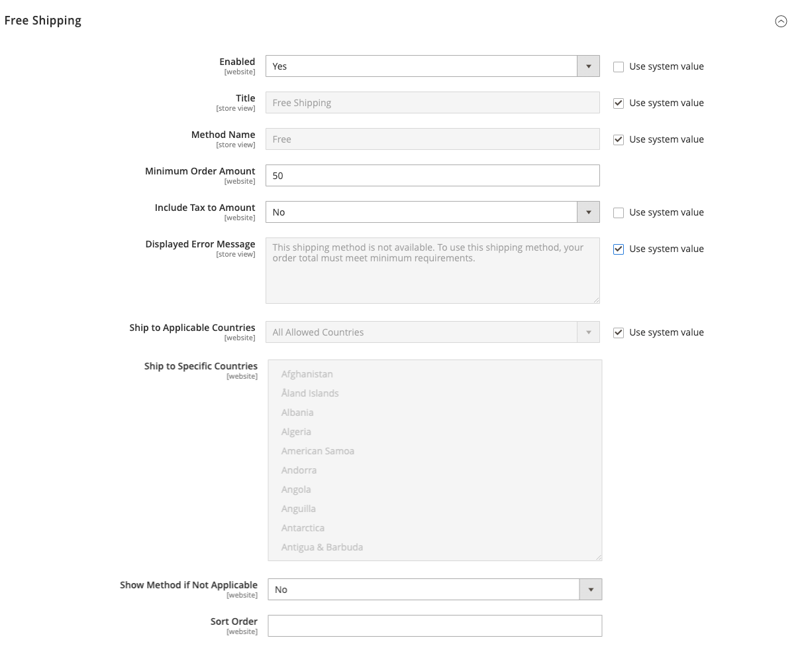
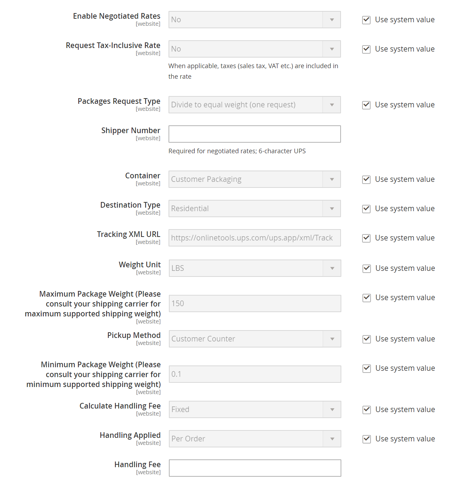
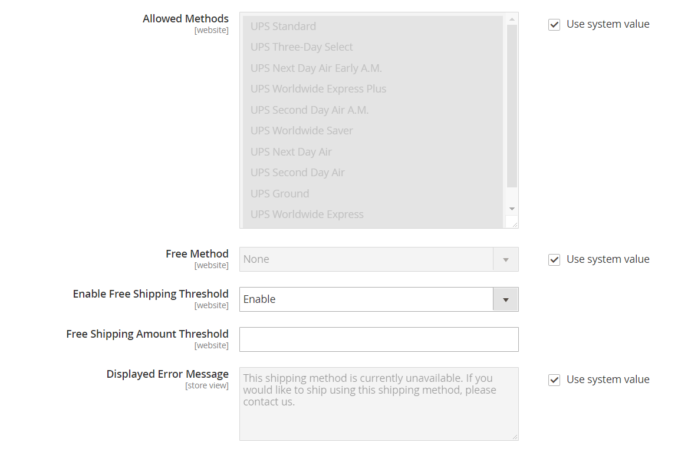
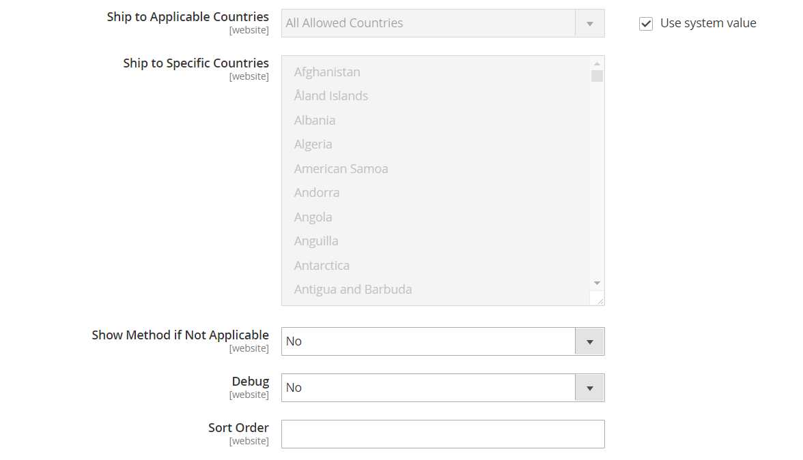
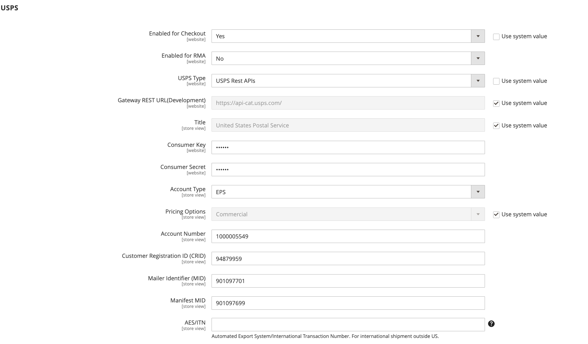
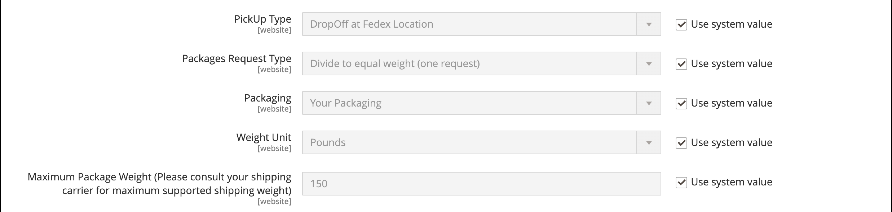
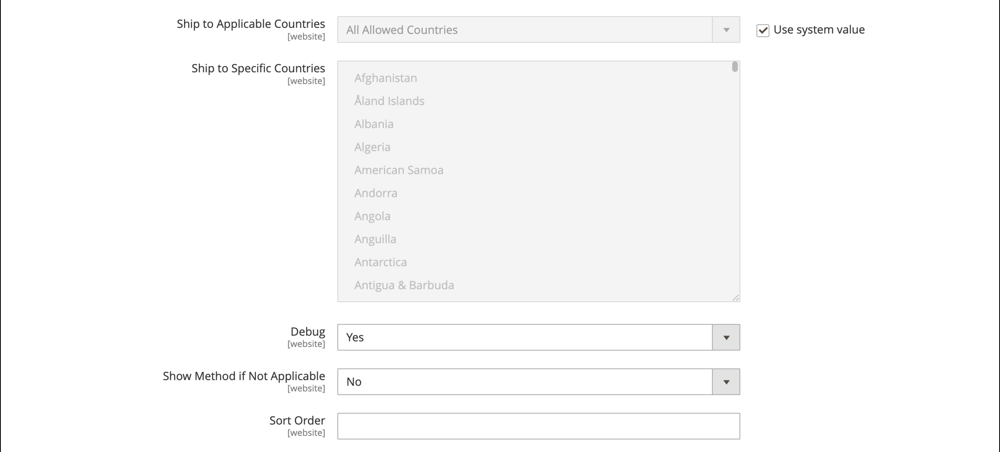

# [!UICONTROL Sales] > [!UICONTROL Delivery Methods]

{{config}}

## [!UICONTROL Basic Delivery Methods]

### [!UICONTROL Flat Rate]

<!-- zoom -->

<!-- [Flat Rate](https://experienceleague.adobe.com/ja/docs/commerce-admin/stores-sales/delivery/basic-methods/shipping-flat-rate) -->

| フィールド | [範囲](../../getting-started/websites-stores-views.md#scope-settings) | 説明 |
|--- |--- |--- |
| [!UICONTROL Enabled] | web サイト | 有効にすると、ショッピングカートの&#x200B;_配送料と税金の見積もり_ セクションと、チェックアウト時の&#x200B;_配送料_ セクションに定額料金がオプションとして表示されます。 オプション：`Yes` / `No` |
| [!UICONTROL Title] | ストアビュー | チェックアウト時にこの配送方法に使用される名前。 |
| [!UICONTROL Method Name] | ストアビュー | 出荷見積の作成に使用する計算方法を表す名前。 メソッド名は、ショッピングカート内の計算された見積もり率の横に表示されます。 デフォルト値は`Fixed`です。 |
| [!UICONTROL Type] | web サイト | 定額料金の決定に使用する計算の種類を説明します。 オプション： **`None`**– 計算が使用されていません。 「定額料金」を「ゼロ」に設定します。これは、送料無料に相当します。 **`Per Order`** – 注文全体に対して1つの定額料金を請求します。 **`Per Item`**- カート内の各商品に対して個別の定額料金を請求します。 合計数量に異なる品目の組み合わせが含まれている場合でも、レートにカート内の品目の数を掛けます。 |
| [!UICONTROL Price] | web サイト | 定額制の送料で顧客に請求する価格。 |
| [!UICONTROL Calculate Handling Fee] | web サイト | 手数料の計算方法を指定します（含まれる場合）。 オプション：`Fixed` / `Percent` |
| [!UICONTROL Handling Fee] | web サイト | 金額を計算するために選択した方法に基づいて、処理手数料に対して請求する金額を入力します。 例えば、料金が固定手数料に基づいている場合、4.90など、金額を10進数で入力します。 ただし、手数料が注文の割合に基づいている場合は、金額を割合で入力します。 例えば、注文の6%を請求する場合は、値を`.06`と入力します。 |
| [!UICONTROL Displayed Error Message] | ストアビュー | お客様が「定額料金」を選択した場合に表示されるメッセージですが、何らかの理由でメソッドが使用できません。 |
| [!UICONTROL Ship to Applicable Countries] | web サイト | 定額制の配送を提供している国を特定します。 オプション： **`All Allowed Countries`**- ストア設定で指定された国のお客様は、定額料金の配送を使用できます。 **`Specific Countries`** – 特定の国のお客様のみが定額制の配送を利用できます。 |
| [!UICONTROL Ship to Specific Countries] | web サイト | 顧客が定額制の配送を利用できる国を特定します。 |
| [!UICONTROL Show Method if Not Applicable] | web サイト | チェックアウト時に、購入時に定額料金がオプションとして表示されるかどうか（購入に適用されない場合）を指定します。 オプション：`Yes` / `No` |
| [!UICONTROL Sort Order] | web サイト | チェックアウト時に他の配送方法と一緒にリストされる場合に、定額料金が表示される順序を決定する数値。 |

{style="table-layout:auto"}

### [!UICONTROL Free Shipping]

<!-- zoom -->

<!-- [Free Shipping](https://experienceleague.adobe.com/ja/docs/commerce-admin/stores-sales/delivery/basic-methods/shipping-free) -->

| フィールド | [範囲](../../getting-started/websites-stores-views.md#scope-settings) | 説明 |
|--- |--- |--- |
| [!UICONTROL Enabled] | web サイト | 有効にすると、チェックアウト時に「送料無料」が「送料」セクションにオプションとして表示されます。 オプション：`Yes` / `No` |
| [!UICONTROL Title] | ストアビュー | チェックアウト時にこの配送方法に使用される名前。 |
| メソッド名 | ストアビュー | 出荷見積の作成に使用する計算方法を表す名前。 メソッド名は、ショッピングカート内の計算された見積もり率の横に表示されます。 デフォルト値は`Free`です。 |
| 最低注文金額 | web サイト | 注文に送料無料を適用するために必要な最低購入額。 |
| 金額に税金を含める | web サイト | 最低注文金額の計算に税金が含まれているかどうかを指定します。 オプション： **はい** – 最低注文金額（小計+税 – 割引）を計算する場合は税金が含まれます。 **いいえ** – 最低注文金額（小計 – 割引）を計算する場合は税金が含まれていません。 |
| 表示されるエラーメッセージ | ストアビュー | お客様が「送料無料」を選択した場合に表示されますが、何らかの理由で方法が利用できないメッセージ。 |
| 適用国への配送 | web サイト | 送料無料を提供する国を指定します。 オプション： **すべての許可された国** - ストア設定で指定された国のお客様は、送料無料を利用できます。  **特定の国** – 特定の国のお客様のみが送料無料を利用できます。 |
| 特定の国への配送 | web サイト | 顧客が送料無料を利用できる国を特定します。 |
| 該当しない場合はメソッドを表示 | web サイト | チェックアウト時に送料無料オプションがオプションとして表示されるかどうかを指定します。この方法が購入に適用されません。 オプション：`Yes` / `No` |
| [!UICONTROL Sort Order] | web サイト | チェックアウト時に他の配送方法と共に表示される場合に、送料無料が表示される順序を決定する番号。 |

{style="table-layout:auto"}

### [!UICONTROL Table Rates]

<!-- zoom -->

<!-- [Table Rates](https://experienceleague.adobe.com/ja/docs/commerce-admin/stores-sales/delivery/basic-methods/shipping-table-rate) -->

| フィールド | [範囲](../../getting-started/websites-stores-views.md#scope-settings) | 説明 |
|--- |--- |--- |
| [!UICONTROL Enabled] | web サイト | 有効にすると、ショッピングカートの「配送料と税金の見積もり」セクションと、チェックアウト時の「配送料」セクションに表レートがオプションとして表示されます。 オプション：`Yes` / `No` |
| [!UICONTROL Title] | ストアビュー | チェックアウト時にこの配送方法に使用される名前。 |
| メソッド名 | ストアビュー | 出荷見積の作成に使用する計算方法を表す名前。 メソッド名は、ショッピングカート内の計算された見積もり率の横に表示されます。 デフォルト値は`Table Rate`です。 |
| [!UICONTROL Condition] | web サイト | 計算の基となる条件を指定します。 アップロードされるCSV ファイルの形式は、各条件に固有です。 オプション：`Weight vs. Destination` / `Price vs. Destination` / `# of Items vs. Destination` |
| [!UICONTROL Include Virtual Products in Price Calculation] | web サイト | 送料を必要としないバーチャル製品を表レートの価格計算に含めるかどうかを指定します。 |
| [!UICONTROL Calculate Handling Fee] | web サイト | 手数料の計算方法を指定します（含まれる場合）。 オプション：`Fixed` / `Percent` |
| [!UICONTROL Handling Fee] | web サイト | 送料に追加される手数料の金額で、送料を負担します。 値を10進数として入力します。 例えば、手数料がパーセントに基づいている場合は、「6%」ではなく「0.06」と入力します。 固定額の場合は、`6.00`と入力します。 |
| [!UICONTROL Displayed Error Message] | ストアビュー | お客様が「表レート」を選択した場合に表示されるメッセージですが、何らかの理由でメソッドが使用できません。 |
| [!UICONTROL Ship to Applicable Countries] | web サイト | 表料配送を提供する国を指定します。 オプション： **`All Allowed Countries`**- ストア設定で指定された国のお客様は、テーブル レートの配送を使用できます。 **`Specific Countries`** – 特定の国のお客様のみが表料配送を使用できます。 |
| [!UICONTROL Ship to Specific Countries] | web サイト | お客様が表料金配送を使用できる国を指定します。 |
| [!UICONTROL Show Method if Not Applicable] | web サイト | チェックアウト時に表レートがオプションとして表示されるかどうか（購入に適用されない場合）を指定します。 オプション：`Yes` / `No` |
| [!UICONTROL Sort Order] | web サイト | チェックアウト時に他の配信方法と共にリストされる場合に、表レートが表示される順序を決定する数値。 |

{style="table-layout:auto"}

### [!UICONTROL In-Store Delivery]

<!-- zoom -->

<!-- [In-Store Delivery](https://experienceleague.adobe.com/ja/docs/commerce-admin/stores-sales/delivery/basic-methods/shipping-in-store-delivery) -->

| フィールド | [範囲](../../getting-started/websites-stores-views.md#scope-settings) | 説明 |
|--- |--- |--- |
| [!UICONTROL Enabled] | web サイト | 有効にすると、ショッピングカートの「_配送料と税金の見積もり_」セクションと、チェックアウト時の「_配送料_」セクションに実店舗内の配送がオプションとして表示されます。 オプション：`Yes` / `No` |
| [!UICONTROL Method Name] | ストアビュー | 実店舗での受け取り機能を配送方法として識別する名前。 この値は、配送チェックアウトページの上部にあるタブのラベルと、同じページの下部にある利用可能な配送方法のテーブルに表示されます。 デフォルト値は`In-store Delivery`です。 |
| [!UICONTROL Title] | ストアビュー | チェックアウト時にこの配送方法に使用される名前。 |
| [!UICONTROL Price] | web サイト | 実店舗での受け取りに対して顧客に請求する価格。 |
| [!UICONTROL Search Radius] | web サイト | 受け取り場所を検索する際に使用する半径（km単位）。 |
| [!UICONTROL Displayed Error Message] | ストアビュー | 顧客が実店舗での受け取りを選択した場合に表示されますが、配達方法が使用できないメッセージ。 |

{style="table-layout:auto"}

## [!UICONTROL Carriers]

### [!UICONTROL UPS]

{{ups-api}}

<!-- zoom -->

<!-- zoom -->

<!-- [UPS REST Account Settings]https://experienceleague.adobe.com/ja/docs/commerce-admin/stores-sales/delivery/shipping-carriers/ups) -->

| フィールド | [範囲](../../getting-started/websites-stores-views.md#scope-settings) | 説明 |
|--- |--- |--- |
| [!UICONTROL Enabled for Checkout] | web サイト | チェックアウト時にUPSを配送方法としてお客様が利用できるかどうかを判断します。 オプション：`Yes` / `No` |
| [!UICONTROL Enabled for RMA] | web サイト | RMAの配送方法としてUPSを顧客が利用できるかどうかを判断します。 オプション：`Yes` / `No` |
| _[!UICONTROL UPS Account Settings]_ |  |  |
| [!UICONTROL Live Account] | ストアビュー | United Parcel Service アカウントが有効であることを指定します。 オプション：`Yes` / `No` |
| [!UICONTROL Title] | ストアビュー | チェックアウト時にこの配送方法に使用される名前。 |
| _[!UICONTROL UPS REST Account Settings]_ |  |  |
| [!UICONTROL Gateway URL] | web サイト | UPS REST サービスの場合、JSON データの送信に必要な次のURLが表示されます：ゲートウェイ URL、トラッキング URL、配送URL。 ライブアカウント設定に従って、サンドボックスまたは実稼動エンドポイントを使用します。 |
| [!UICONTROL Mode] | web サイト | UPS システムに送信されるデータに使用される送信モードを決定します。 オプション： **`Development`**- UPSは、Commerce サーバーから受信したデータがSSL経由で送信されることを確認しません。 **`Live`** - UPSは、Commerce サーバーから受信したデータがSSL （セキュアソケットレイヤー）経由で送信されることを確認します。 |
| ユーザー ID | web サイト | UPS荷送人アカウントのクライアント ID。 |
| [!UICONTROL Origin of the Shipment] | web サイト | （UPS RESTのみ）製品の出荷元の国または地域。 |
| [!UICONTROL Password] | ストアビュー | UPS シッパーアカウントのクライアントシークレット。 |

{style="table-layout:auto"}

<!-- zoom -->

<!-- [UPS Package Information]https://experienceleague.adobe.com/ja/docs/commerce-admin/stores-sales/delivery/shipping-carriers/ups) -->

| フィールド | [範囲](../../getting-started/websites-stores-views.md#scope-settings) | 説明 |
|--- |--- |--- |
| _[!UICONTROL UPS Negotiated Rate Settings]_ |  |  |
| [!UICONTROL Enable Negotiated Rates] | web サイト | （UPS RESTのみ） UPSとの契約に従って、特別料金を有効/無効にします。 オプション：`Yes` / `No` |
| [!UICONTROL Packages Request Type] | web サイト | 複数のパッケージを含む出荷の重量の計算方法を指定します。 オプション：`Divide to equal weight (one request)` / `Use origin weight (multiple requests)` |
| [!UICONTROL Shipper Number] | web サイト | （UPS RESTのみ）交渉レートを使用するには、6文字のUPS荷送人番号が必要です。 |
| [!UICONTROL Container] | web サイト | 出荷のパッケージ化に使用するコンテナタイプを設定します。 オプション：`Customer Packaging` / `UPS Letter Envelope` / `Customer Packaging` / `UPS Letter Envelope` / `UPS Tube` / `UPS Express Box` / `UPS Worldwide 25 kilo` / `UPS Worldwide 10 kilo` |
| [!UICONTROL Weight Unit] | web サイト | ストア内の商品の重みについて、デフォルトの測定単位を設定します。 詳細については、[&#x200B; ディメンションの重み](../../stores-purchase/carriers.md#dimensional-weight)を参照してください。 |
| [!UICONTROL Tracking URL] | web サイト | （UPS RESTのみ）パッケージの追跡に使用されるUPS URL。 実稼動用には`https://onlinetools.ups.com/api/track`を、サンドボックス設定には`https://wwwcie.ups.com/api/track`を使用します。 |
| [!UICONTROL Destination Type] | web サイト | デフォルトの出荷先タイプを設定します。 オプション：`Business` / `Residential` |
| [!UICONTROL Maximum Package Weight] | web サイト | パッケージがUPSで指定された最大重量を設定します。 注文した商品が最大パッケージ重量を超えた場合、この配送オプションは利用できません。 [UPS.com](https://www.ups.com/us/en/global.page)によると、荷物は150 ポンド （70 kg）を超えることはできません。配送業者に確認して、最大重量を確認してください。 |
| [!UICONTROL Pickup Method] | web サイト | UPSの受け取り方法を設定します。 オプション：`Regular Daily Pickup` / `On Call Air` / `One Time Pickup` / `Letter Center` / `Customer Counter` |
| [!UICONTROL Minimum Package Weight] | web サイト | パッケージがUPSで指定された最小重量を設定します。 注文した商品の重量が最小パッケージ重量より小さい場合、この発送オプションは利用できません。 最小重量を確認するには、配送業者に確認してください。 |
| [!UICONTROL Calculate Handling Fee] | web サイト | 表の料金配送の処理手数料の計算方法を設定します。 オプション： **`Fixed`**– 手数料の処理は固定料金です。 **`Percent`** – 注文金額に対する手数料の割合が適用されます。 |
| [!UICONTROL Handling Applied] | web サイト | 処理手数料が各注文に適用されるか、注文内の各パッケージに適用されるかを指定します。 |
| [!UICONTROL Handling Fee] | web サイト | 配送料の価格に含まれる処理を設定します。 手数料は、固定額または割合で設定できます。   **_Note:_** パーセンテージ金額を入力する場合は、25%に小数点以下桁`0.25`を使用します。 |

{style="table-layout:auto"}

<!-- zoom -->

<!-- [UPS Allowed Methods]https://experienceleague.adobe.com/ja/docs/commerce-admin/stores-sales/delivery/shipping-carriers/ups) -->

| フィールド | [範囲](../../getting-started/websites-stores-views.md#scope-settings) | 説明 |
|--- |--- |--- |
| _[!UICONTROL UPS allowed methods]_ |  |  |
| [!UICONTROL Allowed Methods] | web サイト | 顧客に提供されるUPSの出荷方法を指定します。 送料は、選択した配送方法に基づいて計算されます。 |
| [!UICONTROL Free Method] | web サイト | UPSを通じた送料無料の方法に使用される方法を識別します。 送料無料を無効にするには、「なし」を選択します。   **_Note:_**&#x200B;この方法は、基本的な[送料無料](../../stores-purchase/shipping-free.md)と似ていますが、チェックアウト時にはUPSの送料オプションとして表示されます。 |
| [!UICONTROL Free Shipping Amount Threshold] | web サイト | 注文金額が送料無料のしきい値を満たしたときに、送料無料が適用されるかどうかを指定します。 オプション：`Enable` / `Disable` |
| [!UICONTROL Free Shipping Amount Threshold] | web サイト | 注文が送料無料の条件を満たすために到達しなければならない最低合計金額を設定します。 |
| [!UICONTROL Displayed Error Message] | ストアビュー | この配送方法が何らかの理由で利用できない場合に表示されるエラーメッセージ。 |

{style="table-layout:auto"}

<!-- zoom -->

<!-- [UPS Applicable Countries and Other Settings]https://experienceleague.adobe.com/ja/docs/commerce-admin/stores-sales/delivery/shipping-carriers/ups) -->

| フィールド | [範囲](../../getting-started/websites-stores-views.md#scope-settings) | 説明 |
|--- |--- |--- |
| _[!UICONTROL UPS Applicable countries and other Settings]_ |  |  |
| [!UICONTROL Ship to Applicable Countries] | web サイト | この配送方法を使用できる国を指定します。 オプション： **`All Allowed Countries`**- ストア設定で指定されたすべての[国](../../getting-started/store-details.md#country-options)のお客様は、この配送方法を使用できます。 **`Specific Countries`** – このオプションを選択すると、[!UICONTROL Ship to Specific Countries] リストが表示されます。 この配送方法を使用できるリストの各国を選択します。 |
| [!UICONTROL Show Method if Not Applicable] | web サイト | チェックアウト時にUPSが常に配送オプションとして表示されるかどうかを判断します。 オプション： **`Yes`**- UPSは、注文に該当しない場合でも、チェックアウト時に常に配送オプションとして表示されます。 **`No`** - UPSは、チェックアウト時に、注文に該当する場合にのみ発送オプションとして表示されます。 （例えば、注文の重みが最大の重み量を超えている場合）。 |
| [!UICONTROL Debug] | web サイト | ストアとUPS間のデータ転送がデバッグ用にシステムに記録されるかどうかを指定します。 追跡してログに記録する必要がある問題がない限り、このオプションは`No`に設定する必要があります。 |
| [!UICONTROL Sort Order] | web サイト | チェックアウト時に他の配送方法と一緒に表示されるUPSの順序を決定する番号。 リストの先頭に`0`と入力します。 |

{style="table-layout:auto"}

### [!UICONTROL USPS]

<!-- zoom -->

| フィールド | [範囲](../../getting-started/websites-stores-views.md#scope-settings) | 説明 |
|--- |--- |--- |
| チェックアウト可能 | web サイト | チェックアウト時にUSPSが配送方法として顧客に提供されるかどうかを判断します。 オプション：`Yes` / `No` |
| _[!UICONTROL USPS Account Settings]_ |  |  |
| [!UICONTROL Gateway URL] | web サイト | USPS システムに接続して配送料を動的に取得するために使用されるURL。 |
| [!UICONTROL Secure Gateway URL] | web サイト | 配送料を動的に取得するために、セキュアソケットレイヤー（SSL）経由でUSPS システムに接続するために使用されるセキュア URL。 |
| [!UICONTROL Title] | ストアビュー | ショッピングカートのチェックアウトに表示されるこの配送オプションのタイトル。 |
| [!UICONTROL USPS Type] | web サイト | 使用する&#x200B;**USPS Rest API**&#x200B;または&#x200B;**USPS Web Tools API**&#x200B;を選択します。 |
| [!UICONTROL User ID] | web サイト | USPS シッパーアカウントのユーザーID。 |
| [!UICONTROL Password] | web サイト | USPS シッパーのアカウントのパスワード。 |
| [!UICONTROL Mode] | web サイト | USPS システムに送信されるデータに使用される送信モードを決定します。  **`Development`**- USPSは、Commerce サーバーから受信したデータがSSL経由で送信されることを確認しません。 **`Live`** - USPSは、Commerce サーバーから受信したデータがセキュアソケットレイヤー（SSL）経由で送信されることを確認します。 |
| [!UICONTROL Consumer Key] | web サイト | REST APIのUSPS シッパーアカウントのクライアント ID。 |
| [!UICONTROL Consumer Secret] | web サイト | REST API用のUSPS シッパーアカウントのクライアントシークレットキー。 |
| [!UICONTROL Account Type] | web サイト | USPS支払いアカウントのタイプ。 オプション：REST APIの`"EPS"` （エンタープライズ決済システム）または`"PERMIT"` （許可インプリント）です。   **_Note:_**&#x200B;このフィールドはオプションですが、配送ラベルの作成を有効にするために必要です。 |
| [!UICONTROL Pricing Options] | web サイト | USPS価格オプション：**小売**&#x200B;または&#x200B;**コマーシャル**。 適用される配送料に影響します。 REST APIのデフォルトは&#x200B;**Commercial**&#x200B;です。 |
| [!UICONTROL Account Number] | web サイト | お客様のUSPS **口座番号** （REST APIの支払いに使用）。  **_Note:_**&#x200B;このフィールドはオプションですが、配送ラベルの作成を有効にする必要があります。 |
| [!UICONTROL Customer Registration Identifier(CRID)] | web サイト | 顧客登録識別番号（CRID）は、REST APIの場所にある企業を一意に識別するUSPSが生成した数値コードです。  **_Note:_**&#x200B;このフィールドはオプションですが、配送ラベルの作成を有効にする必要があります。 |
| [!UICONTROL Mailer Identifier(MID)] | web サイト | メーラー識別子（MID）は、メーラーを識別するために使用されるインテリジェントメールバーコード内のフィールドです。 MIDは、USPSによって、REST APIを要求するメール所有者、郵送担当者、またはその他のサービスプロバイダーに割り当てられます。  **_Note:_**&#x200B;このフィールドはオプションですが、配送ラベルの作成を有効にする必要があります。 |
| [!UICONTROL Manifest MID] | web サイト | REST APIのマニフェストに指定された一意のメーラー識別子。  **_Note:_**&#x200B;このフィールドはオプションですが、配送ラベルの作成を有効にする必要があります。 |
| [!UICONTROL AES/ITN] | web サイト | USPS AES - Automated Export System / ITN - REST APIの内部トランザクション番号。   **_Note:_**&#x200B;このフィールドは通常オプションですが、次の場合に出荷ラベルの作成を有効にするために必要です。 <ul><li>（Schedule B Export Codes <a href="https://www.census.gov/foreign-trade/schedules/b" target="_blank">www.census.gov/foreign-trade/schedules/b</a>で定義されているように）貨物の種類は、2,500 ドル以下で評価され、輸出許可は必要ありません。</li><li>この貨物は、価値に関係なく、カナダに送られており、輸出許可は必要ありません。</li></ul> |

{style="table-layout:auto"}

次のフィールドは、[USPS REST API移行品質パッチ &#x200B;](https://experienceleague.adobe.com/ja/docs/commerce-operations/tools/quality-patches-tool/patches-available-in-qpt/v1-1-70/ac-15210)を適用した場合にのみ使用できます。 このパッチは、Web ツール APIに代わるREST ベースのプラットフォームであるUSPS APIのサポートを有効にします。 詳しくは、[USPS Web Tools APIの非推奨化](../../stores-purchase/carriers.md)を参照してください。

| フィールド | [範囲](../../getting-started/websites-stores-views.md#scope-settings) | 説明 |
|--- |--- |--- |
| [!UICONTROL USPS Type] | web サイト | 使用する&#x200B;**USPS Rest API**&#x200B;または&#x200B;**USPS Web Tools API**&#x200B;を選択します。 |
| [!UICONTROL Consumer Key] | web サイト | REST APIのUSPS シッパーアカウントのクライアント ID。 |
| [!UICONTROL Consumer Secret] | web サイト | REST API用のUSPS シッパーアカウントのクライアントシークレットキー。 |
| [!UICONTROL Account Type] | web サイト | USPS支払いアカウントのタイプ。 オプション：REST APIの`"EPS"` （エンタープライズ決済システム）または`"PERMIT"` （許可インプリント）です。   **_Note:_**&#x200B;このフィールドはオプションですが、配送ラベルの作成を有効にするために必要です。 |
| [!UICONTROL Pricing Options] | web サイト | USPS価格オプション：**小売**&#x200B;または&#x200B;**コマーシャル**。 適用される配送料に影響します。 REST APIのデフォルトは&#x200B;**Commercial**&#x200B;です。 |
| [!UICONTROL Account Number] | web サイト | お客様のUSPS **口座番号** （REST APIの支払いに使用）。  **_Note:_**&#x200B;このフィールドはオプションですが、配送ラベルの作成を有効にする必要があります。 |
| [!UICONTROL Customer Registration Identifier(CRID)] | web サイト | 顧客登録識別番号（CRID）は、REST APIの場所にある企業を一意に識別するUSPSが生成した数値コードです。  **_Note:_**&#x200B;このフィールドはオプションですが、配送ラベルの作成を有効にする必要があります。 |
| [!UICONTROL Mailer Identifier(MID)] | web サイト | メーラー識別子（MID）は、メーラーを識別するために使用されるインテリジェントメールバーコード内のフィールドです。 MIDは、USPSによって、REST APIを要求するメール所有者、郵送担当者、またはその他のサービスプロバイダーに割り当てられます。  **_Note:_**&#x200B;このフィールドはオプションですが、配送ラベルの作成を有効にする必要があります。 |
| [!UICONTROL Manifest MID] | web サイト | REST APIのマニフェストに指定された一意のメーラー識別子。  **_Note:_**&#x200B;このフィールドはオプションですが、配送ラベルの作成を有効にする必要があります。 [AC-15210](https://experienceleague.adobe.com/ja/docs/commerce-operations/tools/quality-patches-tool/patches-available-in-qpt/v1-1-70/ac-15210) パッチが適用されたMagento 2.4.7-p8の場合、[!UICONTROL Manifest MID]は必須フィールドです。 |
| [!UICONTROL AES/ITN] | web サイト | USPS AES - Automated Export System / ITN - REST APIの内部トランザクション番号。   **_Note:_**&#x200B;このフィールドは通常オプションですが、次の場合に出荷ラベルの作成を有効にするために必要です。 <ul><li>（Schedule B Export Codes <a href="https://www.census.gov/foreign-trade/schedules/b" target="_blank">www.census.gov/foreign-trade/schedules/b</a>で定義されているように）貨物の種類は、2,500 ドル以下で評価され、輸出許可は必要ありません。</li><li>この貨物は、価値に関係なく、カナダに送られており、輸出許可は必要ありません。</li></ul> |

{style="table-layout:auto"}

<!-- zoom -->

<!-- [USPS Packaging Settings](https://experienceleague.adobe.com/ja/docs/commerce-admin/stores-sales/delivery/shipping-carriers/usps) -->

| フィールド | [範囲](../../getting-started/websites-stores-views.md#scope-settings) | 説明 |
|--- |--- |--- |
| _[!UICONTROL USPS packaging Settings]_ |  |  |
| [!UICONTROL Packages Request Type] | web サイト | 複数のパッケージを含む出荷の重量の計算方法を指定します。 オプション：`Divide to equal weight (one request)` / `Use origin weight (multiple requests)` |
| [!UICONTROL Container] | web サイト | 出荷のパッケージ化に使用するコンテナタイプを設定します。 オプション：`Variable` / `Flat Rate Box` / `Flat Rate Envelope` / `Rectangular` / 長方形以外 |
| [!UICONTROL Size] | web サイト | 「サイズ」オプションを一般的な出荷パッケージサイズに設定します。 このオプションは、配送料の計算に影響します。 オプション：`Regular` / `Large` / `Oversize` |
| [!UICONTROL Machinable] | web サイト | パッケージをマシンで処理できるかどうかを指定します。 このオプションは、配送料の計算に影響します。 |
| [!UICONTROL Maximum Package Weight] | web サイト | パッケージがUSPSで指定できる最大重量を設定します。 注文した商品が最大パッケージ重量を超えた場合、この配送オプションは利用できません。 |

{style="table-layout:auto"}

<!-- zoom -->

<!-- [USPS Handling Fee Settings](https://experienceleague.adobe.com/ja/docs/commerce-admin/stores-sales/delivery/shipping-carriers/usps) -->

| フィールド | [範囲](../../getting-started/websites-stores-views.md#scope-settings) | 説明 |
|--- |--- |--- |
| _[!UICONTROL USPS Handling Fee settings]_ |  |  |
| [!UICONTROL Calculate Handling Fee] | web サイト | 表の料金配送の処理手数料の計算方法を設定します。 オプション： **`Fixed`**– 手数料の処理は固定料金です。 **`Percent`** – 注文金額に対する手数料の割合が適用されます。 |
| [!UICONTROL Handling Applied] | web サイト | 処理手数料が各注文に適用されるか、注文内の各パッケージに適用されるかを指定します。 |
| [!UICONTROL Handling Fee] | web サイト | 配送料の価格に含まれる処理を設定します。 手数料は、固定額または割合で設定できます。   **_Note:_** パーセンテージの金額を入力する場合は、25%に小数点形式`25`を使用します。 |

{style="table-layout:auto"}

<!-- zoom -->

<!-- [USPS Allowed Methods](https://experienceleague.adobe.com/ja/docs/commerce-admin/stores-sales/delivery/shipping-carriers/usps) -->

| フィールド | [範囲](../../getting-started/websites-stores-views.md#scope-settings) | 説明 |
|--- |--- |--- |
| _[!UICONTROL USPS Allowed Methods]_ |  |  |
| [!UICONTROL Allowed Methods] | web サイト | 顧客に提供されるUSPS配送の許可される方法を指定します。 送料は、選択した配送方法に基づいて計算されます。 |
| [!UICONTROL Free Method] | web サイト | USPSを通じて送料無料の方法を設定するか、`None`を選択して無効にすることができます。   **_Note:_**&#x200B;この配送方法は、ストアの送料無料の方法に似ていますが、USPSの配送オプションとして表示され、USPSの配送オプションとして識別されます。 |
| [!UICONTROL Minimum Order Amount for Free Shipping] | web サイト | 送料無料の条件を満たすために満たす必要がある最低注文金額を設定します。 |
| [!UICONTROL Displayed Error Message] | ストアビュー | 何らかの理由でUSPSが利用できない場合に表示されるエラーメッセージ。 |

{style="table-layout:auto"}

<!-- zoom -->

<!-- [USPS Applicable Countries](https://experienceleague.adobe.com/ja/docs/commerce-admin/stores-sales/delivery/shipping-carriers/usps) -->

| フィールド | [範囲](../../getting-started/websites-stores-views.md#scope-settings) | 説明 |
|--- |--- |--- |
| _[!UICONTROL USPS Applicable Countries]_ |  |  |
| [!UICONTROL Ship to Applicable Countries] | web サイト | 注文を発送できる国を指定します。 オプション： **`All Allowed Countries`**- ストア設定で指定されたすべての[国](../../getting-started/store-details.md#country-options)のお客様は、この配送方法を使用できます。 **`Specific Countries`** – このオプションを選択すると、[!UICONTROL Ship to Specific Countries] リストが表示されます。 この配送方法を使用できるリストの各国を選択します。 |
| [!UICONTROL Show Method if Not Applicable] | web サイト | チェックアウト時のUSPS配送の表示を制御します。 オプション： **`Yes`**- USPSは、注文に該当しない場合でも、チェックアウト時に常に配送オプションとして表示されます。 **`No`** - USPSは、チェックアウト時に、注文に適用できる場合（つまり、注文重量が最大重量量を超えている場合）にのみ出荷オプションとして表示されます。 |
| [!UICONTROL Debug] | web サイト | ストアとUSPS間のデータ送信のログが、デバッグ用にシステムによって維持されているかどうかを判断します。 追跡してログに記録する必要がある問題がない限り、このオプションは`No`に設定する必要があります。 |
| [!UICONTROL Sort Order] | web サイト | チェックアウト時に他の配信方法と共に表示されるときに、USPSが表示される順序を決定する番号。 リストの先頭に`0`と入力します。 |

{style="table-layout:auto"}

### [!UICONTROL FedEx]

<!-- [FedEx Account Settings](https://experienceleague.adobe.com/ja/docs/commerce-admin/stores-sales/delivery/shipping-carriers/fedex) -->

#### FedEx アカウント設定

{width="600" zoomable="yes"}

| フィールド | [範囲](../../getting-started/websites-stores-views.md#scope-settings) | 説明 |
|-------|------ |-----------------------------------------------------------------------------|
| [!UICONTROL Enabled for Checkout] | web サイト | チェックアウト時にFedExが配送方法としてお客様に提供されているかどうかを確認します。 オプション：`Yes` / `No` |
| [!UICONTROL Title] | ストアビュー | ショッピングカートのチェックアウトに表示されるこの配送オプションのタイトル。 |
| [!UICONTROL Account ID] | web サイト | FedEx アカウント ID。 |
| [!UICONTROL Api Key] | web サイト | FedEx アカウント API キー。 |
| [!UICONTROL Secret Key] | web サイト | FedEx アカウント API秘密鍵。 |
| [!UICONTROL Sandbox Mode] | web サイト | テスト環境でFedEx トランザクションを実行するには、サンドボックスモードを`Yes`に設定します。 オプション：`Yes` / `No`。 |
| [!UICONTROL Web-Services URL] | web サイト | 必要なURLは、サンドボックスモードの設定によって異なります。 オプション： **`Production`**- ストアの公開時にFedEx web サービスにアクセスするためのURL。 **`Sandbox`** - FedEx web サービスのテスト環境にアクセスするためのURL。 |

{style="table-layout:auto"}

#### FedExのパッケージ設定

{width="600" zoomable="yes"}

| フィールド | [範囲](../../getting-started/websites-stores-views.md#scope-settings) | 説明 |
|--- |--- |--- |
| [!UICONTROL Pickup Type] | web サイト | リストから、受け取り方法を選択します： **`DropOff at Fedex Location`**- （デフォルト）お近くのFedEx ステーションで荷物を返送したことを示します。 **`Contact Fedex to Schedule`** - FedExに問い合わせてピックアップをリクエストすることを示します。 **`Use Scheduled Pickup`**– 通常のスケジュール済み受け取りの一環として荷物が受け取られることを示します。 **`On Call`** - FedExを呼び出してピックアップがスケジュールされていることを示します。 **`Package Return Program`**– 荷物がFedEx Ground Package Returns Programによって受け取られることを示します。 **`Regular Stop`** – 通常の受け取りスケジュールで荷物が受け取られることを示します。 **`Tag`**– 出荷受け取りがExpress タグまたはGround コールタグ受け取り要求に固有であることを示します。 これは、返送用ラベルにのみ適用されます。 |
| [!UICONTROL Packages Request Type] | web サイト | 複数のパッケージを含む出荷の重量の計算方法を指定します。 オプション：`Divide to equal weight (one request)` / `Use origin weight (multiple requests)` |
| [!UICONTROL Packaging] | web サイト | リストから、ストアから注文した製品をパッケージ化するために通常使用するコンテナタイプを選択します。 |
| [!UICONTROL Weight Unit] | web サイト | パッケージの重量に使用される単位。 オプション：`Pounds` （既定値） / `Kilograms` |
| [!UICONTROL Maximum Package Weight] | web サイト | FedExのデフォルト値は150 ポンドです。 サポートされている最大重量については、配送業者にお問い合わせください。 FedExとの特別な取り決めがない限り、デフォルト値を使用することをお勧めします。 |

{style="table-layout:auto"}

#### FedEx処理料金設定

{width="600" zoomable="yes"}

| フィールド | [範囲](../../getting-started/websites-stores-views.md#scope-settings) | 説明 |
|--- |--- |--- |
| [!UICONTROL Calculate Handling Fee] | web サイト | 処理手数料の計算に使用する方法を決定します。 オプション：`Fixed Fee` / `Percentage`   **_Note:_**&#x200B;処理手数料はオプションで、FedExの送料に追加される追加料金として表示されます。 |
| [!UICONTROL Handling Applied] | web サイト | 処理手数料の適用方法を決定します。 オプション：`Per Order` / `Per Package` |
| [!UICONTROL Handling Fee] | web サイト | 金額の計算に使用した方法に基づいて、処理手数料として請求される金額を指定します。 料金が固定料金に基づいている場合は、金額を小数（`4.90`など）で入力します。 処理手数料が注文の割合に基づいている場合は、割合で金額を入力します。 例えば、注文の6 パーセントを請求するには、値を`.06`と入力します。 |

{style="table-layout:auto"}

#### FedExの配信方法

{width="600" zoomable="yes"}

| フィールド | [範囲](../../getting-started/websites-stores-views.md#scope-settings) | 説明 |
|--- |--- |--- |
| [!UICONTROL Residential Delivery] | web サイト | B2C （Business-to-Consumer）またはB2B （Business-to-Business）のどちらを販売しているかに応じて、次のいずれかを設定します。 **`Yes`**- B2C配信の場合 **`No`** - B2B配信の場合 |
| [!UICONTROL Allowed Methods] | web サイト | リストから、サポートする出荷方法を選択します。 方法は、FedEx アカウント、発送頻度とサイズ、および国際配送を許可するかどうかによって異なります。 マーチャントとして、地上配送のみを提供することもできます。 |
| [!UICONTROL Hub ID] | web サイト | FedExが提供する[!DNL Smart Post] メソッドで使用されるID。 |
| [!UICONTROL Free Method] | web サイト | リストから、送料無料のオファーに使用する配送方法を選択します。   **_Note:_**&#x200B;この配送方法は、通常の送料無料の方法と似ていますが、FedExの配送オプションに記載されており、FedExの配送オプションとして識別されます。 |
| [!UICONTROL Free Shipping Amount Threshold] | web サイト | 送料無料に最低注文金額が必要かどうかを判断します。 オプション： **`Enable`**– 最低金額を満たす注文に対してFedExの送料無料を有効にします。 **`Disable`** – 最低注文時にFedExの送料無料を無効にします。 |
| [!UICONTROL Free Shipping Amount Threshold] | web サイト | 送料無料に必要な最低注文金額を指定します。 |
| [!UICONTROL Displayed Error Message] | ストアビュー | FedExが何らかの理由で利用できない場合に表示されるメッセージ。 デフォルトのメッセージを使用するか、別のメッセージを入力できます。 |

{style="table-layout:auto"}

#### FedEx適用国設定

{width="600" zoomable="yes"}

| フィールド | [範囲](../../getting-started/websites-stores-views.md#scope-settings) | 説明 |
|--- |--- |--- |
| [!UICONTROL Ship to Applicable Countries] | web サイト | 顧客がFedExで出荷できる国を示します。 オプション： **`All Allowed Countries`**- ストア設定で指定されたすべての[国](../../getting-started/store-details.md#country-options)のお客様は、この配送方法を使用できます。 **`Specific Countries`** – このオプションを選択すると、[!UICONTROL Ship to Specific Countries] リストが表示されます。 この配送方法を使用できるリストの各国を選択します。 |
| [!UICONTROL Ship to Specific Countries] | web サイト | 顧客がFedExで出荷できる特定の国を示します。 |
| [!UICONTROL Debug] | web サイト | ストアとFedEx間のデータ送信のログが、デバッグ用にシステムによって維持されているかどうかを判断します。 追跡してログに記録する必要がある問題がない限り、このオプションは`No`に設定する必要があります。 |
| [!UICONTROL Show Method if Not Applicable] | web サイト | チェックアウト時にFedExが配送方法として表示されるタイミングを決定します。 オプション： **`Yes`**- FedExの配送オプションは、注文で使用する資格があるかどうかにかかわらず、配送方法リストに表示されます。 **`No`** - FedExの配送オプションは、注文に適用されない場合（注文の重みが最大重量の量を超えている場合など）は、配送方法リストに表示されません。 |
| [!UICONTROL Sort Order] | web サイト | チェックアウト時に他の配信方法と共に表示されるときに、FedExが表示される順序を決定する番号。 リストの先頭に`0`と入力します。 |

{style="table-layout:auto"}

### [!UICONTROL DHL]

<!-- zoom -->

<!-- [DHL Account Settings](https://experienceleague.adobe.com/ja/docs/commerce-admin/stores-sales/delivery/shipping-carriers/dhl) -->

| フィールド | [範囲](../../getting-started/websites-stores-views.md#scope-settings) | 説明 |
|--- |--- |--- |
| _[!UICONTROL DHL Account Settings]_ |  |  |
| [!UICONTROL Enabled for Checkout] | web サイト | チェックアウト時にDHLが配送方法としてお客様に提供されているかどうかを判断します。 オプション：`Yes` / `No` |
| [!UICONTROL Title] | ストアビュー | チェックアウト時に表示されるこの配送方法のタイトル。 |
| [!UICONTROL DHL Type] | web サイト | 使用するRESTまたはXMLを選択します。 |
| [!UICONTROL Access ID] | web サイト | DHL荷送人アカウントのアクセス ID。 |
| [!UICONTROL API KEY] | web サイト | REST API用のDHL API キー。 |
| [!UICONTROL Password] | web サイト | DHL シッパーのアカウントのパスワード。 |
| [!UICONTROL API Secret] | web サイト | REST API用のDHL API秘密鍵。 |
| [!UICONTROL Account Number] | web サイト | DHL シッパーの口座番号。 |

{style="table-layout:auto"}

<!-- zoom -->

<!-- [DHL Package Settings](https://experienceleague.adobe.com/ja/docs/commerce-admin/stores-sales/delivery/shipping-carriers/dhl) -->

| フィールド | [範囲](../../getting-started/websites-stores-views.md#scope-settings) | 説明 |
|--- |--- |--- |
| _[!UICONTROL DHL Package Settings]_ |  |  |
| [!UICONTROL Calculate Handling Fee] | web サイト | 処理手数料はオプションで、DHLの送料に追加料金として表示されます。 リストから、処理手数料の計算に使用する方法を選択します。 オプション：固定手数料/割合。 |
| [!UICONTROL Handling Applied] | web サイト | リストから、処理手数料の適用方法を選択します。 オプション：`Per Order` / `Per Package` |
| 手数料の処理 | web サイト | 金額を計算するために選択した方法に基づいて、処理手数料に対して請求する金額を入力します。 例えば、料金が固定料金に基づいている場合は、金額を小数（`4.90`）で入力します。 ただし、手数料が注文の割合に基づいている場合は、金額を割合で入力します。 例えば、注文の6%を請求する場合は、値を`6`と入力します。 |
| [!UICONTROL Divide Order Weight] | ストアビュー | 70 kgを超える注文の重量を小さい単位に分割して、正確な配送料を確保できるかどうかを判断します。 オプション：`Yes` / `No` |
| [!UICONTROL Weight Unit] | ストアビュー | 出荷計算で使用される重量の測定単位を決定します。 オプション：`Pounds` / `Kilograms` |
| [!UICONTROL Size] | ストアビュー | パッケージのサイズを決定します。 オプション： **`Regular`**– 出荷されるパッケージは、DHL標準のパッケージ方法に準拠しています。 [!UICONTROL Allowed Methods] リストで、ストアから商品を出荷するために使用する各梱包方法を選択します。 **`Specific`** – 発送されたパッケージにカスタムディメンションがある場合は、次の項目を完了してください：[!UICONTROL Height (cm)] / [!UICONTROL Depth (cm)] / [!UICONTROL Width (cm)] |

{style="table-layout:auto"}

<!-- zoom -->

<!-- DHL Allowed Methods](https://experienceleague.adobe.com/ja/docs/commerce-admin/stores-sales/delivery/shipping-carriers/dhl) -->

| フィールド | [範囲](../../getting-started/websites-stores-views.md#scope-settings) | 説明 |
|--- |--- |--- |
| _[!UICONTROL DHL allowed methods]_ |  |  |
| [!UICONTROL Allowed Methods] | web サイト | リストで、サポートする各出荷方法を選択します。 |
| [!UICONTROL Ready Time] | web サイト | 注文が送信された後にパッケージを受け取る準備が整う時間を指定します。 |
| [!UICONTROL Displayed Error Message] | ストアビュー | このメッセージは、何らかの理由でDHLが利用できなくなった場合に表示されます。 デフォルトのメッセージを使用するか、独自のメッセージを入力できます。 |
| [!UICONTROL Free Method] |  | この配送方法は、通常の送料無料の方法と似ていますが、DHLの配送オプションに記載されており、DHLの配送として識別されます。 リストで、送料無料のオファーに使用する配送方法を選択します。 |
| [!UICONTROL Free Shipping with Minimum Order Amount] | web サイト | 次のいずれかに設定します。 **`Enable`**– 最低金額を満たす注文のDHL送料無料を許可します。 **`Disable`** – 最低注文時に無料のDHL配送を提供しない。 |
| [!UICONTROL Minimum Order Amount for Free Shipping] | web サイト | [!UICONTROL Free Shipping with Minimum Order]を有効にする場合は、フィールドに最低注文金額の値を入力します。 |

{style="table-layout:auto"}

<!-- zoom -->

<!-- [DHL Applicable Countries](https://experienceleague.adobe.com/ja/docs/commerce-admin/stores-sales/delivery/shipping-carriers/dhl) -->

| フィールド | [範囲](../../getting-started/websites-stores-views.md#scope-settings) | 説明 |
|--- |--- |--- |
| _[!UICONTROL DHL applicable countries]_ |  |  |
| [!UICONTROL Ship to Applicable Countries] | web サイト | この配送方法を使用できる国を指定します。 オプション： **すべての許可された国** – すべての許可された国は、送料無料の方法を使用するために適用されます。 許可されている国は、[!UICONTROL General]設定ページで指定されています。  **特定の国** – この配送オプションを「特定の国に配送」リストで指定されている国に制限します。 |
| [!UICONTROL Ship to Specific Countries] | web サイト | DHLの出荷が可能な国を指定します。 この「選択された国」リストは、[!UICONTROL Ship to Applicable Countries] オプションで`Specific Countries`が選択されている場合に使用されます。 |
| [!UICONTROL Show Method if Not Applicable] | web サイト | チェックアウト時にDHLが配送方法として表示されるタイミングを決定します。 オプション： **`Yes`**- DHLは、注文に該当しない場合でも、チェックアウト時に常に配送オプションとして表示されます。 **`No`** - DHLは、チェックアウト時に、注文に適用できる場合（つまり、注文重量が最大重量量を超えている場合）にのみ発送オプションとして表示されます。 |
| [!UICONTROL Debug] | web サイト | エラー情報を含むログファイルを作成します。 |
| [!UICONTROL Sandbox Mode] | web サイト | サンドボックスを使用する場合は`Yes`に設定します。 ライブモードの場合は`No`に設定します。 |
| [!UICONTROL Sort Order] | web サイト | チェックアウト時に他の配送方法と共に表示される場合にDHLが表示される順序を決定する番号。 リストの一番上に配置するには、`0`と入力します。 |

{style="table-layout:auto"}
