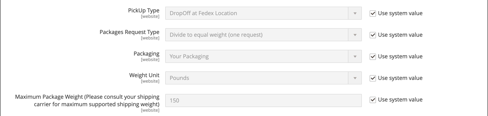

# [!UICONTROL Sales] > [!UICONTROL Delivery Methods]

{{config}}

## [!UICONTROL Basic Delivery Methods]

### [!UICONTROL Flat Rate]

<!-- zoom -->

<!-- [Flat Rate](https://experienceleague.adobe.com/ja/docs/commerce-admin/stores-sales/delivery/basic-methods/shipping-flat-rate) -->

| フィールド | [ 範囲 ](../../getting-started/websites-stores-views.md#scope-settings) | 説明 |
|--- |--- |--- |
| [!UICONTROL Enabled] | Web サイト | 有効にすると、買い物かごの _配送料と税金の見積もり_ セクションと、チェックアウト時の _配送_ セクションに定額レートがオプションとして表示されます。 オプション：`Yes` / `No` |
| [!UICONTROL Title] | ストア表示 | チェックアウト時にこの発送方法に使用される名前。 |
| [!UICONTROL Method Name] | ストア表示 | 出荷見積の生成に使用される計算方法を説明する名前。 メソッド名は、計算された推定レートの横に買い物かごに表示されます。 デフォルト値は `Fixed` です。 |
| [!UICONTROL Type] | Web サイト | 定率算出に使用する計算のタイプを表します。 オプション： **`None`**– 計算は使用されません。 定額料金をゼロに設定します。これは送料無料と同じです。 **`Per Order`** – 注文全体に対して 1 つの定額料金を請求します。  **`Per Item`**– 買い物かごに入っている商品ごとに別々の定額料金を請求します。 合計数量に異なる品目の組合せが含まれている場合でも、レートに買い物かごの品目数が乗算されます。 |
| [!UICONTROL Price] | Web サイト | 定額配送でお客様に請求する価格。 |
| [!UICONTROL Calculate Handling Fee] | Web サイト | 手数料の計算方法を決定します（含まれる場合）。 オプション：`Fixed` / `Percent` |
| [!UICONTROL Handling Fee] | Web サイト | 金額の計算方法に基づいて、手数料に対して請求する金額を入力します。 例えば、料金が固定料金に基づいている場合は、4.90 のように、金額を小数で入力します。ただし、手数料が注文のパーセンテージに基づいている場合は、パーセンテージで金額を入力します。 例えば、注文の 6% を請求する場合は、値を `.06` のように入力します。 |
| [!UICONTROL Displayed Error Message] | ストア表示 | 顧客が定額レートを選択したが、何らかの理由でそのメソッドが使用できない場合に表示されるメッセージ。 |
| [!UICONTROL Ship to Applicable Countries] | Web サイト | お客様が定額配送を提供する国を識別します。 オプション： **`All Allowed Countries`**– 店舗設定で指定された任意の国のお客様は、定額配送を使用できます。 **`Specific Countries`** – 特定の国のお客様のみが定額配送を利用できます。 |
| [!UICONTROL Ship to Specific Countries] | Web サイト | 顧客が定額配送を使用できる国を識別します。 |
| [!UICONTROL Show Method if Not Applicable] | Web サイト | メソッドが購入に適用されない場合に、チェックアウト時に定額料金をオプションとして表示するかどうかを決定します。 オプション：`Yes` / `No` |
| [!UICONTROL Sort Order] | Web サイト | チェックアウト時に他の配信方法と一緒にリストされたときに定額料金が表示される順序を決定する数値です。 |

{style="table-layout:auto"}

### [!UICONTROL Free Shipping]

<!-- zoom -->

<!-- [Free Shipping](https://experienceleague.adobe.com/ja/docs/commerce-admin/stores-sales/delivery/basic-methods/shipping-free) -->

| フィールド | [ 範囲 ](../../getting-started/websites-stores-views.md#scope-settings) | 説明 |
|--- |--- |--- |
| [!UICONTROL Enabled] | Web サイト | 有効にすると、チェックアウト時に「送料」が「送料」セクションにオプションとして表示されます。 オプション：`Yes` / `No` |
| [!UICONTROL Title] | ストア表示 | チェックアウト時にこの発送方法に使用される名前。 |
| メソッド名 | ストア表示 | 出荷見積の生成に使用される計算方法を説明する名前。 メソッド名は、計算された推定レートの横に買い物かごに表示されます。 デフォルト値は `Free` です。 |
| 最小注文金額 | Web サイト | 注文に送料無料を適用するために必要な最小購入。 |
| 金額に税を含める | Web サイト | 税金が最小注文金額計算に含まれるかどうかを決定します。 オプション： **Yes** – 最小受注金額の計算時に税金が含まれます（小計+税金 – 割引）。 **いいえ** – 最小注文金額（小計 – 割引）を計算する際に、税金は含まれません。 |
| 表示されたエラーメッセージ | ストア表示 | 顧客が送料無料を選択したが、何らかの理由でこの方法が使用できない場合に表示されるメッセージ。 |
| 適用可能な国に出荷 | Web サイト | 送料無料を提供する国を識別します。 オプション： **すべての許可されている国** - ストア設定で指定された任意の国のお客様は送料無料を使用できます。  **特定の国** – 特定の国のお客様のみが送料無料を利用できます。 |
| 特定の国に出荷 | Web サイト | 顧客が送料無料を使用できる国を識別します。 |
| 該当しない場合はメソッドを表示 | Web サイト | この方法が購入に適用されない場合に、チェックアウト時に送料無料をオプションとして表示するかどうかを決定します。 オプション：`Yes` / `No` |
| [!UICONTROL Sort Order] | Web サイト | チェックアウト時に他の配信方法と一緒にリストされた場合に送料無料が表示される順序を決定する数値です。 |

{style="table-layout:auto"}

### [!UICONTROL Table Rates]

<!-- zoom -->

<!-- [Table Rates](https://experienceleague.adobe.com/ja/docs/commerce-admin/stores-sales/delivery/basic-methods/shipping-table-rate) -->

| フィールド | [ 範囲 ](../../getting-started/websites-stores-views.md#scope-settings) | 説明 |
|--- |--- |--- |
| [!UICONTROL Enabled] | Web サイト | 有効にすると、テーブル料金は、買い物かごの出荷と税金の見積もりセクション、およびチェックアウト時の出荷セクションにオプションとして表示されます。 オプション：`Yes` / `No` |
| [!UICONTROL Title] | ストア表示 | チェックアウト時にこの発送方法に使用される名前。 |
| メソッド名 | ストア表示 | 出荷見積の生成に使用される計算方法を説明する名前。 メソッド名は、計算された推定レートの横に買い物かごに表示されます。 デフォルト値は `Table Rate` です。 |
| [!UICONTROL Condition] | Web サイト | 計算の基になる条件を決定します。 アップロードされる CSV ファイルの形式は、各条件に固有です。 オプション：`Weight vs. Destination`/`Price vs. Destination`/`# of Items vs. Destination` |
| [!UICONTROL Include Virtual Products in Price Calculation] | Web サイト | 出荷を必要としない仮想製品を表レート価格計算に含めるかどうかを決定します。 |
| [!UICONTROL Calculate Handling Fee] | Web サイト | 手数料の計算方法を決定します（含まれる場合）。 オプション：`Fixed` / `Percent` |
| [!UICONTROL Handling Fee] | Web サイト | 出荷の処理費用をカバーするために出荷費用に追加される手数料の金額。 値を小数で入力します。 例えば、手数料がパーセンテージに基づいている場合は、6 % ではなく 0.06 % と入力します。 固定金額には、`6.00` と入力します。 |
| [!UICONTROL Displayed Error Message] | ストア表示 | 顧客がテーブルレートを選択したが、何らかの理由でこのメソッドが使用できない場合に表示されるメッセージ。 |
| [!UICONTROL Ship to Applicable Countries] | Web サイト | テーブル料金配送を提供する国を識別します。 オプション： **`All Allowed Countries`**- ストア設定で指定された任意の国のお客様は、テーブル料金配送を使用できます。 **`Specific Countries`** – 特定の国のお客様のみがテーブル・レート配送を使用できます。 |
| [!UICONTROL Ship to Specific Countries] | Web サイト | 顧客がテーブル料金配送を使用できる各国を識別します。 |
| [!UICONTROL Show Method if Not Applicable] | Web サイト | メソッドが購入に適用されない場合に、チェックアウト時にテーブルレートがオプションとして表示されるかどうかを決定します。 オプション：`Yes` / `No` |
| [!UICONTROL Sort Order] | Web サイト | チェックアウト時に他の配信方法と共にテーブル料金が表示される順序を決定する数値です。 |

{style="table-layout:auto"}

### [!UICONTROL In-Store Delivery]

<!-- zoom -->

<!-- [In-Store Delivery](https://experienceleague.adobe.com/ja/docs/commerce-admin/stores-sales/delivery/basic-methods/shipping-in-store-delivery) -->

| フィールド | [ 範囲 ](../../getting-started/websites-stores-views.md#scope-settings) | 説明 |
|--- |--- |--- |
| [!UICONTROL Enabled] | Web サイト | 有効にすると、店舗での配信が、買い物かごの _送料と税金の見積もり_ セクションおよびチェックアウト時の _送料_ セクションにオプションとして表示されます。 オプション：`Yes` / `No` |
| [!UICONTROL Method Name] | ストア表示 | 店舗内集荷機能を出荷方法として識別する名前。 この値は、配送チェックアウトページの上部にあるタブのラベルとして、また同じページの下部にある利用可能な配送方法のテーブルとして表示されます。 デフォルト値は `In-store Delivery` です。 |
| [!UICONTROL Title] | ストア表示 | チェックアウト時にこの発送方法に使用される名前。 |
| [!UICONTROL Price] | Web サイト | 店舗での受け取りに対して顧客に請求する価格。 |
| [!UICONTROL Search Radius] | Web サイト | ピックアップ位置を検索するときに使用する半径（km 単位）。 |
| [!UICONTROL Displayed Error Message] | ストア表示 | 顧客が店舗での受け取りを選択したが、配信方法を使用できない場合に表示されるメッセージ。 |

{style="table-layout:auto"}

## [!UICONTROL Carriers]

### [!UICONTROL UPS]

{{ups-api}}

<!-- zoom -->

<!-- zoom -->

<!-- [UPS REST Account Settings]https://experienceleague.adobe.com/ja/docs/commerce-admin/stores-sales/delivery/shipping-carriers/ups) -->

| フィールド | [ 範囲 ](../../getting-started/websites-stores-views.md#scope-settings) | 説明 |
|--- |--- |--- |
| [!UICONTROL Enabled for Checkout] | Web サイト | チェックアウト時に配送方法として顧客が UPS を利用できるかどうかを決定します。 オプション：`Yes` / `No` |
| [!UICONTROL Enabled for RMA] | Web サイト | RMA の出荷方法として顧客が UPS を利用できるかどうかを決定します。 オプション：`Yes` / `No` |
| _[!UICONTROL UPS Account Settings]_ |  |  |
| [!UICONTROL Live Account] | ストア表示 | United Parcel Service アカウントが有効であることを指定します。 オプション：`Yes` / `No` |
| [!UICONTROL Title] | ストア表示 | チェックアウト時にこの発送方法に使用される名前。 |
| _[!UICONTROL UPS REST Account Settings]_ |  |  |
| [!UICONTROL Gateway URL] | Web サイト | UPS REST サービスの場合、JSON データの送信に必要な次の URL が表示されます。ゲートウェイ URL、トラッキング URL、出荷 URL。 ライブアカウント設定に従って、サンドボックスまたは実稼動エンドポイントを使用します。 |
| [!UICONTROL Mode] | Web サイト | UPS システムに送信されるデータの送信モードを決定します。 オプション： **`Development`**- Commerce サーバーから受信したデータが SSL 経由で送信されることを UPS が検証しない。 **`Live`** - UPS は、Commerce サーバーから受信したデータが SSL （Secure Socket Layer）経由で送信されることを確認します。 |
| ユーザー ID | Web サイト | UPS 荷主アカウントのクライアント ID。 |
| [!UICONTROL Origin of the Shipment] | Web サイト | （UPS REST のみ）製品出荷が開始される国または地域。 |
| [!UICONTROL Password] | ストア表示 | UPS 荷主アカウントのクライアント秘密鍵。 |

{style="table-layout:auto"}

<!-- zoom -->

<!-- [UPS Package Information]https://experienceleague.adobe.com/ja/docs/commerce-admin/stores-sales/delivery/shipping-carriers/ups) -->

| フィールド | [ 範囲 ](../../getting-started/websites-stores-views.md#scope-settings) | 説明 |
|--- |--- |--- |
| _[!UICONTROL UPS Negotiated Rate Settings]_ |  |  |
| [!UICONTROL Enable Negotiated Rates] | Web サイト | （UPS REST のみ） UPS との契約に従って、特別料金を有効または無効にします。 オプション：`Yes` / `No` |
| [!UICONTROL Packages Request Type] | Web サイト | 複数のパッケージを含む出荷の重量の計算方法を決定します。 オプション：`Divide to equal weight (one request)` / `Use origin weight (multiple requests)` |
| [!UICONTROL Shipper Number] | Web サイト | （UPS REST のみ）交渉レートを使用するための参照には、6 文字の UPS 荷主番号が必要です。 |
| [!UICONTROL Container] | Web サイト | 出荷をパッケージ化するために使用するコンテナタイプを設定します。 オプション：`Customer Packaging` / `UPS Letter Envelope` / `Customer Packaging` / `UPS Letter Envelope` / `UPS Tube` / `UPS Express Box` / `UPS Worldwide 25 kilo` / `UPS Worldwide 10 kilo` |
| [!UICONTROL Weight Unit] | Web サイト | ストアの商品の重量の既定の測定単位を設定します。 詳細は、[ 次元の重み付け ](../../stores-purchase/carriers.md#dimensional-weight) を参照してください。 |
| [!UICONTROL Tracking URL] | Web サイト | （UPS REST のみ）パッケージの追跡に使用される UPS URL。 実稼動には `https://onlinetools.ups.com/api/track` を、サンドボックスセットアップには `https://wwwcie.ups.com/api/track` を使用します。 |
| [!UICONTROL Destination Type] | Web サイト | 既定の出荷先タイプを設定します。 オプション：`Business` / `Residential` |
| [!UICONTROL Maximum Package Weight] | Web サイト | UPS によって指定されているように、パッケージが指定できる最大重量を設定します。 注文した商品がパッケージの最大重量を超えている場合、この配送オプションは利用できません。 [UPS.com](https://www.ups.com/us/en/global.page) によると、パッケージは 150 ポンド（70 kg）を超えることはできません。最大重量を確認するには、配送業者に確認してください。 |
| [!UICONTROL Pickup Method] | Web サイト | UPS ピックアップ方法を設定します。 オプション：`Regular Daily Pickup` / `On Call Air` / `One Time Pickup` / `Letter Center` / `Customer Counter` |
| [!UICONTROL Minimum Package Weight] | Web サイト | UPS で指定されたとおりに、パッケージの最小重量を設定します。 注文された商品の重量が最小梱包重量を下回る場合、この配送オプションは利用できません。 最小重量を確認するには、配送業者にお問い合わせください。 |
| [!UICONTROL Calculate Handling Fee] | Web サイト | テーブル レート配送の処理料金計算方法を設定します。 オプション： **`Fixed`**– 手数料は固定レートです。 **`Percent`** – 手数料は、注文額に対する割合として適用されます。 |
| [!UICONTROL Handling Applied] | Web サイト | 手数料を注文ごとに適用するか、注文内のパッケージごとに適用するかを指定します。 |
| [!UICONTROL Handling Fee] | Web サイト | 配送料に含まれる処理を設定します。 手数料は、固定金額またはパーセンテージで設定できます。   **_注：_**&#x200B;パーセンテージを入力する場合は、25% の小数点形式 `0.25` を使用してください。 |

{style="table-layout:auto"}

<!-- zoom -->

<!-- [UPS Allowed Methods]https://experienceleague.adobe.com/ja/docs/commerce-admin/stores-sales/delivery/shipping-carriers/ups) -->

| フィールド | [ 範囲 ](../../getting-started/websites-stores-views.md#scope-settings) | 説明 |
|--- |--- |--- |
| _[!UICONTROL UPS allowed methods]_ |  |  |
| [!UICONTROL Allowed Methods] | Web サイト | 顧客に提供される UPS 配送の許可される方法を指定します。 配送料は、選択した配送方法に基づいて計算されます。 |
| [!UICONTROL Free Method] | Web サイト | UPS を通じた送料無料の方法に使用される方法を識別します。 送料無料を無効にするには、「なし」を選択します。   **_注意：_**&#x200B;この方法は基本的な [ 送料無料 ](../../stores-purchase/shipping-free.md) に似ていますが、チェックアウト時に UPS 配送オプションとして表示されます。 |
| [!UICONTROL Free Shipping Amount Threshold] | Web サイト | 注文金額が送料無料しきい値を満たした場合に、送料無料を適用するかどうかを決定します。 オプション：`Enable` / `Disable` |
| [!UICONTROL Free Shipping Amount Threshold] | Web サイト | 注文が送料無料の対象になるために到達する必要のある最小合計金額を設定します。 |
| [!UICONTROL Displayed Error Message] | ストア表示 | この発送方法が何らかの理由で利用できない場合に表示されるエラーメッセージ。 |

{style="table-layout:auto"}

<!-- zoom -->

<!-- [UPS Applicable Countries and Other Settings]https://experienceleague.adobe.com/ja/docs/commerce-admin/stores-sales/delivery/shipping-carriers/ups) -->

| フィールド | [ 範囲 ](../../getting-started/websites-stores-views.md#scope-settings) | 説明 |
|--- |--- |--- |
| _[!UICONTROL UPS Applicable countries and other Settings]_ |  |  |
| [!UICONTROL Ship to Applicable Countries] | Web サイト | 顧客がこの配送方法を使用できる国を指定します。 オプション： **`All Allowed Countries`**– お客様のストア設定で指定されたすべての [ 国 ](../../getting-started/store-details.md#country-options) のお客様がこの配送方法を使用できます。 **`Specific Countries`** – このオプションを選択すると、[!UICONTROL Ship to Specific Countries] のリストが表示されます。 この配送方法を使用できる国をリストから選択してください。 |
| [!UICONTROL Show Method if Not Applicable] | Web サイト | チェックアウト時に UPS が常に配送オプションとして表示されるかどうかを指定します。 オプション： **`Yes`**- UPS は、注文に適用されない場合でも、チェックアウト時に常に配送オプションとして表示されます。 **`No`** - UPS は、注文に該当する場合にのみ、チェックアウト時に出荷オプションとして表示されます。 （例えば、注文の重みが最大重み付け金額を超えている場合）。 |
| [!UICONTROL Debug] | Web サイト | ストアと UPS 間のデータ転送がデバッグのためにシステムに記録されるかどうかを指定します。 追跡して記録する必要がある問題がない限り、このオプションは `No` に設定してください。 |
| [!UICONTROL Sort Order] | Web サイト | チェックアウト時に UPS が他の配信方法と共に一覧表示される際に表示される順序を決定する数値です。 リストの上部に `0` と入力します。 |

{style="table-layout:auto"}

### [!UICONTROL USPS]

| フィールド | [ 範囲 ](../../getting-started/websites-stores-views.md#scope-settings) | 説明 |
|--- |--- |--- |
| チェックアウトを有効 | Web サイト | チェックアウト時に配送方法として顧客が USPS を利用できるかどうかを決定します。 オプション：`Yes` / `No` |
| _[!UICONTROL USPS Account Settings]_ |  |  |
| [!UICONTROL Gateway URL] | Web サイト | USPS システムに接続して配送料を動的に取得するために使用される URL です。 |
| [!UICONTROL Secure Gateway URL] | Web サイト | 配送料を動的に取得するためにセキュア ソケット層（SSL）経由で USPS システムに接続するために使用されるセキュア URL です。 |
| [!UICONTROL Title] | ストア表示 | 買い物かごのチェックアウトに表示されるこの配送オプションのタイトル。 |
| [!UICONTROL User ID] | Web サイト | USPS 荷主アカウントのユーザー ID。 |
| [!UICONTROL Password] | Web サイト | USPS 荷主アカウントのパスワード。 |
| [!UICONTROL Mode] | Web サイト | USPS システムに送信されるデータの送信モードを決定します。  **`Development`**- USPS は、Commerce サーバーから受信したデータが SSL 経由で送信されることを検証しません。 **`Live`** - USPS は、Commerce サーバから受信したデータが SSL （Secure Socket Layer）経由で送信されることを確認します。 |

{style="table-layout:auto"}

<!-- zoom -->

<!-- [USPS Packaging Settings](https://experienceleague.adobe.com/ja/docs/commerce-admin/stores-sales/delivery/shipping-carriers/usps) -->

| フィールド | [ 範囲 ](../../getting-started/websites-stores-views.md#scope-settings) | 説明 |
|--- |--- |--- |
| _[!UICONTROL USPS packaging Settings]_ |  |  |
| [!UICONTROL Packages Request Type] | Web サイト | 複数のパッケージを含む出荷の重量の計算方法を決定します。 オプション：`Divide to equal weight (one request)` / `Use origin weight (multiple requests)` |
| [!UICONTROL Container] | Web サイト | 出荷をパッケージ化するために使用するコンテナタイプを設定します。 オプション：`Variable`/`Flat Rate Box`/`Flat Rate Envelope`/`Rectangular`/長方形以外 |
| [!UICONTROL Size] | Web サイト | 「サイズ」オプションを通常の出荷梱包サイズに設定します。 このオプションは配送料の計算に影響します。 オプション：`Regular`/`Large`/`Oversize` |
| [!UICONTROL Machinable] | Web サイト | パッケージがコンピューターで処理できるかどうかを指定します。 このオプションは配送料の計算に影響します。 |
| [!UICONTROL Maximum Package Weight] | Web サイト | USPS で指定されているように、パッケージが指定可能な最大重量を設定します。 注文した商品がパッケージの最大重量を超えている場合、この配送オプションは利用できません。 |

{style="table-layout:auto"}

<!-- zoom -->

<!-- [USPS Handling Fee Settings](https://experienceleague.adobe.com/ja/docs/commerce-admin/stores-sales/delivery/shipping-carriers/usps) -->

| フィールド | [ 範囲 ](../../getting-started/websites-stores-views.md#scope-settings) | 説明 |
|--- |--- |--- |
| _[!UICONTROL USPS Handling Fee settings]_ |  |  |
| [!UICONTROL Calculate Handling Fee] | Web サイト | テーブル レート配送の処理料金計算方法を設定します。 オプション： **`Fixed`**– 手数料は固定レートです。 **`Percent`** – 手数料は、注文額に対する割合として適用されます。 |
| [!UICONTROL Handling Applied] | Web サイト | 手数料を注文ごとに適用するか、注文内のパッケージごとに適用するかを指定します。 |
| [!UICONTROL Handling Fee] | Web サイト | 配送料に含まれる処理を設定します。 手数料は、固定金額またはパーセンテージで設定できます。   **_注意：_**&#x200B;パーセント値を入力する場合は、25% の小数形式 `0.25` を使用します。 |

{style="table-layout:auto"}

<!-- zoom -->

<!-- [USPS Allowed Methods](https://experienceleague.adobe.com/ja/docs/commerce-admin/stores-sales/delivery/shipping-carriers/usps) -->

| フィールド | [ 範囲 ](../../getting-started/websites-stores-views.md#scope-settings) | 説明 |
|--- |--- |--- |
| _[!UICONTROL USPS Allowed Methods]_ |  |  |
| [!UICONTROL Allowed Methods] | Web サイト | 顧客に提供される USPS 配送で許可される方法を指定します。 配送料は、選択した配送方法に基づいて計算されます。 |
| [!UICONTROL Free Method] | Web サイト | USPS 経由での送料無料の方法を設定するか、`None` を選択して無効にできます。   **_注：_**&#x200B;この配送方法は、お客様のストアの送料無料の方法に似ていますが、USPS 配送オプションとしてリストされ、USPS 配送と識別されています。 |
| [!UICONTROL Minimum Order Amount for Free Shipping] | Web サイト | 送料無料の対象とするために満たす必要がある最小注文金額を設定します。 |
| [!UICONTROL Displayed Error Message] | ストア表示 | USPS が何らかの理由で利用できない場合に表示されるエラーメッセージ。 |

{style="table-layout:auto"}

<!-- zoom -->

<!-- [USPS Applicable Countries](https://experienceleague.adobe.com/ja/docs/commerce-admin/stores-sales/delivery/shipping-carriers/usps) -->

| フィールド | [ 範囲 ](../../getting-started/websites-stores-views.md#scope-settings) | 説明 |
|--- |--- |--- |
| _[!UICONTROL USPS Applicable Countries]_ |  |  |
| [!UICONTROL Ship to Applicable Countries] | Web サイト | 注文を発送できる国を指定します。 オプション： **`All Allowed Countries`**– お客様のストア設定で指定されたすべての [ 国 ](../../getting-started/store-details.md#country-options) のお客様がこの配送方法を使用できます。 **`Specific Countries`** – このオプションを選択すると、[!UICONTROL Ship to Specific Countries] のリストが表示されます。 この配送方法を使用できる国をリストから選択してください。 |
| [!UICONTROL Show Method if Not Applicable] | Web サイト | チェックアウト時の USPS 配送の表示を制御します。 オプション： **`Yes`**- USPS は、注文に適用されない場合でも、チェックアウト時に常に配送オプションとして表示されます。 **`No`** - USPS は、注文に適用される場合（つまり、注文の重みが最大重み付け金額を超える場合）にのみ、チェックアウト時に出荷オプションとして表示されます。 |
| [!UICONTROL Debug] | Web サイト | ストアと USPS 間のデータ転送のログが、デバッグ用にシステムによって維持されているかどうかを決定します。 追跡して記録する必要がある問題がない限り、このオプションは `No` に設定してください。 |
| [!UICONTROL Sort Order] | Web サイト | チェックアウト時に USPS が他の配信方法と一緒にリストされたときに表示される順序を決定する数値です。 リストの上部に `0` と入力します。 |

{style="table-layout:auto"}

### [!UICONTROL FedEx]

<!-- [FedEx Account Settings](https://experienceleague.adobe.com/ja/docs/commerce-admin/stores-sales/delivery/shipping-carriers/fedex) -->

#### FedEx アカウントの設定

{width="600" zoomable="yes"}

| フィールド | [ 範囲 ](../../getting-started/websites-stores-views.md#scope-settings) | 説明 |
|-------|------ |-----------------------------------------------------------------------------|
| [!UICONTROL Enabled for Checkout] | Web サイト | チェックアウト時に配送方法として顧客が FedEx を利用できるかどうかを決定します。 オプション：`Yes` / `No` |
| [!UICONTROL Title] | ストア表示 | 買い物かごのチェックアウトに表示されるこの配送オプションのタイトル。 |
| [!UICONTROL Account ID] | Web サイト | FedEx アカウント ID。 |
| [!UICONTROL Api Key] | Web サイト | FedEx アカウントの API キー。 |
| [!UICONTROL Secret Key] | Web サイト | FedEx アカウントの API 秘密鍵。 |
| [!UICONTROL Sandbox Mode] | Web サイト | テスト環境で FedEx トランザクションを実行するには、サンドボックスモードを `Yes` に設定します。 オプション：`Yes`/`No`。 |
| [!UICONTROL Web-Services URL] | Web サイト | 必要な URL は、サンドボックスモードの設定によって異なります。 Options:  **`Production`**- ストアがライブのときに FedEx web サービスにアクセスする URL。 **`Sandbox`** - FedEx web サービスのテスト環境にアクセスする URL。 |

{style="table-layout:auto"}

#### FedEx パッケージ設定

{width="600" zoomable="yes"}

| フィールド | [ 範囲 ](../../getting-started/websites-stores-views.md#scope-settings) | 説明 |
|--- |--- |--- |
| [!UICONTROL Pickup Type] | Web サイト | リストから、受け取り方法を選択します。 **`DropOff at Fedex Location`**- （デフォルト）現地の FedEx 駅で出荷をドロップ オフすることを示します。 **`Contact Fedex to Schedule`** - FedEx に連絡して集荷を依頼することを示します。  **`Use Scheduled Pickup`**– 出荷が通常のスケジュール済の集荷の一部として集荷されることを示します。 **`On Call`** - FedEx を呼び出してピックアップがスケジュールされていることを示します。  **`Package Return Program`**– 出荷が FedEx Ground Package Returns プログラムによって受け取られることを示します。 **`Regular Stop`** – 出荷が通常の集荷スケジュールで集荷されることを示します。  **`Tag`**– 出荷集荷が Express タグまたは Ground コール タグの集荷要求に固有であることを示します。 これは、返品配送ラベルにのみ適用されます。 |
| [!UICONTROL Packages Request Type] | Web サイト | 複数のパッケージを含む出荷の重量の計算方法を決定します。 オプション：`Divide to equal weight (one request)` / `Use origin weight (multiple requests)` |
| [!UICONTROL Packaging] | Web サイト | リストから、ストアから注文した製品をパッケージ化するために通常使用するコンテナタイプを選択します。 |
| [!UICONTROL Weight Unit] | Web サイト | パッケージの重量に使用される単位。 オプション：`Pounds` （デフォルト）/`Kilograms` |
| [!UICONTROL Maximum Package Weight] | Web サイト | FedEx のデフォルトは 150 ポンドです。 サポートされる最大重量については、配送業者に問い合わせてください。 FedEx との特別な取り決めがない限り、既定値を使用することをお勧めします。 |

{style="table-layout:auto"}

#### FedEx 処理料金設定

{width="600" zoomable="yes"}

| フィールド | [ 範囲 ](../../getting-started/websites-stores-views.md#scope-settings) | 説明 |
|--- |--- |--- |
| [!UICONTROL Calculate Handling Fee] | Web サイト | 手数料の計算に使用する方法を決定します。 オプション：`Fixed Fee` / `Percentage`   **_注：_**&#x200B;手数料は任意であり、FedEx の送料に追加される追加料金として表示されます。 |
| [!UICONTROL Handling Applied] | Web サイト | 手数料の適用方法を決定します。 オプション：`Per Order` / `Per Package` |
| [!UICONTROL Handling Fee] | Web サイト | 金額の計算方法に基づいて、手数料として請求される金額を指定します。 料金が固定料金に基づいている場合は、`4.90` のように小数で金額を入力します。 手数料が注文のパーセンテージに基づいている場合は、パーセンテージで金額を入力します。 例えば、注文の 6% を請求するには、値を `.06` と入力します。 |

{style="table-layout:auto"}

#### FedEx 配信方法

{width="600" zoomable="yes"}

| フィールド | [ 範囲 ](../../getting-started/websites-stores-views.md#scope-settings) | 説明 |
|--- |--- |--- |
| [!UICONTROL Residential Delivery] | Web サイト | B2C 販売か B2B 販売かに応じて、次のいずれかに設定します。 **`Yes`**- B2C 配信用 **`No`** - B2B 配信用 |
| [!UICONTROL Allowed Methods] | Web サイト | リストから、サポートする出荷方法を選択します。 方法は、FedEx アカウント、配送頻度とサイズ、国際配送を許可しているかどうかによって異なります。 商人として、あなたは地上輸送のみを提供することを決定するかもしれません。 |
| [!UICONTROL Hub ID] | Web サイト | [!DNL Smart Post] メソッドで使用される、FedEx から提供された ID です。 |
| [!UICONTROL Free Method] | Web サイト | リストから、送料無料のオファーに使用する配送方法を選択します。   **_注：_**&#x200B;この配送方法は通常の送料無料の方法に似ていますが、FedEx の配送オプション内にリストされ、FedEx の配送として識別されます。 |
| [!UICONTROL Free Shipping Amount Threshold] | Web サイト | 送料無料に最低注文金額が必要かどうかを決定します。 オプション： **`Enable`**– 最小金額を満たす注文に対して送料無料を有効にします。 **`Disable`** – 最小注文で FedEx による送料無料を無効にします。 |
| [!UICONTROL Free Shipping Amount Threshold] | Web サイト | 送料無料に必要な最小注文金額を指定します。 |
| [!UICONTROL Displayed Error Message] | ストア表示 | FedEx が何らかの理由で利用できない場合に表示されるメッセージです。 デフォルトのメッセージを使用するか、別のメッセージを入力できます。 |

{style="table-layout:auto"}

#### FedEx の適用可能な国設定

{width="600" zoomable="yes"}

| フィールド | [ 範囲 ](../../getting-started/websites-stores-views.md#scope-settings) | 説明 |
|--- |--- |--- |
| [!UICONTROL Ship to Applicable Countries] | Web サイト | 顧客が FedEx で出荷できる国を示します。 オプション： **`All Allowed Countries`**– お客様のストア設定で指定されたすべての [ 国 ](../../getting-started/store-details.md#country-options) のお客様がこの配送方法を使用できます。 **`Specific Countries`** – このオプションを選択すると、[!UICONTROL Ship to Specific Countries] のリストが表示されます。 この配送方法を使用できる国をリストから選択してください。 |
| [!UICONTROL Ship to Specific Countries] | Web サイト | 顧客が FedEx で出荷できる特定の国を示します。 |
| [!UICONTROL Debug] | Web サイト | ストアと FedEx 間のデータ転送のログが、デバッグのためにシステムによって維持されているかどうかを決定します。 追跡して記録する必要がある問題がない限り、このオプションは `No` に設定してください。 |
| [!UICONTROL Show Method if Not Applicable] | Web サイト | チェックアウト時に FedEx が配送方法として表示されるタイミングを指定します。 オプション： **`Yes`**- 「FedEx 出荷」オプションは、受注に使用の資格があるかどうかに関係なく、搬送方法リストに表示されます。 **`No`** – 注文に適用できない場合（例えば、注文の重みが最大の重み付け量を超えている場合）、FedEx の配送オプションは配信方法リストに表示されません。 |
| [!UICONTROL Sort Order] | Web サイト | チェックアウト時に FedEx が他の配信方法で一覧表示されるときに表示される順序を決定する数値です。 リストの上部に `0` と入力します。 |

{style="table-layout:auto"}

### [!UICONTROL DHL]

<!-- zoom -->

<!-- [DHL Account Settings](https://experienceleague.adobe.com/ja/docs/commerce-admin/stores-sales/delivery/shipping-carriers/dhl) -->

| フィールド | [ 範囲 ](../../getting-started/websites-stores-views.md#scope-settings) | 説明 |
|--- |--- |--- |
| _[!UICONTROL DHL Account Settings]_ |  |  |
| [!UICONTROL Enabled for Checkout] | Web サイト | チェックアウト時に配送方法として顧客が DHL を利用できるかどうかを決定します。 オプション：`Yes` / `No` |
| [!UICONTROL Title] | ストア表示 | チェックアウト時に表示されるこの発送方法のタイトル。 |
| [!UICONTROL Gateway URL] | Web サイト | 通常は、デフォルトのゲートウェイ URL を使用できます。 ただし、代替 URL を指定した場合は、このフィールドに値を入力します。 |
| [!UICONTROL Access ID] | Web サイト | DHL 荷主アカウントのアクセス ID。 |
| [!UICONTROL Password] | Web サイト | DHL 荷主アカウントのパスワード。 |
| [!UICONTROL Account Number] | Web サイト | DHL 荷主アカウント番号。 |

{style="table-layout:auto"}

<!-- zoom -->

<!-- [DHL Package Settings](https://experienceleague.adobe.com/ja/docs/commerce-admin/stores-sales/delivery/shipping-carriers/dhl) -->

| フィールド | [ 範囲 ](../../getting-started/websites-stores-views.md#scope-settings) | 説明 |
|--- |--- |--- |
| _[!UICONTROL DHL Package Settings]_ |  |  |
| [!UICONTROL Calculate Handling Fee] | Web サイト | 手数料は任意で、DHL の送料に追加される追加料金として表示されます。 リストから、手数料の計算に使用する方法を選択します。 オプション：固定料金/パーセンテージ。 |
| [!UICONTROL Handling Applied] | Web サイト | リストから、手数料の適用方法を選択します。 オプション：`Per Order` / `Per Package` |
| 手数料 | Web サイト | 金額の計算方法に基づいて、手数料に対して請求する金額を入力します。 例えば、料金が固定料金に基づいている場合は、`4.90` のように小数で金額を入力します。 ただし、手数料が注文のパーセンテージに基づいている場合は、パーセンテージで金額を入力します。 例えば、注文の 6% を請求する場合は、値を `.06` のように入力します。 |
| [!UICONTROL Divide Order Weight] | ストア表示 | 正確な配送料を確保するために、70 kg を超える注文の重量をより小さな単位に分割できるかどうかを決定します。 オプション：`Yes` / `No` |
| [!UICONTROL Weight Unit] | ストア表示 | 出荷計算で使用される重量の測定単位を決定します。 オプション：`Pounds` / `Kilograms` |
| [!UICONTROL Size] | ストア表示 | パッケージのサイズを決定します。 オプション： **`Regular`**– 出荷されたパッケージは、DHL 標準のパッケージ方法に準拠しています。 [!UICONTROL Allowed Methods] リストで、商品をストアから発送するために使用する各パッケージ方法を選択します。 **`Specific`** – 出荷されたパッケージにカスタムディメンションがある場合は、次の手順を実行します：[!UICONTROL Height (cm)] / [!UICONTROL Depth (cm)] / [!UICONTROL Width (cm)] |

{style="table-layout:auto"}

<!-- zoom -->

<!-- DHL Allowed Methods](https://experienceleague.adobe.com/ja/docs/commerce-admin/stores-sales/delivery/shipping-carriers/dhl) -->

| フィールド | [ 範囲 ](../../getting-started/websites-stores-views.md#scope-settings) | 説明 |
|--- |--- |--- |
| _[!UICONTROL DHL allowed methods]_ |  |  |
| [!UICONTROL Allowed Methods] | Web サイト | リストで、サポートする各出荷方法を選択します。 |
| [!UICONTROL Ready Time] | Web サイト | 注文が送信された後、パッケージの受け取り準備が整うタイミング （時間単位）を指定します。 |
| [!UICONTROL Displayed Error Message] | ストア表示 | このメッセージは、何らかの理由で DHL が使用できなくなったときに表示されます。 デフォルトのメッセージを使用するか、独自のメッセージを入力できます。 |
| [!UICONTROL Free Method] |  | この配送方法は、通常の送料無料の配送方法と似ていますが、DHL 配送オプション内にリストされ、DHL 配送として識別されます。 リストで、送料無料のオファーに使用する配送方法を選択します。 |
| [!UICONTROL Free Shipping with Minimum Order Amount] | Web サイト | 次のいずれかに設定します。 **`Enable`**– 最小金額を満たす注文に対して DHL 無料配送を許可します。 **`Disable`** – 最小注文で無料 DHL 配送を提供しない。 |
| [!UICONTROL Minimum Order Amount for Free Shipping] | Web サイト | [!UICONTROL Free Shipping with Minimum Order] を有効にする場合は、フィールドに最小注文金額の値を入力します。 |

{style="table-layout:auto"}

<!-- zoom -->

<!-- [DHL Applicable Countries](https://experienceleague.adobe.com/ja/docs/commerce-admin/stores-sales/delivery/shipping-carriers/dhl) -->

| フィールド | [ 範囲 ](../../getting-started/websites-stores-views.md#scope-settings) | 説明 |
|--- |--- |--- |
| _[!UICONTROL DHL applicable countries]_ |  |  |
| [!UICONTROL Ship to Applicable Countries] | Web サイト | 顧客がこの配送方法を使用できる国を指定します。 オプション： **すべての許可された国** – すべての許可された国は、送料無料の方法を使用するために適用されます。 許可される国は、[!UICONTROL General] の設定ページで指定します。  **特定の国** – この配送オプションを「特定の国への配送」リストで指定された国に制限します。 |
| [!UICONTROL Ship to Specific Countries] | Web サイト | DHL 出荷を送信できる国を指定します。 この選択した国のリストは、「[!UICONTROL Ship to Applicable Countries]」オプションで「`Specific Countries`」が選択されている場合に使用されます。 |
| [!UICONTROL Show Method if Not Applicable] | Web サイト | チェックアウト時に配送方法として DHL を表示するタイミングを指定します。 オプション： **`Yes`**- DHL は、注文に適用されない場合でも、チェックアウト時に常に配送オプションとして表示されます。 **`No`** - DHL は、注文に適用される場合（つまり、注文の重みが最大重み量を超える場合）にのみ、チェックアウト時に出荷オプションとして表示されます。 |
| [!UICONTROL Debug] | Web サイト | エラー情報を含むログ ファイルを作成します。 |
| [!UICONTROL Sort Order] | Web サイト | チェックアウト時に他の配信方法と共にリストされた場合に DHL が表示される順序を決定する数値です。 リストの先頭に追加するには、「`0`」と入力します。 |

{style="table-layout:auto"}
