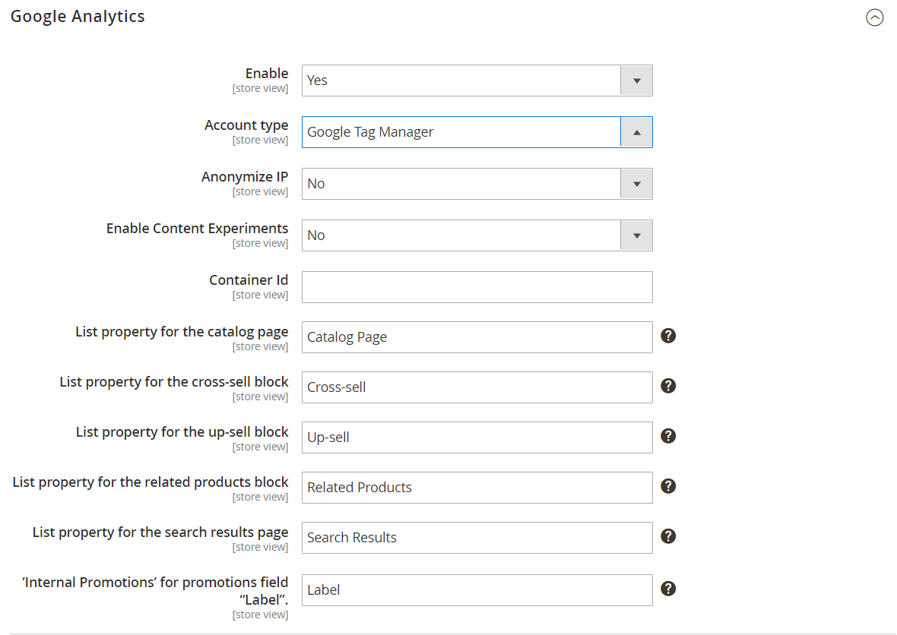

# [!UICONTROL Sales] > [!UICONTROL Google API]

{{config}}

## [!UICONTROL Google Analytics]

<!-- zoom -->

<!-- [Google Analytics](https://experienceleague.adobe.com/ja/docs/commerce-admin/marketing/google-tools/google-analytics) -->

| フィールド | [範囲](../../getting-started/websites-stores-views.md#scope-settings) | 説明 |
| ----- | ------------------------------------------ | ----------- |
| [!UICONTROL Enable] | ストアビュー | ストアの[!DNL Google Analytics]を有効にします。 オプション：`Yes` / `No` |
| [!UICONTROL Account Type] | ストアビュー |  （Adobe Commerceのみ）Google Analytics アカウントの種類に応じて設定オプションを指定します。 オプション：Universal Analytics （デフォルト） / Google Tag Manager |
| [!UICONTROL Account Number] | ストアビュー | [!DNL Google Analytics] アカウントの作成時に割り当てられたアカウント番号またはトラッキングコード。 |
| [!UICONTROL Anonymize IP] | ストアビュー | [!DNL Google Analytics]件の結果に表示されるIP アドレスから識別情報が削除されているかどうかを判断します。 |

{style="table-layout:auto"}

## [!UICONTROL Google Analytics - Google Tag Manager]

{{ee-feature}}

<!-- zoom -->

**[!UICONTROL Account Type]**&#x200B;が`Google Tag Manager`に設定されている場合、追加のフィールドが表示されます。

| フィールド | [範囲](../../getting-started/websites-stores-views.md#scope-settings) | 説明 |
| ----- | ------------------------------------------ | ----------- |
| [!UICONTROL Container ID] | ストアビュー | [!DNL Google Tag Manager] コンテナの一意のID。 この値は通常、`GTM-`で始まります。 このIDは[!DNL Google Tag Manager] アカウントにあります。 [!DNL Google Tag Manager]が既にインストールされ、ストア用に設定されている場合、コンテナ IDはこのフィールドに自動的に表示されます。 |
| [!UICONTROL List property for the catalog page] | ストアビュー | カタログページに関連付けられている[!DNL Google Tag Manager] プロパティを識別します。 デフォルト値：`Catalog Page` |
| [!UICONTROL List property for the cross-sell block] | ストアビュー | クロスセル ブロックに関連付けられている[!DNL Google Tag Manager] プロパティを識別します。 デフォルト値：`Cross-sell` |
| [!UICONTROL List property for the up-sell block] | ストアビュー | アップセルブロックに関連付けられている[!DNL Google Tag Manager] プロパティを識別します。 デフォルト値：`Up-sell` |
| [!UICONTROL List property for the related products block] | ストアビュー | 関連する製品ブロックに関連付けられている[!DNL Google Tag Manager] プロパティを識別します。 デフォルト値：`Related Products` |
| [!UICONTROL List property for the search results page] | ストアビュー | 検索結果ページに関連付けられている[!DNL Google Tag Manager] プロパティを識別します。 デフォルト値：`Search Results` |
| [!UICONTROL 'Internal Promotions' for promotions field "Label"] | ストアビュー | 内部プロモーションのラベルに関連付けられている[!DNL Google Tag Manager] プロパティを識別します。 デフォルト値：`Label` |

{style="table-layout:auto"}

## [!UICONTROL Google AdWords]

<!-- zoom -->

<!-- [Google AdWords](https://experienceleague.adobe.com/ja/docs/commerce-admin/marketing/google-tools/google-adwords) -->

| フィールド | [範囲](../../getting-started/websites-stores-views.md#scope-settings) | 説明 |
| ----- | ------------------------------------------ | ----------- |
| [!UICONTROL Enable] | ストアビュー | ストアのGoogle AdWordsを有効にします。 オプション：`Yes` / `No` |
| [!UICONTROL Conversion ID] | ストアビュー | Google AdWords アカウントのID。 |
| [!UICONTROL Conversion Language] | ストアビュー | AdWords コンバージョンに使用される言語。 オプション：`All available languages` |
| [!UICONTROL Conversion Format] | ストアビュー | コンバージョンページに表示される[!DNL Google Site Stats]通知の形式を決定します。 この通知は、訪問者の訪問を追跡するために使用されるCookieを訪問者に通知するページにリンクします。 この数値は、AdWords スクリプトの`google_conversion_format`変数に割り当てられます。 詳しくは、Google web サイトの[&#x200B; コンバージョントラッキングについて](https://support.google.com/google-ads/answer/1722022?hl=en)を参照してください。 オプション： **`1`**- 1行の通知を表示します。 **`2`** - （デフォルト） 2行の通知を表示します。 **`3`**– 顧客の通知を表示しません。 |
| [!UICONTROL Conversion Color] | ストアビュー | コンバージョンラベルの色を指定します。 [&#x200B; カラーピッカー](https://www.w3schools.com/colors/colors_picker.asp)を使用して、16進数値を選択します。 この16進数値は、AdWords スクリプトの`google_conversion_color`変数に割り当てられます。 例：ffffff `var google_conversion_color = "ffffff";` |
| [!UICONTROL Conversion Label] | ストアビュー | [!DNL Google Site Stats]通知と共に表示されるテキストラベル。 このテキスト文字列は、AdWords スクリプトの`~`変数に割り当てられます。 例えば、「お買い物ありがとうございます！」 |
| [!UICONTROL Conversion Value Type] | ストアビュー | 変換が発生するタイミングを決定するために使用される値のタイプを指定します。 オプション： **`Dynamic`**– 動的な注文金額に基づいてコンバージョンが発生したことを確認します。 **`Constant`** – 入力された値に基づいてコンバージョンが発生したことを確認します。 |
| [!UICONTROL Conversion Value] | ストアビュー | _[!UICONTROL Constant]_&#x200B;変換値タイプに使用される値を指定します。 |
| [!UICONTROL Send Order Currency] | ストアビュー | AdWordsでトランザクション固有の通貨コンバージョン値を有効にします（異なる基本通貨を使用するweb サイトの場合）。 |

{style="table-layout:auto"}

## [!UICONTROL Google GTag]

{{gtag-api-note}}

### [!UICONTROL Google Analytics4]

<!-- zoom -->

<!-- [Google Analytics4](https://experienceleague.adobe.com/ja/docs/commerce-admin/marketing/google-tools/google-analytics) -->

| フィールド | [範囲](../../getting-started/websites-stores-views.md#scope-settings) | 説明 |
| ----- | ------------------------------------------ | ----------- |
| [!UICONTROL Enable] | ストアビュー | ストアでGoogle Analytics 4を有効にします。 オプション：`Yes` / `No` |
| [!UICONTROL Account Type] | ストアビュー |  （Adobe Commerceのみ）Google Analytics アカウントの種類に応じて設定オプションを指定します。 オプション：`Google Analytics4` （既定値） / `Google Tag Manager` |
| [!UICONTROL Measurement ID] | ストアビュー | Google Analytics アカウントの作成時に割り当てられたアカウント番号（トラッキングコード）です。 |
| [!UICONTROL Anonymize IP] | ストアビュー | Google Analyticsの結果に表示されるIP アドレスから識別情報が削除されるかどうかを指定します。 |

{style="table-layout:auto"}

### [!UICONTROL Google Analytics4 - Google Tag Manager]

{{ee-feature}}

<!-- zoom -->

**[!UICONTROL Account Type]**&#x200B;が`Google Tag Manager`に設定されている場合、追加のフィールドが表示されます。

| フィールド | [範囲](../../getting-started/websites-stores-views.md#scope-settings) | 説明 |
| ----- | ------------------------------------------ | ----------- |
| [!UICONTROL Container Id] | ストアビュー | [!DNL Google Tag Manager] コンテナの一意のID。 この値は通常、`GTM-`で始まります。 このIDは、Google Tab Manager アカウントに含まれています。 [!DNL Google Tag Manager]が既にインストールされ、ストア用に設定されている場合、コンテナ IDはこのフィールドに自動的に表示されます。 |
| [!UICONTROL List property for the catalog page] | ストアビュー | カタログページに関連付けられている[!DNL Google Tag Manager] プロパティを識別します。 デフォルト値：`Catalog Page` |
| [!UICONTROL List property for the cross-sell block] | ストアビュー | クロスセル ブロックに関連付けられている[!DNL Google Tag Manager] プロパティを識別します。 デフォルト値：`Cross-sell` |
| [!UICONTROL List property for the up-sell block] | ストアビュー | アップセルブロックに関連付けられている[!DNL Google Tag Manager] プロパティを識別します。 デフォルト値：`Up-sell` |
| [!UICONTROL List property for the related products block] | ストアビュー | 関連する製品ブロックに関連付けられている[!DNL Google Tag Manager] プロパティを識別します。 デフォルト値：`Related Products` |
| [!UICONTROL List property for the search results page] | ストアビュー | 検索結果ページに関連付けられている[!DNL Google Tag Manager] プロパティを識別します。 デフォルト値：`Search Results` |
| [!UICONTROL 'Internal Promotions' for promotions field "Label"] | ストアビュー | 内部プロモーションのラベルに関連付けられている[!DNL Google Tag Manager] プロパティを識別します。 デフォルト値：`Label` |

{style="table-layout:auto"}

### [!UICONTROL Google AdWords]

<!-- zoom -->

<!-- -- Google AdWords](https://experienceleague.adobe.com/ja/docs/commerce-admin/marketing/google-tools/google-adwords) -->

| フィールド | [範囲](../../getting-started/websites-stores-views.md#scope-settings) | 説明 |
| ----- | ------------------------------------------ | ----------- |
| [!UICONTROL Enable] | ストアビュー | ストアのGoogle AdWordsを有効にします。 オプション：`Yes` / `No` |
| [!UICONTROL Conversion ID] | ストアビュー | Google AdWords アカウントのID。 |
| [!UICONTROL Conversion Language] | ストアビュー | AdWords コンバージョンに使用される言語。 オプション：すべての使用可能な言語 |
| [!UICONTROL Conversion Format] | ストアビュー | コンバージョンページに表示されるGoogle Site Stats通知の書式を指定します。 この通知は、訪問者の訪問を追跡するために使用されるCookieを訪問者に通知するページにリンクします。 この数値は、AdWords スクリプトの`google_conversion_format`変数に割り当てられます。 詳しくは、Google web サイトの[&#x200B; コンバージョントラッキングについて](https://support.google.com/google-ads/answer/1722022?hl=en)を参照してください。 オプション： **`1`**- 1行の通知を表示します。 **`2`** - （デフォルト） 2行の通知を表示します。 **`3`**– 顧客の通知を表示しません。 |
| [!UICONTROL Conversion Color] | ストアビュー | コンバージョンラベルの色を指定します。 [&#x200B; カラーピッカー](https://www.w3schools.com/colors/colors_picker.asp)を使用して、16進数値を選択します。 この16進数値は、AdWords スクリプトの`google_conversion_color`変数に割り当てられます。 例：ffffff `var google_conversion_color = "ffffff";` |
| [!UICONTROL Conversion Label] | ストアビュー | Google サイト統計の通知と共に表示されるテキストラベル。 このテキスト文字列は、AdWords スクリプトの`~`変数に割り当てられます。 例えば、「お買い物ありがとうございます！」 |
| [!UICONTROL Conversion Value Type] | ストアビュー | 変換が発生するタイミングを決定するために使用される値のタイプを指定します。 オプション： **`Dynamic`**– 動的な注文金額に基づいてコンバージョンが発生したことを確認します。 **`Constant`** – 入力された値に基づいてコンバージョンが発生したことを確認します。 |
| [!UICONTROL Conversion Value] | ストアビュー | _[!UICONTROL Constant]_&#x200B;変換値タイプに使用される値を指定します。 |
| [!UICONTROL Send Order Currency] | ストアビュー | AdWordsでトランザクション固有の通貨コンバージョン値を有効にします（異なる基本通貨を使用するweb サイトの場合）。 |

{style="table-layout:auto"}
