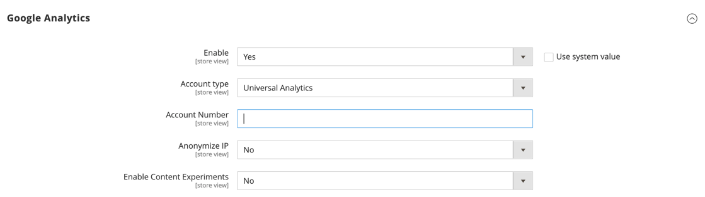

# [!UICONTROL Sales] > [!UICONTROL Google API]

{{config}}

## [!UICONTROL Google Analytics]

<!-- zoom -->

<!-- [Google Analytics](https://docs.magento.com/user-guide/marketing/google-universal-analytics.html) -->

| フィールド | [ 範囲 ](../../getting-started/websites-stores-views.md#scope-settings) | 説明 |
| ----- | ------------------------------------------ | ----------- |
| [!UICONTROL Enable] | ストア表示 | ストアの [!DNL Google Analytics] を有効にします。 オプション：`Yes` / `No` |
| [!UICONTROL Account Type] | ストア表示 |  （Adobe Commerceのみ）Google Analytics アカウントの種類に応じて設定オプションを決定します。 オプション：ユニバーサルアナリティクス（デフォルト）/Google Tag Manager |
| [!UICONTROL Account Number] | ストア表示 | [!DNL Google Analytics] アカウントの作成時に割り当てられたアカウント番号またはトラッキングコード。 |
| [!UICONTROL Anonymize IP] | ストア表示 | 結果に表示される IP アドレスから識別情報を削除するかどうかを決定 [!DNL Google Analytics] ます。 |
| [!UICONTROL Enable Content Experiments] | ストア表示 | [Google コンテンツ実験 ](https://support.google.com/analytics/answer/9366791?hl=en&amp;ref_topic=1745207) をアクティブ化します。この実験を使用して、同じページの異なるバージョン （最大 10 個）をテストできます。 オプション：`Yes` / `No` |

{style="table-layout:auto"}

## [!UICONTROL Google Analytics - Google Tag Manager]

{{ee-feature}}

<!-- zoom -->

**[!UICONTROL Account Type]** を `Google Tag Manager` に設定すると、追加のフィールドが表示されます。

| フィールド | [ 範囲 ](../../getting-started/websites-stores-views.md#scope-settings) | 説明 |
| ----- | ------------------------------------------ | ----------- |
| [!UICONTROL Container ID] | ストア表示 | [!DNL Google Tag Manager] コンテナの一意の ID。 通常、この値は `GTM-` で始まります。 この ID は [!DNL Google Tag Manager] アカウントに登録されています。 [!DNL Google Tag Manager] が既にストアにインストールされて設定されている場合は、このフィールドにコンテナ ID が自動的に表示されます。 |
| [!UICONTROL List property for the catalog page] | ストア表示 | カタログページに関連付けられた [!DNL Google Tag Manager] プロパティを識別します。 デフォルト値：`Catalog Page` |
| [!UICONTROL List property for the cross-sell block] | ストア表示 | クロスセル ブロックに関連付けられた [!DNL Google Tag Manager] プロパティを識別します。 デフォルト値：`Cross-sell` |
| [!UICONTROL List property for the up-sell block] | ストア表示 | アップセル ブロックに関連付けられた [!DNL Google Tag Manager] プロパティを識別します。 デフォルト値：`Up-sell` |
| [!UICONTROL List property for the related products block] | ストア表示 | 関連する製品ブロックに関連付けられている [!DNL Google Tag Manager] プロパティを識別します。 デフォルト値：`Related Products` |
| [!UICONTROL List property for the search results page] | ストア表示 | 検索結果ページに関連付けられた [!DNL Google Tag Manager] プロパティを識別します。 デフォルト値：`Search Results` |
| [!UICONTROL 'Internal Promotions' for promotions field "Label"] | ストア表示 | 内部プロモーションのラベルに関連付けられた [!DNL Google Tag Manager] プロパティを識別します。 デフォルト値：`Label` |

{style="table-layout:auto"}

## [!UICONTROL Google AdWords]

<!-- zoom -->

<!-- [Google AdWords](https://docs.magento.com/user-guide/marketing/google-adwords.html) -->

| フィールド | [ 範囲 ](../../getting-started/websites-stores-views.md#scope-settings) | 説明 |
| ----- | ------------------------------------------ | ----------- |
| [!UICONTROL Enable] | ストア表示 | ストアのGoogle AdWords を有効にします。 オプション：`Yes` / `No` |
| [!UICONTROL Conversion ID] | ストア表示 | Google AdWords アカウントの ID。 |
| [!UICONTROL Conversion Language] | ストア表示 | AdWords の変換に使用される言語です。 オプション：`All available languages` |
| [!UICONTROL Conversion Format] | ストア表示 | 変換ページに表示される [!DNL Google Site Stats] 通知の形式を決定します。 通知は、訪問の追跡に使用される Cookie について訪問者に通知するページにリンクしています。 この数値は、AdWords スクリプトの `google_conversion_format` 変数に割り当てられます。 詳しくは、Google web サイトの [ コンバージョントラッキングについて ](https://support.google.com/google-ads/answer/1722022?hl=en) を参照してください。 オプション： **`1`**- 1 行通知を表示します。 **`2`** - （デフォルト） 2 行の通知を表示します。  **`3`**– 顧客通知を表示しません。 |
| [!UICONTROL Conversion Color] | ストア表示 | 変換ラベルの色を決定します。 [ カラーピッカー ](https://www.w3schools.com/colors/colors_picker.asp) を使用して、16 進数値を選択します。 この 16 進数値は、AdWords スクリプトの `google_conversion_color` 変数に割り当てられます。 例：ffffff `var google_conversion_color = "ffffff";` |
| [!UICONTROL Conversion Label] | ストア表示 | [!DNL Google Site Stats] 通知と共に表示されるテキストラベル。 このテキスト文字列は、AdWords スクリプトの `~` 変数に割り当てられます。 例：「お買い物ありがとうございます。」 |
| [!UICONTROL Conversion Value Type] | ストア表示 | 変換を行うタイミングを決定するために使用する値のタイプを指定します。 オプション： **`Dynamic`**– 動的な注文金額に基づいてコンバージョンが発生したことを判断します。 **`Constant`** – 入力された値に基づいて、コンバージョンが発生したことを判別します。 |
| [!UICONTROL Conversion Value] | ストア表示 | コンバージョン値の _[!UICONTROL Constant]_イプに使用する値を指定します。 |
| [!UICONTROL Send Order Currency] | ストア表示 | （基本通貨の異なる Web サイト用に） AdWords でトランザクション固有の通貨換算値を有効にします。 |

{style="table-layout:auto"}

## [!UICONTROL Google GTag]

{{gtag-api-note}}

### [!UICONTROL Google Analytics4]

<!-- zoom -->

<!-- [Google Analytics4](https://docs.magento.com/user-guide/marketing/google-universal-analytics.html) -->

| フィールド | [ 範囲 ](../../getting-started/websites-stores-views.md#scope-settings) | 説明 |
| ----- | ------------------------------------------ | ----------- |
| [!UICONTROL Enable] | ストア表示 | ストアのGoogle Analytics 4 を有効にします。 オプション：`Yes` / `No` |
| [!UICONTROL Account Type] | ストア表示 |  （Adobe Commerceのみ）Google Analytics アカウントの種類に応じて設定オプションを決定します。 オプション：`Google Analytics4` （デフォルト）/`Google Tag Manager` |
| [!UICONTROL Measurement ID] | ストア表示 | Google Analytics アカウントの作成時に割り当てられたアカウント番号またはトラッキングコード。 |
| [!UICONTROL Anonymize IP] | ストア表示 | Google Analyticsの結果に表示される IP アドレスから識別情報を削除するかどうかを指定します。 |
| [!UICONTROL Enable Content Experiments] | ストア表示 | [Google コンテンツ実験 ](https://support.google.com/analytics/answer/9366791?hl=en&amp;ref_topic=1745207) をアクティブ化します。この実験を使用して、同じページの異なるバージョン （最大 10 個）をテストできます。 オプション：`Yes` / `No` |

{style="table-layout:auto"}

### [!UICONTROL Google Analytics4 - Google Tag Manager]

{{ee-feature}}

<!-- zoom -->

**[!UICONTROL Account Type]** を `Google Tag Manager` に設定すると、追加のフィールドが表示されます。

| フィールド | [ 範囲 ](../../getting-started/websites-stores-views.md#scope-settings) | 説明 |
| ----- | ------------------------------------------ | ----------- |
| [!UICONTROL Container Id] | ストア表示 | [!DNL Google Tag Manager] コンテナの一意の ID。 通常、この値は `GTM-` で始まります。 この ID はGoogle Tab Manager アカウントに含まれています。 [!DNL Google Tag Manager] が既にストアにインストールされて設定されている場合は、このフィールドにコンテナ ID が自動的に表示されます。 |
| [!UICONTROL List property for the catalog page] | ストア表示 | カタログページに関連付けられた [!DNL Google Tag Manager] プロパティを識別します。 デフォルト値：`Catalog Page` |
| [!UICONTROL List property for the cross-sell block] | ストア表示 | クロスセル ブロックに関連付けられた [!DNL Google Tag Manager] プロパティを識別します。 デフォルト値：`Cross-sell` |
| [!UICONTROL List property for the up-sell block] | ストア表示 | アップセル ブロックに関連付けられた [!DNL Google Tag Manager] プロパティを識別します。 デフォルト値：`Up-sell` |
| [!UICONTROL List property for the related products block] | ストア表示 | 関連する製品ブロックに関連付けられている [!DNL Google Tag Manager] プロパティを識別します。 デフォルト値：`Related Products` |
| [!UICONTROL List property for the search results page] | ストア表示 | 検索結果ページに関連付けられた [!DNL Google Tag Manager] プロパティを識別します。 デフォルト値：`Search Results` |
| [!UICONTROL 'Internal Promotions' for promotions field "Label"] | ストア表示 | 内部プロモーションのラベルに関連付けられた [!DNL Google Tag Manager] プロパティを識別します。 デフォルト値：`Label` |

{style="table-layout:auto"}

### [!UICONTROL Google AdWords]

<!-- zoom -->

<!-- -- Google AdWords](https://docs.magento.com/user-guide/marketing/google-adwords.html) -->

| フィールド | [ 範囲 ](../../getting-started/websites-stores-views.md#scope-settings) | 説明 |
| ----- | ------------------------------------------ | ----------- |
| [!UICONTROL Enable] | ストア表示 | ストアのGoogle AdWords を有効にします。 オプション：`Yes` / `No` |
| [!UICONTROL Conversion ID] | ストア表示 | Google AdWords アカウントの ID。 |
| [!UICONTROL Conversion Language] | ストア表示 | AdWords の変換に使用される言語です。 オプション：使用可能なすべての言語 |
| [!UICONTROL Conversion Format] | ストア表示 | コンバージョンページに表示されるGoogle サイトの統計情報に関する通知の形式を指定します。 通知は、訪問の追跡に使用される Cookie について訪問者に通知するページにリンクしています。 この数値は、AdWords スクリプトの `google_conversion_format` 変数に割り当てられます。 詳しくは、Google web サイトの [ コンバージョントラッキングについて ](https://support.google.com/google-ads/answer/1722022?hl=en) を参照してください。 オプション： **`1`**- 1 行通知を表示します。 **`2`** - （デフォルト） 2 行の通知を表示します。  **`3`**– 顧客通知を表示しません。 |
| [!UICONTROL Conversion Color] | ストア表示 | 変換ラベルの色を決定します。 [ カラーピッカー ](https://www.w3schools.com/colors/colors_picker.asp) を使用して、16 進数値を選択します。 この 16 進数値は、AdWords スクリプトの `google_conversion_color` 変数に割り当てられます。 例：ffffff `var google_conversion_color = "ffffff";` |
| [!UICONTROL Conversion Label] | ストア表示 | Google サイト統計の通知と共に表示されるテキストラベルです。 このテキスト文字列は、AdWords スクリプトの `~` 変数に割り当てられます。 例：「お買い物ありがとうございます。」 |
| [!UICONTROL Conversion Value Type] | ストア表示 | 変換を行うタイミングを決定するために使用する値のタイプを指定します。 オプション： **`Dynamic`**– 動的な注文金額に基づいてコンバージョンが発生したことを判断します。 **`Constant`** – 入力された値に基づいて、コンバージョンが発生したことを判別します。 |
| [!UICONTROL Conversion Value] | ストア表示 | コンバージョン値の _[!UICONTROL Constant]_イプに使用する値を指定します。 |
| [!UICONTROL Send Order Currency] | ストア表示 | （基本通貨の異なる Web サイト用に） AdWords でトランザクション固有の通貨換算値を有効にします。 |

{style="table-layout:auto"}
