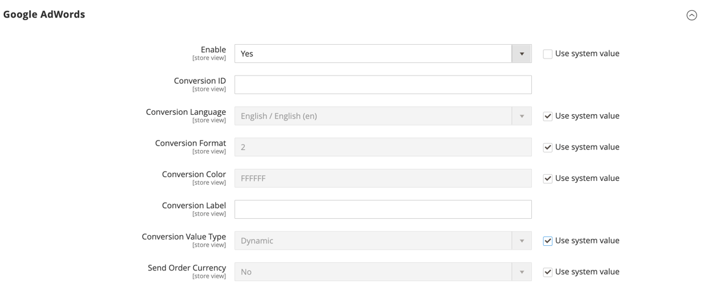
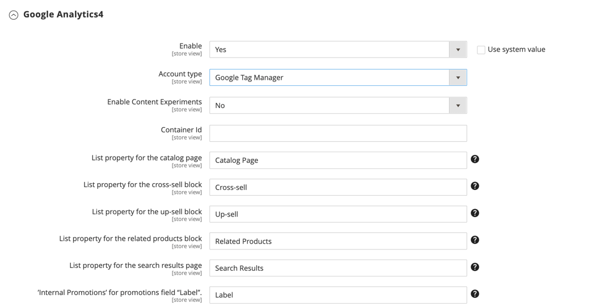

# [!UICONTROL Sales] > [!UICONTROL Google API]

{{config}}

## [!UICONTROL Google Analytics]

<!-- zoom -->

<!-- [Google Analytics](https://docs.magento.com/user-guide/marketing/google-universal-analytics.html) -->

| フィールド | [範囲](../../getting-started/websites-stores-views.md#scope-settings) | 説明 |
| ----- | ------------------------------------------ | ----------- |
| [!UICONTROL Enable] | ストア表示 | 有効 [!DNL Google Analytics] お客様のストアの。 オプション： `Yes` / `No` |
| [!UICONTROL Account Type] | ストア表示 |  (Adobe Commerceのみ ) 設定アカウントのタイプに応じて、Google Analyticsオプションを決定します。 オプション： Universal Analytics（デフォルト）/Google Tag Manager |
| [!UICONTROL Account Number] | ストア表示 | 作成時に割り当てられたアカウント番号（トラッキングコード） [!DNL Google Analytics] アカウント。 |
| [!UICONTROL Anonymize IP] | ストア表示 | 次に示す IP アドレスから識別情報が削除されるかどうかを指定します。 [!DNL Google Analytics] 結果。 |
| [!UICONTROL Enable Content Experiments] | ストア表示 | 有効化 [Google Content Experiment](https://support.google.com/analytics/answer/9366791?hl=en&amp;ref_topic=1745207)：同じページの最大 10 の異なるバージョンをテストするために使用できます。 オプション： `Yes` / `No` |

{style="table-layout:auto"}

## [!UICONTROL Google Analytics - Google Tag Manager]

{{ee-feature}}

<!-- zoom -->

条件 **[!UICONTROL Account Type]** が `Google Tag Manager`、追加のフィールドが表示されます。

| フィールド | [範囲](../../getting-started/websites-stores-views.md#scope-settings) | 説明 |
| ----- | ------------------------------------------ | ----------- |
| [!UICONTROL Container ID] | ストア表示 | の一意の ID [!DNL Google Tag Manager] コンテナ。 この値は通常、 `GTM-`. この ID は、 [!DNL Google Tag Manager] アカウント。 次の場合 [!DNL Google Tag Manager] が既にインストールされ、お使いのストア用に設定されている場合は、コンテナ ID がこのフィールドに自動的に表示されます。 |
| [!UICONTROL List property for the catalog page] | ストア表示 | を識別します。 [!DNL Google Tag Manager] プロパティを追加します。 デフォルト値： `Catalog Page` |
| [!UICONTROL List property for the cross-sell block] | ストア表示 | を識別します。 [!DNL Google Tag Manager] クロス販売ブロックに関連付けられたプロパティ。 デフォルト値： `Cross-sell` |
| [!UICONTROL List property for the up-sell block] | ストア表示 | を識別します。 [!DNL Google Tag Manager] アップセルブロックに関連付けられたプロパティ。 デフォルト値： `Up-sell` |
| [!UICONTROL List property for the related products block] | ストア表示 | を識別します。 [!DNL Google Tag Manager] 関連する products ブロックに関連付けられたプロパティ。 デフォルト値： `Related Products` |
| [!UICONTROL List property for the search results page] | ストア表示 | を識別します。 [!DNL Google Tag Manager] プロパティを検索結果ページに関連付けました。 デフォルト値： `Search Results` |
| [!UICONTROL 'Internal Promotions' for promotions field "Label"] | ストア表示 | を識別します。 [!DNL Google Tag Manager] 内部プロモーションのラベルに関連付けられたプロパティ。 デフォルト値： `Label` |

{style="table-layout:auto"}

## [!UICONTROL Google AdWords]

<!-- zoom -->

<!-- [Google AdWords](https://docs.magento.com/user-guide/marketing/google-adwords.html) -->

| フィールド | [範囲](../../getting-started/websites-stores-views.md#scope-settings) | 説明 |
| ----- | ------------------------------------------ | ----------- |
| [!UICONTROL Enable] | ストア表示 | ストアのGoogle AdWords を有効にします。 オプション： `Yes` / `No` |
| [!UICONTROL Conversion ID] | ストア表示 | Google AdWords アカウントの ID。 |
| [!UICONTROL Conversion Language] | ストア表示 | AdWords のコンバージョンに使用される言語です。 オプション： `All available languages` |
| [!UICONTROL Conversion Format] | ストア表示 | の形式を決定します。 [!DNL Google Site Stats] 通知がコンバージョンページに表示される問題を修正しました。 訪問者の訪問の追跡に使用された cookie について訪問者に通知するページへのリンク。 この数値は `google_conversion_format` 変数を使用して、AdWords スクリプト内で設定します。 詳しくは、 [コンバージョントラッキングについて](https://support.google.com/google-ads/answer/1722022?hl=en) をGoogleの Web サイトに貼り付けます。 オプション：  **`1`**- 1 行の通知を表示します。 **`2`** - （デフォルト）2 行の通知を表示します。  **`3`**— 顧客通知を表示しません。 |
| [!UICONTROL Conversion Color] | ストア表示 | 変換ラベルの色を決定します。 の使用 [カラーピッカー](https://www.w3schools.com/colors/colors_picker.asp) をクリックして、16 進数値を選択します。 この 16 進値は、 `google_conversion_color` 変数を使用して、AdWords スクリプト内で設定します。 例： fffffff  `var google_conversion_color = "ffffff";` |
| [!UICONTROL Conversion Label] | ストア表示 | 表示されるテキストラベル [!DNL Google Site Stats] 通知。 このテキスト文字列は `~` 変数を使用して、AdWords スクリプト内で設定します。 例：「ご購入ありがとうございました。」 |
| [!UICONTROL Conversion Value Type] | ストア表示 | 変換がいつおこなわれるかを判断するために使用される値のタイプを指定します。 オプション：  **`Dynamic`**— 動的な注文額に基づいてコンバージョンが発生したかどうかを判断します。 **`Constant`**  — 入力された値に基づいてコンバージョンが発生したかどうかを判断します。 |
| [!UICONTROL Conversion Value] | ストア表示 | に使用する値を指定します。 _[!UICONTROL Constant]_コンバージョン値のタイプ。 |
| [!UICONTROL Send Order Currency] | ストア表示 | AdWords でトランザクション固有の通貨換算値を有効にします（異なる基本通貨を持つ Web サイトの場合）。 |

{style="table-layout:auto"}

## [!UICONTROL Google GTag]

{{gtag-api-note}}

### [!UICONTROL Google Analytics4]

<!-- zoom -->

<!-- [Google Analytics4](https://docs.magento.com/user-guide/marketing/google-universal-analytics.html) -->

| フィールド | [範囲](../../getting-started/websites-stores-views.md#scope-settings) | 説明 |
| ----- | ------------------------------------------ | ----------- |
| [!UICONTROL Enable] | ストア表示 | ストアのGoogle Analytics4 を有効にします。 オプション： `Yes` / `No` |
| [!UICONTROL Account Type] | ストア表示 |  (Adobe Commerceのみ ) 設定アカウントのタイプに応じて、Google Analyticsオプションを決定します。 オプション： `Google Analytics4` （デフォルト） / `Google Tag Manager` |
| [!UICONTROL Measurement ID] | ストア表示 | Accounts アカウントの作成時に割り当てられたアカウント番号 (Google Analyticsコード )。 |
| [!UICONTROL Anonymize IP] | ストア表示 | [Google Analytics] の結果に表示される IP アドレスから識別情報を削除するかどうかを指定します。 |
| [!UICONTROL Enable Content Experiments] | ストア表示 | 有効化 [Google Content Experiment](https://support.google.com/analytics/answer/9366791?hl=en&amp;ref_topic=1745207)：同じページの最大 10 の異なるバージョンをテストするために使用できます。 オプション： `Yes` / `No` |

{style="table-layout:auto"}

### [!UICONTROL Google Analytics4 - Google Tag Manager]

{{ee-feature}}

<!-- zoom -->

条件 **[!UICONTROL Account Type]** が `Google Tag Manager`、追加のフィールドが表示されます。

| フィールド | [範囲](../../getting-started/websites-stores-views.md#scope-settings) | 説明 |
| ----- | ------------------------------------------ | ----------- |
| [!UICONTROL Container Id] | ストア表示 | の一意の ID [!DNL Google Tag Manager] コンテナ。 この値は通常、 `GTM-`. この ID はGoogle Tab Manager アカウントにあります。 次の場合 [!DNL Google Tag Manager] が既にインストールされ、お使いのストア用に設定されている場合は、コンテナ ID がこのフィールドに自動的に表示されます。 |
| [!UICONTROL List property for the catalog page] | ストア表示 | を識別します。 [!DNL Google Tag Manager] プロパティを追加します。 デフォルト値： `Catalog Page` |
| [!UICONTROL List property for the cross-sell block] | ストア表示 | を識別します。 [!DNL Google Tag Manager] クロス販売ブロックに関連付けられたプロパティ。 デフォルト値： `Cross-sell` |
| [!UICONTROL List property for the up-sell block] | ストア表示 | を識別します。 [!DNL Google Tag Manager] アップセルブロックに関連付けられたプロパティ。 デフォルト値： `Up-sell` |
| [!UICONTROL List property for the related products block] | ストア表示 | を識別します。 [!DNL Google Tag Manager] 関連する products ブロックに関連付けられたプロパティ。 デフォルト値： `Related Products` |
| [!UICONTROL List property for the search results page] | ストア表示 | を識別します。 [!DNL Google Tag Manager] プロパティを検索結果ページに関連付けました。 デフォルト値： `Search Results` |
| [!UICONTROL 'Internal Promotions' for promotions field "Label"] | ストア表示 | を識別します。 [!DNL Google Tag Manager] 内部プロモーションのラベルに関連付けられたプロパティ。 デフォルト値： `Label` |

{style="table-layout:auto"}

### [!UICONTROL Google AdWords]

<!-- zoom -->

<!-- -- Google AdWords](https://docs.magento.com/user-guide/marketing/google-adwords.html) -->

| フィールド | [範囲](../../getting-started/websites-stores-views.md#scope-settings) | 説明 |
| ----- | ------------------------------------------ | ----------- |
| [!UICONTROL Enable] | ストア表示 | ストアのGoogle AdWords を有効にします。 オプション： `Yes` / `No` |
| [!UICONTROL Conversion ID] | ストア表示 | Google AdWords アカウントの ID。 |
| [!UICONTROL Conversion Language] | ストア表示 | AdWords のコンバージョンに使用される言語です。 オプション：使用可能なすべての言語 |
| [!UICONTROL Conversion Format] | ストア表示 | コンバージョンページに表示されるGoogle Site Stats 通知の形式を決定します。 訪問者の訪問の追跡に使用された cookie について訪問者に通知するページへのリンク。 この数値は `google_conversion_format` 変数を使用して、AdWords スクリプト内で設定します。 詳しくは、 [コンバージョントラッキングについて](https://support.google.com/google-ads/answer/1722022?hl=en) をGoogleの Web サイトに貼り付けます。 オプション：  **`1`**- 1 行の通知を表示します。 **`2`** - （デフォルト）2 行の通知を表示します。  **`3`**— 顧客通知を表示しません。 |
| [!UICONTROL Conversion Color] | ストア表示 | 変換ラベルの色を決定します。 の使用 [カラーピッカー](https://www.w3schools.com/colors/colors_picker.asp) をクリックして、16 進数値を選択します。 この 16 進値は、 `google_conversion_color` 変数を使用して、AdWords スクリプト内で設定します。 例： fffffff  `var google_conversion_color = "ffffff";` |
| [!UICONTROL Conversion Label] | ストア表示 | Googleサイト統計の通知と共に表示されるテキストラベル。 このテキスト文字列は `~` 変数を使用して、AdWords スクリプト内で設定します。 例：「ご購入ありがとうございました。」 |
| [!UICONTROL Conversion Value Type] | ストア表示 | 変換がいつおこなわれるかを判断するために使用される値のタイプを指定します。 オプション：  **`Dynamic`**— 動的な注文額に基づいてコンバージョンが発生したかどうかを判断します。 **`Constant`**  — 入力された値に基づいてコンバージョンが発生したかどうかを判断します。 |
| [!UICONTROL Conversion Value] | ストア表示 | に使用する値を指定します。 _[!UICONTROL Constant]_コンバージョン値のタイプ。 |
| [!UICONTROL Send Order Currency] | ストア表示 | AdWords でトランザクション固有の通貨換算値を有効にします（異なる基本通貨を持つ Web サイトの場合）。 |

{style="table-layout:auto"}
