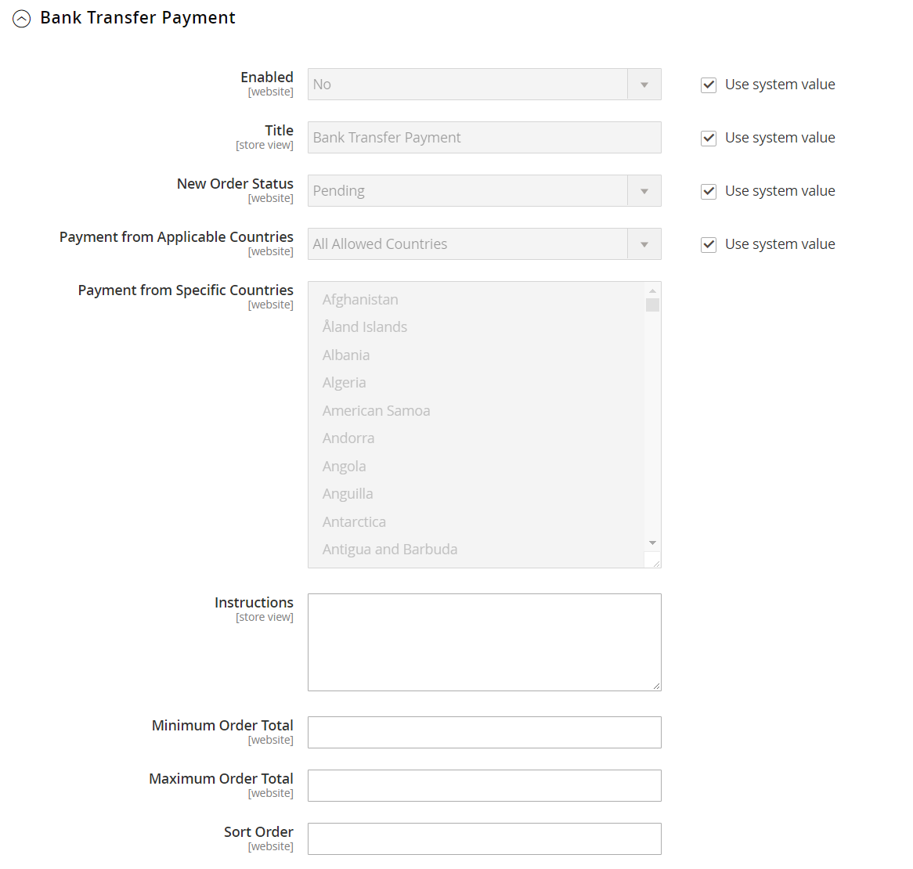
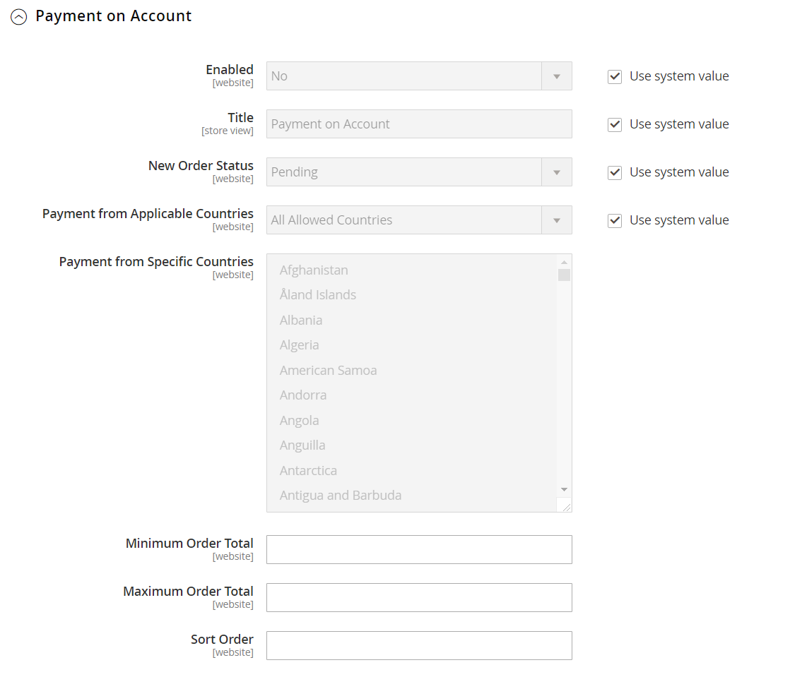

# [!UICONTROL Sales] > [!UICONTROL Payment Methods]

>[!TIP]
>
>Adobe CommerceおよびMagento Open Sourceの決済サービスでは、サンドボックステストやシンプルな設定など、ターンキー型のセルフサービスソリューションを提供し、堅牢で安全な決済処理を実現します。 この強力なツールセットと、購入者に最適なエクスペリエンスを構築するために必要なinsightとコントロールを提供する方法について詳しくは、[_決済サービスユーザーガイド_](https://experienceleague.adobe.com/docs/commerce/payment-services/guide-overview.html)を参照してください。

{{config}}

## [!UICONTROL Merchant Location]

[!BADGE PaaSのみ]{type=Informative url="https://experienceleague.adobe.com/en/docs/commerce/user-guides/product-solutions" tooltip="Adobe Commerce on Cloud プロジェクト（Adobeで管理されるPaaS インフラストラクチャ）とオンプレミス プロジェクトにのみ適用されます。"}

<!-- zoom -->

<!-- [Merchant Location](https://experienceleague.adobe.com/en/docs/commerce-admin/start/setup/store-details#merchant-location) -->

| フィールド | [範囲](../../getting-started/websites-stores-views.md#scope-settings) | 説明 |
|--- |--- |--- |
| [!UICONTROL Merchant Country] | web サイト | 加盟店が事業を行うために登録されている国を示します。 |

{style="table-layout:auto"}

## 推奨ソリューション

以下の支払いソリューションは、PayPal アカウントまたはクレジットカードによるオンライン支払いを受け入れ始めたばかりのマーチャントにとって簡単な方法として推奨されています。 ビジネスが成長するにつれ、これらを追加のPayPal支払いソリューションと組み合わせることができます。

- [決済サービス](payment-services.md)
- [!BADGE PaaSのみ]{type=Informative url="https://experienceleague.adobe.com/en/docs/commerce/user-guides/product-solutions" tooltip="Adobe Commerce on Cloud プロジェクト（Adobeで管理されるPaaS インフラストラクチャ）とオンプレミス プロジェクトにのみ適用されます。"} [PayPal Express チェックアウト &#x200B;](paypal-express-checkout.md)
- [!BADGE PaaSのみ]{type=Informative url="https://experienceleague.adobe.com/en/docs/commerce/user-guides/product-solutions" tooltip="Adobe Commerce on Cloud プロジェクト（Adobeで管理されるPaaS インフラストラクチャ）とオンプレミス プロジェクトにのみ適用されます。"} [Braintree](braintree.md)

>[!NOTE]
>
>一部の支払い統合機能とバンドルされた拡張機能は、2.4.x リリースで削除され、Commerce Marketplaceに移行されました。最新の公式な支払い統合拡張機能は、[Commerce Marketplace](https://marketplace.magento.com/extensions/payments-security.html){:target="_blank"}で確認できます。
> >**Amazon Pay**&#x200B;および&#x200B;**Klarna**: Adobe CommerceおよびMagento Open Source リリース 2.4.0 ～ 2.4.3には、これらのベンダーが開発した拡張機能が含まれています。2.4.4 リリース以降、これらの拡張機能はコアリリースにバンドルされなくなり、Commerce Marketplaceからインストールして更新する必要があります。Marketplaceでは、拡張機能の開発者が提供する最新のドキュメントにもアクセスできます。
> >これらのバンドル拡張機能のいずれかを有効にして設定している場合は、2.4.4 アップグレードプロセスの一環として`composer.json` ファイルを更新し、拡張機能の更新を今後も管理する必要があります。詳しくは、_アップグレードガイド_&#x200B;の[&#x200B; アップグレードモジュール &#x200B;](https://experienceleague.adobe.com/docs/commerce-operations/upgrade-guide/modules/upgrade.html)を参照してください。 
> >**Worldpay**、**Eway**、**CyberSource**、**Authorize.Net**：これらの支払い統合から安全に移行する方法について詳しくは、[開発ブログ &#x200B;](https://community.magento.com/t5/Magento-DevBlog/Deprecation-of-Magento-core-payment-integrations/ba-p/426445){:target="_blank"}を参照してください。

## その他のPayPal方式

[!BADGE PaaSのみ]{type=Informative url="https://experienceleague.adobe.com/en/docs/commerce/user-guides/product-solutions" tooltip="Adobe Commerce on Cloud プロジェクト（Adobeで管理されるPaaS インフラストラクチャ）とオンプレミス プロジェクトにのみ適用されます。"}

PayPalは、あらゆる規模の企業のニーズを満たし、世界中でビジネスを行っている様々な支払いソリューションを提供しています。 PayPalは、主要なデビットカードやクレジットカードからの支払いを受け付ける機能を提供しています。 PayPal アカウントをお持ちでない顧客でもPayPalで購入した分を支払うことができるため、PayPalは特別な労力を必要とせずに利便性を向上させます。

### PayPal オールインワン方式

[!BADGE PaaSのみ]{type=Informative url="https://experienceleague.adobe.com/en/docs/commerce/user-guides/product-solutions" tooltip="Adobe Commerce on Cloud プロジェクト（Adobeで管理されるPaaS インフラストラクチャ）とオンプレミス プロジェクトにのみ適用されます。"}

- [PayPal Payment Advanced](paypal-payments-advanced.md)
- [PayPal Payments Pro](paypal-payments-pro.md)
- [PayPal Payments Standard](paypal-payments-standard.md)

### PayPal支払いゲートウェイ

[!BADGE PaaSのみ]{type=Informative url="https://experienceleague.adobe.com/en/docs/commerce/user-guides/product-solutions" tooltip="Adobe Commerce on Cloud プロジェクト（Adobeで管理されるPaaS インフラストラクチャ）とオンプレミス プロジェクトにのみ適用されます。"}

- [PayPal Payflow Pro](paypal-payflow-pro.md) （Express チェックアウトを含む）
- [PayPal Payflow Link](paypal-payflow-link.md) （Express Checkoutを含む）

## 基本的な支払い方法

以下の支払い方法はCommerceに組み込まれており、サードパーティの支払いプロバイダーを使用して取引を処理することはありません。 基本的な支払い方法の多くは、オンラインではなくオフラインで管理されます。

### [!UICONTROL Check / Money Order]

<!-- zoom -->

<!-- [Check / Money Order](https://experienceleague.adobe.com/en/docs/commerce-admin/stores-sales/payments/offline/check-money-order) -->

| フィールド | [範囲](../../getting-started/websites-stores-views.md#scope-settings) | 説明 |
|--- |--- |--- |
| [!UICONTROL Enabled] | web サイト | 顧客が小切手またはマネーオーダーで支払えるかどうかを決定します。 オプション：`Yes` / `No` |
| [!UICONTROL Title] | ストアビュー | チェックアウト時に顧客に表示されるこの支払い方法の名前。 |
| [!UICONTROL New Order Status] | web サイト | 小切手またはマネーオーダーで支払われた注文に割り当てられる最初の[注文状況](../../stores-purchase/order-status.md)を決定します。 デフォルト値：`Pending` |
| [!UICONTROL Payment from Applicable Countries] | web サイト | 小切手またはマネーオーダーで支払いを受け入れる国を指定します。 オプション：`All Allowed Countries` / `Specific Countries` |
| [!UICONTROL Payment from Specific Countries] | web サイト | 小切手またはマネーオーダーで支払いを受け入れる特定の国を指定します。 |
| [!UICONTROL Make Check Payable to] | ストアビュー | 小切手や為替を支払うべき法人の名称。 |
| [!UICONTROL Send Check to] | ストアビュー | 小切手やマネーオーダーを送るべき住所または私書箱。 |
| [!UICONTROL Minimum Order Total] | web サイト | 小切手またはマネーオーダーで支払うことができる最小の注文金額。 |
| [!UICONTROL Maximum Order Total] | web サイト | 小切手またはマネーオーダーで支払うことができる最大の注文金額。   **_Note:_**&#x200B;注文は、合計が最小注文合計または最大注文合計の間にあるか、一致しているかを条件とします。 |
| [!UICONTROL Sort Order] | web サイト | チェックアウト時に他の支払い方法と一緒に表示される場合、小切手または為替による支払いの順序を決定する番号が表示されます。 `0`と入力して、リストの最上部に配置します。 |

{style="table-layout:auto"}

### [!UICONTROL Bank Transfer Payment]

<!-- zoom -->

<!-- [Bank Transfer Payment](https://experienceleague.adobe.com/en/docs/commerce-admin/stores-sales/payments/offline/bank-transfer) -->

| フィールド | [範囲](../../getting-started/websites-stores-views.md#scope-settings) | 説明 |
|--- |--- |--- |
| [!UICONTROL Enabled] | web サイト | 顧客が銀行から加盟店アカウントに直接支払いを転送して、支払いできるかどうかを判断します。 オプション：`Yes` / `No` |
| [!UICONTROL Title] | ストアビュー | チェックアウト時に顧客に表示されるこの支払い方法の名前。 |
| [!UICONTROL New Order Status] | web サイト | 銀行振込で支払われた注文に割り当てられた初期注文状況を決定します。 デフォルト値：`Pending` |
| [!UICONTROL Payment from Applicable Countries] | web サイト | 銀行振込による支払いを受け入れる国を指定します。 オプション：`All Allowed Countries` / `Specific Countries` |
| [!UICONTROL Payment from Specific Countries] | web サイト | 銀行振込による支払いを受け入れる特定の国を指定します。 |
| [!UICONTROL Minimum Order Total] | web サイト | 銀行振込で支払える最小の注文金額。 |
| [!UICONTROL Maximum Order Total] | web サイト | 銀行振込で支払える最大の注文金額。   **_Note:_**&#x200B;注文は、合計が最小注文合計または最大注文合計の間にあるか、一致しているかを条件とします。 |
| [!UICONTROL Sort Order] | web サイト | 銀行振込による支払いの順序を決定する番号は、チェックアウト時に他の支払い方法と一緒に表示されるときに表示されます。 `0`と入力して、リストの最上部に配置します。 |

{style="table-layout:auto"}

### [!UICONTROL Payment on Account]

{{b2b-feature}}

<!-- zoom -->

<!-- [Payment on Account](https://experienceleague.adobe.com/en/docs/commerce-admin/b2b/enable-basic-features#configure-payment-on-account) -->

| フィールド | [範囲](../../getting-started/websites-stores-views.md#scope-settings) | 説明 |
|--- |--- |--- |
| [!UICONTROL Enabled] | web サイト | 企業が会社のクレジットを使用して購入できるかどうかを決定します。 オプション：`Yes` / `No` |
| [!UICONTROL Title] | ストアビュー | チェックアウト時に顧客に表示されるこの支払い方法の名前。 |
| [!UICONTROL New Order Status] | web サイト | 会社アカウントに請求された新しい注文のステータスを決定します。 オプション：`Pending (default)` / `Processing` / `Suspected Fraud` |
| [!UICONTROL Payment from Applicable Countries] | web サイト | 企業がアカウントに購入を請求できる国を指定します。 オプション：`All Allowed Countries` / `Specific Countries` |
| [!UICONTROL Payment from Specific Countries] | web サイト | 企業がアカウントに購入を請求できる特定の国を指定します。 |
| [!UICONTROL Minimum Order Total] | web サイト | 会社アカウントに請求できる最小の注文金額を指定します。 |
| [!UICONTROL Maximum Order Total] | web サイト | 会社のアカウントに請求できる最大の注文金額。   **_Note:_**&#x200B;注文は、合計が最小注文合計または最大注文合計の間にあるか、一致しているかを条件とします。 |
| [!UICONTROL Sort Order] | web サイト | チェックアウト時に他の支払い方法と一緒に表示される場合、アカウントでの支払いの順序を決定する番号。 `0`と入力して、リストの最上部に配置します。 |

{style="table-layout:auto"}

>[!NOTE]
>
>アカウントでの支払いは、[複数の配送先住所](../../stores-purchase/shipping-settings.md#multiple-addresses)を持つ注文ではサポートされておらず、支払いオプションには表示されません。

### [!UICONTROL Cash On Delivery Payment]

<!-- zoom -->

<!-- [Cash On Delivery Payment](../../stores-purchase/cash-on-delivery.html) -->

| フィールド | [範囲](../../getting-started/websites-stores-views.md#scope-settings) | 説明 |
|--- |--- |--- |
| [!UICONTROL Enabled] | web サイト | 顧客が銀行から加盟店アカウントに直接支払いを転送して、支払いできるかどうかを判断します。 オプション：`Yes` / `No` |
| [!UICONTROL Title] | ストアビュー | チェックアウト時に顧客に表示されるこの支払い方法の名前。 |
| [!UICONTROL New Order Status] | web サイト | 銀行振込で支払われた注文に割り当てられた初期注文状況を決定します。 デフォルト値：`Pending` |
| [!UICONTROL Payment from Applicable Countries] | web サイト | 銀行振込による支払いを受け入れる国を指定します。 オプション：`All Allowed Countries` / `Specific Countries` |
| [!UICONTROL Payment from Specific Countries] | web サイト | 銀行振込による支払いを受け入れる特定の国を指定します。 |
| [!UICONTROL Minimum Order Total] | web サイト | 銀行振込で支払える最小の注文金額を指定します。 |
| [!UICONTROL Maximum Order Total] | web サイト | 銀行振込で支払える最大の注文金額。   **_Note:_**&#x200B;注文は、合計が最小注文合計または最大注文合計の間にあるか、一致しているかを条件とします。 |
| [!UICONTROL Sort Order] | web サイト | 銀行振込による支払いの順序を決定する番号は、チェックアウト時に他の支払い方法と一緒に表示されるときに表示されます。 `0`と入力して、リストの最上部に配置します。 |

{style="table-layout:auto"}

### [!UICONTROL Zero Subtotal Checkout]

<!-- zoom -->

<!-- [Zero Subtotal Checkout](../../stores-purchase/zero-subtotal-checkout.html) -->

| フィールド | [範囲](../../getting-started/websites-stores-views.md#scope-settings) | 説明 |
|--- |--- |--- |
| [!UICONTROL Title] | ストアビュー | チェックアウト時にこの支払い方法に使用される名前。 デフォルト値：支払い情報は必要ありません |
| [!UICONTROL Enabled] | web サイト | 小計がゼロの注文を管理するために、ストア管理者が小計がゼロの注文を管理できるかどうかを決定します。例えば、税金が課せられているもので、割引によって金額がゼロに減りました。 オプション：`Yes` / `No` |
| [!UICONTROL New Order Status] | web サイト | ゼロ小計チェックアウトとして処理された注文に割り当てられる最初の注文ステータスを決定します。 デフォルト値：`Pending` |
| [!UICONTROL Payment from Applicable Countries] | web サイト | 小計ゼロ チェックアウトを適用できる国を指定します。 オプション：`All Allowed Countries` / `Specific Countries` |
| [!UICONTROL Payment from Specific Countries] | web サイト | ゼロ小計チェックアウトを適用できる特定の国を指定します。 |
| [!UICONTROL Sort Order] | web サイト | チェックアウト時に他の支払い方法と一緒に表示される場合は、「支払い情報が必要ありません」など、タイトルが表示される順序を決定する番号が表示されます。 `0`と入力して、リストの最上部に配置します。 |

{style="table-layout:auto"}

## [!UICONTROL Payment actions]

[!BADGE PaaSのみ]{type=Informative url="https://experienceleague.adobe.com/en/docs/commerce/user-guides/product-solutions" tooltip="Adobe Commerce on Cloud プロジェクト（Adobeで管理されるPaaS インフラストラクチャ）とオンプレミス プロジェクトにのみ適用されます。"}

支払いアクションは、支払い方法&#x200B;_ごとに_&#x200B;設定されています。 支払アクションは、資金が取得されるタイミングと、販売注文の請求書が作成されるタイミングを決定します。

個々の設定オプションの包括的なリストについては、個々の支払い方法のトピックの「基本設定」セクションを参照してください。

| 支払いアクション | 説明 |
|--- |---|
| [!UICONTROL Authorization] | 購入を承認しますが、資金を保持します。 金額は、加盟店が獲得するまで引き落とされません。 |
| [!UICONTROL Authorize] | 注文合計に対する購入者のアカウントを承認しますが、支払いは取得しません。 請求書を作成して支払いをキャプチャします。 許可された注文は無効にすることも、キャンセルすることもできます。 |
| [!UICONTROL Authorize and Capture] | 注文合計に対する購入者のアカウントを承認し、支払いをキャプチャします。 請求書が自動的に作成されます。 獲得した資金は、クレジットメモで返金できます。 支払いが取り込まれた後は、注文をキャンセルすることはできません。 |
| [!UICONTROL Charge on shipment] | Amazonはキャプチャリクエストを受け取り、Commerceで請求書が作成されたときに請求を行います。 |
| [!UICONTROL Charge on order] | Amazonは請求書を作成し、注文が行われたときにお客様に請求します。 |
| [!UICONTROL Not Capture] | 請求書が送信された場合、システムは支払いをキャプチャしません。 後でCommerceを通じて支払いをキャプチャすることを想定しています。 完了した請求書には「取得」ボタンがあります。 取り込む前に、請求書をキャンセルできます。 取り込み後、クレジットメモを作成し、請求書を無効にできます。 |
| [!UICONTROL Order] | PayPalとの契約を表します。これにより、加盟店は、定義された期間内（最大29日間）に、顧客のバイヤーアカウントからの注文合計までの1つ以上の金額を取得できます。 |
| [!UICONTROL Sale] | 購入金額は承認され、お客様のアカウントから直ちに引き落とされます。 |

{style="table-layout:auto"}

>[!NOTE]
>
>後でCommerceを通じて支払いを取得する予定であることが確実でない限り、_[!UICONTROL Not Capture]_&#x200B;オプションを選択しないでください。 「キャプチャ」ボタンを使用して支払いがキャプチャされるまで、クレジットメモを作成することはできません。

## [!UICONTROL Purchase Order]

<!-- zoom -->

<!-- [Purchase Order](../../stores-purchase/purchase-order.html) -->

| フィールド | [範囲](../../getting-started/websites-stores-views.md#scope-settings) | 説明 |
|--- |--- |--- |
| [!UICONTROL Enabled] | web サイト | 顧客が発注書（PO）で支払えるかどうかを決定します。 オプション：`Yes` / `No` |
| [!UICONTROL Title] | ストアビュー | チェックアウト時に顧客に表示されるこの支払い方法の名前。 |
| [!UICONTROL New Order Status] | web サイト | POで支払われた注文に割り当てられた最初の[注文状況](../../stores-purchase/order-status.md)を決定します。 デフォルト値：保留中 |
| [!UICONTROL Payment from Applicable Countries] | web サイト | POによる支払いを受け入れる国を指定します。 オプション：`All Allowed Countries` / `Specific Countries` |
| [!UICONTROL Payment from Specific Countries] | web サイト | POによる支払いを受け入れる特定の国を指定します。 |
| [!UICONTROL Minimum Order Total] | web サイト | POで支払うことができる最低注文金額。 |
| [!UICONTROL Maximum Order Total] | web サイト | POで支払うことができる最大の注文金額。   **_Note:_**&#x200B;注文は、合計が最小注文合計または最大注文合計の間にあるか、一致しているかを条件とします。 |
| [!UICONTROL Sort Order] | web サイト | チェックアウト時に他の支払い方法と共に表示される場合、POによる支払いの順序を決定する番号が表示されます。 `0`と入力して、リストの最上部に配置します。 |

{style="table-layout:auto"}
