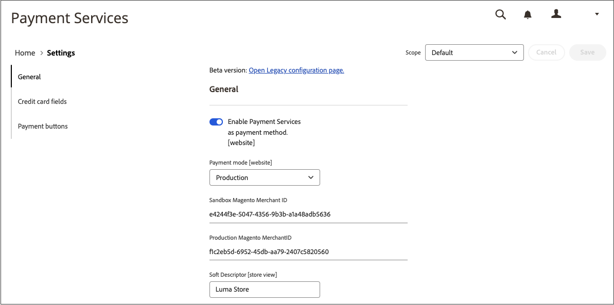
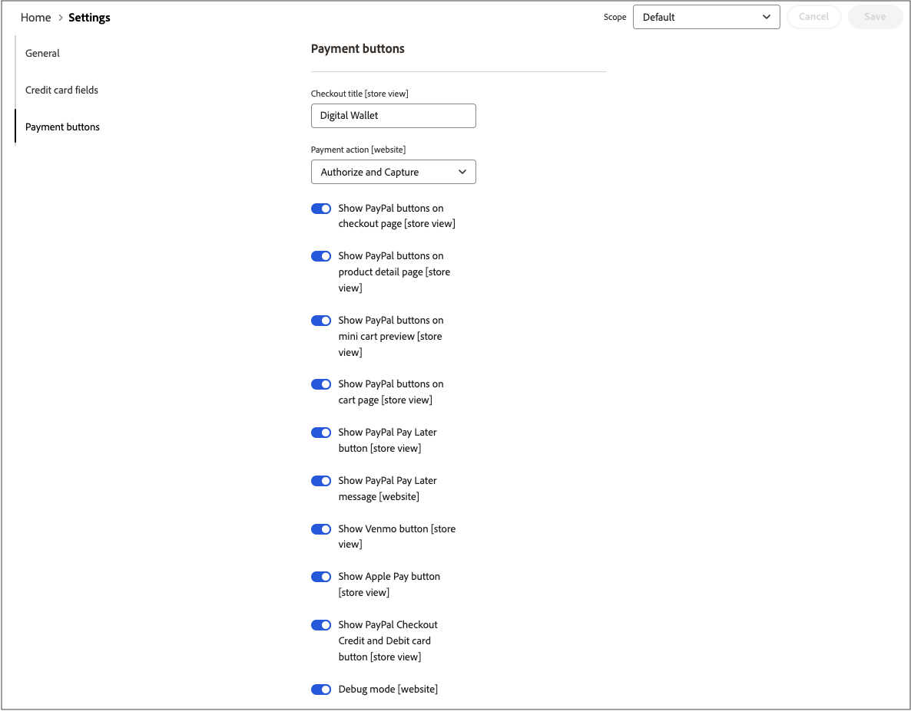
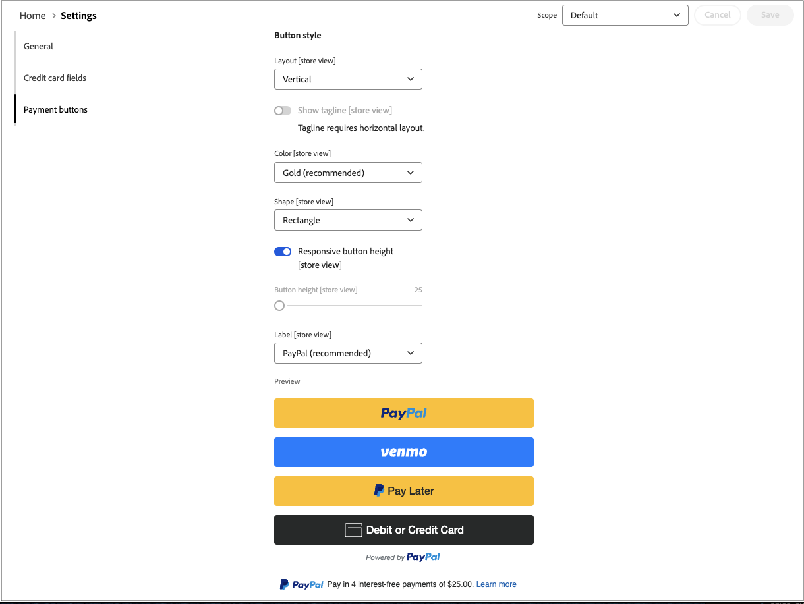

# [!UICONTROL Sales] > [!UICONTROL Payment Methods] > [!UICONTROL Payment Services]

決済サービスでは、サンドボックステストやシンプルな設定など、すぐに使えるセルフサービスソリューションを提供し、堅牢で安全な決済処理を実現します。 詳しくは、[_決済サービスユーザーガイド_](https://experienceleague.adobe.com/docs/commerce/payment-services/guide-overview.html)を参照してください。

決済サービスの設定設定にアクセスするには、_管理者_ サイドバーで&#x200B;**[!UICONTROL Sales]** > **[!UICONTROL Payment Services]**&#x200B;に移動し、**[!UICONTROL Settings]**&#x200B;をクリックします。

{width="400"}

>[!NOTE]
>
>[設定](https://experienceleague.adobe.com/docs/commerce/payment-services/configure/settings.html)の代わりにレガシー設定を使用するには、[&#x200B; レガシー設定](https://experienceleague.adobe.com/docs/commerce/payment-services/configure/configure-admin.html)を参照してください。

## [!UICONTROL General]

{width="600" zoomable="yes"}

| フィールド | [範囲](../../getting-started/websites-stores-views.md#scope-settings) | 説明 |
|---|---|---|
| [!UICONTROL Enable] | web サイト | Web サイトの[!DNL Payment Services]を有効または無効にします。 オプション：[!UICONTROL Yes] / [!UICONTROL No] |
| [!UICONTROL Payment mode] | ストアビュー | ストアのメソッドまたは環境を設定します。 オプション：[!UICONTROL Sandbox] / [!UICONTROL Production] |
| [!UICONTROL Sandbox Merchant ID] | ストアビュー | サンドボックスのオンボーディング中に自動生成されるサンドボックスマーチャント ID。 |
| [!UICONTROL Production Merchant ID] | ストアビュー | 本番環境でのマーチャント ID。サンドボックスのオンボーディング中に自動生成されます |
| [!UICONTROL Soft Descriptor] | web サイトまたはストアビュー | web サイトにソフト記述子を追加し、顧客トランザクションに関する情報を提供し、ブランド、店舗、商品ラインを描くストアビューを作成します。 [!UICONTROL Use website] トグルは、web サイト レベルで追加されたソフト記述子を適用します。 [!UICONTROL Use default] トグルは、デフォルトとして追加されたソフトディスクリプタを適用します。 |

{style="table-layout:auto"}

## [!UICONTROL Credit card fields]

{width="600" zoomable="yes"}

| フィールド | [範囲](../../getting-started/websites-stores-views.md#scope-settings) | 説明 |
|---|---|---|
| [!UICONTROL Title] | ストアビュー | チェックアウト時に、支払い方法ビューでこの支払いオプションのタイトルとして表示するテキストを追加します。 |
| [!UICONTROL Payment Action] | web サイト | 指定された支払い方法の[支払いアクション &#x200B;](payment-methods.md#payment-actions)。 オプション：[!UICONTROL Authorize] / [!UICONTROL Authorize and Capture] |
| [!UICONTROL 3DS Secure authentication] | web サイト | [3DS セキュア認証](https://experienceleague.adobe.com/docs/commerce/payment-services/security-compliance/security.html#3ds)を有効または無効にします。 オプション：[!UICONTROL Always] / [!UICONTROL When Required] / [!UICONTROL Off] |
| [!UICONTROL Show on checkout page] | web サイト | チェックアウトページに表示するクレジットカード情報フィールドを有効または無効にします。 オプション：[!UICONTROL Yes] / [!UICONTROL No] |
| [!UICONTROL Vault enabled] | ストアビュー | [&#x200B; クレジットカードの資格情報の保管](https://experienceleague.adobe.com/docs/commerce/payment-services/payments-checkout/vaulting.html)を有効または無効にします。 オプション：[!UICONTROL Yes] / [!UICONTROL No] |
| [!UICONTROL Show vaulted payment methods in Admin] | ストアビュー | 管理者[の顧客に対して、優先支払い方法](https://experienceleague.adobe.com/docs/commerce/payment-services/payments-checkout/vaulting.html)を使用して注文を完了する機能を有効または無効にします。 オプション：[!UICONTROL Yes] / [!UICONTROL No] |
| [!UICONTROL Debug Mode] | web サイト | デバッグモードを有効または無効にします。 オプション：[!UICONTROL Yes] / [!UICONTROL No] |

{style="table-layout:auto"}

## [!UICONTROL Payment buttons]

{width="600" zoomable="yes"}

| フィールド | [範囲](../../getting-started/websites-stores-views.md#scope-settings) | 説明 |
|---|---|---|
| [!UICONTROL Title] | ストアビュー | チェックアウト時に支払い方法ビューでこの支払いオプションのタイトルとして表示するテキストを追加します。 |
| [!UICONTROL Payment Action] | web サイト | 指定された支払い方法の[支払いアクション &#x200B;](payment-methods.md#payment-actions){target="_blank"}。 オプション：[!UICONTROL Authorize] / [!UICONTROL Authorize and Capture] |
| [!UICONTROL Show PayPal buttons on checkout page] | ストアビュー | チェックアウトページで[!DNL PayPal Smart Buttons]を有効または無効にします。 オプション：[!UICONTROL &#x200B; Yes] / [!UICONTROL No] |
| [!UICONTROL Show PayPal buttons on product detail page] | ストアビュー | 製品詳細ページで[!DNL PayPal Smart Buttons]を有効または無効にします。 オプション：[!UICONTROL &#x200B; Yes] / [!UICONTROL No] |
| [!UICONTROL Show PayPal buttons in mini-cart preview] | ストアビュー | ミニカートのプレビューで[!DNL PayPal Smart Buttons]を有効または無効にします。 オプション：[!UICONTROL Yes] / [!UICONTROL No] |
| [!UICONTROL Show PayPal buttons on cart page] | ストアビュー | 買い物かごページの[!DNL PayPal Smart Buttons]を有効または無効にします。 オプション：[!UICONTROL Yes] / [!UICONTROL No] |
| [!UICONTROL Show PayPal Pay Later button] | ストアビュー | 支払いボタンが表示される後払い支払いオプションの表示を有効または無効にします。 オプション：[!UICONTROL Yes] / [!UICONTROL No] |
| [!UICONTROL Show PayPal Pay Later Message] | web サイト | ショッピングカート、製品ページ、ミニカート、チェックアウトフロー中の後払いメッセージを有効または無効にします。 オプション：[!UICONTROL Yes] / [!UICONTROL No] |
| [!UICONTROL Show Venmo button] | ストアビュー | 支払いボタンが表示されるVenmo支払いオプションを有効または無効にします。 オプション：[!UICONTROL Yes] / [!UICONTROL No] |
| [!UICONTROL Show Apple Pay button] | ストアビュー | 支払いボタンが表示されるApple支払い支払いオプションを有効または無効にします。 オプション：[!UICONTROL Yes] / [!UICONTROL No] |
| [!UICONTROL Show PayPal Credit and Debit card button] | ストアビュー | 支払いボタンが表示されるクレジットカードとデビットカードの支払いオプションを有効または無効にします。 オプション：[!UICONTROL Yes] / [!UICONTROL No] |
| [!UICONTROL Debug Mode] | web サイト | デバッグモードを有効または無効にします。 オプション：[!UICONTROL Yes] / [!UICONTROL No] |

{style="table-layout:auto"}

## [!UICONTROL PayPal Smart Button Styling]

{width="600" zoomable="yes"}

| フィールド | [範囲](../../getting-started/websites-stores-views.md#scope-settings) | 説明 |
|--- |--- |--- |
| [!UICONTROL Layout] | ストアビュー | 支払いボタンのレイアウトのスタイルを定義します。 オプション：[!UICONTROL Vertical] / [!UICONTROL Horizontal] |
| [!UICONTROL Tagline] | ストアビュー | タグラインを有効/無効にします。 オプション：[!UICONTROL Yes] / [!UICONTROL No] |
| [!UICONTROL Color] | ストアビュー | 支払いボタンの色を定義します。 オプション：[!UICONTROL Blue] / [!UICONTROL Gold] / [!UICONTROL Silver] / [!UICONTROL White] / [!UICONTROL Black] |
| [!UICONTROL Shape] | ストアビュー | 支払いボタンの形状を定義します。 オプション：[!UICONTROL Rectangular] / [!UICONTROL Pill] |
| [!UICONTROL Responsive Button Height] | ストアビュー | 支払いボタンにデフォルトの高さを使用するかどうかを定義します。 オプション：[!UICONTROL Yes] / [!UICONTROL No] |
| [!UICONTROL Height] | ストアビュー | 支払いボタンの高さを定義します。 デフォルト値：なし |
| [!UICONTROL Label] | ストアビュー | 支払いボタンに表示されるラベルを定義します。 オプション：[!UICONTROL PayPal] / [!UICONTROL Checkout] / [!UICONTROL Buynow] / [!UICONTROL Pay] / [!UICONTROL Installment] |

{style="table-layout:auto"}
