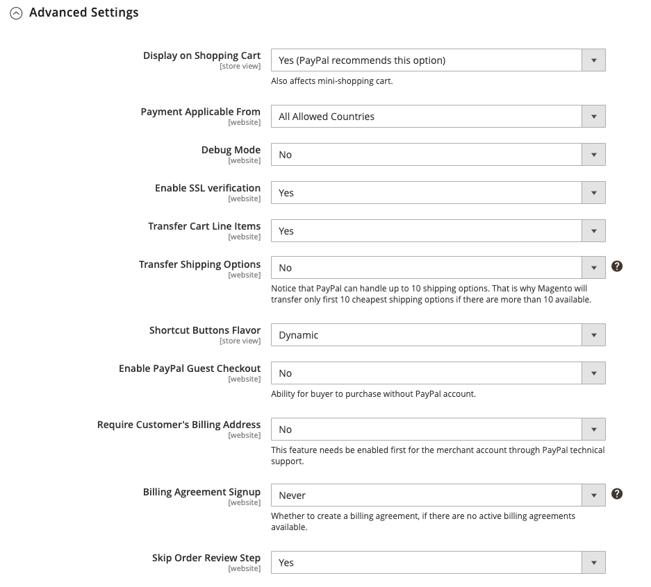
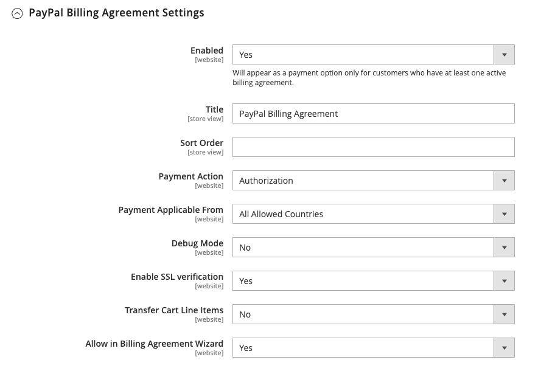

# [!UICONTROL Sales] > [!UICONTROL Payment Methods] > [!UICONTROL PayPal Express Checkout]

>[!IMPORTANT]
>
>**PSD2の要件：**  
>2019年9月14日の時点で、ヨーロッパの銀行は[PSD2](../../getting-started/compliance-payment-services-directive.md)の要件を満たさない支払いを拒否する可能性があります。PayPal Express Checkoutでは、すべての要件がPayPalによって処理されるため、PSD2に準拠するために何もする必要はありません。

{{config}}

## [!UICONTROL Required PayPal Settings]

<!-- zoom -->

<!-- [PayPal Express Checkout Required Settings](../../stores-purchase/paypal-express-checkout.html) -->

| フィールド | [範囲](../../getting-started/websites-stores-views.md#scope-settings) | 説明 |
|--- |--- |--- |
| [!UICONTROL Enable this Solution] | web サイト | 顧客が利用できる支払い方法として[!DNL PayPal Express Checkout]をアクティブ化します。 オプション：`Yes` / `No` |
| [!UICONTROL Enable In-Context Checkout Experience] | web サイト | 顧客が利用できる支払い方法として、合理化されたPayPalのインコンテクストチェックアウトを有効にします。 オプション：`Yes` / `No` |
| [!UICONTROL Enable PayPal Credit] | web サイト | PayPal クレジットを有効にして、お客様が今すぐ購入し、後で支払いを行えるようにします。 前払いされますが、顧客には前払いする時間がより多くあります。 オプション：`Yes` / `No` |

{style="table-layout:auto"}

### [!UICONTROL Express Checkout]

| フィールド | [範囲](../../getting-started/websites-stores-views.md#scope-settings) | 説明 |
|--- |--- |--- |
| [!UICONTROL Email Associated with PayPal Merchant Account] | web サイト | PayPal加盟店アカウントの確立時に指定した電子メールアドレスを指定します。 メールアドレスは大文字と小文字が区別され、PayPal システムのメールアドレスと完全に一致する必要があります。 |
| [!UICONTROL API Authentication Methods] | web サイト | API認証に使用するメソッドを指定します。 オプション： **`API Signature`**- フォームに&#x200B;_[!UICONTROL API Signature]_フィールドを表示します。 **`API Certificate`**- フォームに_[!UICONTROL API Certificate]_ フィールドを表示します。 |
| [!UICONTROL API Username] | web サイト | PayPal加盟店アカウントに関連付けられているAPI ユーザー名。 |
| [!UICONTROL API Password] | web サイト | PayPal加盟店アカウントに関連付けられているAPI パスワード。 |
| [!UICONTROL API Signature] | web サイト | PayPal加盟店アカウントに関連付けられているAPI署名。 |
| [!UICONTROL API Certificate] | web サイト | 参照してAPI証明書をアップロードします。 |
| [!UICONTROL Get Credentials from PayPal] |  | PayPalからAPI資格情報を取得します。 |
| [!UICONTROL Sandbox Credentials] |  | PayPalからサンドボックスの資格情報を取得します。 |
| [!UICONTROL Sandbox Mode] | web サイト | テスト環境でPayPal Express Checkoutを実行するには、サンドボックス API資格情報を入力し、これを`Yes`に設定します。 オプション：`Yes` / `No` |
| [!UICONTROL API Uses Proxy] | web サイト | お使いのシステムでプロキシサーバーを使用してCommerceとPayPal システムの間の接続を確立する場合は、これを`Yes`に設定します。 オプション：`Yes` / `No` |
| [!UICONTROL Proxy Host] | web サイト | APIがプロキシを使用する場合は、プロキシホストのIP アドレスを指定します。 |
| [!UICONTROL Proxy Port] | web サイト | APIがプロキシを使用する場合は、プロキシホストで使用されるポートを指定します。 |

{style="table-layout:auto"}

### [!UICONTROL Advertise PayPal Credit]

<!-- zoom -->

| フィールド | [範囲](../../getting-started/websites-stores-views.md#scope-settings) | 説明 |
|--- |--- |--- |
| [!UICONTROL Publisher ID] | web サイト | PayPal クレジット アカウントに関連付けられている発行者ID。 |
| [!UICONTROL Get Publisher ID from PayPal] |  | PayPalからパブリッシャーIDを取得します。 |
| [!UICONTROL Home Page] | web サイト | ホームページ上の[!DNL PayPal Credit] バナーの位置とサイズを決定します。 オプション： **表示** - ストアのホームページに[!DNL PayPal Credit] バナーを表示します。 オプション：`Yes` / `No`  **位置** - ホームページ上の[!DNL PayPal Credit] バナーの位置を決定します。 オプション：ヘッダー（中央） / サイドバー（右）  **サイズ** - ホームページの[!DNL PayPal Credit] バナーのサイズを決定します。 オプション：`190 x 100` / `234 x 60` / `300 x 50` / `468 x 60` / `728 x 90` /` 800 x 66` |
| [!UICONTROL Catalog Category Page] | web サイト | カテゴリーページ上の[!DNL PayPal Credit] バナーの位置とサイズを決定します。 オプション：（[!UICONTROL Home Page]と同じ） |
| [!UICONTROL Catalog Product Page] | web サイト | 商品ページ上の[!DNL PayPal Credit] バナーの位置とサイズを決定します。 オプション：（[!UICONTROL Home Page]と同じ） |
| [!UICONTROL Checkout Cart Page] | web サイト | 買い物かごページの[!DNL PayPal Credit] バナーの位置とサイズを決定します。 オプション：（[!UICONTROL Home Page]と同じ） |

{style="table-layout:auto"}

## [!UICONTROL Basic Settings]

<!-- zoom -->

| フィールド | [範囲](../../getting-started/websites-stores-views.md#scope-settings) | 説明 |
|--- |--- |--- |
| [!UICONTROL Title] | ストアビュー | チェックアウト時のPayPal Express チェックアウト支払い方法を識別する名前。 |
| [!UICONTROL Sort Order] | ストアビュー | チェックアウト時に他の支払い方法と一緒に表示される場合に、PayPal Express Checkoutが表示される順序を決定する番号。 リストの先頭に`0`と入力します。 |
| [!UICONTROL Payment Action] | web サイト | PayPalが注文を受け取ったときに実行されるアクションを決定します。 オプション： **`Authorization`**– 購入を承認しますが、ファンドを保留します。 金額は、加盟店が「獲得」するまで引き落とされません。 **`Sale`** – 購入金額が承認され、お客様のアカウントから直ちに引き落とされます。 **`Order`**– 定義された期間内に、加盟店が顧客の購入者アカウントから注文された合計までの1つ以上の金額を取得できるようにするPayPalとの契約を表します。 最大29日間です。 資金を取得するには、Commerce管理者から1つ以上の請求書を生成する必要があります。 |
| [!UICONTROL Display on Product Details Page] | ストアビュー | 「PayPalでのチェックアウト」ボタンが製品ページに表示されるかどうかを指定します。 オプションは次のとおりです：`Yes` / `No` |

{style="table-layout:auto"}

## [!UICONTROL Advanced Settings]

<!-- zoom -->

| フィールド | [範囲](../../getting-started/websites-stores-views.md#scope-settings) | 説明 |
|--- |--- |--- |
| [!UICONTROL Display on Shopping Cart] | ストアビュー | PayPal Express Checkoutをショッピングカートに支払いオプションとして表示するかどうかを指定します。 オプション：`Yes` （PayPal推奨） / `No` |
| [!UICONTROL Payment Action Applicable From] | web サイト | 該当する国の選択範囲を指定します。 オプション：`All Allowed Countries` / `Specific Countries` |
| [!UICONTROL Countries Payment Applicable From] | web サイト | 支払いが受け入れられる各国を示します。 この支払い方法で購入できるのは、選択した国の請求先住所を持つ顧客のみです。 |
| [!UICONTROL Debug Mode] | web サイト | ストアと支払いシステムの間で送信されたメッセージをログファイルに記録します。 オプション：`Yes` / `No`   **_Note:_** ログファイルはサーバーに保存され、開発者のみがアクセスできます。 PCI データセキュリティ基準に従い、クレジットカード情報はログファイルに記録されません。 |
| [!UICONTROL Enable SSL Verification] | web サイト | ホストのセキュリティ証明書の検証を有効にします。 オプション：`Yes` / `No` |
| [!UICONTROL Transfer Cart Line Items] | web サイト | PayPal サイトで顧客のショッピングカートから行アイテムの完全な概要を表示します。 オプション：`Yes` / `No` |
| [!UICONTROL Transfer Shipping Options] | web サイト | PayPal サイトには最大10個の配送オプションが含まれます。 オプション：`Yes` / `No` |
| [!UICONTROL Shortcut Buttons Flavor] | ストアビュー | PayPal受け入れボタンに使用する画像のタイプを指定します。 オプション： **`Dynamic`**- （推奨） PayPal サーバーから動的に変更できる画像を表示します。 **`Static`** – 動的に変更できない静止画像を表示します。 |
| [!UICONTROL Enable PayPal Guest Checkout] | web サイト | PayPal アカウントを持たないお客様は、PayPal Express Checkoutで購入できます。 オプション：`Yes` / `No` |
| [!UICONTROL Require Customer's Billing Address] | web サイト | 顧客の請求先住所が必要かどうかを指定します。 オプション：`Yes` / `No` / `For Virtual Quotes Only` |
| [!UICONTROL Billing Agreement Signup] | web サイト | お客様がストアと[請求契約書](../../stores-purchase/paypal-billing-agreements.md)を締結できるかどうかを決定します。 オプション： **`Auto`**– お客様は、Express チェックアウト中に請求契約書にサインアップできます。 **`Ask Customer`** – お客様は、請求契約書にサインアップするかどうかを尋ねられます。 **`Never`**– お客様には、請求契約書にサインアップするオプションは提供されていません。 |
| [!UICONTROL Skip Order Review Step] | web サイト | お客様がPayPal サイトからトランザクションを完了できるか、または店舗に戻って注文を送信する前に注文レビュー手順を完了する必要があるかを指定します。 オプション：`Yes` / `No` |

{style="table-layout:auto"}

### [!UICONTROL Billing Agreement Settings]

<!-- zoom -->

| フィールド | [範囲](../../getting-started/websites-stores-views.md#scope-settings) | 説明 |
|--- |--- |--- |
| [!UICONTROL Enabled] | web サイト | 有効にすると、請求契約書がチェックアウト時に支払いオプションとして顧客に表示されます。 オプション：`Yes` / `No` |
| [!UICONTROL Title] | ストアビュー | チェックアウト時に支払いオプションとして表示されるPayPal請求契約書オプションのラベル。 |
| [!UICONTROL Sort Order] | ストアビュー | チェックアウト時に、請求契約書が他の支払い方法と共に一覧表示される順序を決定します。 |
| [!UICONTROL Payment Action] | web サイト | PayPalがトランザクションをどのように管理するかを決定します。オプション： **認証** – 購入を承認しますが、資金を保留します。 金額は、加盟店が「獲得」するまで引き落とされません。  **販売** – 購入金額が承認され、お客様のアカウントから直ちに引き落とされます。 |
| [!UICONTROL Payment Applicable From] | web サイト | 該当する国の選択範囲を指定します。 オプション：すべての許可された国/特定の国 |
| [!UICONTROL Countries Payment Applicable From] | web サイト | 支払いが受け入れられる各国を示します。 この支払い方法で購入できるのは、選択した国の請求先住所を持つ顧客のみです。 |
| [!UICONTROL Debug Mode] | web サイト | 支払いシステムとの通信をログファイルに記録します。 オプション：`Yes` / `No`   **_Note:_** ログファイルはサーバーに保存され、開発者のみがアクセスできます。 PCI データセキュリティ基準に従い、クレジットカード情報はログファイルに記録されません。 |
| [!UICONTROL Enable SSL Verification] | web サイト | 暗号化されたSSL チャネルを介してトランザクションが確実に実行されるように、検証手順を有効にします。 オプション：`Yes` / `No` |
| [!UICONTROL Transfer Cart Line Items] | web サイト | 有効にすると、PayPalの支払いページにショッピングカートの行項目の概要が表示されます。 オプション：`Yes` / `No` |
| [!UICONTROL Allow in Billing Agreement Wizard] | web サイト | 有効にすると、顧客は顧客アカウントのダッシュボードから請求契約書を開始できます。 |

{style="table-layout:auto"}

### [!UICONTROL Settlement Report Settings]

<!-- zoom -->

| フィールド | [範囲](../../getting-started/websites-stores-views.md#scope-settings) | 説明 |
|--- |--- |--- |
| **[!UICONTROL SFTP Credentials]** |  |  |
| [!UICONTROL Login] | web サイト | PayPalのセキュア FTP サーバーにログインするために必要なユーザー名。 |
| [!UICONTROL Password] | web サイト | PayPalのセキュア FTP サーバーにログインするために必要なパスワード。 |
| [!UICONTROL Sandbox Mode] | web サイト | 有効にすると、実稼動環境で「本番稼動中」になる前に、テスト環境でレポートを実行します。 オプション：`Yes` / `No` |
| [!UICONTROL Custom Endpoint Hostname or IP-Address] | web サイト | 決済レポートが管理されるURL。 デフォルト値：`reports.paypal.com` |
| [!UICONTROL Custom Path] | web サイト | 決済レポートがサーバーに保存されるパス。 デフォルト値：`/ppreports/outgoing` |
| **[!UICONTROL Scheduled Fetching]** |  |  |
| [!UICONTROL Enable Automatic Fetching] | web サイト | 有効にすると、スケジュール時に決済レポートが自動的に取得されます。 オプション：`Yes` / `No` |
| [!UICONTROL Schedule] | web サイト | PayPalが決済レポートを生成する頻度を指定します。 オプション：`Daily` / `Every 3 days` / `Every 7 days` / `Every 10 days` / `Every 14 days` / `Every 30 days` / `Every 40 days` |
| [!UICONTROL Time of Day] | web サイト | 決済レポートが生成される時間、分、秒を指定します。 |

{style="table-layout:auto"}

### [!UICONTROL Frontend Experience Settings]

<!-- zoom -->

| フィールド | [範囲](../../getting-started/websites-stores-views.md#scope-settings) | 説明 |
|--- |--- |--- |
| [!UICONTROL PayPal Product Logo] | ストアビュー | ストアに表示されるPayPal ロゴを決定します。 2つのサイズに4つの基本スタイルがあります。 オプション：`No Logo` / `We prefer PayPal (150 x 60)` / `We prefer PayPal (150 x 40)` / `Now accepting PayPal (150 x 60)` / `Now accepting PayPal (150 x 40)` / `Payments by PayPal (150 x 60)` / `Payments by PayPal (150 x 40)` / `Shop now using (150 x 60)` / `Shop now using (150 x 40)` |
| **[!UICONTROL PayPal Merchant Pages Style]** |  |  |
| [!UICONTROL Page Style] | ストアビュー | PayPal マーチャントページの外観を決定します。 許可される値：**`paypal`** - PayPal ページスタイルを使用します。 **`primary`**- アカウントプロファイルで「プライマリ」スタイルとして識別したページスタイルを使用します。 **`your_custom_value`** - アカウントプロファイルで指定されたカスタム支払いページスタイルを使用します。 |
| [!UICONTROL Header Image URL] | ストアビュー | チェックアウトページの左上隅に表示される画像のURL。 最大サイズは750 x 90 ピクセルです。   **_Note:_** PayPalでは、画像を安全な（https）サーバーに保存することをお勧めします。 それ以外の場合、お客様のブラウザーは「ページに安全な項目と安全でない項目の両方が含まれています」と警告する場合があります。 |
| [!UICONTROL Header Image Background Color] | ストアビュー | チェックアウトページのヘッダーの背景色の6文字の[16進数カラー](https://en.wikipedia.org/wiki/Web_colors) コード。 コードは、大文字と小文字のどちらでも入力できます。 |
| [!UICONTROL Header Image Border Color] | ストアビュー | ヘッダーの周囲の2 ピクセルの境界線の6文字の[16進数カラー](https://en.wikipedia.org/wiki/Web_colors) コード。 |
| [!UICONTROL Page Background Color] | ストアビュー | ヘッダーと支払いフォームの背後に表示されるチェックアウトページの背景色の6文字の[16進数カラー](https://en.wikipedia.org/wiki/Web_colors) コード。 |

{style="table-layout:auto"}

#### [!UICONTROL Customize Smart Buttons (Basic)]

<!-- zoom -->

| フィールド | [範囲](../../getting-started/websites-stores-views.md#scope-settings) | 説明 |
|--- |--- |--- |
| [!UICONTROL Customize Button] | ストアビュー | PayPal スマートボタンを、ストアのレイアウトとテーマに合わせてカスタマイズできるかどうかを指定します。 これらの変更は、チェックアウトページ、製品ページ、買い物かごページ、ミニカートで個別に適用できます。 |
| [!UICONTROL Label] | ストアビュー | PayPalが「スマート支払い」ボタンに表示するテキスト。 オプション： **`Checkout`**（「PayPal チェックアウト」と表示） **`Pay`** （「PayPalで支払う」と表示）  **`Buy Now`**（「PayPalで今すぐ購入」と表示） **`PayPal`** （「PayPal」と表示）  **`Installment`**（「PayPal」と表示） **`Credit`** （「PayPal CREDIT」と表示） |
| [!UICONTROL Layout] | ストアビュー | PayPal スマートボタンを垂直方向または水平方向に表示するかどうかを指定します。 オプション： **`Vertical`**– 購入者は、「ゲストチェックアウトを有効にする」が選択されているかどうかに関係なく、PayPalにログインするか、PayPal アカウントを作成する必要があります。 **`Horizontal`** - 「ゲストチェックアウトを有効にする」が選択されている場合、PayPal ポップアップウィンドウに&#x200B;**`Pay with Debit Card or Credit Card`** ボタンが表示されます。 それ以外の場合、購入者はPayPalにログインするか、PayPal アカウントを作成する必要があります。 |
| [!UICONTROL Size] | ストアビュー | スマート支払いボタンのサイズを設定します。 オプション： **`Medium`**- 250 ピクセル x 35 ピクセル **`Large`** - 350 ピクセル x 40 ピクセル  **`Responsive`**- （デフォルト）コンテナの幅に合わせて調整します。 最小幅は100 ピクセル、最大幅は500 ピクセルです。 高さは、幅に基づいて動的に調整されます。 |
| [!UICONTROL Shape] | ストアビュー | スマート支払いボタンの形状を設定します。 オプション：`Pill` （既定値） / `Rectangle` |
| [!UICONTROL Color] | ストアビュー | スマート支払いボタンの色を設定します。 オプション：`Gold` （既定値） / `Blue` / `Silver` / `Black` |

{style="table-layout:auto"}

#### [!UICONTROL Customize Smart Buttons (Features)]

<!-- zoom -->

| フィールド | [範囲](../../getting-started/websites-stores-views.md#scope-settings) | 説明 |
|--- |--- |--- |
| [!UICONTROL Disable Funding Options] | ストアビュー | チェックアウトページに表示されるその他のPayPal資金調達オプションを指定します。 選択したオプションは、チェックアウトページには表示されません。 選択されていないオプションは、PayPalがストアの通貨と購入者の場所をサポートしている場合にのみ表示されます。 オプション：`PayPal Credit` / `PayPal Guest Checkout` `Credit Card Icons` / `Elektronisches Lastschriftverfahren - German ELV` |

{style="table-layout:auto"}
