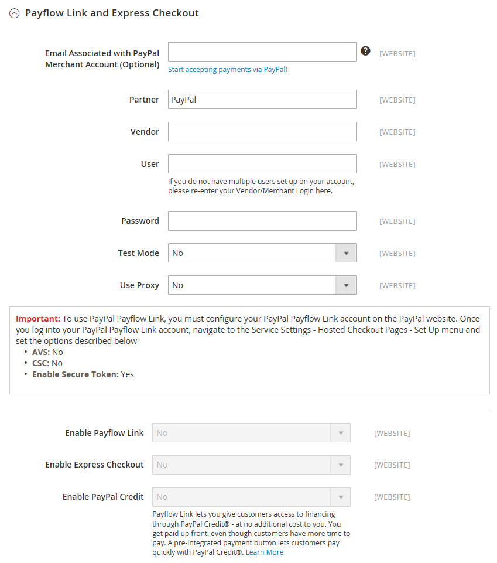

# [!UICONTROL Sales] > [!UICONTROL Payment Methods] > [!UICONTROL PayPal Payflow Link]

>[!IMPORTANT]
>
>**PSD2 の要件：**  
>2019 年 9 月 14 日（PT）現在、ヨーロッパの銀行は、[PSD2](../../getting-started/compliance-payment-services-directive.md) の要件を満たさない支払いを拒否する可能性があります。 PSD2 に準拠するには、[!DNL PayPal Payflow Link] を [!DNL Cardinal Commerce] と統合する必要があります。 詳しくは、[3-D Secure for Payflow](https://developer.paypal.com/api/nvp-soap/payflow/3d-secure-overview/) を参照してください。

{{config}}

## [!UICONTROL Required Settings]

<!-- zoom -->

| フィールド | [&#x200B; 範囲 &#x200B;](../../getting-started/websites-stores-views.md#scope-settings) | 説明 |
|--- |--- |--- |
| [!UICONTROL Email Associated with PayPal Merchant Account] | Web サイト | （任意） PayPal マーチャントアカウントに関連付けられているメールアドレス。 メールアドレスは大文字と小文字が区別され、アカウントのアドレスと完全に一致する必要があります。 |
| [!UICONTROL Partner] | Web サイト | PayPal パートナー ID （該当する場合）。 |
| [!UICONTROL Vendor] | Web サイト | PayPal ユーザーログイン名。 |
| ユーザー | Web サイト | PayPal アカウントの追加ユーザーの ID。 ネットワーク上に他のユーザーがいない場合は、ベンダー ID またはマーチャント ID を入力します。 |
| [!UICONTROL Password] | Web サイト | PayPal マーチャントアカウントに関連付けられているパスワード。 |
| [!UICONTROL Test Mode] | Web サイト | 有効にすると、テスト環境で PayPal Payflow Pro を実行します。 実稼動モードで「運用を開始」する準備が整ったら、テストモードをオフにします。 オプション：`Yes` / `No` |
| [!UICONTROL Use Proxy] | Web サイト | プロキシは、サーバーファイアウォールが PayPal サーバーへの直接アクセスを妨げる場合に、トラフィックをリダイレクトするために使用できます。 該当する場合、は PayPal サーバーとの接続を確立するために使用されるプロキシサーバーを識別します。 Options: `Yes` / `No`    有効な場合、プロキシオプションを設定します。 **`Proxy Host`**- プロキシホストの IP アドレス。 **`Proxy Port`** - プロキシポートの番号。 |
| [!UICONTROL Enable Payflow Link] | Web サイト | お客様が支払い方法として PayPal Payflow Link を使用できるかどうかを決定します。 |
| [!UICONTROL Enable Express Checkout] | Web サイト | PayPal Express Checkout が支払い方法として顧客に提供できるかどうかを決定します。 |
| [!UICONTROL Enable PayPal Credit] | Web サイト | PayPal クレジットを支払いオプションとして顧客が利用できるかどうかを決定します。 |

{style="table-layout:auto"}

## [!UICONTROL Advertise PayPal Credit]

<!-- zoom -->

| フィールド | [&#x200B; 範囲 &#x200B;](../../getting-started/websites-stores-views.md#scope-settings) | 説明 |
|--- |--- |--- |
| [!UICONTROL Publisher ID] | Web サイト | PayPal クレジットアカウントに関連付けられたパブリッシャー ID。 |
| [!UICONTROL Get Publisher ID from PayPal] |  | PayPal からパブリッシャー ID を取得します。 |
| [!UICONTROL Home Page] | Web サイト | ホーム ページ上の [!DNL PayPal Credit] バナーの位置とサイズを決定します。 オプション： **`Display`**- ストアのホームページに [!DNL PayPal Credit] のバナーを表示するかどうかを決定します。 オプション：`Yes` / `No` **`Position`** - ホームページ上の [!DNL PayPal Credit] のバナーの位置を決定します。 オプション：ヘッダー（中央）/サイドバー（右）  **`Size`**- ホームページの [!DNL PayPal Credit] のバナーのサイズを決定します。 オプション：`190 x 100` / `234 x 60` / `300 x 50` / `468 x 60` / `728 x 90` /` 800 x 66` |
| [!UICONTROL Catalog Category Page] | Web サイト | カテゴリページ上の [!DNL PayPal Credit] のバナーの位置とサイズを決定します。 オプション：（[!UICONTROL Home Page] と同じ） |
| [!UICONTROL Catalog Product Page] | Web サイト | 製品ページ上の [!DNL PayPal Credit] バナーの位置とサイズを決定します。 オプション：（[!UICONTROL Home Page] と同じ） |
| [!UICONTROL Checkout Cart Page] | Web サイト | 買い物かごページの [!DNL PayPal Credit] のバナーの位置とサイズを決定します。 オプション：（[!UICONTROL Home Page] と同じ） |

{style="table-layout:auto"}

### [!UICONTROL Basic Settings]

<!-- zoom -->

| フィールド | [&#x200B; 範囲 &#x200B;](../../getting-started/websites-stores-views.md#scope-settings) | 説明 |
|--- |--- |--- |
| [!UICONTROL Title] | ストア表示 | チェックアウト時の支払い方法として PayPal ペイフローリンクを識別する名前。 |
| [!UICONTROL Sort Order] | ストア表示 | チェックアウト時に他の支払い方法と一緒にリストされたときに PayPal ペイフローリンクが表示される順序を決定する数値です。 |
| [!UICONTROL Payment Action] | Web サイト | 注文が送信されたときに PayPal が実行するアクションを決定します。 オプション： **`Authorization`**– 購入を承認しますが、資金を保留します。 この金額は、マーチャントによって「キャプチャ」されるまで引き出されません。 **`Sale`** – 購入金額は許可され、すぐにお客様のアカウントから引き出されます。 |

{style="table-layout:auto"}

### [!UICONTROL Advanced Settings]

<!-- zoom -->

| フィールド | [&#x200B; 範囲 &#x200B;](../../getting-started/websites-stores-views.md#scope-settings) | 説明 |
|--- |--- |--- |
| [!UICONTROL Payment Applicable From] | Web サイト | 適用可能な国選択の範囲を決定します。 オプション：許可されているすべての国/特定の国 |
| [!UICONTROL Countries Payment Applicable From] | Web サイト | 支払いが受け入れられる各国を識別します。 この支払い方法で購入できるのは、選択した国の請求先住所を持つお客様のみです。 |
| [!UICONTROL Debug Mode] | Web サイト | ストアと支払いシステム間で送信されたメッセージをログ ファイルに記録します。 オプション：`Yes` / `No`   **_注意：_**&#x200B;ログファイルはサーバーに保存され、開発者のみがアクセスできます。 PCI Data Security Standards に従い、クレジットカード情報はログファイルに記録されません。 |
| [!UICONTROL Enable SSL Verification] | Web サイト | トランザクションが発生する前に、ホスト上のセキュリティで保護されたチャネルを検証するかどうかを決定します。 オプション：`Yes` / `No` |
| [!UICONTROL CVV Entry is Editable] | Web サイト | 顧客が入力後に CVV を編集できるかどうかを決定します。 オプション：`Yes` / `No` |
| [!UICONTROL Require CVV Entry] | Web サイト | 顧客がクレジット カードの裏面から CVV コードを入力する必要があるかどうかを決定します。 オプション：`Yes` / `No` |
| [!UICONTROL Send Email Confirmation] | Web サイト | 顧客が支払いの確認メールを受信するかどうかを決定します。 オプション：`Yes` / `No` |
| [!UICONTROL URL Method for Cancel  URL and Return URL] | Web サイト | トランザクション中に PayPal サーバーと情報を交換するために使用される方法を決定します。 オプション： **`GET`**- プロセスの結果である情報を取得します。 （これはデフォルトの方法です。） **`POST`** - フォームに入力されたデータなどのデータブロックをデータ処理プロセスに送信します。 |

{style="table-layout:auto"}

## [!UICONTROL Settlement Report Settings]

<!-- zoom -->

| フィールド | [&#x200B; 範囲 &#x200B;](../../getting-started/websites-stores-views.md#scope-settings) | 説明 |
|--- |--- |--- |
| **[!UICONTROL SFTP Credentials]** |  |  |
| [!UICONTROL Login] | Web サイト | PayPal のセキュア FTP サーバーにログインするために必要なユーザー名。 |
| [!UICONTROL Password] | Web サイト | PayPal のセキュア FTP サーバーにログインするために必要なパスワード。 |
| [!UICONTROL Sandbox Mode] | Web サイト | 有効にすると、実稼動環境で「実稼動」になる前に、テスト環境でレポートを実行します。 オプション：`Yes` / `No` |
| [!UICONTROL Custom Endpoint Hostname or IP-Address] | Web サイト | 決済レポートを管理する URL。 デフォルト値：`reports.paypal.com` |
| [!UICONTROL Custom Path] | Web サイト | 決済レポートがサーバー上に保存されるパス。 デフォルト値：`/ppreports/outgoing` |
| **[!UICONTROL Scheduled Fetching]** |  |  |
| [!UICONTROL Enable Automatic Fetching] | Web サイト | 有効化すると、スケジュールに従って決済レポートが自動的に取得されます。 オプション：`Yes` / `No` |
| [!UICONTROL Schedule] | グローバル | PayPal によって決済レポートが生成される頻度を決定します。 オプション：`Daily` / `Every 3 days` / `Every 7 days` / `Every 10 days` / `Every 14 days` / `Every 30 days` / `Every 40 days` |
| [!UICONTROL Time of Day] | グローバル | 決済レポートが生成される時間、分、および秒を決定します。 |

{style="table-layout:auto"}

## [!UICONTROL Frontend Experience Settings]

<!-- zoom -->

| フィールド | [&#x200B; 範囲 &#x200B;](../../getting-started/websites-stores-views.md#scope-settings) | 説明 |
|--- |--- |--- |
| [!UICONTROL PayPal Product Logo] | ストア表示 | ストアに表示される PayPal ロゴを決定します。 2 つのサイズには 4 つの基本スタイルがあります。 オプション：`No Logo` / `We prefer PayPal (150 x 60)` / `We prefer PayPal (150 x 40)` / `Now accepting PayPal (150 x 60)` / `Now accepting PayPal (150 x 40)` / `Payments by PayPal (150 x 60)` / `Payments by PayPal (150 x 40)` / `Shop now using (150 x 60)` / `Shop now using (150 x 40)` |
| PayPal マーチャントページスタイル |  |  |
| [!UICONTROL Page Style] | ストア表示 | PayPal マーチャントページの外観を決定します。 許可されている値： **`paypal`**- PayPal ページスタイルを使用します。 **`primary`** - アカウントプロファイルで「プライマリ」スタイルとして識別したページスタイルを使用します。  **`your_custom_value`**- アカウントプロファイルで指定されているカスタム支払いページスタイルを使用します。 |
| [!UICONTROL Header Image URL] | ストア表示 | チェックアウトページの左上隅に表示される画像の URL。 最大サイズは 750 x 90 ピクセルです。   **_注意：_**&#x200B;PayPal では、画像を安全な（https）サーバーに保存することをお勧めします。 そうしないと、顧客のブラウザーで「ページにセキュアな項目とセキュアでない項目の両方が含まれています」と警告される場合があります。 |
| [!UICONTROL Header Image Background Color] | ストア表示 | チェックアウトページのヘッダーの背景色を 6 文字 [16 進数カラー &#x200B;](https://en.wikipedia.org/wiki/Web_colors) のコードで表します。 コードは、大文字でも小文字でも入力できます。 |
| [!UICONTROL Header Image Border Color] | ストア表示 | ヘッダーの周囲の 2 ピクセルの境界線を表す、6 文字の 16 進数のカラーコード。 |
| [!UICONTROL Page Background Color] | ストア表示 | ヘッダーと支払いフォームの後ろに表示される、チェックアウトページの背景色の 6 文字の 16 進数カラーコード。 |

{style="table-layout:auto"}

### [!UICONTROL Basic Settings - PayPal Express Checkout]

<!-- zoom -->

| フィールド | [&#x200B; 範囲 &#x200B;](../../getting-started/websites-stores-views.md#scope-settings) | 説明 |
|--- |--- |--- |
| [!UICONTROL Title] | ストア表示 | チェックアウト時の PayPal Express チェックアウト支払い方法を識別する名前。 |
| [!UICONTROL Sort Order] | ストア表示 | チェックアウト時に他のお支払い方法と一緒にリストされた場合に、PayPal Express チェックアウトが表示される順序を決定する数字です。 リストの上部に `0` と入力します。 |
| [!UICONTROL Payment Action] | Web サイト | 注文を受け取った際に PayPal が実行するアクションを決定します。 オプション： **`Authorization`**– 購入を承認しますが、資金を保留します。 この金額は、マーチャントによって「キャプチャ」されるまで引き出されません。 **`Sale`** – 購入金額は許可され、すぐにお客様のアカウントから引き出されます。  **`Order`**- PayPal との契約を表します。この契約により、マーチャントは、定義された期間内に顧客のバイヤーアカウントから注文された合計を上限とする 1 つ以上の金額を取得できます。 これは最大 29 日間有効です。 資金を取得するには、Commerce管理者から 1 つ以上の請求書を生成する必要があります。 |
| [!UICONTROL URL Display on Product Details Page] | ストア表示 | 製品ページに「PayPal でチェックアウト」ボタンを表示するかどうかを決定します。 オプション：`Yes` / `No` |

{style="table-layout:auto"}

### [!UICONTROL Advanced Settings - PayPal Express Checkout]

<!-- zoom -->

| フィールド | [&#x200B; 範囲 &#x200B;](../../getting-started/websites-stores-views.md#scope-settings) | 説明 |
|--- |--- |--- |
| [!UICONTROL Display on Shopping Cart] | ストア表示 | PayPal Express チェックアウトが買い物かごに支払いオプションとして表示されるかどうかを決定します。 オプション：はい（推奨）/いいえ |
| [!UICONTROL Payment Action Applicable From] | Web サイト | 適用可能な国選択の範囲を決定します。 オプション：許可されているすべての国/特定の国 |
| [!UICONTROL Countries Payment Applicable From] | Web サイト | 支払いが受け入れられる各国を識別します。 この支払い方法で購入できるのは、選択した国の請求先住所を持つお客様のみです。 |
| [!UICONTROL Debug Mode] | Web サイト | ストアと PayPal 支払いシステム間で送信されたメッセージをログファイルに記録します。 オプション：`Yes` / `No`   **_注意：_**&#x200B;ログファイルはサーバーに保存され、開発者のみがアクセスできます。 PCI Data Security Standards に従い、クレジットカード情報はログファイルに記録されません。 |
| [!UICONTROL Enable SSL Verification] | Web サイト | ホスト セキュリティ証明書の検証を有効にします。 オプション：`Yes` / `No` |
| [!UICONTROL Transfer Cart Line Items] | Web サイト | PayPal サイトの顧客の買い物かごからの明細項目の完全な概要を表示します。 オプション：`Yes` / `No` |
| [!UICONTROL Skip Order Review Step] | Web サイト | 顧客が PayPal サイトからトランザクションを完了できるか、またはストアに戻って注文を送信する前に注文レビュー手順を完了する必要があるかを決定します。 オプション：`Yes` / `No` |

{style="table-layout:auto"}
