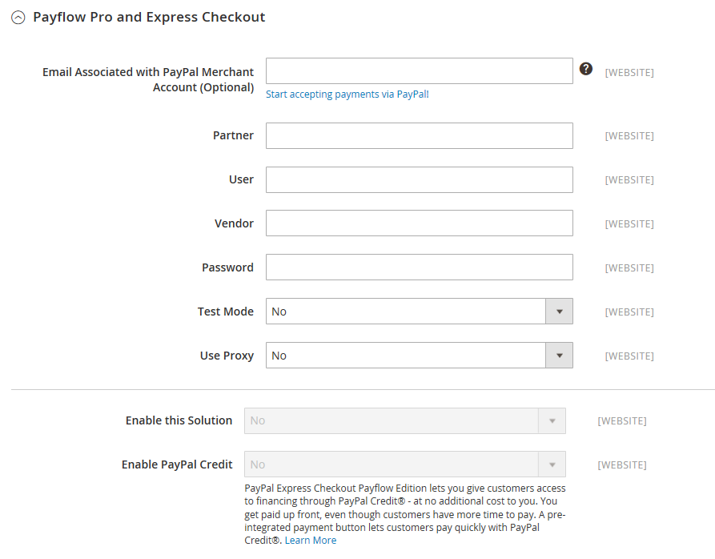

# [!UICONTROL Sales] > [!UICONTROL Payment Methods] >  [!UICONTROL PayPal Payflow Pro]

>[!IMPORTANT]
>
>**PSD2の要件：**  
>2019年9月14日の時点で、ヨーロッパの銀行は[PSD2](../../getting-started/compliance-payment-services-directive.md)の要件を満たさない支払いを拒否する可能性があります。PSD2に準拠するには、[!DNL PayPal Payflow Pro]を[!DNL Cardinal Commerce]と統合する必要があります。詳しくは、「[3-D Secure for Payflow](https://developer.paypal.com/api/nvp-soap/payflow/3d-secure-overview/)」を参照してください。

{{config}}

## [!UICONTROL Required Settings]

<!-- zoom -->

| フィールド | [範囲](../../getting-started/websites-stores-views.md#scope-settings) | 説明 |
|--- |--- |--- |
| [!UICONTROL Email Associated with PayPal Merchant Account] | web サイト | （オプション） PayPal加盟店アカウントに関連付けられているメールアドレス。 メールアドレスでは大文字と小文字が区別されるため、アカウント内のアドレスと完全に一致する必要があります。 |
| [!UICONTROL Partner] | web サイト | PayPal パートナーID （該当する場合）。 |
| [!UICONTROL Vendor] | web サイト | PayPal ユーザーログイン名。 |
| ユーザー | web サイト | PayPal アカウントの別のユーザーのID。 |
| [!UICONTROL Password] | web サイト | PayPal加盟店アカウントに関連付けられているパスワード。 |
| [!UICONTROL Test Mode] | web サイト | 有効にすると、テスト環境でPayPal Payflow Proを実行します。 実稼動モードで「本番稼動」する準備ができたら、テストモードをオフにします。 オプション：`Yes` / `No` |
| [!UICONTROL Use Proxy] | web サイト | プロキシは、サーバーファイアウォールがPayPal サーバーへの直接アクセスを妨げる場合に、トラフィックをリダイレクトするために使用できます。 該当する場合は、PayPal サーバーとの接続を確立するために使用されるプロキシサーバーを識別します。 オプション：`Yes` / `No`   有効な場合、プロキシオプションを設定します： **`Proxy Host`**- プロキシホストのIP アドレス。 **`Proxy Port`** - プロキシ ポートの番号。 |
| [!UICONTROL Enable this Solution] | web サイト | PayPal Payflow Proがお客様の支払い方法として利用可能かどうかを判断します。 |
| [!UICONTROL Enable PayPal Credit] | web サイト | PayPal クレジットがお客様の支払いオプションとして利用可能かどうかを決定します。 |

{style="table-layout:auto"}

## [!UICONTROL Advertise PayPal Credit]

<!-- zoom -->

| フィールド | [範囲](../../getting-started/websites-stores-views.md#scope-settings) | 説明 |
|--- |--- |--- |
| [!UICONTROL Publisher ID] | web サイト | PayPal クレジット アカウントに関連付けられている発行者ID。 |
| [!UICONTROL Get Publisher ID from PayPal] |  | PayPalからパブリッシャーIDを取得します。 |
| [!UICONTROL Home Page] | web サイト | ホームページ上の[!DNL PayPal Credit] バナーの位置とサイズを決定します。 オプション： **`Display`**- ストアのホームページに[!DNL PayPal Credit] バナーが表示されるかどうかを指定します。 オプション：`Yes` / `No` **`Position`** - ホームページ上の[!DNL PayPal Credit] バナーの位置を決定します。 オプション：ヘッダー（中央） / サイドバー（右）  **`Size`**- ホームページの[!DNL PayPal Credit] バナーのサイズを決定します。 オプション：`190 x 100` / `234 x 60` / `300 x 50` / `468 x 60` / `728 x 90` /` 800 x 66` |
| [!UICONTROL Catalog Category Page] | web サイト | カテゴリーページ上の[!DNL PayPal Credit] バナーの位置とサイズを決定します。 オプション：（[!UICONTROL Home Page]と同じ） |
| [!UICONTROL Catalog Product Page] | web サイト | 商品ページ上の[!DNL PayPal Credit] バナーの位置とサイズを決定します。 オプション：（[!UICONTROL Home Page]と同じ） |
| [!UICONTROL Checkout Cart Page] | web サイト | 買い物かごページの[!DNL PayPal Credit] バナーの位置とサイズを決定します。 オプション：（[!UICONTROL Home Page]と同じ） |

{style="table-layout:auto"}

## [!UICONTROL Basic Settings - PayPal Payflow Pro]

<!-- zoom -->

| フィールド | [範囲](../../getting-started/websites-stores-views.md#scope-settings) | 説明 |
|--- |--- |--- |
| [!UICONTROL Title] | ストアビュー | チェックアウト時の支払い方法としてPayPal Payflow Proを識別する名前。 |
| [!UICONTROL Sort Order] | ストアビュー | チェックアウト時に他の支払い方法と共に表示されるPayPal Payflow Proの表示順序を決定する番号。 |
| [!UICONTROL Payment Action] | web サイト | 注文の送信時にPayPalが実行するアクションを指定します。 オプション： **`Authorization`**– 購入を承認しますが、ファンドを保留します。 金額は、加盟店が「獲得」するまで引き落とされません。 **`Sale`** – 購入金額が承認され、お客様のアカウントから直ちに引き落とされます。 |
| **[!UICONTROL Credit Card Settings]** |  |  |
| [!UICONTROL Allowed Credit Cart Types] | web サイト | チェックアウト時に顧客が利用できるクレジットカードを決定します。 対応しているカードを選択します。 オプション：`American Express` （追加契約が必要） / `Visa` / `MasterCard` / `Discover` / `JCB` |

{style="table-layout:auto"}

## [!UICONTROL Advanced Settings]

<!-- zoom -->

| フィールド | [範囲](../../getting-started/websites-stores-views.md#scope-settings) | 説明 |
|--- |--- |--- |
| ショッピングカートに表示 | ストアビュー | PayPal Express Checkoutをショッピングカートに支払いオプションとして表示するかどうかを指定します。 オプション：はい（推奨）/いいえ |
| [!UICONTROL Payment Action Applicable From] | web サイト | 該当する国の選択範囲を指定します。 オプション：すべての許可された国/特定の国 |
| [!UICONTROL Countries Payment Applicable From] | web サイト | 支払いが受け入れられる各国を示します。 この支払い方法で購入できるのは、選択した国の請求先住所を持つ顧客のみです。 |
| [!UICONTROL Debug Mode] | web サイト | ストアとPayPal支払いシステムの間で送信されたメッセージをログファイルに記録します。 オプション：`Yes` / `No`   **_Note:_** ログファイルはサーバーに保存され、開発者のみがアクセスできます。 PCI データセキュリティ基準に従い、クレジットカード情報はログファイルに記録されません。 |
| [!UICONTROL Enable SSL Verification] | web サイト | ホストのセキュリティ証明書の検証を有効にします。 オプション：`Yes` / `No` |
| [!UICONTROL Transfer Cart Line Items] | web サイト | PayPal サイトで顧客のショッピングカートから行アイテムの完全な概要を表示します。 オプション：`Yes` / `No` |
| [!UICONTROL Skip Order Review Step] | web サイト | お客様がPayPal サイトからトランザクションを完了できるか、または店舗に戻って注文を送信する前に注文レビュー手順を完了する必要があるかを指定します。 オプション：`Yes` / `No` |

{style="table-layout:auto"}
