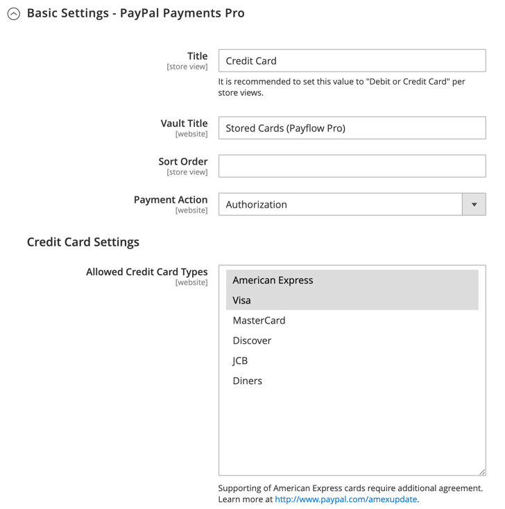

# [!UICONTROL Sales] > [!UICONTROL Payment Methods] > [!UICONTROL PayPal Payments Pro]

>[!IMPORTANT]
>
>**PSD2 の要件：**  
>2019 年 9 月 14 日の時点で、ヨーロッパの銀行は満たされていない支払いを拒否する可能性があります [PSD2](../../getting-started/compliance-payment-services-directive.md) 要件 PSD2 に準拠するには [!DNL PayPal Payments Pro] と統合する必要があります。 [!DNL Cardinal Commerce]. 詳しくは、 [ペイフロー用の 3-D セキュア](https://developer.paypal.com/api/nvp-soap/payflow/3d-secure-overview/).

{{config}}

## [!UICONTROL Required Settings]

<!-- zoom -->

| フィールド | [範囲](../../getting-started/websites-stores-views.md#scope-settings) | 説明 |
|--- |--- |--- |
| [!UICONTROL Email Associated with PayPal Merchant Account] | Web サイト | （任意） PayPal マーチャントアカウントに関連付けられているメールアドレス。 メールアドレスは大文字と小文字が区別され、アカウントのアドレスと完全に一致する必要があります。 |
| [!UICONTROL Partner] | Web サイト | PayPal パートナー ID （該当する場合）。 |
| [!UICONTROL Vendor] | Web サイト | PayPal ユーザーログイン名。 |
| ユーザー | Web サイト | PayPal アカウントの別のユーザーの ID。 |
| [!UICONTROL Password] | Web サイト | PayPal マーチャントアカウントに関連付けられているパスワード。 |
| [!UICONTROL Test Mode] | Web サイト | 有効にすると、テスト環境で PayPal Payments Pro を実行します。 実稼動モードで「運用を開始」する準備が整ったら、テストモードをオフにします。 オプション： `Yes` / `No` |
| [!UICONTROL Use Proxy] | Web サイト | プロキシは、サーバーファイアウォールが PayPal サーバーへの直接アクセスを妨げる場合に、トラフィックをリダイレクトするために使用できます。 該当する場合、は PayPal サーバーとの接続を確立するために使用されるプロキシサーバーを識別します。 オプション： `Yes` / `No`   有効な場合、次のオプションを設定します。  **プロキシホスト** - プロキシホストの IP アドレス。  **プロキシポート** - プロキシポートの番号。 |
| [!UICONTROL Enable this Solution] | Web サイト | お客様が PayPal Payments Pro を支払い方法として利用できるかどうかを決定します。 |
| [!UICONTROL Enable PayPal Credit] | Web サイト | PayPal クレジットを支払いオプションとして顧客が利用できるかどうかを決定します。 |

{style="table-layout:auto"}

## [!UICONTROL Advertise PayPal Credit]

<!-- zoom -->

| フィールド | [範囲](../../getting-started/websites-stores-views.md#scope-settings) | 説明 |
|--- |--- |--- |
| [!UICONTROL Publisher ID] | Web サイト | PayPal クレジットアカウントに関連付けられたパブリッシャー ID。 |
| [!UICONTROL Get Publisher ID from PayPal] |  | PayPal からパブリッシャー ID を取得します。 |
| [!UICONTROL Home Page] | Web サイト | の位置とサイズを決定します [!DNL PayPal Credit] ホームページのバナー。 オプション：  **`Display`**– 次の場合に判断します[!DNL PayPal Credit] バナーは、ストアのホームページに表示されます。 オプション： `Yes` / `No` **`Position`**  – の位置を指定します [!DNL PayPal Credit] ホームページのバナー。 オプション：ヘッダー（中央）/サイドバー（右）  **`Size`**– のサイズを決定します [!DNL PayPal Credit] ホームページのバナー。 オプション： `190 x 100` / `234 x 60` / `300 x 50` / `468 x 60` / `728 x 90` /` 800 x 66` |
| [!UICONTROL Catalog Category Page] | Web サイト | の位置とサイズを決定します [!DNL PayPal Credit] カテゴリページのバナー。 オプション：（と同じ [!UICONTROL Home Page]） |
| [!UICONTROL Catalog Product Page] | Web サイト | の位置とサイズを決定します [!DNL PayPal Credit] 製品ページのバナー オプション：（と同じ [!UICONTROL Home Page]） |
| [!UICONTROL Checkout Cart Page] | Web サイト | の位置とサイズを決定します [!DNL PayPal Credit] カートのページのバナー。 オプション：（と同じ [!UICONTROL Home Page]） |

{style="table-layout:auto"}

## [!UICONTROL Basic Settings - PayPal Payments Pro]

<!-- zoom -->

| フィールド | [範囲](../../getting-started/websites-stores-views.md#scope-settings) | 説明 |
|--- |--- |--- |
| [!UICONTROL Title] | ストア表示 | チェックアウト時の支払い方法として PayPal Payments Pro を識別する名前。 |
| [!UICONTROL Sort Order] | ストア表示 | チェックアウト時に他の支払い方法と一緒にリストされたときに PayPal Payments Pro が表示される順序を決定する数値です。 |
| [!UICONTROL Payment Action] | Web サイト | 注文が送信されたときに PayPal が実行するアクションを決定します。 オプション：  **`Authorization`**– 購入を承認しますが、資金を保留します。 この金額は、マーチャントによって「キャプチャ」されるまで引き出されません。 **`Sale`**  – 購入金額が承認され、すぐにお客様のアカウントから引き出されます。 |
| [!UICONTROL Credit Card Settings] |  |  |
| [!UICONTROL Allowed Credit Cart Types] | Web サイト | チェックアウト時に顧客が使用できるクレジットカードを決定します。 サポートされている各カードを選択します。 オプション： `American Express` （追加契約が必要） / `Visa` / `MasterCard` / `Discover` / `JCB` |

{style="table-layout:auto"}

## [!UICONTROL Advanced Settings]

<!-- zoom -->

| フィールド | [範囲](../../getting-started/websites-stores-views.md#scope-settings) | 説明 |
|--- |--- |--- |
| [!UICONTROL Payment Applicable From] | Web サイト | 該当する国の選択を決定します。 オプション： `All Allowed Countries` / `Specific Countries` |
| [!UICONTROL Countries Payment Applicable From] | Web サイト | 支払いが受け入れられる各国を識別します。 この支払い方法で購入できるのは、選択した国の請求先住所を持つお客様のみです。 |
| [!UICONTROL Debug Mode] | Web サイト | ストアと支払いシステム間で送信されたメッセージをログ ファイルに記録します。 オプション： `Yes` / `No`   **_注意：_**ログファイルはサーバーに保存され、開発者のみがアクセスできます。 PCI Data Security Standards に従い、クレジットカード情報はログファイルに記録されません。 |
| [!UICONTROL Enable SSL Verification] | Web サイト | トランザクションが発生する前に、ホスト上のセキュリティで保護されたチャネルを検証するかどうかを決定します。 オプション： `Yes` / `No` |
| [!UICONTROL Require CVV Entry] | Web サイト | 顧客がクレジット カードの裏面から CVV コードを入力する必要があるかどうかを決定します。 オプション： `Yes` / `No` |
| **[!UICONTROL CVV and AVS Settings]** |  |  |
| _[!UICONTROL Reject Transaction if:]_ |  |  |
| [!UICONTROL AVS Street Does Not Match] | Web サイト | 住所の確認サービスが住所がシステム内の情報と一致しないと判断した場合に実行されるアクションを決定します。 オプション： `Yes` / `No` |
| [!UICONTROL AVS Zip Does Not Match] | Web サイト | 住所の確認サービスによって郵便番号がシステム内の情報と一致しないと判断された場合に実行されるアクションを決定します。 オプション： `Yes` / `No` |
| [!UICONTROL International AVS Indicator Does Not Match] | Web サイト | アドレス確認サービスが、国際識別子がシステム内の情報と一致しないと判断した場合に実行されるアクションを決定します。 オプション： `Yes` / `No` |
| [!UICONTROL Card Security Code Does Not Match] | Web サイト | 顧客が入力した CVV セキュリティ コードがシステム内の情報と一致しない場合に実行されるアクションを決定します。 オプション： `Yes` / `No` |

{style="table-layout:auto"}

## [!UICONTROL Settlement Report Settings]

<!-- zoom -->

| フィールド | [範囲](../../getting-started/websites-stores-views.md#scope-settings) | 説明 |
|--- |--- |--- |
| [!UICONTROL Login] | Web サイト | PayPal のセキュア FTP サーバーにログインするために必要なユーザー名。 |
| [!UICONTROL Password] | Web サイト | PayPal のセキュア FTP サーバーにログインするために必要なパスワード。 |
| [!UICONTROL Sandbox Mode] | Web サイト | 有効にすると、実稼動環境で「実稼動」になる前に、テスト環境でレポートを実行します。 オプション： `Yes` / `No` |
| [!UICONTROL Custom Endpoint Hostname or IP-Address] | Web サイト | 決済レポートを管理する URL。 デフォルト値 `reports.paypal.com` |
| [!UICONTROL Custom Path] | Web サイト | 決済レポートがサーバー上に保存されるパス。 デフォルト値 `/ppreports/outgoing` |
| [!UICONTROL Scheduled Fetching] |  |  |
| [!UICONTROL Enable Automatic Fetching] | Web サイト | 有効化すると、スケジュールに従って決済レポートが自動的に取得されます。 オプション： `Yes` / `No` |
| [!UICONTROL Schedule] | グローバル | PayPal によって決済レポートが生成される頻度を決定します。 オプション： `Daily` / `Every 3 days` / `Every 7 days` / `Every 10 days` / `Every 14 days` / `Every 30 days` / `Every 40 days` |
| [!UICONTROL Time of Day] | グローバル | 決済レポートが生成される時間、分、および秒を決定します。 |

{style="table-layout:auto"}

## [!UICONTROL Frontend Experience Settings]

<!-- zoom -->

| フィールド | [範囲](../../getting-started/websites-stores-views.md#scope-settings) | 説明 |
|--- |--- |--- |
| [!UICONTROL PayPal Product Logo] | ストア表示 | ストアに表示される PayPal ロゴを決定します。 2 つのサイズには 4 つの基本スタイルがあります。 オプション： `No Logo` / `We prefer PayPal (150 x 60)` / `We prefer PayPal (150 x 40)` / `Now accepting PayPal (150 x 60)` / `Now accepting PayPal (150 x 40)` / `Payments by PayPal (150 x 60)` / `Payments by PayPal (150 x 40)` / `Shop now using (150 x 60)` / `Shop now using (150 x 40)` |
| **[!UICONTROL PayPal Merchant Pages Style]** |  |  |
| [!UICONTROL Page Style] | ストア表示 | PayPal マーチャントページの外観を決定します。 使用できる値：  **`paypal`**- PayPal ページスタイルを使用します。 **`primary`** - アカウントプロファイルで「プライマリ」スタイルとして識別したページスタイルを使用します。  **`your_custom_value`**- アカウントプロファイルで指定されているカスタム支払いページスタイルを使用します。 |
| [!UICONTROL Header Image URL] | ストア表示 | チェックアウトページの左上隅に表示される画像の URL。 最大サイズは 750 x 90 ピクセルです。   **_注意：_**PayPal では、画像を安全な（https）サーバーに保存することをお勧めします。 そうしないと、顧客のブラウザーで「ページにセキュアな項目とセキュアでない項目の両方が含まれています」と警告される場合があります。 |
| [!UICONTROL Header Image Background Color] | ストア表示 | 六文字 [16 進色](https://en.wikipedia.org/wiki/Web_colors) チェックアウトページのヘッダーの背景色のコード。 コードは、大文字でも小文字でも入力できます。 |
| [!UICONTROL Header Image Border Color] | ストア表示 | ヘッダーの周囲の 2 ピクセルの境界線を表す、6 文字の 16 進数のカラーコード。 |
| [!UICONTROL Page Background Color] | ストア表示 | ヘッダーと支払いフォームの後ろに表示される、チェックアウトページの背景色の 6 文字の 16 進数カラーコード。 |

{style="table-layout:auto"}

## [!UICONTROL Basic Settings - PayPal Express Checkout]

<!-- zoom -->

| フィールド | [範囲](../../getting-started/websites-stores-views.md#scope-settings) | 説明 |
|--- |--- |--- |
| [!UICONTROL Title] | ストア表示 | チェックアウト時の PayPal Express チェックアウト支払い方法を識別する名前。 |
| [!UICONTROL Sort Order] | ストア表示 | チェックアウト時に他のお支払い方法と一緒にリストされた場合に、PayPal Express チェックアウトが表示される順序を決定する数字です。 リストの先頭に 0 を入力します。 |
| [!UICONTROL Payment Action] | Web サイト | 注文を受け取った際に PayPal が実行するアクションを決定します。 オプション：  **`Authorization`**– 購入を承認しますが、資金を保留します。 この金額は、マーチャントによって「キャプチャ」されるまで引き出されません。 **`Sale`**  – 購入金額が承認され、すぐにお客様のアカウントから引き出されます。  **`Order`**– 指定された期間内にマーチャントが顧客のバイヤーアカウントから注文された合計を上限とする 1 つ以上の金額を取得できる PayPal との契約を表します。 これは最大 29 日間有効です。 資金を取得するには、Commerce管理者から 1 つ以上の請求書を生成する必要があります。 |
| [!UICONTROL URL Display on Product Details Page] | ストア表示 | 製品ページに「PayPal でチェックアウト」ボタンを表示するかどうかを決定します。 オプション： `Yes` / `No` |

{style="table-layout:auto"}

## [!UICONTROL PayPal Express Checkout - Advanced Settings]

<!-- zoom -->

| フィールド | [範囲](../../getting-started/websites-stores-views.md#scope-settings) | 説明 |
|--- |--- |--- |
| [!UICONTROL Display on Shopping Cart] | ストア表示 | PayPal Express チェックアウトが買い物かごに支払いオプションとして表示されるかどうかを決定します。 オプション： `Yes` （PayPal はこのオプションを推奨しています） / `No` |
| [!UICONTROL Payment Action Applicable From] | Web サイト | 適用可能な国選択の範囲を決定します。 オプション： `All Allowed Countries` / `Specific Countries` |
| [!UICONTROL Countries Payment Applicable From] | Web サイト | 支払いが受け入れられる各国を識別します。 この支払い方法で購入できるのは、選択した国の請求先住所を持つお客様のみです。 |
| [!UICONTROL Debug Mode] | Web サイト | ストアと PayPal 支払いシステム間で送信されたメッセージをログファイルに記録します。 オプション： `Yes` / `No`   **_注意：_**ログファイルはサーバーに保存され、開発者のみがアクセスできます。 PCI Data Security Standards に従い、クレジットカード情報はログファイルに記録されません。 |
| [!UICONTROL Enable SSL Verification] | Web サイト | ホスト セキュリティ証明書の検証を有効にします。 オプション： `Yes` / `No` |
| [!UICONTROL Transfer Cart Line Items] | Web サイト | PayPal サイトの顧客の買い物かごからの明細項目の完全な概要を表示します。 オプション： `Yes` / `No` |
| [!UICONTROL Skip Order Review Step] | Web サイト | 顧客が PayPal サイトからトランザクションを完了できるか、またはストアに戻って注文を送信する前に注文レビュー手順を完了する必要があるかを決定します。 オプション： `Yes` / `No` |

{style="table-layout:auto"}
