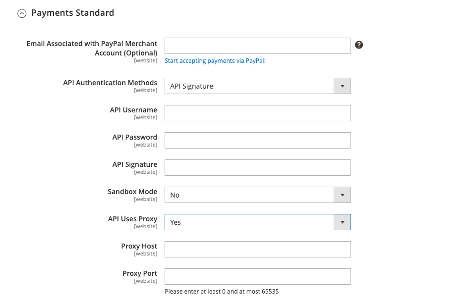
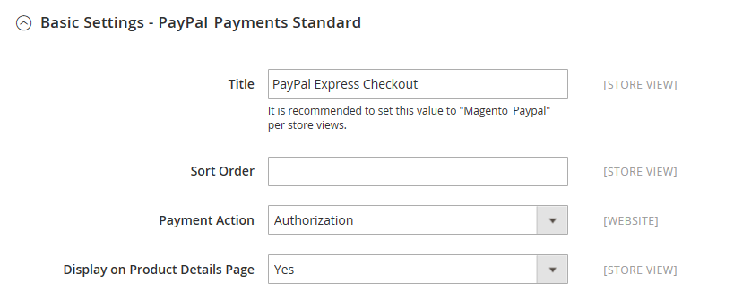

# [!UICONTROL Sales] > [!UICONTROL Payment Methods] > [!UICONTROL PayPal Payments Standard]

>[!IMPORTANT]
>
>**PSD2 の要件：** 
>2019 年 9 月 14 日現在、ヨーロッパの銀行は、満たさない支払いを辞退する可能性があります [PSD2](../../getting-started/compliance-payment-services-directive.md) 要件。 次の操作は必要ありません： [!DNL PayPal Payments Standard] すべての要件が PayPal で処理されるので、PSD2 に準拠する。

{{config}}

## [!UICONTROL Required Settings]

<!-- zoom -->

| フィールド | [範囲](../../getting-started/websites-stores-views.md#scope-settings) | 説明 |
|--- |--- |--- |
| [!UICONTROL Email Associated with PayPal Merchant Account] | Web サイト | （オプション） PayPal マーチャントアカウントに関連付けられている電子メールアドレス。 電子メールアドレスでは大文字と小文字が区別され、アカウント内のアドレスと完全に一致する必要があります。 |
| [!UICONTROL Partner] | Web サイト | PayPal パートナー ID（該当する場合）。 |
| [!UICONTROL Vendor] | Web サイト | PayPal ユーザーのログイン名。 |
| ユーザー | Web サイト | PayPal アカウント上の別のユーザーの ID。 |
| [!UICONTROL Password] | Web サイト | PayPal マーチャントアカウントに関連付けられたパスワード。 |
| [!UICONTROL Test Mode] | Web サイト | 有効にすると、はテスト環境で PayPal Payments Pro を実行します。 実稼働モードで「運用開始」の準備が整ったら、テストモードをオフにします。 オプション： `Yes` / `No` |
| [!UICONTROL Use Proxy] | Web サイト | プロキシは、サーバーファイアウォールが PayPal サーバーへの直接アクセスを禁止している場合に、トラフィックをリダイレクトするために使用できます。 該当する場合は、PayPal サーバーとの接続を確立するために使用されるプロキシサーバーを識別します。 オプション： `Yes` / `No`   有効にした場合は、次のオプションを設定します。  **`Proxy Host`**— プロキシホストの IP アドレス。 **`Proxy Port`**  — プロキシポートの番号。 |
| [!UICONTROL Enable this Solution] | Web サイト | PayPal Payments Pro をお客様が支払い方法として利用できるかどうかを指定します。 |
| [!UICONTROL Enable PayPal Credit] | Web サイト | PayPal クレジットをお客様が支払いオプションとして利用できるかどうかを指定します。 |

{style="table-layout:auto"}

## PayPal クレジットの宣伝

<!-- zoom -->

| フィールド | [範囲](../../getting-started/websites-stores-views.md#scope-settings) | 説明 |
|--- |--- |--- |
| [!UICONTROL Publisher ID] | Web サイト | PayPal クレジットアカウントに関連付けられた発行者 ID です。 |
| [!UICONTROL Get Publisher ID from PayPal] |  | PayPal から Publisher ID を取得します。 |
| [!UICONTROL Home Page] | Web サイト | の位置とサイズを決定します。 [!DNL PayPal Credit] バナーをホームページに表示します。 オプション：  **`Display`**— 次の条件を満たすかどうかを決定します。 [!DNL PayPal Credit] バナーがストアのホームページに表示されます。 オプション： `Yes` / `No` **`Position`** - [!DNL PayPal Credit] バナーをホームページに表示します。 オプション： `Header (center)` / `Sidebar (right)`  **`Size`**— サイズを決定します [!DNL PayPal Credit] バナーをホームページに表示します。 オプション： `190 x 100` / `234 x 60` / `300 x 50` / `468 x 60` / `728 x 90` /` 800 x 66` |
| [!UICONTROL Catalog Category Page] | Web サイト | の位置とサイズを決定します。 [!DNL PayPal Credit] カテゴリページのバナー。 オプション： （の場合と同じ） [!UICONTROL Home Page]) |
| [!UICONTROL Catalog Product Page] | Web サイト | の位置とサイズを決定します。 [!DNL PayPal Credit] 製品ページのバナー。 オプション： （の場合と同じ） [!UICONTROL Home Page]) |
| [!UICONTROL Checkout Cart Page] | Web サイト | の位置とサイズを決定します。 [!DNL PayPal Credit] 買い物かごページのバナー。 オプション： （の場合と同じ） [!UICONTROL Home Page]) |

{style="table-layout:auto"}

## [!UICONTROL Basic Settings - PayPal Payments Standard]

<!-- zoom -->

| フィールド | [範囲](../../getting-started/websites-stores-views.md#scope-settings) | 説明 |
|--- |--- |--- |
| [!UICONTROL Title] | ストア表示 | チェックアウト時の支払い方法として PayPal Payments Pro を識別する名前。 |
| [!UICONTROL Sort Order] | ストア表示 | チェックアウト時に他の支払い方法と共にリストされた場合に PayPal Payments Pro が表示される順序を決定する数値です。 |
| [!UICONTROL Payment Action] | Web サイト | 注文が送信されたときに PayPal が実行するアクションを決定します。 オプション：  **`Authorization`**・買い付けを承認するが、資金を保留する。 その金額は、商人によって「取り込まれる」まで引き落とされません。 **`Sale`**  — 購入金額は、お客様のアカウントから承認され、直ちに取り下げられます。 |
| [!UICONTROL Credit Card Settings] |  |  |
| [!UICONTROL Allowed Credit Cart Types] | Web サイト | 顧客がチェックアウト時に使用できるクレジットカードを決定します。 サポートされている各カードを選択します。 オプション： `American Express` （追加の契約が必要） / `Visa` / `MasterCard` / `Discover` / `JCB` |

{style="table-layout:auto"}

## [!UICONTROL Advanced Settings]

<!-- zoom -->

| フィールド | 範囲 | 説明 |
|--- |--- |--- |
| [!UICONTROL Display on Shopping Cart] | ストア表示 | PayPal Express Checkout が買い物かごの支払いオプションとして表示されるかどうかを指定します。 オプション： `Yes` （推奨） / `No` |
| [!UICONTROL Payment Action Applicable From] | Web サイト | 適用可能な国の選択範囲を決定します。 オプション： `All Allowed Countries` / `Specific Countries` |
| [!UICONTROL Countries Payment Applicable From] | Web サイト | 支払が受け入れられた国を識別します。 選択した国の請求先住所を持つ顧客のみが、この支払い方法で購入を行うことができます。 |
| [!UICONTROL Debug Mode] | Web サイト | ストアと PayPal 支払いシステム間で送信されたメッセージをログファイルに記録します。 オプション： `Yes` / `No`   **_注意：_**ログファイルはサーバーに保存され、開発者のみがアクセスできます。 PCI データセキュリティ基準に従って、クレジットカード情報はログファイルに記録されません。 |
| [!UICONTROL Enable SSL Verification] | Web サイト | ホストセキュリティ証明書の検証を有効にします。 オプション： `Yes` / `No` |
| [!UICONTROL Transfer Cart Line Items] | Web サイト | PayPal サイト上の顧客の買い物かごからの行項目の完全な概要を表示します。 オプション： `Yes` / `No` |
| [!UICONTROL Transfer Shipping Options] | Web サイト | PayPal サイトに最大 10 個の送料オプションを含みます。 オプション： `Yes` / `No` |
| [!UICONTROL Shortcut Buttons Flavor] | ストア表示 | PayPal の許可ボタンに使用する画像の種類を決定します。 オプション：  **`Dynamic`**- （推奨） PayPal サーバーから動的に変更できる画像を表示します。 **`Static`**  — 動的に変更できない静的画像を表示します。 |
| [!UICONTROL Enable PayPal Guest Checkout] | Web サイト | PayPal アカウントを持たないお客様が PayPal Express Checkout で購入できるようにします。 オプション： `Yes` / `No` |
| [!UICONTROL Require Customer's Billing Address] | Web サイト | 顧客の請求先住所が必須かどうかを決定します。 オプション： `Yes` / `No` / `For Virtual Quotes Only` |
| [!UICONTROL Billing Agreement Signup] | Web サイト | 顧客が [請求契約](../../stores-purchase/paypal-billing-agreements.md) お客様のストアに置き換えます。 オプション：  **`Auto`**— お客様は、高速チェックアウト時に請求契約に新規登録できます。 **`Ask Customer`** ：顧客は、請求契約に新規登録するかどうかを尋ねられます。  **`Never`**：お客様には、請求契約への新規登録オプションは提供されません。 |
| [!UICONTROL Skip Order Review Step] | Web サイト | 顧客が PayPal サイトからトランザクションを完了できるか、またはストアに戻って注文を送信する前に注文の確認手順を完了する必要があるかを指定します。 オプション： `Yes` / `No` |

{style="table-layout:auto"}

## [!UICONTROL Billing Agreement Setting]

<!-- zoom -->

| フィールド | 範囲 | 説明 |
|--- |--- |--- |
| [!UICONTROL Enabled] | Web サイト | 有効にすると、請求契約は顧客に対して、チェックアウト時に支払いオプションとして表示されます。 オプション： `Yes` / `No` |
| [!UICONTROL Title] | ストア表示 | チェックアウト時に支払いオプションとして表示される PayPal 請求契約オプションのラベル。 |
| [!UICONTROL Sort Order] | ストア表示 | 請求契約がチェックアウト時に他の支払い方法と共に表示される順序を決定します。 |
| [!UICONTROL Payment Action] | Web サイト | PayPal によるトランザクションの管理方法を決定します。オプション：  **`Authorization`**・買い付けを承認するが、資金を保留する。 その金額は、商人によって「取り込まれる」まで引き落とされません。 **`Sale`**  — 購入金額は、お客様のアカウントから承認され、直ちに取り下げられます。 |
| [!UICONTROL Payment Applicable From] | Web サイト | 適用可能な国の選択範囲を決定します。 オプション： `All Allowed Countries` / `Specific Countries` |
| [!UICONTROL Countries Payment Applicable From] | Web サイト | 支払が受け入れられた国を識別します。 選択した国の請求先住所を持つ顧客のみが、この支払い方法で購入を行うことができます。 |
| [!UICONTROL Debug Mode] | Web サイト | 支払いシステムとの通信をログファイルに記録します。 オプション： `Yes` / `No`   **_注意：_**ログファイルはサーバーに保存され、開発者のみがアクセスできます。 PCI データセキュリティ基準に従って、クレジットカード情報はログファイルに記録されません。 |
| [!UICONTROL Enable SSL Verification] | Web サイト | 暗号化された SSL チャネルを介してトランザクションが確実に実行されるように、を検証する手順を有効にします。 オプション： `Yes` / `No` |
| [!UICONTROL Transfer Cart Line Items] | Web サイト | 有効にすると、PayPal の支払いページに、買い物かごの行項目の概要が表示されます。 オプション： `Yes` / `No` |
| [!UICONTROL Allow in Billing Agreement Wizard] | Web サイト | 有効にすると、顧客は顧客アカウントのダッシュボードから請求契約を開始できます。 |

{style="table-layout:auto"}

## [!UICONTROL Settlement Report Settings]

<!-- zoom -->

| フィールド | [範囲](../../getting-started/websites-stores-views.md#scope-settings) | 説明 |
|--- |--- |--- |
| [!UICONTROL Login] | Web サイト | PayPal のセキュア FTP サーバにログインするために必要なユーザ名。 |
| [!UICONTROL Password] | Web サイト | PayPal のセキュア FTP サーバにログインするために必要なパスワード。 |
| [!UICONTROL Sandbox Mode] | Web サイト | 有効にすると、実稼動環境で「運用を開始」する前に、テスト環境でレポートが実行されます。 オプション： `Yes` / `No` |
| [!UICONTROL Custom Endpoint Hostname or IP-Address] | Web サイト | 決済レポートが管理される URL。 デフォルト値： `reports.paypal.com` |
| [!UICONTROL Custom Path] | Web サイト | 決済レポートがサーバー上に保存されるパス。 デフォルト値： `/ppreports/outgoing` |
| [!UICONTROL Scheduled Fetching] |  |  |
| [!UICONTROL Enable Automatic Fetching] | Web サイト | 有効にすると、決済レポートがスケジュールに従って自動的に取得されます。 オプション： `Yes` / `No` |
| [!UICONTROL Schedule] | グローバル | PayPal によって決済レポートが生成される頻度を決定します。 オプション： `Daily` / `Every 3 days` / `Every 7 days` / `Every 10 days` / `Every 14 days` / `Every 30 days` / `Every 40 days` |
| [!UICONTROL Time of Day] | グローバル | 決済レポートが生成される時間、分、秒を決定します。 |

{style="table-layout:auto"}

## [!UICONTROL Frontend Experience Settings]

<!-- zoom -->

| フィールド | [範囲](../../getting-started/websites-stores-views.md#scope-settings) | 説明 |
|--- |--- |--- |
| [!UICONTROL PayPal Product Logo] | ストア表示 | ストアに表示される PayPal ロゴを指定します。 2 つのサイズに 4 つの基本的なスタイルがあります。 オプション： `No Logo` / `We prefer PayPal (150 x 60)` / `We prefer PayPal (150 x 40)` / `Now accepting PayPal (150 x 60)` / `Now accepting PayPal (150 x 40)` / `Payments by PayPal (150 x 60)` / `Payments by PayPal (150 x 40)` / `Shop now using (150 x 60)` / `Shop now using (150 x 40)` |
| [!UICONTROL PayPal Merchant Pages Style] |  |  |
| [!UICONTROL Page Style] | ストア表示 | PayPal マーチャントページの外観を決定します。 許可されている値：  **`paypal`**- PayPal ページスタイルを使用します。 **`primary`**  — アカウントプロファイルで「プライマリ」スタイルとして指定したページスタイルを使用します。  **`your_custom_value`**— アカウントプロファイルで指定されたカスタムの支払いページスタイルを使用します。 |
| [!UICONTROL Header Image URL] | ストア表示 | チェックアウトページの左上隅に表示される画像の URL。 最大サイズは 750 x 90 ピクセルです。   **_注意：_**PayPal では、画像をセキュアな (https) サーバーに保存することをお勧めします。 そうしないと、顧客のブラウザーが、「ページにセキュリティで保護された項目とセキュリティで保護されていない項目の両方が含まれている」と警告する場合があります。 |
| [!UICONTROL Header Image Background Color] | ストア表示 | 六字 [16 進数の色](https://en.wikipedia.org/wiki/Web_colors) チェックアウトページのヘッダーの背景色のコード。 コードは、大文字と小文字のどちらでも入力できます。 |
| [!UICONTROL Header Image Border Color] | ストア表示 | ヘッダーの周囲の 2 ピクセル境界線に対する 6 文字の 16 進カラーコードです。 |
| [!UICONTROL Page Background Color] | ストア表示 | ヘッダーと支払いフォームの後ろに表示されるチェックアウトページの背景色の 6 文字の 16 進数カラーコードです。 |

{style="table-layout:auto"}
