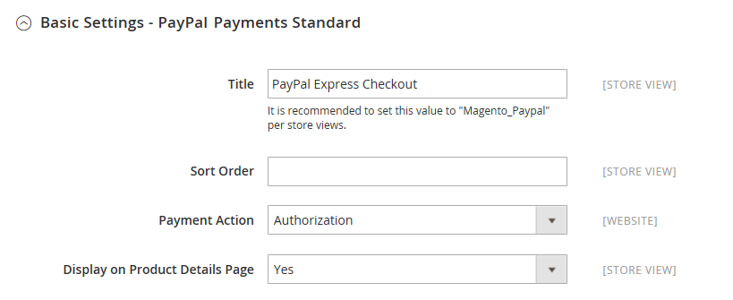

# [!UICONTROL Sales] > [!UICONTROL Payment Methods] > [!UICONTROL PayPal Payments Standard]

>[!IMPORTANT]
>
>**PSD2の要件：** 
>2019年9月14日の時点で、ヨーロッパの銀行は[PSD2](../../getting-started/compliance-payment-services-directive.md)の要件を満たさない支払いを拒否する可能性があります。すべての要件はPayPalによって処理されるため、[!DNL PayPal Payments Standard]がPSD2に準拠するために何もする必要はありません。

{{config}}

## [!UICONTROL Required Settings]

<!-- zoom -->

| フィールド | [範囲](../../getting-started/websites-stores-views.md#scope-settings) | 説明 |
|--- |--- |--- |
| [!UICONTROL Email Associated with PayPal Merchant Account] | web サイト | （オプション） PayPal加盟店アカウントに関連付けられているメールアドレス。 メールアドレスでは大文字と小文字が区別されるため、アカウント内のアドレスと完全に一致する必要があります。 |
| [!UICONTROL Partner] | web サイト | PayPal パートナーID （該当する場合）。 |
| [!UICONTROL Vendor] | web サイト | PayPal ユーザーログイン名。 |
| ユーザー | web サイト | PayPal アカウントの別のユーザーのID。 |
| [!UICONTROL Password] | web サイト | PayPal加盟店アカウントに関連付けられているパスワード。 |
| [!UICONTROL Test Mode] | web サイト | 有効にすると、テスト環境でPayPal Payments Proを実行します。 実稼動モードで「本番稼動」する準備ができたら、テストモードをオフにします。 オプション：`Yes` / `No` |
| [!UICONTROL Use Proxy] | web サイト | プロキシは、サーバーファイアウォールがPayPal サーバーへの直接アクセスを妨げる場合に、トラフィックをリダイレクトするために使用できます。 該当する場合は、PayPal サーバーとの接続を確立するために使用されるプロキシサーバーを識別します。 オプション：`Yes` / `No`   有効な場合は、オプションを設定します： **`Proxy Host`**- プロキシホストのIP アドレス。 **`Proxy Port`** - プロキシ ポートの番号。 |
| [!UICONTROL Enable this Solution] | web サイト | PayPal Payments Proがお客様の支払い方法として利用可能かどうかを判断します。 |
| [!UICONTROL Enable PayPal Credit] | web サイト | PayPal クレジットがお客様の支払いオプションとして利用可能かどうかを決定します。 |

{style="table-layout:auto"}

## Advertising PayPal Credit

<!-- zoom -->

| フィールド | [範囲](../../getting-started/websites-stores-views.md#scope-settings) | 説明 |
|--- |--- |--- |
| [!UICONTROL Publisher ID] | web サイト | PayPal クレジット アカウントに関連付けられている発行者ID。 |
| [!UICONTROL Get Publisher ID from PayPal] |  | PayPalからパブリッシャーIDを取得します。 |
| [!UICONTROL Home Page] | web サイト | ホームページ上の[!DNL PayPal Credit] バナーの位置とサイズを決定します。 オプション： **`Display`**- ストアのホームページに[!DNL PayPal Credit] バナーが表示されるかどうかを指定します。 オプション：`Yes` / `No` **`Position`** - ホームページ上の[!DNL PayPal Credit] バナーの位置を決定します。 オプション：`Header (center)` / `Sidebar (right)`  **`Size`**- ホームページの[!DNL PayPal Credit] バナーのサイズを決定します。 オプション：`190 x 100` / `234 x 60` / `300 x 50` / `468 x 60` / `728 x 90` /` 800 x 66` |
| [!UICONTROL Catalog Category Page] | web サイト | カテゴリーページ上の[!DNL PayPal Credit] バナーの位置とサイズを決定します。 オプション：（[!UICONTROL Home Page]と同じ） |
| [!UICONTROL Catalog Product Page] | web サイト | 商品ページ上の[!DNL PayPal Credit] バナーの位置とサイズを決定します。 オプション：（[!UICONTROL Home Page]と同じ） |
| [!UICONTROL Checkout Cart Page] | web サイト | 買い物かごページの[!DNL PayPal Credit] バナーの位置とサイズを決定します。 オプション：（[!UICONTROL Home Page]と同じ） |

{style="table-layout:auto"}

## [!UICONTROL Basic Settings - PayPal Payments Standard]

<!-- zoom -->

| フィールド | [範囲](../../getting-started/websites-stores-views.md#scope-settings) | 説明 |
|--- |--- |--- |
| [!UICONTROL Title] | ストアビュー | チェックアウト時の支払い方法としてPayPal Payments Proを識別する名前。 |
| [!UICONTROL Sort Order] | ストアビュー | チェックアウト時に他の支払い方法と共に表示されるPayPal Payments Proの表示順序を決定する番号。 |
| [!UICONTROL Payment Action] | web サイト | 注文の送信時にPayPalが実行するアクションを指定します。 オプション： **`Authorization`**– 購入を承認しますが、ファンドを保留します。 金額は、加盟店が「獲得」するまで引き落とされません。 **`Sale`** – 購入金額が承認され、お客様のアカウントから直ちに引き落とされます。 |
| [!UICONTROL Credit Card Settings] |  |  |
| [!UICONTROL Allowed Credit Cart Types] | web サイト | チェックアウト時に顧客が利用できるクレジットカードを決定します。 対応しているカードを選択します。 オプション：`American Express` （追加契約が必要） / `Visa` / `MasterCard` / `Discover` / `JCB` |

{style="table-layout:auto"}

## [!UICONTROL Advanced Settings]

<!-- zoom -->

| フィールド | 範囲 | 説明 |
|--- |--- |--- |
| [!UICONTROL Display on Shopping Cart] | ストアビュー | PayPal Express Checkoutをショッピングカートに支払いオプションとして表示するかどうかを指定します。 オプション：`Yes` （推奨） / `No` |
| [!UICONTROL Payment Action Applicable From] | web サイト | 該当する国の選択範囲を指定します。 オプション：`All Allowed Countries` / `Specific Countries` |
| [!UICONTROL Countries Payment Applicable From] | web サイト | 支払いが受け入れられる各国を示します。 この支払い方法で購入できるのは、選択した国の請求先住所を持つ顧客のみです。 |
| [!UICONTROL Debug Mode] | web サイト | ストアとPayPal支払いシステムの間で送信されたメッセージをログファイルに記録します。 オプション：`Yes` / `No`   **_Note:_** ログファイルはサーバーに保存され、開発者のみがアクセスできます。 PCI データセキュリティ基準に従い、クレジットカード情報はログファイルに記録されません。 |
| [!UICONTROL Enable SSL Verification] | web サイト | ホストのセキュリティ証明書の検証を有効にします。 オプション：`Yes` / `No` |
| [!UICONTROL Transfer Cart Line Items] | web サイト | PayPal サイトで顧客のショッピングカートから行アイテムの完全な概要を表示します。 オプション：`Yes` / `No` |
| [!UICONTROL Transfer Shipping Options] | web サイト | PayPal サイトには最大10個の配送オプションが含まれます。 オプション：`Yes` / `No` |
| [!UICONTROL Shortcut Buttons Flavor] | ストアビュー | PayPal受け入れボタンに使用する画像のタイプを指定します。 オプション： **`Dynamic`**- （推奨） PayPal サーバーから動的に変更できる画像を表示します。 **`Static`** – 動的に変更できない静止画像を表示します。 |
| [!UICONTROL Enable PayPal Guest Checkout] | web サイト | PayPal アカウントを持たないお客様は、PayPal Express Checkoutで購入できます。 オプション：`Yes` / `No` |
| [!UICONTROL Require Customer's Billing Address] | web サイト | 顧客の請求先住所が必要かどうかを指定します。 オプション：`Yes` / `No` / `For Virtual Quotes Only` |
| [!UICONTROL Billing Agreement Signup] | web サイト | お客様がストアと[請求契約書](../../stores-purchase/paypal-billing-agreements.md)を締結できるかどうかを決定します。 オプション： **`Auto`**– お客様は、Express チェックアウト中に請求契約書にサインアップできます。 **`Ask Customer`** – お客様は、請求契約書にサインアップするかどうかを尋ねられます。 **`Never`**– お客様には、請求契約書にサインアップするオプションは提供されていません。 |
| [!UICONTROL Skip Order Review Step] | web サイト | お客様がPayPal サイトからトランザクションを完了できるか、または店舗に戻って注文を送信する前に注文レビュー手順を完了する必要があるかを指定します。 オプション：`Yes` / `No` |

{style="table-layout:auto"}

## [!UICONTROL Billing Agreement Setting]

<!-- zoom -->

| フィールド | 範囲 | 説明 |
|--- |--- |--- |
| [!UICONTROL Enabled] | web サイト | 有効にすると、請求契約書がチェックアウト時に支払いオプションとして顧客に表示されます。 オプション：`Yes` / `No` |
| [!UICONTROL Title] | ストアビュー | チェックアウト時に支払いオプションとして表示されるPayPal請求契約書オプションのラベル。 |
| [!UICONTROL Sort Order] | ストアビュー | チェックアウト時に、請求契約書が他の支払い方法と共に一覧表示される順序を決定します。 |
| [!UICONTROL Payment Action] | web サイト | PayPalがトランザクションをどのように管理するかを決定します：オプション： **`Authorization`**– 購入を承認しますが、資金を保留します。 金額は、加盟店が「獲得」するまで引き落とされません。 **`Sale`** – 購入金額が承認され、お客様のアカウントから直ちに引き落とされます。 |
| [!UICONTROL Payment Applicable From] | web サイト | 該当する国の選択範囲を指定します。 オプション：`All Allowed Countries` / `Specific Countries` |
| [!UICONTROL Countries Payment Applicable From] | web サイト | 支払いが受け入れられる各国を示します。 この支払い方法で購入できるのは、選択した国の請求先住所を持つ顧客のみです。 |
| [!UICONTROL Debug Mode] | web サイト | 支払いシステムとの通信をログファイルに記録します。 オプション：`Yes` / `No`   **_Note:_** ログファイルはサーバーに保存され、開発者のみがアクセスできます。 PCI データセキュリティ基準に従い、クレジットカード情報はログファイルに記録されません。 |
| [!UICONTROL Enable SSL Verification] | web サイト | 暗号化されたSSL チャネルを介してトランザクションが確実に実行されるように、検証手順を有効にします。 オプション：`Yes` / `No` |
| [!UICONTROL Transfer Cart Line Items] | web サイト | 有効にすると、PayPalの支払いページにショッピングカートの行項目の概要が表示されます。 オプション：`Yes` / `No` |
| [!UICONTROL Allow in Billing Agreement Wizard] | web サイト | 有効にすると、顧客は顧客アカウントのダッシュボードから請求契約書を開始できます。 |

{style="table-layout:auto"}

## [!UICONTROL Settlement Report Settings]

<!-- zoom -->

| フィールド | [範囲](../../getting-started/websites-stores-views.md#scope-settings) | 説明 |
|--- |--- |--- |
| [!UICONTROL Login] | web サイト | PayPalのセキュア FTP サーバーにログインするために必要なユーザー名。 |
| [!UICONTROL Password] | web サイト | PayPalのセキュア FTP サーバーにログインするために必要なパスワード。 |
| [!UICONTROL Sandbox Mode] | web サイト | 有効にすると、実稼動環境で「本番稼動中」になる前に、テスト環境でレポートを実行します。 オプション：`Yes` / `No` |
| [!UICONTROL Custom Endpoint Hostname or IP-Address] | web サイト | 決済レポートが管理されるURL。 デフォルト値：`reports.paypal.com` |
| [!UICONTROL Custom Path] | web サイト | 決済レポートがサーバーに保存されるパス。 デフォルト値：`/ppreports/outgoing` |
| [!UICONTROL Scheduled Fetching] |  |  |
| [!UICONTROL Enable Automatic Fetching] | web サイト | 有効にすると、スケジュール時に決済レポートが自動的に取得されます。 オプション：`Yes` / `No` |
| [!UICONTROL Schedule] | グローバル | PayPalが決済レポートを生成する頻度を指定します。 オプション：`Daily` / `Every 3 days` / `Every 7 days` / `Every 10 days` / `Every 14 days` / `Every 30 days` / `Every 40 days` |
| [!UICONTROL Time of Day] | グローバル | 決済レポートが生成される時間、分、秒を指定します。 |

{style="table-layout:auto"}

## [!UICONTROL Frontend Experience Settings]

<!-- zoom -->

| フィールド | [範囲](../../getting-started/websites-stores-views.md#scope-settings) | 説明 |
|--- |--- |--- |
| [!UICONTROL PayPal Product Logo] | ストアビュー | ストアに表示されるPayPal ロゴを決定します。 2つのサイズに4つの基本スタイルがあります。 オプション：`No Logo` / `We prefer PayPal (150 x 60)` / `We prefer PayPal (150 x 40)` / `Now accepting PayPal (150 x 60)` / `Now accepting PayPal (150 x 40)` / `Payments by PayPal (150 x 60)` / `Payments by PayPal (150 x 40)` / `Shop now using (150 x 60)` / `Shop now using (150 x 40)` |
| [!UICONTROL PayPal Merchant Pages Style] |  |  |
| [!UICONTROL Page Style] | ストアビュー | PayPal マーチャントページの外観を決定します。 許可される値： **`paypal`**- PayPal ページスタイルを使用します。 **`primary`** - アカウントプロファイルで「プライマリ」スタイルとして識別したページスタイルを使用します。 **`your_custom_value`**- アカウントプロファイルで指定されたカスタム支払いページスタイルを使用します。 |
| [!UICONTROL Header Image URL] | ストアビュー | チェックアウトページの左上隅に表示される画像のURL。 最大サイズは750 x 90 ピクセルです。   **_Note:_** PayPalでは、画像を安全な（https）サーバーに保存することをお勧めします。 それ以外の場合、お客様のブラウザーは「ページに安全な項目と安全でない項目の両方が含まれています」と警告する場合があります。 |
| [!UICONTROL Header Image Background Color] | ストアビュー | チェックアウトページのヘッダーの背景色の6文字の[16進数カラー](https://en.wikipedia.org/wiki/Web_colors) コード。 コードは、大文字と小文字のどちらでも入力できます。 |
| [!UICONTROL Header Image Border Color] | ストアビュー | ヘッダーの周囲の2 ピクセル境界の6文字の16進数カラーコード。 |
| [!UICONTROL Page Background Color] | ストアビュー | ヘッダーと支払いフォームの背後に表示されるチェックアウトページの背景色の6文字の16進数カラーコード。 |

{style="table-layout:auto"}
