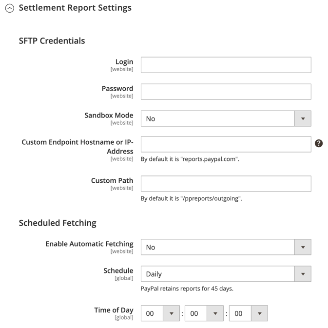

# [!UICONTROL Sales] > [!UICONTROL Payment Methods] > [!UICONTROL PayPal Payments Standard]

>[!IMPORTANT]
>
>**PSD2 の要件：** 
>2019 年 9 月 14 日（PT）現在、ヨーロッパの銀行は、[PSD2](../../getting-started/compliance-payment-services-directive.md) の要件を満たさない支払いを拒否する可能性があります。 [!DNL PayPal Payments Standard] がPSD2 を遵守する必要はありません。すべての要件が PayPal で処理されるからです。

{{config}}

## [!UICONTROL Required Settings]

<!-- zoom -->

| フィールド | [ 範囲 ](../../getting-started/websites-stores-views.md#scope-settings) | 説明 |
|--- |--- |--- |
| [!UICONTROL Email Associated with PayPal Merchant Account] | Web サイト | （任意） PayPal マーチャントアカウントに関連付けられているメールアドレス。 メールアドレスは大文字と小文字が区別され、アカウントのアドレスと完全に一致する必要があります。 |
| [!UICONTROL Partner] | Web サイト | PayPal パートナー ID （該当する場合）。 |
| [!UICONTROL Vendor] | Web サイト | PayPal ユーザーログイン名。 |
| ユーザー | Web サイト | PayPal アカウントの別のユーザーの ID。 |
| [!UICONTROL Password] | Web サイト | PayPal マーチャントアカウントに関連付けられているパスワード。 |
| [!UICONTROL Test Mode] | Web サイト | 有効にすると、テスト環境で PayPal Payments Pro を実行します。 実稼動モードで「運用を開始」する準備が整ったら、テストモードをオフにします。 オプション：`Yes` / `No` |
| [!UICONTROL Use Proxy] | Web サイト | プロキシは、サーバーファイアウォールが PayPal サーバーへの直接アクセスを妨げる場合に、トラフィックをリダイレクトするために使用できます。 該当する場合、は PayPal サーバーとの接続を確立するために使用されるプロキシサーバーを識別します。 Options: `Yes` / `No`    有効な場合、次のオプションを設定します。 **`Proxy Host`**- プロキシホストの IP アドレス。 **`Proxy Port`** - プロキシポートの番号。 |
| [!UICONTROL Enable this Solution] | Web サイト | お客様が PayPal Payments Pro を支払い方法として利用できるかどうかを決定します。 |
| [!UICONTROL Enable PayPal Credit] | Web サイト | PayPal クレジットを支払いオプションとして顧客が利用できるかどうかを決定します。 |

{style="table-layout:auto"}

## PayPal クレジットのアドバタイズ

<!-- zoom -->

| フィールド | [ 範囲 ](../../getting-started/websites-stores-views.md#scope-settings) | 説明 |
|--- |--- |--- |
| [!UICONTROL Publisher ID] | Web サイト | PayPal クレジットアカウントに関連付けられたパブリッシャー ID。 |
| [!UICONTROL Get Publisher ID from PayPal] |  | PayPal からパブリッシャー ID を取得します。 |
| [!UICONTROL Home Page] | Web サイト | ホーム ページ上の [!DNL PayPal Credit] バナーの位置とサイズを決定します。 オプション： **`Display`**- ストアのホームページに [!DNL PayPal Credit] のバナーが表示されるかどうかを決定します。 オプション：`Yes` / `No` **`Position`** - ホームページ上の [!DNL PayPal Credit] のバナーの位置を決定します。 オプション：`Header (center)`/`Sidebar (right)`  **`Size`**- ホームページの [!DNL PayPal Credit] バナーのサイズを決定します。 オプション：`190 x 100` / `234 x 60` / `300 x 50` / `468 x 60` / `728 x 90` /` 800 x 66` |
| [!UICONTROL Catalog Category Page] | Web サイト | カテゴリページ上の [!DNL PayPal Credit] のバナーの位置とサイズを決定します。 オプション：（[!UICONTROL Home Page] と同じ） |
| [!UICONTROL Catalog Product Page] | Web サイト | 製品ページ上の [!DNL PayPal Credit] バナーの位置とサイズを決定します。 オプション：（[!UICONTROL Home Page] と同じ） |
| [!UICONTROL Checkout Cart Page] | Web サイト | 買い物かごページの [!DNL PayPal Credit] のバナーの位置とサイズを決定します。 オプション：（[!UICONTROL Home Page] と同じ） |

{style="table-layout:auto"}

## [!UICONTROL Basic Settings - PayPal Payments Standard]

<!-- zoom -->

| フィールド | [ 範囲 ](../../getting-started/websites-stores-views.md#scope-settings) | 説明 |
|--- |--- |--- |
| [!UICONTROL Title] | ストア表示 | チェックアウト時の支払い方法として PayPal Payments Pro を識別する名前。 |
| [!UICONTROL Sort Order] | ストア表示 | チェックアウト時に他の支払い方法と一緒にリストされたときに PayPal Payments Pro が表示される順序を決定する数値です。 |
| [!UICONTROL Payment Action] | Web サイト | 注文が送信されたときに PayPal が実行するアクションを決定します。 オプション： **`Authorization`**– 購入を承認しますが、資金を保留します。 この金額は、マーチャントによって「キャプチャ」されるまで引き出されません。 **`Sale`** – 購入金額は許可され、すぐにお客様のアカウントから引き出されます。 |
| [!UICONTROL Credit Card Settings] |  |  |
| [!UICONTROL Allowed Credit Cart Types] | Web サイト | チェックアウト時に顧客が使用できるクレジットカードを決定します。 サポートされている各カードを選択します。 オプション：`American Express` （追加契約が必要）/`Visa`/`MasterCard`/`Discover`/`JCB` |

{style="table-layout:auto"}

## [!UICONTROL Advanced Settings]

<!-- zoom -->

| フィールド | 範囲 | 説明 |
|--- |--- |--- |
| [!UICONTROL Display on Shopping Cart] | ストア表示 | PayPal Express チェックアウトが買い物かごに支払いオプションとして表示されるかどうかを決定します。 オプション：`Yes` （推奨） / `No` |
| [!UICONTROL Payment Action Applicable From] | Web サイト | 適用可能な国選択の範囲を決定します。 オプション：`All Allowed Countries` / `Specific Countries` |
| [!UICONTROL Countries Payment Applicable From] | Web サイト | 支払いが受け入れられる各国を識別します。 この支払い方法で購入できるのは、選択した国の請求先住所を持つお客様のみです。 |
| [!UICONTROL Debug Mode] | Web サイト | ストアと PayPal 支払いシステム間で送信されたメッセージをログファイルに記録します。 オプション：`Yes` / `No`   **_注意：_**ログファイルはサーバーに保存され、開発者のみがアクセスできます。 PCI Data Security Standards に従い、クレジットカード情報はログファイルに記録されません。 |
| [!UICONTROL Enable SSL Verification] | Web サイト | ホスト セキュリティ証明書の検証を有効にします。 オプション：`Yes` / `No` |
| [!UICONTROL Transfer Cart Line Items] | Web サイト | PayPal サイトの顧客の買い物かごからの明細項目の完全な概要を表示します。 オプション：`Yes` / `No` |
| [!UICONTROL Transfer Shipping Options] | Web サイト | PayPal サイトに最大 10 の配送オプションが含まれます。 オプション：`Yes` / `No` |
| [!UICONTROL Shortcut Buttons Flavor] | ストア表示 | PayPal 受け入れボタンに使用する画像のタイプを決定します。 オプション： **`Dynamic`**- （推奨） PayPal サーバーから動的に変更できる画像を表示します。 **`Static`** – 動的に変更できない静的画像を表示します。 |
| [!UICONTROL Enable PayPal Guest Checkout] | Web サイト | PayPal アカウントをお持ちでないお客様は、PayPal Express Checkout で購入できます。 オプション：`Yes` / `No` |
| [!UICONTROL Require Customer's Billing Address] | Web サイト | 顧客の請求先住所が必須かどうかを決定します。 オプション：`Yes`/`No`/`For Virtual Quotes Only` |
| [!UICONTROL Billing Agreement Signup] | Web サイト | 顧客がストアと [ 請求契約 ](../../stores-purchase/paypal-billing-agreements.md) を締結できるかどうかを決定します。 オプション： **`Auto`**– お客様は、エクスプレスチェックアウト中に請求契約にサインアップできます。 **`Ask Customer`** – お客様は請求契約に新規登録するかどうかを尋ねられます。  **`Never`**– お客様は請求契約に新規登録するオプションを提供されません。 |
| [!UICONTROL Skip Order Review Step] | Web サイト | 顧客が PayPal サイトからトランザクションを完了できるか、またはストアに戻って注文を送信する前に注文レビュー手順を完了する必要があるかを決定します。 オプション：`Yes` / `No` |

{style="table-layout:auto"}

## [!UICONTROL Billing Agreement Setting]

<!-- zoom -->

| フィールド | 範囲 | 説明 |
|--- |--- |--- |
| [!UICONTROL Enabled] | Web サイト | 有効化すると、請求契約書がチェックアウト時に支払いオプションとして顧客に表示されます。 オプション：`Yes` / `No` |
| [!UICONTROL Title] | ストア表示 | チェックアウト時に支払いオプションとして表示される PayPal 請求契約オプションのラベル。 |
| [!UICONTROL Sort Order] | ストア表示 | チェックアウト時に他の支払い方法と共に請求契約がリストされる順序を決定します。 |
| [!UICONTROL Payment Action] | Web サイト | PayPal がトランザクションをどのように管理するかを決定します。オプション： **`Authorization`**– 購入を承認しますが、資金を保留します。 この金額は、マーチャントによって「キャプチャ」されるまで引き出されません。 **`Sale`** – 購入金額は許可され、すぐにお客様のアカウントから引き出されます。 |
| [!UICONTROL Payment Applicable From] | Web サイト | 適用可能な国選択の範囲を決定します。 オプション：`All Allowed Countries` / `Specific Countries` |
| [!UICONTROL Countries Payment Applicable From] | Web サイト | 支払いが受け入れられる各国を識別します。 この支払い方法で購入できるのは、選択した国の請求先住所を持つお客様のみです。 |
| [!UICONTROL Debug Mode] | Web サイト | 支払システムとの通信をログ ファイルに記録します。 オプション：`Yes` / `No`   **_注意：_**ログファイルはサーバーに保存され、開発者のみがアクセスできます。 PCI Data Security Standards に従い、クレジットカード情報はログファイルに記録されません。 |
| [!UICONTROL Enable SSL Verification] | Web サイト | 暗号化された SSL チャネルでトランザクションが確実に実行されるように、に対して検証手順を有効にします。 オプション：`Yes` / `No` |
| [!UICONTROL Transfer Cart Line Items] | Web サイト | 有効にすると、PayPal 支払いページの買い物かごからの明細項目の概要が表示されます。 オプション：`Yes` / `No` |
| [!UICONTROL Allow in Billing Agreement Wizard] | Web サイト | 有効にすると、顧客は、顧客アカウントのダッシュボードから請求契約を開始できます。 |

{style="table-layout:auto"}

## [!UICONTROL Settlement Report Settings]

<!-- zoom -->

| フィールド | [ 範囲 ](../../getting-started/websites-stores-views.md#scope-settings) | 説明 |
|--- |--- |--- |
| [!UICONTROL Login] | Web サイト | PayPal のセキュア FTP サーバーにログインするために必要なユーザー名。 |
| [!UICONTROL Password] | Web サイト | PayPal のセキュア FTP サーバーにログインするために必要なパスワード。 |
| [!UICONTROL Sandbox Mode] | Web サイト | 有効にすると、実稼動環境で「実稼動」になる前に、テスト環境でレポートを実行します。 オプション：`Yes` / `No` |
| [!UICONTROL Custom Endpoint Hostname or IP-Address] | Web サイト | 決済レポートを管理する URL。 デフォルト値：`reports.paypal.com` |
| [!UICONTROL Custom Path] | Web サイト | 決済レポートがサーバー上に保存されるパス。 デフォルト値：`/ppreports/outgoing` |
| [!UICONTROL Scheduled Fetching] |  |  |
| [!UICONTROL Enable Automatic Fetching] | Web サイト | 有効化すると、スケジュールに従って決済レポートが自動的に取得されます。 オプション：`Yes` / `No` |
| [!UICONTROL Schedule] | グローバル | PayPal によって決済レポートが生成される頻度を決定します。 オプション：`Daily` / `Every 3 days` / `Every 7 days` / `Every 10 days` / `Every 14 days` / `Every 30 days` / `Every 40 days` |
| [!UICONTROL Time of Day] | グローバル | 決済レポートが生成される時間、分、および秒を決定します。 |

{style="table-layout:auto"}

## [!UICONTROL Frontend Experience Settings]

<!-- zoom -->

| フィールド | [ 範囲 ](../../getting-started/websites-stores-views.md#scope-settings) | 説明 |
|--- |--- |--- |
| [!UICONTROL PayPal Product Logo] | ストア表示 | ストアに表示される PayPal ロゴを決定します。 2 つのサイズには 4 つの基本スタイルがあります。 オプション：`No Logo` / `We prefer PayPal (150 x 60)` / `We prefer PayPal (150 x 40)` / `Now accepting PayPal (150 x 60)` / `Now accepting PayPal (150 x 40)` / `Payments by PayPal (150 x 60)` / `Payments by PayPal (150 x 40)` / `Shop now using (150 x 60)` / `Shop now using (150 x 40)` |
| [!UICONTROL PayPal Merchant Pages Style] |  |  |
| [!UICONTROL Page Style] | ストア表示 | PayPal マーチャントページの外観を決定します。 許可されている値： **`paypal`**- PayPal ページスタイルを使用します。 **`primary`** - アカウントプロファイルで「プライマリ」スタイルとして識別したページスタイルを使用します。  **`your_custom_value`**- アカウントプロファイルで指定されているカスタム支払いページスタイルを使用します。 |
| [!UICONTROL Header Image URL] | ストア表示 | チェックアウトページの左上隅に表示される画像の URL。 最大サイズは 750 x 90 ピクセルです。   **_注意：_**PayPal では、画像を安全な（https）サーバーに保存することをお勧めします。 そうしないと、顧客のブラウザーで「ページにセキュアな項目とセキュアでない項目の両方が含まれています」と警告される場合があります。 |
| [!UICONTROL Header Image Background Color] | ストア表示 | チェックアウトページのヘッダーの背景色を 6 文字 [16 進数カラー ](https://en.wikipedia.org/wiki/Web_colors) のコードで表します。 コードは、大文字でも小文字でも入力できます。 |
| [!UICONTROL Header Image Border Color] | ストア表示 | ヘッダーの周囲の 2 ピクセルの境界線を表す、6 文字の 16 進数のカラーコード。 |
| [!UICONTROL Page Background Color] | ストア表示 | ヘッダーと支払いフォームの後ろに表示される、チェックアウトページの背景色の 6 文字の 16 進数カラーコード。 |

{style="table-layout:auto"}
