# [!UICONTROL Sales] > [!UICONTROL Sales Emails]

{{config}}

## [!UICONTROL General Settings]

<!-- zoom -->

<!-- [General Settings](https://experienceleague.adobe.com/en/docs/commerce-admin/systems/communications/email-communications) -->

| フィールド | [範囲](../../getting-started/websites-stores-views.md#scope-settings) | 説明 |
|--- |--- |--- |
| [!UICONTROL Asynchronous sending] | グローバル | セールスメールが非同期で送信されるかどうかを指定します。 非同期送信を有効にすることをお勧めします。 オプション： **`Disable`**- （デフォルト）イベントによってトリガーされると、セールスメールが送信されます。 **`Enable`** - （推奨）営業用メールは、所定の間隔で定期的に送信されます。 |

{style="table-layout:auto"}

## [!UICONTROL Order]

<!-- zoom -->

<!-- [Order](https://experienceleague.adobe.com/en/docs/commerce-admin/stores-sales/order-management/orders/orders) -->

| フィールド | [範囲](../../getting-started/websites-stores-views.md#scope-settings) | 説明 |
|--- |--- |--- |
| [!UICONTROL Enabled] | ストアビュー | 有効にすると、注文ごとにトランザクションメールが送信されます。 オプション：`Yes` / `No` |
| [!UICONTROL New Order Confirmation Email Sender] | ストアビュー | メッセージ送信者として表示されるストア連絡先を識別します。 既定の送信者：`Sales Representative` |
| [!UICONTROL New Order Confirmation Template] | ストアビュー | 顧客による新しい注文を確認するために送信されるテンプレートを識別します。 既定のテンプレート：`New Order` |
| [!UICONTROL New Order Confirmation Template for Guest] | ストアビュー | ゲストによる新しい注文を確認するために送信されるテンプレートを識別します。 既定のテンプレート：`New Order for Guest` |
| [!UICONTROL Send Order Email Copy To] | ストアビュー | 注文の電子メールのコピーを受け取るユーザーの電子メールアドレスを提供します。 複数のアドレスをコンマで区切ります。 |
| [!UICONTROL Send Order Email Copy Method] | ストアビュー | コピーの送信に使用するメール方法を示します。 オプションには次のものが含まれます。 **`Bcc`**– 顧客に送信されるのと同じメールのヘッダーに受信者を含めることで、盲目的の礼儀コピーを送信します。 BCC受信者は、お客様には表示されません。 **`Separate Email`** - コピーを別の電子メールとして送信します。 |

{style="table-layout:auto"}

## [!UICONTROL Order Comments]

<!-- zoom -->

<!-- [Order Comments](https://experienceleague.adobe.com/en/docs/commerce-admin/stores-sales/order-management/orders/order-processing#process-an-order) -->

| フィールド | [範囲](../../getting-started/websites-stores-views.md#scope-settings) | 説明 |
|--- |--- |--- |
| [!UICONTROL Enabled] | ストアビュー | 有効にすると、注文コメントごとにトランザクションメールが送信されます。 オプション：`Yes` / `No` |
| [!UICONTROL Order Comment Email Sender] | ストアビュー | メッセージ送信者として表示されるストア連絡先を識別します。 既定の送信者：`Sales Representative` |
| [!UICONTROL Order Comment Email Template] | ストアビュー | 顧客の注文にコメントが追加されたときに送信されるテンプレートを識別します。 既定のテンプレート：`Order Update` |
| [!UICONTROL New Order Confirmation Template for Guest] | ストアビュー | ゲスト注文にコメントが追加されたときに送信されるテンプレートを識別します。 既定のテンプレート：`Order Update for Guest` |
| [!UICONTROL Send Order Email Copy To|Store View] | 注文コメントの電子メールのコピーを受け取るユーザーの電子メールアドレスを指定します。 複数のアドレスをコンマで区切ります。 |
| [!UICONTROL Send Order Email Copy Method] | ストアビュー | コピーの送信に使用するメソッドを示します。 オプションには次のものが含まれます。 **`Bcc`**– 顧客に送信されるのと同じメールのヘッダーに受信者を含めることで、盲目的の礼儀コピーを送信します。 BCC受信者は、お客様には表示されません。 **`Separate Email`** - コピーを別の電子メールとして送信します。 |

{style="table-layout:auto"}

## [!UICONTROL Invoice]

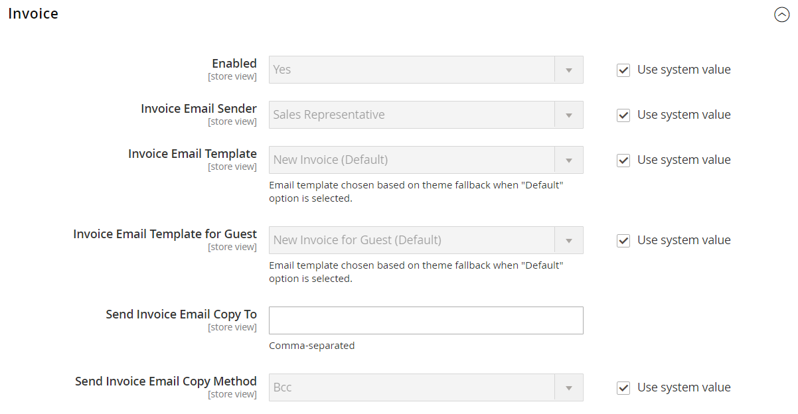<!-- zoom -->

<!-- [Invoice](https://experienceleague.adobe.com/en/docs/commerce-admin/stores-sales/order-management/invoices) -->

| フィールド | [範囲](../../getting-started/websites-stores-views.md#scope-settings) | 説明 |
|--- |--- |--- |
| [!UICONTROL Enabled] | ストアビュー | 有効にすると、生成された請求書ごとにトランザクションメールが送信されます。 オプション：`Yes` / `No` |
| [!UICONTROL Invoice Email Sender] | ストアビュー | メッセージ送信者として表示されるストア連絡先を識別します。 既定の送信者：`Sales Representative` |
| [!UICONTROL Invoice Email Template] | ストアビュー | 顧客の請求書が生成されたときに送信されるテンプレートを識別します。 既定のテンプレート：`New Invoice` |
| [!UICONTROL Invoice Email Template for Guest] | ストアビュー | ゲストの請求書が生成されたときに送信されるテンプレートを識別します。 既定のテンプレート：`New Invoice for Guest` |
| [!UICONTROL Send Invoice Email Copy To] | ストアビュー | 請求書の電子メールのコピーを受け取るユーザーの電子メールアドレスを指定します。 複数のアドレスをコンマで区切ります。 |
| [!UICONTROL Send Invoice Email Copy Method] | ストアビュー | コピーの送信に使用するメソッドを示します。 オプションには次のものが含まれます。 **`Bcc`**– 顧客に送信されるのと同じメールのヘッダーに受信者を含めることで、盲目的の礼儀コピーを送信します。 BCC受信者は、お客様には表示されません。 **`Separate Email`** - コピーを別の電子メールとして送信します。 |

{style="table-layout:auto"}

## [!UICONTROL Invoice Comments]

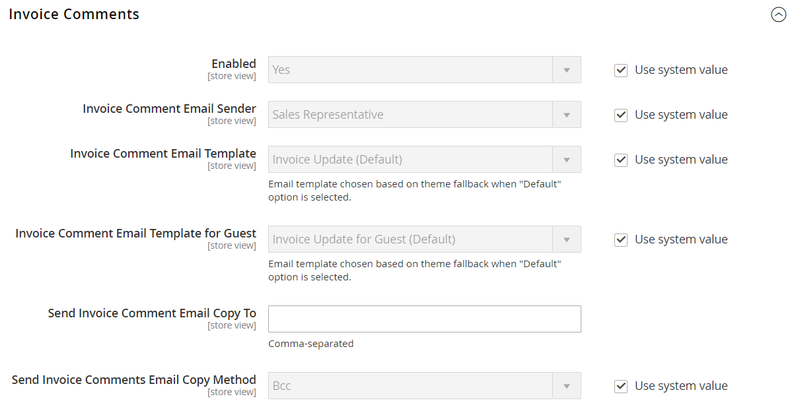<!-- zoom -->

<!-- [Invoice Comments](https://experienceleague.adobe.com/en/docs/commerce-admin/stores-sales/order-management/invoices#create-an-invoice) -->

| フィールド | [範囲](../../getting-started/websites-stores-views.md#scope-settings) | 説明 |
|--- |--- |--- |
| [!UICONTROL Enabled] | ストアビュー | 有効にすると、請求書のコメントごとにトランザクションメールが送信されます。 オプション：`Yes` / `No` |
| [!UICONTROL Invoice Comment Email Sender] | ストアビュー | メッセージ送信者として表示されるストア連絡先を識別します。 既定の送信者：`Sales Representative` |
| [!UICONTROL Invoice Comment Email Template] | ストアビュー | 顧客の請求書にコメントが追加されたときに送信されるテンプレートを識別します。 既定のテンプレート：`Invoice Update` |
| [!UICONTROL Invoice Comment Email Template for Guest] | ストアビュー | ゲスト請求書にコメントが追加されたときに送信されるテンプレートを識別します。 既定のテンプレート：`Invoice Update for Guest` |
| [!UICONTROL Send Invoice Comment Email Copy To] | ストアビュー | 請求書のコメント電子メールのコピーを受け取るユーザーの電子メールアドレスを指定します。 複数のアドレスをコンマで区切ります。 |
| [!UICONTROL Send Invoice Comments Email Copy Method] | ストアビュー | コピーの送信に使用するメール方法を示します。 オプションには次のものが含まれます。 **`Bcc`**– 顧客に送信されるのと同じメールのヘッダーに受信者を含めることで、盲目的の礼儀コピーを送信します。 BCC受信者は、お客様には表示されません。 **`Separate Email`** - コピーを別の電子メールとして送信します。 |

{style="table-layout:auto"}

## [!UICONTROL Shipment]

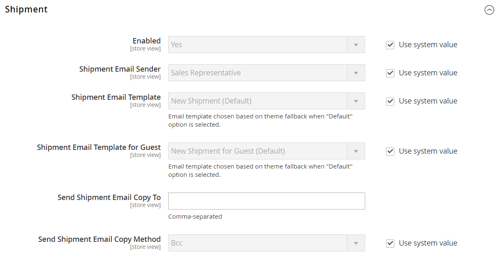<!-- zoom -->

<!-- [Shipment](https://experienceleague.adobe.com/en/docs/commerce-admin/stores-sales/order-management/shipments) -->

| フィールド | [範囲](../../getting-started/websites-stores-views.md#scope-settings) | 説明 |
|--- |--- |--- |
| [!UICONTROL Enabled] | ストアビュー | 有効にすると、生成された各出荷のトランザクションメールが送信されます。 オプション：`Yes` / `No` |
| [!UICONTROL Shipment Email Sender] | ストアビュー | メッセージの送信者として表示されるストア連絡先を識別します。 既定の送信者：`Sales Representative` |
| [!UICONTROL Shipment Email Template] | ストアビュー | 顧客の出荷が生成されたときに送信されるテンプレートを識別します。 既定のテンプレート：`New Shipment` |
| [!UICONTROL Shipment Email Template for Guest] | ストアビュー | ゲストの出荷が生成されたときに送信されるテンプレートを識別します。 既定のテンプレート：`New Shipment for Guest` |
| [!UICONTROL Send Shipment Email Copy To] | ストアビュー | 配送メールのコピーを受け取る必要があるユーザーの電子メールアドレスを提供します。 複数のアドレスをコンマで区切ります。 |
| [!UICONTROL Send Shipment Email Copy Method] | ストアビュー | コピーの送信に使用するメソッドを示します。 オプションには次のものが含まれます。 **`Bcc`**– 顧客に送信されるのと同じメールのヘッダーに受信者を含めることで、盲目的の礼儀コピーを送信します。 BCC受信者は、お客様には表示されません。 **`Separate Email`** - コピーを別の電子メールとして送信します。 |

{style="table-layout:auto"}

## [!UICONTROL Shipment Comments]

<!-- zoom -->

<!-- [Shipment Comments](https://experienceleague.adobe.com/en/docs/commerce-admin/stores-sales/order-management/shipments) -->

| フィールド | [範囲](../../getting-started/websites-stores-views.md#scope-settings) | 説明 |
|--- |--- |--- |
| [!UICONTROL Enabled] | ストアビュー | 有効にすると、各配送コメントのトランザクションメールが送信されます。 オプション：`Yes` / `No` |
| [!UICONTROL Shipment Comment Email Sender] | ストアビュー | メッセージ送信者として表示されるストア連絡先を識別します。 既定の送信者：`Sales Representative` |
| [!UICONTROL Shipment Comment Email Template] | ストアビュー | 顧客出荷にコメントが追加されたときに送信されるテンプレートを識別します。 既定のテンプレート：`Shipment Update` |
| [!UICONTROL Shipment Comment Email Template for Guest] | ストアビュー | ゲスト出荷にコメントが追加されたときに送信されるテンプレートを識別します。 既定のテンプレート：`Shipment Update for Guest` |
| [!UICONTROL Send Shipment Comment Email Copy To] | ストアビュー | 配送コメントの電子メールのコピーを受け取るユーザーの電子メールアドレスを指定します。 複数のアドレスをコンマで区切ります。 |
| [!UICONTROL Send Shipment Comments Email Copy Method] | ストアビュー | コピーの送信に使用するメール方法を示します。 オプションには次のものが含まれます。 **`Bcc`**– 顧客に送信されるのと同じメールのヘッダーに受信者を含めることで、盲目的の礼儀コピーを送信します。 BCC受信者は、お客様には表示されません。 **`Separate Email`** - コピーを別の電子メールとして送信します。 |

{style="table-layout:auto"}

## [!UICONTROL Credit Memo]

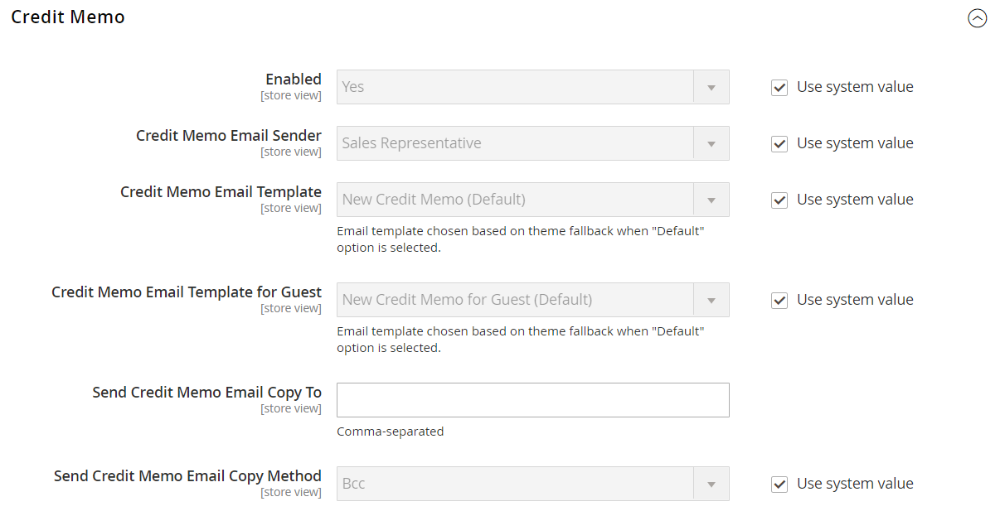<!-- zoom -->

<!-- [Credit Memo](https://experienceleague.adobe.com/en/docs/commerce-admin/stores-sales/order-management/credit-memos/credit-memos) -->

| フィールド | [範囲](../../getting-started/websites-stores-views.md#scope-settings) | 説明 |
|--- |--- |--- |
| [!UICONTROL Enabled] | ストアビュー | 生成された各クレジットメモのトランザクションメールをアクティブにします。 オプション：`Yes` / `No` |
| [!UICONTROL Credit Memo Email Sender] | ストアビュー | メッセージの送信者として表示されるストア連絡先を識別します。 既定の送信者：`Sales Representative` |
| [!UICONTROL Credit Memo Email Template] | ストアビュー | 顧客のクレジットメモが生成されたときに送信されるテンプレートを識別します。 既定のテンプレート：`New Credit Memo` |
| [!UICONTROL Credit Memo Email Template for Guest] | ストアビュー | ゲストのクレジットメモが生成されたときに送信されるテンプレートを識別します。 既定のテンプレート：`New Credit Memo for Guest` |
| [!UICONTROL Send Credit Memo Email Copy To] | ストアビュー | クレジットメモの電子メールのコピーを受け取る必要があるユーザーの電子メールアドレスを提供します。 複数のアドレスをコンマで区切ります。 |
| [!UICONTROL Send Credit Memo Email Copy Method] | ストアビュー | コピーの送信に使用するメソッドを示します。 オプションには次のものが含まれます。 **`Bcc`**– 顧客に送信されるのと同じメールのヘッダーに受信者を含めることで、盲目的の礼儀コピーを送信します。 BCC受信者は、お客様には表示されません。 **`Separate Email`** - コピーを別の電子メールとして送信します。 |

{style="table-layout:auto"}

## [!UICONTROL Credit Memo Comments]

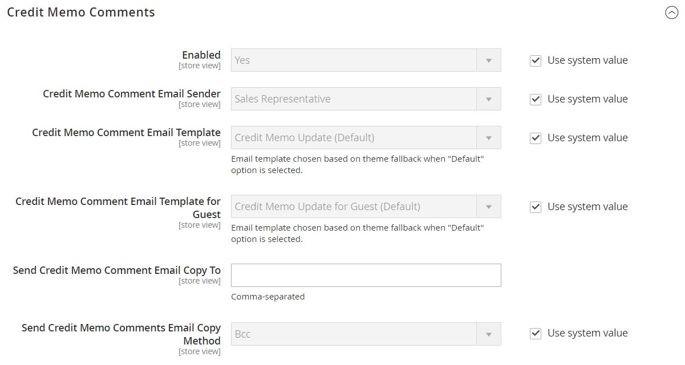<!-- zoom -->

<!-- [Credit Memo Comments](https://experienceleague.adobe.com/en/docs/commerce-admin/stores-sales/order-management/credit-memos/credit-memo-create) -->

| フィールド | [範囲](../../getting-started/websites-stores-views.md#scope-settings) | 説明 |
|--- |--- |--- |
| [!UICONTROL Enabled] | ストアビュー | 有効にすると、クレジットメモのコメントごとにトランザクションメールが送信されます。 オプション：`Yes` / `No` |
| [!UICONTROL Credit Memo Comment Email Sender] | ストアビュー | メッセージ送信者として表示されるストア連絡先を識別します。 既定の送信者：`Sales Representative` |
| [!UICONTROL Credit Memo Comment Email Template] | ストアビュー | 顧客クレジットメモにコメントが追加されたときに送信されるテンプレートを識別します。 既定のテンプレート：`Credit Memo Update` |
| [!UICONTROL Credit Memo Comment Email Template for Guest] | ストアビュー | ゲストクレジットメモにコメントが追加されたときに送信されるテンプレートを識別します。 既定のテンプレート：`Credit Memo Update for Guest` |
| [!UICONTROL Send Credit Memo Comment Email Copy To] | ストアビュー | クレジットメモのコメントメールのコピーを受け取るユーザーのメールアドレスを指定します。 複数のアドレスをコンマで区切ります。 |
| [!UICONTROL Send Credit Memo Comments Email Copy Method] | ストアビュー | コピーの送信に使用するメール方法を示します。 オプションには次のものが含まれます。 **`Bcc`**– 顧客に送信されるのと同じメールのヘッダーに受信者を含めることで、盲目的の礼儀コピーを送信します。 BCC受信者は、お客様には表示されません。 **`Separate Email`** - コピーを別の電子メールとして送信します。 |

{style="table-layout:auto"}

## [!UICONTROL Order Ready For Pickup in Store]

このオプションを有効にするには、[Inventory management](../../inventory-management/guide-overview.md)が必要です。

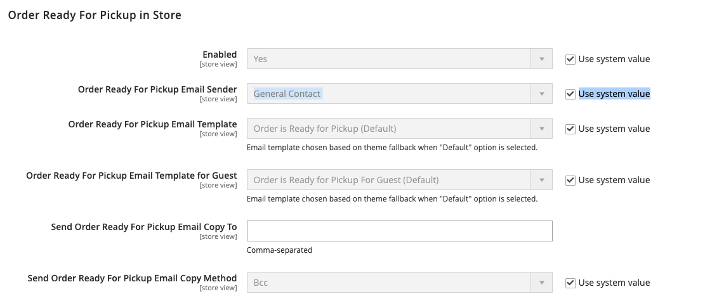<!-- zoom -->

<!-- [Order Ready For Pickup in Store](https://experienceleague.adobe.com/en/docs/commerce-admin/stores-sales/delivery/basic-methods/shipping-in-store-delivery) -->

| フィールド | [範囲](../../getting-started/websites-stores-views.md#scope-settings) | 説明 |
|--- |--- |--- |
| [!UICONTROL Enabled] | ストアビュー | 有効にすると、注文が実店舗での受け取りに間に合った時点でトランザクションメールが送信されます。 オプション：`Yes` / `No` |
| [!UICONTROL Order Ready For Pickup Email Sender] | ストアビュー | メッセージ送信者として表示されるストア連絡先を識別します。 既定の送信者：`General Contact` |
| [!UICONTROL Order Ready For Pickup Email Template] | ストアビュー | 登録済みの顧客の店舗で受け取る準備ができている注文ごとに、トランザクションメールに使用されるテンプレートを識別します。 既定のテンプレート：`Order is Ready for Pickup` |
| [!UICONTROL Order Ready For Pickup Email Template for Guest] | ストアビュー | ゲストの実店舗で受け取る準備ができている注文ごとに、トランザクションメールに使用されるテンプレートを識別します。 既定のテンプレート：`Order is Ready for Pickup for Guest` |
| 注文受取準備完了メールのコピー先 | ストアビュー | _注文受取準備完了_&#x200B;の電子メールのコピーを受け取るユーザーの電子メールアドレスを指定します。 複数のアドレスをコンマで区切ります。 |
| [!UICONTROL Send Order Ready For Pickup Email Copy Method] | ストアビュー | コピーの送信に使用するメール方法を示します。 オプション： **`Bcc`**– 顧客に送信されるのと同じメールのヘッダーに受信者を含めることで、盲目的の礼儀コピーを送信します。 BCC受信者は、お客様には表示されません。 **`Separate Email`** - コピーを別の電子メールとして送信します。 |

{style="table-layout:auto"}

## [!UICONTROL Purchase Order Approval]

{{b2b-feature}}

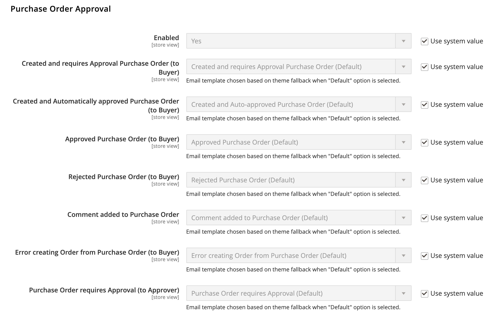<!-- zoom -->

| フィールド | [範囲](../../getting-started/websites-stores-views.md#scope-settings) | 説明 |
|--- |--- |--- |
| [!UICONTROL Enabled] | ストアビュー | 有効にすると、発注書処理中にメールが送信されます。 オプション：`Yes` / `No` |
| [!UICONTROL Created and requires Approval Purchase Order (to Buyer)] | ストアビュー | 発注書の作成者に確認メールを送信します。 |
| [!UICONTROL Created and Automatically approved Purchase Order (to Buyer)] | ストアビュー | 発注書の作成者に確認メールを送信します。 |
| [!UICONTROL Approved Purchase Order (to Buyer)] | ストアビュー | 発注書の承認時に作成者に電子メールを送信します。 |
| [!UICONTROL Rejected Purchase Order (to Buyer)] | ストアビュー | 発注書が却下されたときに、作成者に電子メールを送信します。 |
| [!UICONTROL Comment added to Purchase Order] | ストアビュー | 注釈がPOに追加されたときに、作成者に電子メールを送信します。 |
| [!UICONTROL Error creating Order from Purchase Order (to Buyer)] | ストアビュー | POを注文に変換する際にエラーが発生したことを作成者に通知します。 |
| [!UICONTROL Purchase Order required Approval (to Approver)] | ストアビュー | 発注書の承認が必要であることを承認者に通知する電子メールを送信します。 |

{style="table-layout:auto"}

## [!UICONTROL Quote]

{{b2b-feature}}

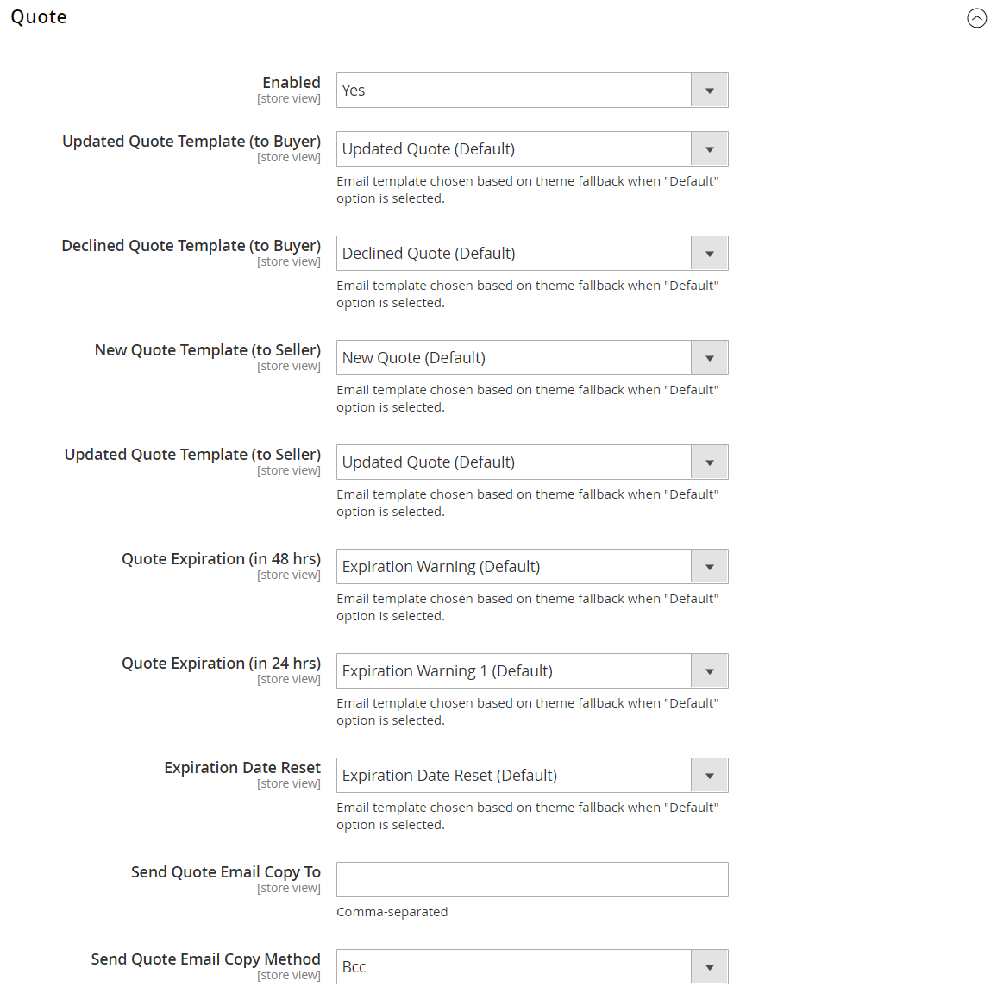<!-- zoom -->

<!-- [Quotes](https://experienceleague.adobe.com/en/docs/commerce-admin/b2b/quotes/account-dashboard-my-quotes) -->

| フィールド | [範囲](../../getting-started/websites-stores-views.md#scope-settings) | 説明 |
|--- |--- |--- |
| [!UICONTROL Enabled] | ストアビュー | 現在のストアビューから見積もり電子メールメッセージを送信できるようにします。 オプション：`Yes` / `No` |
| [!UICONTROL Updated Quote Template (to Buyer)] | ストアビュー | 更新された見積が使用可能になったときに購入者に送信される通知に使用する電子メールテンプレートを決定します。 既定のテンプレート：`Updated Quote` |
| [!UICONTROL Declined Quote Template (to Buyer)] | ストアビュー | 見積が辞退されたときに購入者に送信される通知に使用する電子メールテンプレートを決定します。 既定のテンプレート：`Declined Quote` |
| [!UICONTROL New Quote Template (to Seller)] | ストアビュー | 新しい見積もりの要求を受信したときに販売者に送信される通知に使用する電子メールテンプレートを決定します。 既定のテンプレート：`New Quote` |
| [!UICONTROL Updated Quote Template (to Seller)] | ストアビュー | 更新された見積もりを受信したときに販売者に送信される通知に使用する電子メールテンプレートを決定します。 既定のテンプレート：`Updated Quote` |
| [!UICONTROL Quote Expiration (in 48 hrs)] | ストアビュー | 見積書の有効期限が切れる48時間前に送信される有効期限の通知に使用する電子メールテンプレートを指定します。 既定のテンプレート：`Expiration Warning` |
| [!UICONTROL Quote Expiration (in 24 hrs)] | ストアビュー | 見積書の有効期限が切れる24時間前に送信される有効期限の通知に使用する電子メールテンプレートを指定します。 既定のテンプレート：`Expiration Warning 1` |
| [!UICONTROL Expiration Date Reset] | ストアビュー | 有効期限が変更されたときに送信される通知に使用する電子メールテンプレートを指定します。 既定のテンプレート：`Expiration Date Reset` |
| [!UICONTROL Send Quote Email Copy To] | ストアビュー | 見積もり電子メールのコピーを受信する各担当者の電子メールアドレスを指定します。 複数のアドレスをコンマで区切ります。 |
| [!UICONTROL Send Quote Email Copy Method] | ストアビュー | コピーの送信に使用するメール方法を示します。 オプションには次のものが含まれます。 **`Bcc`**– 顧客に送信されるのと同じメールのヘッダーに受信者を含めることで、盲目的の礼儀コピーを送信します。 BCC受信者は、お客様には表示されません。 **`Separate Email`** - コピーを別の電子メールとして送信します。 |

{style="table-layout:auto"}

## [!UICONTROL RMA]

{{ee-feature}}

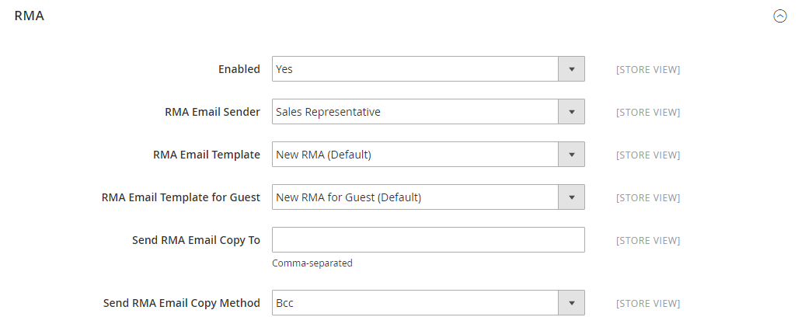<!-- zoom -->

<!-- [RMA](https://experienceleague.adobe.com/en/docs/commerce-admin/stores-sales/order-management/returns/returns) -->

| フィールド | [範囲](../../getting-started/websites-stores-views.md#scope-settings) | 説明 |
|--- |--- |--- |
| [!UICONTROL Enabled] | ストアビュー | 生成されたRMAごとにメール通知をアクティブ化します。 オプション：`Yes` / `No` |
| [!UICONTROL RMA Email Sender] | ストアビュー | メッセージの送信者として表示される[&#x200B; ストア連絡先](../../getting-started/store-details.md#store-email-addresses)を識別します。 デフォルト値：`Sales Representative` |
| [!UICONTROL RMA Email Template] | ストアビュー | 顧客に対してRMAが生成されたときに送信される通知に使用される[電子メールテンプレート &#x200B;](../../systems/email-templates.md)を決定します。 既定のテンプレート：`New RMA` |
| [!UICONTROL RMA Email Template for Guest] | ストアビュー | ゲストのRMAが生成されたときに送信されるテンプレートを指定します。 既定のテンプレート：`New RMA for Guest` |
| [!UICONTROL Send RMA Email Copy To] | ストアビュー | RMAの電子メールのコピーを受け取る必要があるユーザーの電子メールアドレスを提供します。 複数のアドレスをコンマで区切ります。 |
| [!UICONTROL Send RMA  Email Copy Method] | ストアビュー | コピーの送信に使用するメール方法を示します。 オプションには次のものが含まれます。 **`Bcc`**– 顧客に送信されるのと同じメールのヘッダーに受信者を含めることで、盲目的の礼儀コピーを送信します。 BCC受信者は、お客様には表示されません。 **`Separate Email`** - コピーを別の電子メールとして送信します。 |

{style="table-layout:auto"}

## [!UICONTROL RMA Authorization]

{{ee-feature}}

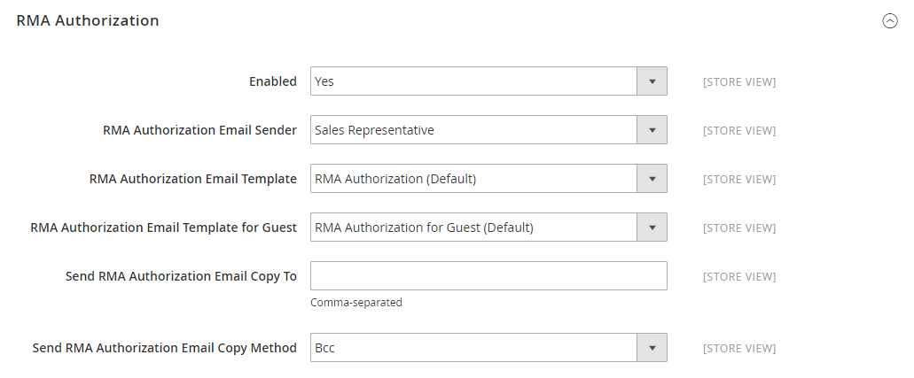<!-- zoom -->

<!-- [RMA Authorization](https://experienceleague.adobe.com/en/docs/commerce-admin/stores-sales/order-management/returns/rma-configure) -->

| フィールド | [範囲](../../getting-started/websites-stores-views.md#scope-settings) | 説明 |
|--- |--- |--- |
| [!UICONTROL Enabled] | ストアビュー | 有効にすると、RMA認証ごとにメール通知が送信されます。 オプション：`Yes` / `No` |
| [!UICONTROL RMA Authorization Email Sender] | ストアビュー | メッセージ送信者として表示される[&#x200B; ストア連絡先](../../getting-started/store-details.md#store-email-addresses)を識別します。 デフォルト値：`Sales Representative` |
| [!UICONTROL RMA Authorization Email Template] | ストアビュー | RMA承認通知の送信時に使用される[電子メールテンプレート &#x200B;](../../systems/email-templates.md)を決定します。 既定のテンプレート：`RMA Authorization` |
| [!UICONTROL RMA Authorization Email Template for Guest] | ストアビュー | RMA承認通知がゲストに送信されるときに使用されるテンプレートを決定します。 既定のテンプレート：`RMA Authorization for Guest` |
| [!UICONTROL Send RMA Authorization Email Copy To] | ストアビュー | RMA認証メールのコピーを受け取るユーザーのメールアドレスを提供します。 複数のアドレスをコンマで区切ります。 |
| [!UICONTROL Send RMA Authorization Email Copy Method] | ストアビュー | コピーの送信に使用するメール方法を示します。 オプションには次のものが含まれます。 **`Bcc`**– 顧客に送信されるのと同じメールのヘッダーに受信者を含めることで、盲目的の礼儀コピーを送信します。 BCC受信者は、お客様には表示されません。 **`Separate Email`** - コピーを別の電子メールとして送信します。 |

{style="table-layout:auto"}

## [!UICONTROL RMA Admin Comments]

{{ee-feature}}

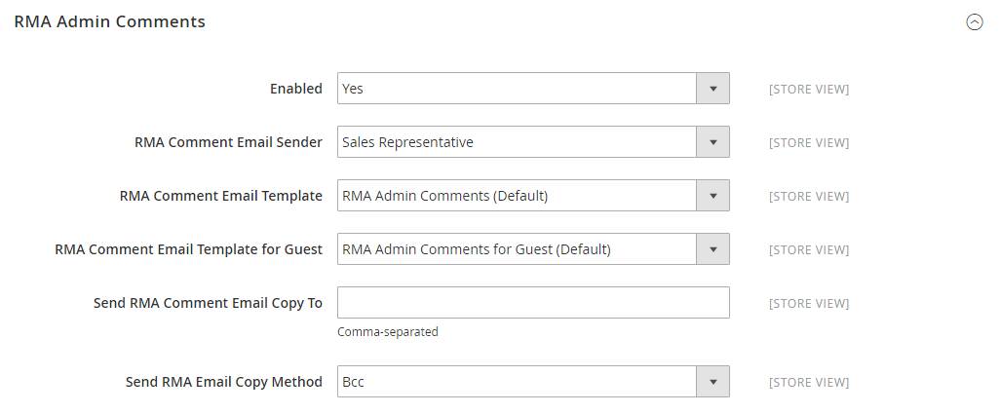<!-- zoom -->

| フィールド | [範囲](../../getting-started/websites-stores-views.md#scope-settings) | 説明 |
|--- |--- |--- |
| [!UICONTROL Enabled] | ストアビュー | 有効にすると、RMA管理者のコメントごとにメール通知が送信されます。 オプション：`Yes` / `No` |
| [!UICONTROL RMA Comment Email Sender] | ストアビュー | メッセージ送信者として表示される[&#x200B; ストア連絡先](../../getting-started/store-details.md#store-email-addresses)を識別します。 デフォルト値：`Sales Representative` |
| [!UICONTROL RMA Comment Email Template] | ストアビュー | 管理者が顧客のRMAにコメントを追加する際に使用する[電子メールテンプレート &#x200B;](../../systems/email-templates.md)を決定します。 既定のテンプレート：`RMA Admin Comments` |
| [!UICONTROL RMA Comment Email Template for Guest] | ストアビュー | 管理者がゲストのRMAにコメントを追加するときに使用するテンプレートを決定します。 既定のテンプレート：`RMA Admin Comments for Guest` |
| [!UICONTROL Send RMA Comment Email Copy To] | ストアビュー | 通知のコピーを受け取るユーザーの電子メールアドレスを指定します。 複数のアドレスをコンマで区切ります。 |
| [!UICONTROL Send RMA Comments Email Copy Method] | ストアビュー | コピーの送信に使用するメール方法を示します。 オプションには次のものが含まれます。 **`Bcc`**– 顧客に送信されるのと同じメールのヘッダーに受信者を含めることで、盲目的の礼儀コピーを送信します。 BCC受信者は、お客様には表示されません。 **`Separate Email`** - コピーを別の電子メールとして送信します。 |

{style="table-layout:auto"}

## [!UICONTROL RMA Customer Comments]

{{ee-feature}}

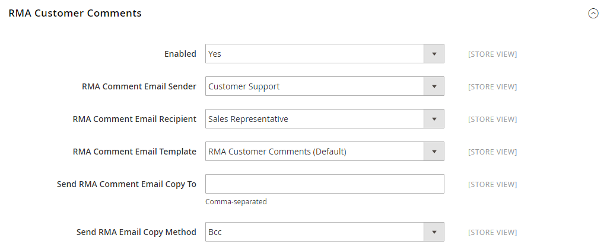<!-- zoom -->

<!-- [RMA Customer Comments](https://experienceleague.adobe.com/en/docs/commerce-admin/stores-sales/order-management/returns/returns) -->

| フィールド | [範囲](../../getting-started/websites-stores-views.md#scope-settings) | 説明 |
|--- |--- |--- |
| [!UICONTROL Enabled] | ストアビュー | 有効にすると、RMA カスタマーコメントごとにメール通知が送信されます。 オプション：`Yes` / `No` |
| [!UICONTROL RMA Comment Email Sender] | ストアビュー | メッセージ送信者として表示される[&#x200B; ストア連絡先](../../getting-started/store-details.md#store-email-addresses)を識別します。 デフォルト値：`Customer Support` |
| [!UICONTROL RMA Comment Email Recipient] | ストアビュー | 顧客コメントメールの受信者であるストア連絡先を識別します。 デフォルト値：`Sales Representative` |
| [!UICONTROL RMA Comment Email Template] | ストアビュー | 顧客がRMAにコメントを追加する際に使用される[電子メールテンプレート &#x200B;](../../systems/email-templates.md)を決定します。 既定のテンプレート：`RMA Admin Comments` |
| [!UICONTROL Send RMA Comment Email Copy To] | ストアビュー | 通知のコピーを受け取るユーザーの電子メールアドレスを指定します。 複数のアドレスをコンマで区切ります。 |
| [!UICONTROL Send RMA Comments Email Copy Method] | ストアビュー | コピーの送信に使用するメール方法を示します。 オプションには次のものが含まれます。 **`Bcc`**– 顧客に送信されるのと同じメールのヘッダーに受信者を含めることで、盲目的の礼儀コピーを送信します。 BCC受信者は、お客様には表示されません。 **`Separate Email`** - コピーを別の電子メールとして送信します。 |

{style="table-layout:auto"}
