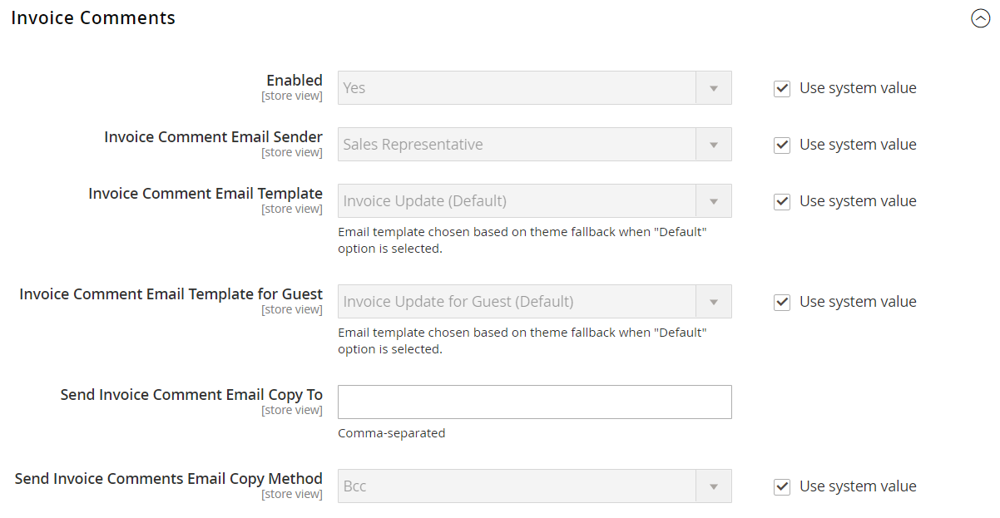

# [!UICONTROL Sales] > [!UICONTROL Sales Emails]

{{config}}

## [!UICONTROL General Settings]

<!-- zoom -->

<!-- [General Settings](https://docs.magento.com/user-guide/system/email-communications.html) -->

| フィールド | [ 範囲 ](../../getting-started/websites-stores-views.md#scope-settings) | 説明 |
|--- |--- |--- |
| [!UICONTROL Asynchronous sending] | グローバル | 販売 E メールを非同期で送信するかどうかを決定します。 非同期送信を有効にすることをお勧めします。 オプション： **`Disable`**– （デフォルト）イベントによってトリガーされたときに販売メールが送信されます。 **`Enable`** - （推奨）販売メールは、事前に決められた一定の間隔で送信されます。 |

{style="table-layout:auto"}

## [!UICONTROL Order]

<!-- zoom -->

<!-- [Order](https://docs.magento.com/user-guide/sales/orders.html) -->

| フィールド | [ 範囲 ](../../getting-started/websites-stores-views.md#scope-settings) | 説明 |
|--- |--- |--- |
| [!UICONTROL Enabled] | ストア表示 | 有効にすると、注文のたびにトランザクションメールが送信されます。 オプション：`Yes` / `No` |
| [!UICONTROL New Order Confirmation Email Sender] | ストア表示 | メッセージの送信者として表示されるストアの連絡先を識別します。 既定の送信者：`Sales Representative` |
| [!UICONTROL New Order Confirmation Template] | ストア表示 | 顧客によって行われた新しい注文を確認するために送信されるテンプレートを識別します。 既定のテンプレート：`New Order` |
| [!UICONTROL New Order Confirmation Template for Guest] | ストア表示 | ゲストによって行われた新しい注文を確認するために送信されるテンプレートを識別します。 既定のテンプレート：`New Order for Guest` |
| [!UICONTROL Send Order Email Copy To] | ストア表示 | 注文メールのコピーを受け取るユーザーのメールアドレスを指定します。 複数のアドレスはコンマで区切ります。 |
| [!UICONTROL Send Order Email Copy Method] | ストア表示 | コピーの送信に使用する電子メールの方法を示します。 オプションは次のとおりです。 **`Bcc`**– 顧客に送信されるのと同じメールのヘッダーに受信者を含めることで、ブラインドの礼儀コピーを送信します。 BCC 受信者が顧客に表示されない。 **`Separate Email`** - コピーを個別のメールとして送信します。 |

{style="table-layout:auto"}

## [!UICONTROL Order Comments]

<!-- zoom -->

<!-- [Order Comments](https://docs.magento.com/user-guide/sales/order-processing.html) -->

| フィールド | [ 範囲 ](../../getting-started/websites-stores-views.md#scope-settings) | 説明 |
|--- |--- |--- |
| [!UICONTROL Enabled] | ストア表示 | 有効化すると、注文コメントごとにトランザクションメールを送信します。 オプション：`Yes` / `No` |
| [!UICONTROL Order Comment Email Sender] | ストア表示 | メッセージの送信者として表示されるストアの連絡先を識別します。 既定の送信者：`Sales Representative` |
| [!UICONTROL Order Comment Email Template] | ストア表示 | 顧客の注文にコメントが追加されたときに送信されるテンプレートを識別します。 既定のテンプレート：`Order Update` |
| [!UICONTROL New Order Confirmation Template for Guest] | ストア表示 | ゲストの注文にコメントが追加されたときに送信されるテンプレートを識別します。 既定のテンプレート：`Order Update for Guest` |
| [!UICONTROL Send Order Email Copy To|Store View] | 注文コメントメールのコピーを受信するユーザーのメールアドレスを指定します。 複数のアドレスはコンマで区切ります。 |
| [!UICONTROL Send Order Email Copy Method] | ストア表示 | コピーを送信するために使用される方法を示します。 オプションは次のとおりです。 **`Bcc`**– 顧客に送信されるのと同じメールのヘッダーに受信者を含めることで、ブラインドの礼儀コピーを送信します。 BCC 受信者が顧客に表示されない。 **`Separate Email`** - コピーを個別のメールとして送信します。 |

{style="table-layout:auto"}

## [!UICONTROL Invoice]

<!-- zoom -->

<!-- [Invoice](https://docs.magento.com/user-guide/sales/invoices.html) -->

| フィールド | [ 範囲 ](../../getting-started/websites-stores-views.md#scope-settings) | 説明 |
|--- |--- |--- |
| [!UICONTROL Enabled] | ストア表示 | 有効にすると、生成された各請求書に対してトランザクションメールを送信します。 オプション：`Yes` / `No` |
| [!UICONTROL Invoice Email Sender] | ストア表示 | メッセージの送信者として表示されるストアの連絡先を識別します。 既定の送信者：`Sales Representative` |
| [!UICONTROL Invoice Email Template] | ストア表示 | 顧客の請求書が生成されるときに送信されるテンプレートを識別します。 既定のテンプレート：`New Invoice` |
| [!UICONTROL Invoice Email Template for Guest] | ストア表示 | ゲストに対する請求書が生成されるときに送信されるテンプレートを識別します。 既定のテンプレート：`New Invoice for Guest` |
| [!UICONTROL Send Invoice Email Copy To] | ストア表示 | 請求書 E メールのコピーを受け取るユーザーの E メール アドレスを指定します。 複数のアドレスはコンマで区切ります。 |
| [!UICONTROL Send Invoice Email Copy Method] | ストア表示 | コピーを送信するために使用される方法を示します。 オプションは次のとおりです。 **`Bcc`**– 顧客に送信されるのと同じメールのヘッダーに受信者を含めることで、ブラインドの礼儀コピーを送信します。 BCC 受信者が顧客に表示されない。 **`Separate Email`** - コピーを個別のメールとして送信します。 |

{style="table-layout:auto"}

## [!UICONTROL Invoice Comments]

<!-- zoom -->

<!-- [Invoice Comments](https://docs.magento.com/user-guide/sales/invoice-create.html) -->

| フィールド | [ 範囲 ](../../getting-started/websites-stores-views.md#scope-settings) | 説明 |
|--- |--- |--- |
| [!UICONTROL Enabled] | ストア表示 | 有効にすると、各請求書コメントに関するトランザクションメールを送信します。 オプション：`Yes` / `No` |
| [!UICONTROL Invoice Comment Email Sender] | ストア表示 | メッセージの送信者として表示されるストアの連絡先を識別します。 既定の送信者：`Sales Representative` |
| [!UICONTROL Invoice Comment Email Template] | ストア表示 | 顧客請求書にコメントが追加されたときに送信されるテンプレートを識別します。 既定のテンプレート：`Invoice Update` |
| [!UICONTROL Invoice Comment Email Template for Guest] | ストア表示 | ゲストの請求書にコメントが追加されたときに送信されるテンプレートを識別します。 既定のテンプレート：`Invoice Update for Guest` |
| [!UICONTROL Send Invoice Comment Email Copy To] | ストア表示 | 請求書コメント電子メールのコピーを受信するユーザーの電子メールアドレスを指定します。 複数のアドレスはコンマで区切ります。 |
| [!UICONTROL Send Invoice Comments Email Copy Method] | ストア表示 | コピーの送信に使用する電子メールの方法を示します。 オプションは次のとおりです。 **`Bcc`**– 顧客に送信されるのと同じメールのヘッダーに受信者を含めることで、ブラインドの礼儀コピーを送信します。 BCC 受信者が顧客に表示されない。 **`Separate Email`** - コピーを個別のメールとして送信します。 |

{style="table-layout:auto"}

## [!UICONTROL Shipment]

<!-- zoom -->

<!-- [Shipment](https://docs.magento.com/user-guide/sales/shipments.html) -->

| フィールド | [ 範囲 ](../../getting-started/websites-stores-views.md#scope-settings) | 説明 |
|--- |--- |--- |
| [!UICONTROL Enabled] | ストア表示 | 有効にすると、生成された各出荷に対してトランザクションメールが送信されます。 オプション：`Yes` / `No` |
| [!UICONTROL Shipment Email Sender] | ストア表示 | メッセージの送信者として表示される店舗連絡先を識別します。 既定の送信者：`Sales Representative` |
| [!UICONTROL Shipment Email Template] | ストア表示 | 顧客に対して出荷が生成される際に送信されるテンプレートを識別します。 既定のテンプレート：`New Shipment` |
| [!UICONTROL Shipment Email Template for Guest] | ストア表示 | ゲストに対して出荷が生成される際に送信されるテンプレートを識別します。 既定のテンプレート：`New Shipment for Guest` |
| [!UICONTROL Send Shipment Email Copy To] | ストア表示 | 出荷 E メールのコピーを受け取るユーザーの E メール アドレスを指定します。 複数のアドレスはコンマで区切ります。 |
| [!UICONTROL Send Shipment Email Copy Method] | ストア表示 | コピーを送信するために使用される方法を示します。 オプションは次のとおりです。 **`Bcc`**– 顧客に送信されるのと同じメールのヘッダーに受信者を含めることで、ブラインドの礼儀コピーを送信します。 BCC 受信者が顧客に表示されない。 **`Separate Email`** - コピーを個別のメールとして送信します。 |

{style="table-layout:auto"}

## [!UICONTROL Shipment Comments]

<!-- zoom -->

<!-- [Shipment Comments](https://docs.magento.com/user-guide/sales/shipments.html) -->

| フィールド | [ 範囲 ](../../getting-started/websites-stores-views.md#scope-settings) | 説明 |
|--- |--- |--- |
| [!UICONTROL Enabled] | ストア表示 | 有効にすると、各出荷コメントに対してトランザクション メールが送信されます。 オプション：`Yes` / `No` |
| [!UICONTROL Shipment Comment Email Sender] | ストア表示 | メッセージの送信者として表示されるストアの連絡先を識別します。 既定の送信者：`Sales Representative` |
| [!UICONTROL Shipment Comment Email Template] | ストア表示 | 顧客出荷にコメントが追加されたときに送信されるテンプレートを識別します。 既定のテンプレート：`Shipment Update` |
| [!UICONTROL Shipment Comment Email Template for Guest] | ストア表示 | ゲストによる出荷にコメントが追加されたときに送信されるテンプレートを識別します。 既定のテンプレート：`Shipment Update for Guest` |
| [!UICONTROL Send Shipment Comment Email Copy To] | ストア表示 | 出荷コメント電子メールのコピーを受信するユーザーの電子メール アドレスを指定します。 複数のアドレスはコンマで区切ります。 |
| [!UICONTROL Send Shipment Comments Email Copy Method] | ストア表示 | コピーの送信に使用する電子メールの方法を示します。 オプションは次のとおりです。 **`Bcc`**– 顧客に送信されるのと同じメールのヘッダーに受信者を含めることで、ブラインドの礼儀コピーを送信します。 BCC 受信者が顧客に表示されない。 **`Separate Email`** - コピーを個別のメールとして送信します。 |

{style="table-layout:auto"}

## [!UICONTROL Credit Memo]

<!-- zoom -->

<!-- [Credit Memo](https://docs.magento.com/user-guide/sales/credit-memos.html) -->

| フィールド | [ 範囲 ](../../getting-started/websites-stores-views.md#scope-settings) | 説明 |
|--- |--- |--- |
| [!UICONTROL Enabled] | ストア表示 | 生成された各クレジットメモのトランザクションメールを有効化します。 オプション：`Yes` / `No` |
| [!UICONTROL Credit Memo Email Sender] | ストア表示 | メッセージの送信者として表示される店舗連絡先を識別します。 既定の送信者：`Sales Representative` |
| [!UICONTROL Credit Memo Email Template] | ストア表示 | 顧客のクレジット メモが生成されるときに送信されるテンプレートを識別します。 既定のテンプレート：`New Credit Memo` |
| [!UICONTROL Credit Memo Email Template for Guest] | ストア表示 | ゲストのクレジット メモが生成されるときに送信されるテンプレートを識別します。 既定のテンプレート：`New Credit Memo for Guest` |
| [!UICONTROL Send Credit Memo Email Copy To] | ストア表示 | クレジット メモ メールのコピーを受け取るユーザーの電子メール アドレスを指定します。 複数のアドレスはコンマで区切ります。 |
| [!UICONTROL Send Credit Memo Email Copy Method] | ストア表示 | コピーを送信するために使用される方法を示します。 オプションは次のとおりです。 **`Bcc`**– 顧客に送信されるのと同じメールのヘッダーに受信者を含めることで、ブラインドの礼儀コピーを送信します。 BCC 受信者が顧客に表示されない。 **`Separate Email`** - コピーを個別のメールとして送信します。 |

{style="table-layout:auto"}

## [!UICONTROL Credit Memo Comments]

<!-- zoom -->

<!-- [Credit Memo Comments](https://docs.magento.com/user-guide/sales/credit-memo-create.html) -->

| フィールド | [ 範囲 ](../../getting-started/websites-stores-views.md#scope-settings) | 説明 |
|--- |--- |--- |
| [!UICONTROL Enabled] | ストア表示 | 有効にすると、各クレジットメモコメントに関するトランザクションメールを送信します。 オプション：`Yes` / `No` |
| [!UICONTROL Credit Memo Comment Email Sender] | ストア表示 | メッセージの送信者として表示されるストアの連絡先を識別します。 既定の送信者：`Sales Representative` |
| [!UICONTROL Credit Memo Comment Email Template] | ストア表示 | 顧客のクレジット メモにコメントが追加されたときに送信されるテンプレートを識別します。 既定のテンプレート：`Credit Memo Update` |
| [!UICONTROL Credit Memo Comment Email Template for Guest] | ストア表示 | ゲストのクレジットメモにコメントが追加されたときに送信されるテンプレートを識別します。 既定のテンプレート：`Credit Memo Update for Guest` |
| [!UICONTROL Send Credit Memo Comment Email Copy To] | ストア表示 | クレジット メモ コメント メールのコピーを受信するユーザーの電子メール アドレスを指定します。 複数のアドレスはコンマで区切ります。 |
| [!UICONTROL Send Credit Memo Comments Email Copy Method] | ストア表示 | コピーの送信に使用する電子メールの方法を示します。 オプションは次のとおりです。 **`Bcc`**– 顧客に送信されるのと同じメールのヘッダーに受信者を含めることで、ブラインドの礼儀コピーを送信します。 BCC 受信者が顧客に表示されない。 **`Separate Email`** - コピーを個別のメールとして送信します。 |

{style="table-layout:auto"}

## [!UICONTROL Order Ready For Pickup in Store]

<!-- zoom -->

<!-- [Order Ready For Pickup in Store](https://docs.magento.com/user-guide/shipping/shipping-in-store-delivery.html) -->

| フィールド | [ 範囲 ](../../getting-started/websites-stores-views.md#scope-settings) | 説明 |
|--- |--- |--- |
| [!UICONTROL Enabled] | ストア表示 | 有効にすると、注文が店舗での受け取りの準備が整ったときにトランザクションメールを送信します。 オプション：`Yes` / `No` |
| [!UICONTROL Order Ready For Pickup Email Sender] | ストア表示 | メッセージの送信者として表示されるストアの連絡先を識別します。 既定の送信者：`General Contact` |
| [!UICONTROL Order Ready For Pickup Email Template] | ストア表示 | 登録済みの顧客が店舗で受け取る準備ができている注文ごとに、トランザクションメールに使用するテンプレートを識別します。 既定のテンプレート：`Order is Ready for Pickup` |
| [!UICONTROL Order Ready For Pickup Email Template for Guest] | ストア表示 | ゲスト用にストアで受け取る準備が整った注文ごとに、トランザクションメールに使用するテンプレートを識別します。 既定のテンプレート：`Order is Ready for Pickup for Guest` |
| 集荷準備完了の注文を E メール コピーで次の場所に送信 | ストア表示 | _集荷の準備が完了した注文_ の電子メールのコピーを受け取るユーザーの電子メール アドレスを指定します。 複数のアドレスはコンマで区切ります。 |
| [!UICONTROL Send Order Ready For Pickup Email Copy Method] | ストア表示 | コピーの送信に使用する電子メールの方法を示します。 オプション： **`Bcc`**– 顧客に送信されるのと同じメールのヘッダーに受信者を含めることで、ブラインドコピーを送信します。 BCC 受信者が顧客に表示されない。 **`Separate Email`** - コピーを個別のメールとして送信します。 |

{style="table-layout:auto"}

## [!UICONTROL Purchase Order Approval]

{{b2b-feature}}

<!-- zoom -->

| フィールド | [ 範囲 ](../../getting-started/websites-stores-views.md#scope-settings) | 説明 |
|--- |--- |--- |
| [!UICONTROL Enabled] | ストア表示 | 有効化すると、発注書の処理中にメールが送信されます。 オプション：`Yes` / `No` |
| [!UICONTROL Created and requires Approval Purchase Order (to Buyer)] | ストア表示 | 発注書作成者に確認メールを送信します。 |
| [!UICONTROL Created and Automatically approved Purchase Order (to Buyer)] | ストア表示 | 発注書作成者に確認メールを送信します。 |
| [!UICONTROL Approved Purchase Order (to Buyer)] | ストア表示 | 発注書の承認時に作成者に電子メールを送信します。 |
| [!UICONTROL Rejected Purchase Order (to Buyer)] | ストア表示 | 発注書が拒否された場合に、作成者に電子メールを送信します。 |
| [!UICONTROL Comment added to Purchase Order] | ストア表示 | PO にコメントが追加された場合に、作成者にメールを送信します。 |
| [!UICONTROL Error creating Order from Purchase Order (to Buyer)] | ストア表示 | PO をオーダーに変換する際にエラーが発生したことを作成者に通知します。 |
| [!UICONTROL Purchase Order required Approval (to Approver)] | ストア表示 | 発注書に承認が必要であることを承認者に通知する E メールを送信します。 |

{style="table-layout:auto"}

## [!UICONTROL Quote]

{{b2b-feature}}

<!-- zoom -->

<!-- [Quotes](https://docs.magento.com/user-guide/customers/account-dashboard-quotes.html) -->

| フィールド | [ 範囲 ](../../getting-started/websites-stores-views.md#scope-settings) | 説明 |
|--- |--- |--- |
| [!UICONTROL Enabled] | ストア表示 | 現在のストア表示から見積 E メール メッセージを送信できるようにします。 オプション：`Yes` / `No` |
| [!UICONTROL Updated Quote Template (to Buyer)] | ストア表示 | 更新された見積もりが使用可能な場合に購入者に送信される通知に使用する電子メール テンプレートを決定します。 既定のテンプレート：`Updated Quote` |
| [!UICONTROL Declined Quote Template (to Buyer)] | ストア表示 | 見積もりが却下されたときに購入者に送信される通知に使用する E メール テンプレートを決定します。 既定のテンプレート：`Declined Quote` |
| [!UICONTROL New Quote Template (to Seller)] | ストア表示 | 新しい見積もりの要求を受信したときに販売者に送信される通知に使用する電子メール テンプレートを決定します。 既定のテンプレート：`New Quote` |
| [!UICONTROL Updated Quote Template (to Seller)] | ストア表示 | 更新された見積もりを受信したときに販売者に送信される通知に使用する電子メール テンプレートを決定します。 既定のテンプレート：`Updated Quote` |
| [!UICONTROL Quote Expiration (in 48 hrs)] | ストア表示 | 見積もりの有効期限が切れる 48 時間前に送信される有効期限通知に使用するメールテンプレートを指定します。 既定のテンプレート：`Expiration Warning` |
| [!UICONTROL Quote Expiration (in 24 hrs)] | ストア表示 | 見積もりの有効期限が切れる 24 時間前に送信される有効期限通知に使用するメールテンプレートを指定します。 既定のテンプレート：`Expiration Warning 1` |
| [!UICONTROL Expiration Date Reset] | ストア表示 | 有効期限が変更されたときに送信される通知に使用する電子メール テンプレートを指定します。 既定のテンプレート：`Expiration Date Reset` |
| [!UICONTROL Send Quote Email Copy To] | ストア表示 | 見積もり電子メールのコピーを受け取る各ユーザーの電子メール アドレスを指定します。 複数のアドレスはコンマで区切ります。 |
| [!UICONTROL Send Quote Email Copy Method] | ストア表示 | コピーの送信に使用する電子メールの方法を示します。 オプションは次のとおりです。 **`Bcc`**– 顧客に送信されるのと同じメールのヘッダーに受信者を含めることで、ブラインドの礼儀コピーを送信します。 BCC 受信者が顧客に表示されない。 **`Separate Email`** - コピーを個別のメールとして送信します。 |

{style="table-layout:auto"}

## [!UICONTROL RMA]

{{ee-feature}}

<!-- zoom -->

<!-- [RMA](https://docs.magento.com/user-guide/sales/returns.html) -->

| フィールド | [ 範囲 ](../../getting-started/websites-stores-views.md#scope-settings) | 説明 |
|--- |--- |--- |
| [!UICONTROL Enabled] | ストア表示 | 生成された RMA ごとにメール通知を有効化します。 オプション：`Yes` / `No` |
| [!UICONTROL RMA Email Sender] | ストア表示 | メッセージの送信者として表示される [ ストア連絡先 ](../../getting-started/store-details.md#store-email-addresses) を識別します。 デフォルト値：`Sales Representative` |
| [!UICONTROL RMA Email Template] | ストア表示 | 顧客に対する RMA が生成されるときに送信される通知に使用される [ メールテンプレート ](../../systems/email-templates.md) を決定します。 既定のテンプレート：`New RMA` |
| [!UICONTROL RMA Email Template for Guest] | ストア表示 | ゲストに対して RMA が生成される際に送信されるテンプレートを決定します。 既定のテンプレート：`New RMA for Guest` |
| [!UICONTROL Send RMA Email Copy To] | ストア表示 | RMA メールのコピーを受信する必要があるユーザーのメールアドレスを指定します。 複数のアドレスはコンマで区切ります。 |
| [!UICONTROL Send RMA  Email Copy Method] | ストア表示 | コピーの送信に使用する電子メールの方法を示します。 オプションは次のとおりです。 **`Bcc`**– 顧客に送信されるのと同じメールのヘッダーに受信者を含めることで、ブラインドの礼儀コピーを送信します。 BCC 受信者が顧客に表示されない。 **`Separate Email`** - コピーを個別のメールとして送信します。 |

{style="table-layout:auto"}

## [!UICONTROL RMA Authorization]

{{ee-feature}}

<!-- zoom -->

<!-- [RMA Authorization](https://docs.magento.com/user-guide/sales/rma-configure.html) -->

| フィールド | [ 範囲 ](../../getting-started/websites-stores-views.md#scope-settings) | 説明 |
|--- |--- |--- |
| [!UICONTROL Enabled] | ストア表示 | 有効化すると、RMA 認証ごとにメール通知が送信されます。 オプション：`Yes` / `No` |
| [!UICONTROL RMA Authorization Email Sender] | ストア表示 | メッセージの送信者として表示される [ ストアの連絡先 ](../../getting-started/store-details.md#store-email-addresses) を識別します。 デフォルト値：`Sales Representative` |
| [!UICONTROL RMA Authorization Email Template] | ストア表示 | RMA 承認通知が送信されるときに使用される [ 電子メール テンプレート ](../../systems/email-templates.md) を決定します。 既定のテンプレート：`RMA Authorization` |
| [!UICONTROL RMA Authorization Email Template for Guest] | ストア表示 | RMA 承認通知がゲストに送信される際に使用されるテンプレートを決定します。 既定のテンプレート：`RMA Authorization for Guest` |
| [!UICONTROL Send RMA Authorization Email Copy To] | ストア表示 | RMA 認証メールのコピーを受け取るユーザーのメールアドレスを指定します。 複数のアドレスはコンマで区切ります。 |
| [!UICONTROL Send RMA Authorization Email Copy Method] | ストア表示 | コピーの送信に使用する電子メールの方法を示します。 オプションは次のとおりです。 **`Bcc`**– 顧客に送信されるのと同じメールのヘッダーに受信者を含めることで、ブラインドの礼儀コピーを送信します。 BCC 受信者が顧客に表示されない。 **`Separate Email`** - コピーを個別のメールとして送信します。 |

{style="table-layout:auto"}

## [!UICONTROL RMA Admin Comments]

{{ee-feature}}

<!-- zoom -->

| フィールド | [ 範囲 ](../../getting-started/websites-stores-views.md#scope-settings) | 説明 |
|--- |--- |--- |
| [!UICONTROL Enabled] | ストア表示 | 有効にすると、RMA 管理者の各コメントに関するメール通知が送信されます。 オプション：`Yes` / `No` |
| [!UICONTROL RMA Comment Email Sender] | ストア表示 | メッセージの送信者として表示される [ ストアの連絡先 ](../../getting-started/store-details.md#store-email-addresses) を識別します。 デフォルト値：`Sales Representative` |
| [!UICONTROL RMA Comment Email Template] | ストア表示 | 管理者が顧客の RMA にコメントを追加する際に使用する [ メールテンプレート ](../../systems/email-templates.md) を決定します。 既定のテンプレート：`RMA Admin Comments` |
| [!UICONTROL RMA Comment Email Template for Guest] | ストア表示 | 管理者がゲストの RMA にコメントを追加するときに使用するテンプレートを決定します。 既定のテンプレート：`RMA Admin Comments for Guest` |
| [!UICONTROL Send RMA Comment Email Copy To] | ストア表示 | 通知のコピーを受信するユーザーのメールアドレスを指定します。 複数のアドレスはコンマで区切ります。 |
| [!UICONTROL Send RMA Comments Email Copy Method] | ストア表示 | コピーの送信に使用する電子メールの方法を示します。 オプションは次のとおりです。 **`Bcc`**– 顧客に送信されるのと同じメールのヘッダーに受信者を含めることで、ブラインドの礼儀コピーを送信します。 BCC 受信者が顧客に表示されない。 **`Separate Email`** - コピーを個別のメールとして送信します。 |

{style="table-layout:auto"}

## [!UICONTROL RMA Customer Comments]

{{ee-feature}}

<!-- zoom -->

<!-- [RMA Customer Comments](https://docs.magento.com/user-guide/sales/returns.html) -->

| フィールド | [ 範囲 ](../../getting-started/websites-stores-views.md#scope-settings) | 説明 |
|--- |--- |--- |
| [!UICONTROL Enabled] | ストア表示 | 有効化すると、RMA 顧客の各コメントに関するメール通知を送信します。 オプション：`Yes` / `No` |
| [!UICONTROL RMA Comment Email Sender] | ストア表示 | メッセージの送信者として表示される [ ストアの連絡先 ](../../getting-started/store-details.md#store-email-addresses) を識別します。 デフォルト値：`Customer Support` |
| [!UICONTROL RMA Comment Email Recipient] | ストア表示 | 顧客コメントメールの受信者であるストアの連絡先を識別します。 デフォルト値：`Sales Representative` |
| [!UICONTROL RMA Comment Email Template] | ストア表示 | 顧客が RMA にコメントを追加する際に使用する [ メールテンプレート ](../../systems/email-templates.md) を決定します。 既定のテンプレート：`RMA Admin Comments` |
| [!UICONTROL Send RMA Comment Email Copy To] | ストア表示 | 通知のコピーを受信するユーザーのメールアドレスを指定します。 複数のアドレスはコンマで区切ります。 |
| [!UICONTROL Send RMA Comments Email Copy Method] | ストア表示 | コピーの送信に使用する電子メールの方法を示します。 オプションは次のとおりです。 **`Bcc`**– 顧客に送信されるのと同じメールのヘッダーに受信者を含めることで、ブラインドの礼儀コピーを送信します。 BCC 受信者が顧客に表示されない。 **`Separate Email`** - コピーを個別のメールとして送信します。 |

{style="table-layout:auto"}
