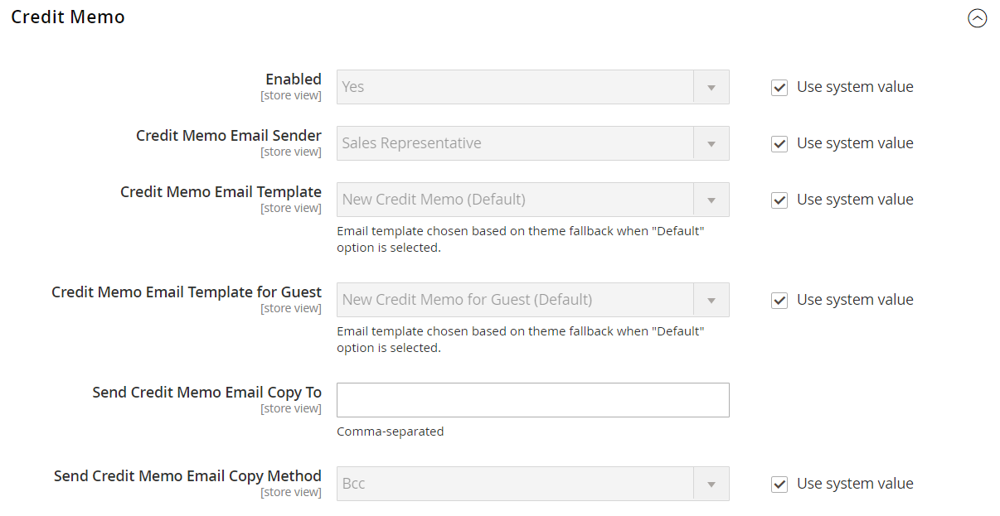
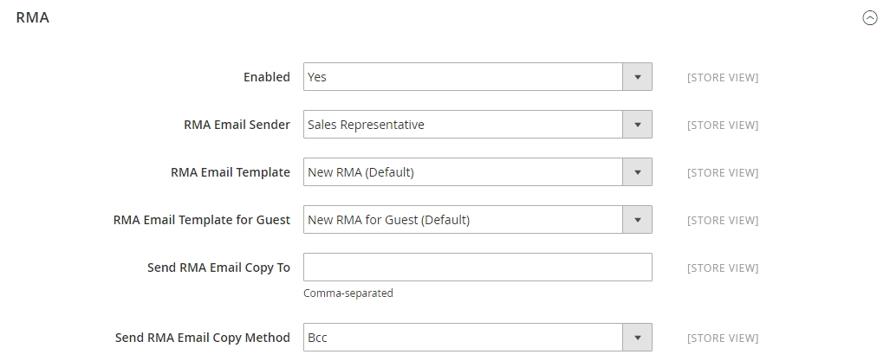

# [!UICONTROL Sales] > [!UICONTROL Sales Emails]

{{config}}

## [!UICONTROL General Settings]

<!-- zoom -->

<!-- [General Settings](https://docs.magento.com/user-guide/system/email-communications.html) -->

| フィールド | [範囲](../../getting-started/websites-stores-views.md#scope-settings) | 説明 |
|--- |--- |--- |
| [!UICONTROL Asynchronous sending] | グローバル | セールス E メールを非同期で送信するかどうかを指定します。 非同期送信を有効にすることをお勧めします。 オプション：  **`Disable`**- （デフォルト）イベントでトリガーされた場合、セールス電子メールが送信されます。 **`Enable`** - （推奨）セールス E メールは、事前に定期的な間隔で送信されます。 |

{style="table-layout:auto"}

## [!UICONTROL Order]

<!-- zoom -->

<!-- [Order](https://docs.magento.com/user-guide/sales/orders.html) -->

| フィールド | [範囲](../../getting-started/websites-stores-views.md#scope-settings) | 説明 |
|--- |--- |--- |
| [!UICONTROL Enabled] | ストア表示 | 有効にすると、は注文ごとにトランザクション E メールを送信します。 オプション： `Yes` / `No` |
| [!UICONTROL New Order Confirmation Email Sender] | ストア表示 | メッセージ送信者として表示されるストアの連絡先を識別します。 デフォルトの送信者： `Sales Representative` |
| [!UICONTROL New Order Confirmation Template] | ストア表示 | 顧客が行った新しい注文を確認するために送信されるテンプレートを識別します。 デフォルトのテンプレート： `New Order` |
| [!UICONTROL New Order Confirmation Template for Guest] | ストア表示 | ゲストが行った新しい注文を確認するために送信されるテンプレートを識別します。 デフォルトのテンプレート： `New Order for Guest` |
| [!UICONTROL Send Order Email Copy To] | ストア表示 | 注文の電子メールのコピーを受け取る人の電子メールアドレスを指定します。 複数のアドレスを指定する場合は、コンマで区切ります。 |
| [!UICONTROL Send Order Email Copy Method] | ストア表示 | コピーの送信に使用する電子メールメソッドを示します。 オプションは次のとおりです。  **`Bcc`**— 顧客に送信されるのと同じ E メールのヘッダーに受信者を含めて、非表示の提供コピーを送信します。 BCC 受信者は、顧客に対して表示されません。 **`Separate Email`**  — コピーを別の E メールとして送信します。 |

{style="table-layout:auto"}

## [!UICONTROL Order Comments]

<!-- zoom -->

<!-- [Order Comments](https://docs.magento.com/user-guide/sales/order-processing.html) -->

| フィールド | [範囲](../../getting-started/websites-stores-views.md#scope-settings) | 説明 |
|--- |--- |--- |
| [!UICONTROL Enabled] | ストア表示 | 有効にすると、は注文のコメントごとにトランザクション E メールを送信します。 オプション： `Yes` / `No` |
| [!UICONTROL Order Comment Email Sender] | ストア表示 | メッセージ送信者として表示されるストアの連絡先を識別します。 デフォルトの送信者： `Sales Representative` |
| [!UICONTROL Order Comment Email Template] | ストア表示 | 顧客の注文にコメントが追加されたときに送信されるテンプレートを識別します。 デフォルトのテンプレート： `Order Update` |
| [!UICONTROL New Order Confirmation Template for Guest] | ストア表示 | ゲストの注文にコメントが追加されたときに送信されるテンプレートを識別します。 デフォルトのテンプレート： `Order Update for Guest` |
| [!UICONTROL Send Order Email Copy To|Store View] | 注文のコメント電子メールのコピーを受け取る人の電子メールアドレスを指定します。 複数のアドレスを指定する場合は、コンマで区切ります。 |
| [!UICONTROL Send Order Email Copy Method] | ストア表示 | コピーの送信に使用するメソッドを示します。 オプションは次のとおりです。  **`Bcc`**— 顧客に送信されるのと同じ E メールのヘッダーに受信者を含めて、非表示の提供コピーを送信します。 BCC 受信者は、顧客に対して表示されません。 **`Separate Email`**  — コピーを別の E メールとして送信します。 |

{style="table-layout:auto"}

## [!UICONTROL Invoice]

<!-- zoom -->

<!-- [Invoice](https://docs.magento.com/user-guide/sales/invoices.html) -->

| フィールド | [範囲](../../getting-started/websites-stores-views.md#scope-settings) | 説明 |
|--- |--- |--- |
| [!UICONTROL Enabled] | ストア表示 | 有効にすると、は生成された各請求書に対してトランザクション E メールを送信します。 オプション： `Yes` / `No` |
| [!UICONTROL Invoice Email Sender] | ストア表示 | メッセージ送信者として表示されるストアの連絡先を識別します。 デフォルトの送信者： `Sales Representative` |
| [!UICONTROL Invoice Email Template] | ストア表示 | 顧客に対して請求書が生成される際に送信されるテンプレートを識別します。 デフォルトのテンプレート： `New Invoice` |
| [!UICONTROL Invoice Email Template for Guest] | ストア表示 | ゲストに対して請求書が生成される際に送信されるテンプレートを識別します。 デフォルトのテンプレート： `New Invoice for Guest` |
| [!UICONTROL Send Invoice Email Copy To] | ストア表示 | 請求書の電子メールのコピーを受け取る人の電子メールアドレスを指定します。 複数のアドレスを指定する場合は、コンマで区切ります。 |
| [!UICONTROL Send Invoice Email Copy Method] | ストア表示 | コピーの送信に使用するメソッドを示します。 オプションは次のとおりです。  **`Bcc`**— 顧客に送信されるのと同じ E メールのヘッダーに受信者を含めて、非表示の提供コピーを送信します。 BCC 受信者は、顧客に対して表示されません。 **`Separate Email`**  — コピーを別の E メールとして送信します。 |

{style="table-layout:auto"}

## [!UICONTROL Invoice Comments]

<!-- zoom -->

<!-- [Invoice Comments](https://docs.magento.com/user-guide/sales/invoice-create.html) -->

| フィールド | [範囲](../../getting-started/websites-stores-views.md#scope-settings) | 説明 |
|--- |--- |--- |
| [!UICONTROL Enabled] | ストア表示 | 有効にすると、は請求書のコメントごとにトランザクション E メールを送信します。 オプション： `Yes` / `No` |
| [!UICONTROL Invoice Comment Email Sender] | ストア表示 | メッセージ送信者として表示されるストアの連絡先を識別します。 デフォルトの送信者： `Sales Representative` |
| [!UICONTROL Invoice Comment Email Template] | ストア表示 | 顧客の請求書にコメントが追加された際に送信されるテンプレートを識別します。 デフォルトのテンプレート： `Invoice Update` |
| [!UICONTROL Invoice Comment Email Template for Guest] | ストア表示 | ゲストの請求書にコメントが追加されたときに送信されるテンプレートを識別します。 デフォルトのテンプレート： `Invoice Update for Guest` |
| [!UICONTROL Send Invoice Comment Email Copy To] | ストア表示 | 請求書コメント電子メールのコピーを受け取る人の電子メールアドレスを指定します。 複数のアドレスを指定する場合は、コンマで区切ります。 |
| [!UICONTROL Send Invoice Comments Email Copy Method] | ストア表示 | コピーの送信に使用する電子メールメソッドを示します。 オプションは次のとおりです。  **`Bcc`**— 顧客に送信されるのと同じ E メールのヘッダーに受信者を含めて、非表示の提供コピーを送信します。 BCC 受信者は、顧客に対して表示されません。 **`Separate Email`**  — コピーを別の E メールとして送信します。 |

{style="table-layout:auto"}

## [!UICONTROL Shipment]

<!-- zoom -->

<!-- [Shipment](https://docs.magento.com/user-guide/sales/shipments.html) -->

| フィールド | [範囲](../../getting-started/websites-stores-views.md#scope-settings) | 説明 |
|--- |--- |--- |
| [!UICONTROL Enabled] | ストア表示 | 有効にすると、は生成された出荷ごとにトランザクション E メールを送信します。 オプション： `Yes` / `No` |
| [!UICONTROL Shipment Email Sender] | ストア表示 | メッセージの送信者として表示されるストアの連絡先を識別します。 デフォルトの送信者： `Sales Representative` |
| [!UICONTROL Shipment Email Template] | ストア表示 | 顧客に対して出荷が生成された際に送信されるテンプレートを識別します。 デフォルトのテンプレート： `New Shipment` |
| [!UICONTROL Shipment Email Template for Guest] | ストア表示 | ゲストに対して出荷が生成された際に送信されるテンプレートを識別します。 デフォルトのテンプレート： `New Shipment for Guest` |
| [!UICONTROL Send Shipment Email Copy To] | ストア表示 | 発送メールのコピーを受け取る必要のあるすべての人の電子メールアドレスを指定します。 複数のアドレスを指定する場合は、コンマで区切ります。 |
| [!UICONTROL Send Shipment Email Copy Method] | ストア表示 | コピーの送信に使用するメソッドを示します。 オプションは次のとおりです。  **`Bcc`**— 顧客に送信されるのと同じ E メールのヘッダーに受信者を含めて、非表示の提供コピーを送信します。 BCC 受信者は、顧客に対して表示されません。 **`Separate Email`**  — コピーを別の E メールとして送信します。 |

{style="table-layout:auto"}

## [!UICONTROL Shipment Comments]

<!-- zoom -->

<!-- [Shipment Comments](https://docs.magento.com/user-guide/sales/shipments.html) -->

| フィールド | [範囲](../../getting-started/websites-stores-views.md#scope-settings) | 説明 |
|--- |--- |--- |
| [!UICONTROL Enabled] | ストア表示 | 有効にすると、は各出荷コメントに対してトランザクション E メールを送信します。 オプション： `Yes` / `No` |
| [!UICONTROL Shipment Comment Email Sender] | ストア表示 | メッセージ送信者として表示されるストアの連絡先を識別します。 デフォルトの送信者： `Sales Representative` |
| [!UICONTROL Shipment Comment Email Template] | ストア表示 | 顧客の出荷にコメントが追加されたときに送信されるテンプレートを識別します。 デフォルトのテンプレート： `Shipment Update` |
| [!UICONTROL Shipment Comment Email Template for Guest] | ストア表示 | ゲストの出荷にコメントが追加されたときに送信されるテンプレートを識別します。 デフォルトのテンプレート： `Shipment Update for Guest` |
| [!UICONTROL Send Shipment Comment Email Copy To] | ストア表示 | 発送コメントの電子メールのコピーを受け取る人の電子メールアドレスを提供します。 複数のアドレスを指定する場合は、コンマで区切ります。 |
| [!UICONTROL Send Shipment Comments Email Copy Method] | ストア表示 | コピーの送信に使用する電子メールメソッドを示します。 オプションは次のとおりです。  **`Bcc`**— 顧客に送信されるのと同じ E メールのヘッダーに受信者を含めて、非表示の提供コピーを送信します。 BCC 受信者は、顧客に対して表示されません。 **`Separate Email`**  — コピーを別の E メールとして送信します。 |

{style="table-layout:auto"}

## [!UICONTROL Credit Memo]

<!-- zoom -->

<!-- [Credit Memo](https://docs.magento.com/user-guide/sales/credit-memos.html) -->

| フィールド | [範囲](../../getting-started/websites-stores-views.md#scope-settings) | 説明 |
|--- |--- |--- |
| [!UICONTROL Enabled] | ストア表示 | 生成された各クレジットメモのトランザクション E メールを有効化します。 オプション： `Yes` / `No` |
| [!UICONTROL Credit Memo Email Sender] | ストア表示 | メッセージの送信者として表示されるストアの連絡先を識別します。 デフォルトの送信者： `Sales Representative` |
| [!UICONTROL Credit Memo Email Template] | ストア表示 | 顧客に対してクレジットメモを生成する際に送信されるテンプレートを識別します。 デフォルトのテンプレート： `New Credit Memo` |
| [!UICONTROL Credit Memo Email Template for Guest] | ストア表示 | ゲスト用のクレジットメモを生成する際に送信されるテンプレートを識別します。 デフォルトのテンプレート： `New Credit Memo for Guest` |
| [!UICONTROL Send Credit Memo Email Copy To] | ストア表示 | クレジットメモの電子メールのコピーを受け取る必要のある人の電子メールアドレスを指定します。 複数のアドレスを指定する場合は、コンマで区切ります。 |
| [!UICONTROL Send Credit Memo Email Copy Method] | ストア表示 | コピーの送信に使用するメソッドを示します。 オプションは次のとおりです。  **`Bcc`**— 顧客に送信されるのと同じ E メールのヘッダーに受信者を含めて、非表示の提供コピーを送信します。 BCC 受信者は、顧客に対して表示されません。 **`Separate Email`**  — コピーを別の E メールとして送信します。 |

{style="table-layout:auto"}

## [!UICONTROL Credit Memo Comments]

<!-- zoom -->

<!-- [Credit Memo Comments](https://docs.magento.com/user-guide/sales/credit-memo-create.html) -->

| フィールド | [範囲](../../getting-started/websites-stores-views.md#scope-settings) | 説明 |
|--- |--- |--- |
| [!UICONTROL Enabled] | ストア表示 | 有効にすると、は各クレジットメモコメントに対してトランザクション E メールを送信します。 オプション： `Yes` / `No` |
| [!UICONTROL Credit Memo Comment Email Sender] | ストア表示 | メッセージ送信者として表示されるストアの連絡先を識別します。 デフォルトの送信者： `Sales Representative` |
| [!UICONTROL Credit Memo Comment Email Template] | ストア表示 | 顧客のクレジットメモにコメントが追加されたときに送信されるテンプレートを識別します。 デフォルトのテンプレート： `Credit Memo Update` |
| [!UICONTROL Credit Memo Comment Email Template for Guest] | ストア表示 | ゲストクレジットメモにコメントが追加されたときに送信されるテンプレートを識別します。 デフォルトのテンプレート： `Credit Memo Update for Guest` |
| [!UICONTROL Send Credit Memo Comment Email Copy To] | ストア表示 | クレジットメモコメントの電子メールのコピーを受け取る人の電子メールアドレスを指定します。 複数のアドレスを指定する場合は、コンマで区切ります。 |
| [!UICONTROL Send Credit Memo Comments Email Copy Method] | ストア表示 | コピーの送信に使用する電子メールメソッドを示します。 オプションは次のとおりです。  **`Bcc`**— 顧客に送信されるのと同じ E メールのヘッダーに受信者を含めて、非表示の提供コピーを送信します。 BCC 受信者は、顧客に対して表示されません。 **`Separate Email`**  — コピーを別の E メールとして送信します。 |

{style="table-layout:auto"}

## [!UICONTROL Order Ready For Pickup in Store]

<!-- zoom -->

<!-- [Order Ready For Pickup in Store](https://docs.magento.com/user-guide/shipping/shipping-in-store-delivery.html) -->

| フィールド | [範囲](../../getting-started/websites-stores-views.md#scope-settings) | 説明 |
|--- |--- |--- |
| [!UICONTROL Enabled] | ストア表示 | 有効にすると、注文の準備が整ったら、店頭でのピックアップ用にトランザクション E メールを送信します。 オプション： `Yes` / `No` |
| [!UICONTROL Order Ready For Pickup Email Sender] | ストア表示 | メッセージ送信者として表示されるストアの連絡先を識別します。 デフォルトの送信者： `General Contact` |
| [!UICONTROL Order Ready For Pickup Email Template] | ストア表示 | 登録済み顧客の店舗に持ち込む準備が整った注文ごとに、トランザクション E メールで使用されるテンプレートを識別します。 デフォルトのテンプレート： `Order is Ready for Pickup` |
| [!UICONTROL Order Ready For Pickup Email Template for Guest] | ストア表示 | ゲスト用にストアに移動する準備が整った注文ごとに、トランザクション E メールに使用されるテンプレートを識別します。 デフォルトのテンプレート： `Order is Ready for Pickup for Guest` |
| 受け取り用のメールコピーを次に送信： | ストア表示 | のコピーを受け取る人の電子メールアドレスを指定します _受け取り準備完了_ 電子メール。 複数のアドレスを指定する場合は、コンマで区切ります。 |
| [!UICONTROL Send Order Ready For Pickup Email Copy Method] | ストア表示 | コピーの送信に使用する電子メールメソッドを示します。 オプション：  **`Bcc`**— 顧客に送信されるのと同じ E メールのヘッダーに受信者を含めて、非表示の提供コピーを送信します。 BCC 受信者は、顧客に対して表示されません。 **`Separate Email`**  — コピーを別の E メールとして送信します。 |

{style="table-layout:auto"}

## [!UICONTROL Purchase Order Approval]

{{b2b-feature}}

<!-- zoom -->

| フィールド | [範囲](../../getting-started/websites-stores-views.md#scope-settings) | 説明 |
|--- |--- |--- |
| [!UICONTROL Enabled] | ストア表示 | 有効にすると、は発注プロセス中に E メールを送信します。 オプション： `Yes` / `No` |
| [!UICONTROL Created and requires Approval Purchase Order (to Buyer)] | ストア表示 | 発注書作成者に電子メール確認を送信します。 |
| [!UICONTROL Created and Automatically approved Purchase Order (to Buyer)] | ストア表示 | 発注書作成者に電子メール確認を送信します。 |
| [!UICONTROL Approved Purchase Order (to Buyer)] | ストア表示 | 発注書の承認時に作成者に電子メールを送信します。 |
| [!UICONTROL Rejected Purchase Order (to Buyer)] | ストア表示 | 発注が却下された場合、作成者に電子メールを送信します。 |
| [!UICONTROL Comment added to Purchase Order] | ストア表示 | PO にコメントが追加されたら、作成者に電子メールを送信します。 |
| [!UICONTROL Error creating Order from Purchase Order (to Buyer)] | ストア表示 | 発注書を注文に変換する際にエラーが発生したことを作成者に通知します。 |
| [!UICONTROL Purchase Order required Approval (to Approver)] | ストア表示 | 電子メールを送信して、発注で承認が必要なことを承認者に通知します。 |

{style="table-layout:auto"}

## [!UICONTROL Quote]

{{b2b-feature}}

<!-- zoom -->

<!-- [Quotes](https://docs.magento.com/user-guide/customers/account-dashboard-quotes.html) -->

| フィールド | [範囲](../../getting-started/websites-stores-views.md#scope-settings) | 説明 |
|--- |--- |--- |
| [!UICONTROL Enabled] | ストア表示 | 見積もりの電子メールメッセージを現在のストア表示から送信できるようにします。 オプション： `Yes` / `No` |
| [!UICONTROL Updated Quote Template (to Buyer)] | ストア表示 | 更新された見積もりが利用可能な場合に購入者に送信する通知に使用する電子メールテンプレートを決定します。 デフォルトのテンプレート： `Updated Quote` |
| [!UICONTROL Declined Quote Template (to Buyer)] | ストア表示 | 見積もりが却下された場合に購入者に送信される通知に使用する電子メールテンプレートを決定します。 デフォルトのテンプレート： `Declined Quote` |
| [!UICONTROL New Quote Template (to Seller)] | ストア表示 | 新しい見積もりのリクエストを受け取ったときに販売者に送信される通知に使用する電子メールテンプレートを決定します。 デフォルトのテンプレート： `New Quote` |
| [!UICONTROL Updated Quote Template (to Seller)] | ストア表示 | 更新された見積もりを受け取った際に販売者に送信される通知に使用する電子メールテンプレートを決定します。 デフォルトのテンプレート： `Updated Quote` |
| [!UICONTROL Quote Expiration (in 48 hrs)] | ストア表示 | 見積もりの有効期限が切れる 48 時間前に送信される有効期限通知に使用する電子メールテンプレートを指定します。 デフォルトのテンプレート： `Expiration Warning` |
| [!UICONTROL Quote Expiration (in 24 hrs)] | ストア表示 | 見積もりの有効期限が切れる 24 時間前に送信される有効期限通知に使用する電子メールテンプレートを指定します。 デフォルトのテンプレート： `Expiration Warning 1` |
| [!UICONTROL Expiration Date Reset] | ストア表示 | 有効期限が変更されたときに送信される通知に使用する電子メールテンプレートを指定します。 デフォルトのテンプレート： `Expiration Date Reset` |
| [!UICONTROL Send Quote Email Copy To] | ストア表示 | 見積もりメールのコピーを受け取る各人の電子メールアドレスを指定します。 複数のアドレスを指定する場合は、コンマで区切ります。 |
| [!UICONTROL Send Quote Email Copy Method] | ストア表示 | コピーの送信に使用する電子メールメソッドを示します。 オプションは次のとおりです。  **`Bcc`**— 顧客に送信されるのと同じ E メールのヘッダーに受信者を含めて、非表示の提供コピーを送信します。 BCC 受信者は、顧客に対して表示されません。 **`Separate Email`**  — コピーを別の E メールとして送信します。 |

{style="table-layout:auto"}

## [!UICONTROL RMA]

{{ee-feature}}

<!-- zoom -->

<!-- [RMA](https://docs.magento.com/user-guide/sales/returns.html) -->

| フィールド | [範囲](../../getting-started/websites-stores-views.md#scope-settings) | 説明 |
|--- |--- |--- |
| [!UICONTROL Enabled] | ストア表示 | 生成された各 RMA の電子メール通知を有効化します。 オプション： `Yes` / `No` |
| [!UICONTROL RMA Email Sender] | ストア表示 | を識別します。 [ストア連絡先](../../getting-started/store-details.md#store-email-addresses) メッセージの送信者として表示される デフォルト値： `Sales Representative` |
| [!UICONTROL RMA Email Template] | ストア表示 | を決定します。 [電子メールテンプレート](../../systems/email-templates.md) 顧客に対して RMA が生成された際に送信される通知に使用される。 デフォルトのテンプレート： `New RMA` |
| [!UICONTROL RMA Email Template for Guest] | ストア表示 | ゲストに対して RMA が生成された場合に送信されるテンプレートを決定します。 デフォルトのテンプレート： `New RMA for Guest` |
| [!UICONTROL Send RMA Email Copy To] | ストア表示 | RMA E メールのコピーを受け取る必要がある人の E メールアドレスを指定します。 複数のアドレスを指定する場合は、コンマで区切ります。 |
| [!UICONTROL Send RMA  Email Copy Method] | ストア表示 | コピーの送信に使用する電子メールメソッドを示します。 オプションは次のとおりです。  **`Bcc`**— 顧客に送信されるのと同じ E メールのヘッダーに受信者を含めて、非表示の提供コピーを送信します。 BCC 受信者は、顧客に対して表示されません。 **`Separate Email`**  — コピーを別の E メールとして送信します。 |

{style="table-layout:auto"}

## [!UICONTROL RMA Authorization]

{{ee-feature}}

<!-- zoom -->

<!-- [RMA Authorization](https://docs.magento.com/user-guide/sales/rma-configure.html) -->

| フィールド | [範囲](../../getting-started/websites-stores-views.md#scope-settings) | 説明 |
|--- |--- |--- |
| [!UICONTROL Enabled] | ストア表示 | 有効にすると、各 RMA 認証に関する電子メール通知が送信されます。 オプション： `Yes` / `No` |
| [!UICONTROL RMA Authorization Email Sender] | ストア表示 | を識別します。 [ストア連絡先](../../getting-started/store-details.md#store-email-addresses) メッセージ送信者として表示される デフォルト値： `Sales Representative` |
| [!UICONTROL RMA Authorization Email Template] | ストア表示 | を決定します。 [電子メールテンプレート](../../systems/email-templates.md) RMA 承認通知が送信される際に使用されます。 デフォルトのテンプレート： `RMA Authorization` |
| [!UICONTROL RMA Authorization Email Template for Guest] | ストア表示 | RMA 承認通知がゲストに送信される際に使用するテンプレートを決定します。 デフォルトのテンプレート： `RMA Authorization for Guest` |
| [!UICONTROL Send RMA Authorization Email Copy To] | ストア表示 | RMA 承認 E メールのコピーを受け取る人の E メールアドレスを指定します。 複数のアドレスを指定する場合は、コンマで区切ります。 |
| [!UICONTROL Send RMA Authorization Email Copy Method] | ストア表示 | コピーの送信に使用する電子メールメソッドを示します。 オプションは次のとおりです。  **`Bcc`**— 顧客に送信されるのと同じ E メールのヘッダーに受信者を含めて、非表示の提供コピーを送信します。 BCC 受信者は、顧客に対して表示されません。 **`Separate Email`**  — コピーを別の E メールとして送信します。 |

{style="table-layout:auto"}

## [!UICONTROL RMA Admin Comments]

{{ee-feature}}

<!-- zoom -->

| フィールド | [範囲](../../getting-started/websites-stores-views.md#scope-settings) | 説明 |
|--- |--- |--- |
| [!UICONTROL Enabled] | ストア表示 | 有効にすると、各 RMA 管理者コメントに関する電子メール通知が送信されます。 オプション： `Yes` / `No` |
| [!UICONTROL RMA Comment Email Sender] | ストア表示 | を識別します。 [ストア連絡先](../../getting-started/store-details.md#store-email-addresses) メッセージ送信者として表示される デフォルト値： `Sales Representative` |
| [!UICONTROL RMA Comment Email Template] | ストア表示 | を決定します。 [電子メールテンプレート](../../systems/email-templates.md) これは、管理者が顧客の RMA にコメントを追加する際に使用されます。 デフォルトのテンプレート： `RMA Admin Comments` |
| [!UICONTROL RMA Comment Email Template for Guest] | ストア表示 | 管理者がゲストの RMA にコメントを追加する際に使用するテンプレートを決定します。 デフォルトのテンプレート： `RMA Admin Comments for Guest` |
| [!UICONTROL Send RMA Comment Email Copy To] | ストア表示 | 通知のコピーを受け取る人の電子メールアドレスを指定します。 複数のアドレスを指定する場合は、コンマで区切ります。 |
| [!UICONTROL Send RMA Comments Email Copy Method] | ストア表示 | コピーの送信に使用する電子メールメソッドを示します。 オプションは次のとおりです。  **`Bcc`**— 顧客に送信されるのと同じ E メールのヘッダーに受信者を含めて、非表示の提供コピーを送信します。 BCC 受信者は、顧客に対して表示されません。 **`Separate Email`**  — コピーを別の E メールとして送信します。 |

{style="table-layout:auto"}

## [!UICONTROL RMA Customer Comments]

{{ee-feature}}

<!-- zoom -->

<!-- [RMA Customer Comments](https://docs.magento.com/user-guide/sales/returns.html) -->

| フィールド | [範囲](../../getting-started/websites-stores-views.md#scope-settings) | 説明 |
|--- |--- |--- |
| [!UICONTROL Enabled] | ストア表示 | 有効にすると、各 RMA 顧客コメントに関する電子メール通知が送信されます。 オプション： `Yes` / `No` |
| [!UICONTROL RMA Comment Email Sender] | ストア表示 | を識別します。 [ストア連絡先](../../getting-started/store-details.md#store-email-addresses) メッセージ送信者として表示される デフォルト値： `Customer Support` |
| [!UICONTROL RMA Comment Email Recipient] | ストア表示 | 顧客コメント電子メールの受信者であるストアの連絡先を識別します。 デフォルト値： `Sales Representative` |
| [!UICONTROL RMA Comment Email Template] | ストア表示 | を決定します。 [電子メールテンプレート](../../systems/email-templates.md) お客様が RMA にコメントを追加する際に使用されます。 デフォルトのテンプレート： `RMA Admin Comments` |
| [!UICONTROL Send RMA Comment Email Copy To] | ストア表示 | 通知のコピーを受け取る人の電子メールアドレスを指定します。 複数のアドレスを指定する場合は、コンマで区切ります。 |
| [!UICONTROL Send RMA Comments Email Copy Method] | ストア表示 | コピーの送信に使用する電子メールメソッドを示します。 オプションは次のとおりです。  **`Bcc`**— 顧客に送信されるのと同じ E メールのヘッダーに受信者を含めて、非表示の提供コピーを送信します。 BCC 受信者は、顧客に対して表示されません。 **`Separate Email`**  — コピーを別の E メールとして送信します。 |

{style="table-layout:auto"}
