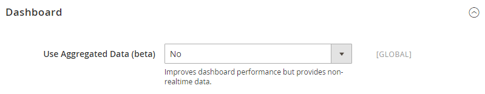
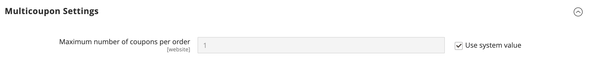
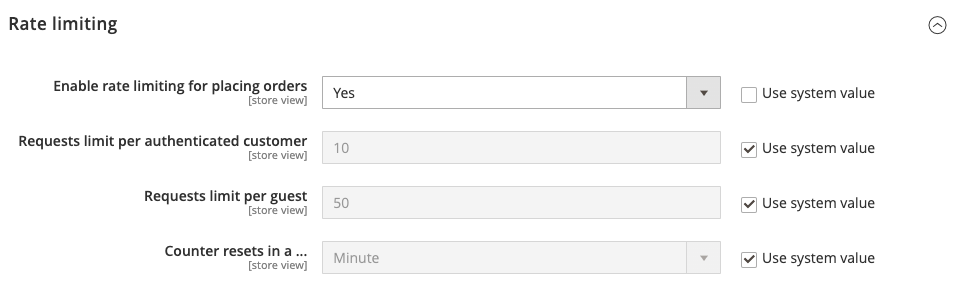
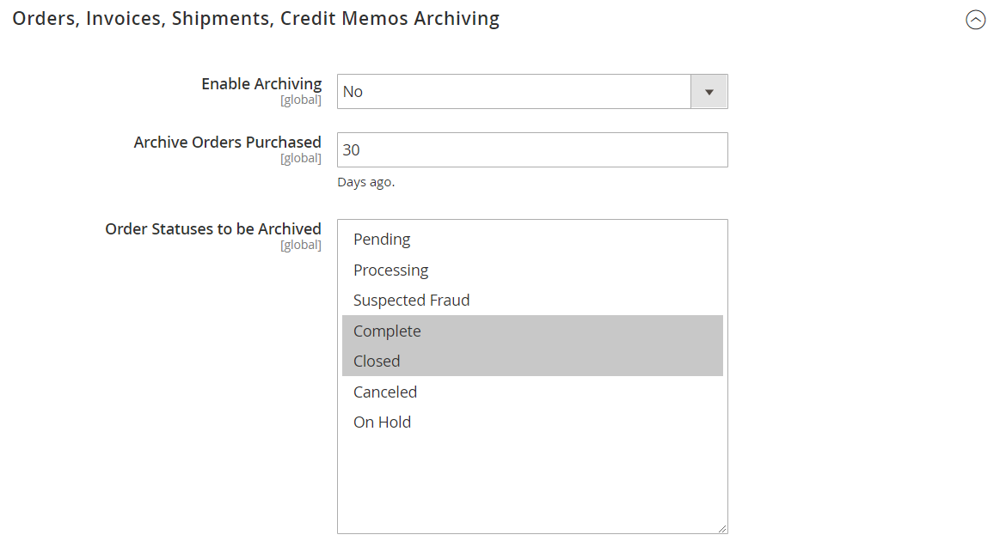

# [!UICONTROL Sales] > [!UICONTROL Sales]

{{config}}

## [!UICONTROL General]

<!-- zoom -->

<!-- [General](https://experienceleague.adobe.com/en/docs/commerce-admin/stores-sales/site-store/sales-documents) -->

| フィールド | [範囲](../../getting-started/websites-stores-views.md#scope-settings) | 説明 |
|--- |--- |--- |
| [!UICONTROL Hide Customer IP] | ストアビュー | 顧客のIP アドレスが注文、請求書、出荷、およびクレジットメモに表示されるかどうかを指定します。 オプション：`Yes` / `No` |

{style="table-layout:auto"}

## [!UICONTROL Checkout Totals Sort Order]

<!-- zoom -->

<!-- [Checkout Totals Sort Order](https://experienceleague.adobe.com/en/docs/commerce-admin/stores-sales/point-of-purchase/checkout/checkout-totals-sort-order) -->

| フィールド | [範囲](../../getting-started/websites-stores-views.md#scope-settings) | 説明 |
|--- |--- |--- |
| [!UICONTROL Subtotal] | web サイト | 小計が他のチェックアウト合計に関連して計算されるタイミングを決定する数値。 デフォルト値：`10` |
| [!UICONTROL Discount] | web サイト | 他のチェックアウト合計に対して割引を計算するタイミングを決定する数値。 デフォルト値：`20` |
| [!UICONTROL Shipping] | web サイト | 他のチェックアウト合計に関連して出荷が計算されるタイミングを決定する数値。 デフォルト値：`30` |
| [!UICONTROL Tax] | web サイト | 他のチェックアウト合計に関連して税金が計算されるタイミングを決定する数値。 デフォルト値：`40` |
| [!UICONTROL Fixed Product Tax] | web サイト | 他のチェックアウト合計に対して固定製品税を計算するタイミングを決定する数値。 デフォルト値：`50` |
| [!UICONTROL Grand Total] | web サイト | 総計が他のチェックアウト合計に関連して計算されるタイミングを決定する数値。 デフォルト値：`100` |

{style="table-layout:auto"}

## [!UICONTROL Reorder]

<!-- zoom -->

<!-- [Reorder](https://experienceleague.adobe.com/en/docs/commerce-admin/stores-sales/shopper-tools/reorders-allow) -->

| フィールド | [範囲](../../getting-started/websites-stores-views.md#scope-settings) | 説明 |
|--- |--- |--- |
| [!UICONTROL Allow Reorder] | ストアビュー | 顧客がアカウントから再注文できるかどうかを決定します。 オプション：`Yes` / `No` |

{style="table-layout:auto"}

## [!UICONTROL Allow Zero Grand Total]

| フィールド | [範囲](../../getting-started/websites-stores-views.md#scope-settings) | 説明 |
|--- |--- |--- |
| [!UICONTROL Allow Zero Grand Total for Credit Memo] | ストアビュー | 総計がゼロのクレジットメモを作成する可能性を決定します。 オプション：`Yes` / `No` |

{style="table-layout:auto"}

## [!UICONTROL Invoice and Packing Slip Design]

<!-- zoom -->

<!-- [Invoice and Packing Slip Design](https://experienceleague.adobe.com/en/docs/commerce-admin/stores-sales/site-store/sales-documents) -->

| フィールド | [範囲](../../getting-started/websites-stores-views.md#scope-settings) | 説明 |
|--- |--- |--- |
| [!UICONTROL Logo for PDF Print-outs] | ストアビュー | PDFの請求書と梱包明細の見出しに表示されるロゴファイルを識別します。 使用可能なファイル形式： JPG/JPEG  TIF/TIFF  PNG |
| [!UICONTROL Logo for HTML Print View] | ストアビュー | 請求書と梱包明細のHTML印刷ビューのヘッダーに表示されるロゴファイルを識別します。 使用可能なファイル形式： JPG /JPEG  GIF  PNG |
| [!UICONTROL Address] | ストアビュー | 請求書および梱包明細に表示する店舗アドレス。 |

{style="table-layout:auto"}

## [!UICONTROL Minimum Order Amount]

<!-- zoom -->

<!-- [Minimum Order Amount](https://experienceleague.adobe.com/en/docs/commerce-admin/stores-sales/point-of-purchase/cart/cart-configuration#minimum-order-amount) -->

| フィールド | [範囲](../../getting-started/websites-stores-views.md#scope-settings) | 説明 |
|--- |--- |--- |
| [!UICONTROL Enable] | web サイト | サイトに最低注文金額が設定されているかどうかを判断します。 オプション：`Yes` / `No` |
| [!UICONTROL Minimum Amount] | web サイト | 割引が適用された後の注文の最小小計を指定します。 |
| [!UICONTROL Include Discount Amount] | web サイト | 最低注文金額に適用された割引が含まれているかどうかを判断します。 オプション：`Yes` / `No` |
| [!UICONTROL Include Tax to Amount] | web サイト | 最低注文金額に税金が含まれているかどうかを判断します。 オプション：`Yes` / `No` |
| [!UICONTROL Description Message] | ストアビュー | 買い物かごの合計が最低注文金額を下回ったときに、買い物かごの上部に表示されるメッセージを指定します。 空白のままにすると、次のデフォルトメッセージが表示されます：`Minimum order amount is $[minimum_amount]` |
| [!UICONTROL Error to Show in Shopping Cart] | ストアビュー | 注文金額が必要な最低注文金額を下回った場合に、ミニカートまたはチェックアウトリンクから表示されるメッセージを決定します。 空白のままにすると、デフォルトのメッセージが表示されます。 |
| [!UICONTROL Validate Each Address Separately in Multi-address Checkout] | web サイト | 複数品目の注文の場合、別の住所に配置される注文品目が最低注文金額を大幅に満たすかどうかを判断します。 オプション：`Yes` / `No` |
| [!UICONTROL Multi-address Description Message] | ストアビュー | 複数アドレスの注文の場合、住所に送信されるアイテムが最低注文金額を下回っている場合に、ショッピングカートに表示されるメッセージを決定します。 |
| [!UICONTROL Multi-address Error to Show in Shopping Cart] | ストアビュー | 複数アドレスの注文の場合、注文金額が必要な最低注文金額を下回った場合に、ミニカートまたはチェックアウトリンクから表示されるメッセージを決定します。 空白のままにすると、デフォルトのメッセージが表示されます。 |

{style="table-layout:auto"}

## [!UICONTROL Dashboard]

<!-- zoom -->

<!-- [Dashboard](https://experienceleague.adobe.com/en/docs/commerce-admin/start/admin/tools/admin-dashboard) -->

| フィールド | [範囲](../../getting-started/websites-stores-views.md#scope-settings) | 説明 |
|--- |--- |--- |
| [!UICONTROL Use Aggregated Data] | グローバル | リアルタイムの集約された売上データを使用して、ダッシュボードのスナップショットレポートを作成するかどうかを決定します。 処理するデータ量が多い場合は、リアルタイムデータの表示をオフにすることで、パフォーマンスを向上させることができます。 オプション：`Yes` / `No` |

{style="table-layout:auto"}

## [!UICONTROL Orders Cron Settings]

<!-- zoom -->

<!-- [Orders Cron Settings](https://experienceleague.adobe.com/en/docs/commerce-admin/systems/tools/cron) -->

| フィールド | [範囲](../../getting-started/websites-stores-views.md#scope-settings) | 説明 |
|--- |--- |--- |
| [!UICONTROL Pending Payment Order Lifetime] | web サイト | 保留中の注文の有効期間を分単位で決定します。 既定の設定：`480`分（8時間） |

{style="table-layout:auto"}

## [!UICONTROL Promotions]

[!BADGE SaaSのみ]{type=Positive url="https://experienceleague.adobe.com/en/docs/commerce/user-guides/product-solutions" tooltip="Adobe Commerce as a Cloud Service プロジェクト（Adobeで管理されるSaaS インフラストラクチャ）にのみ適用されます。"}

<!-- zoom -->

| フィールド | [範囲](../../getting-started/websites-stores-views.md#scope-settings) | 説明 |
|--- |--- |--- |
| [!UICONTROL Apply Catalog Price Rule on Grouped Price] | グローバル | 階層価格の数量が`1`に設定されている場合、カタログ価格ルール ](../../catalog/product-price-tier.md)の[階層価格を有効にします。  オプション：`Yes` / `No` |

## [!UICONTROL Gift Options]

<!-- zoom -->

<!-- [Gift Options](https://experienceleague.adobe.com/en/docs/commerce-admin/stores-sales/point-of-purchase/cart/cart-configuration#gift-options) -->

| フィールド | [範囲](../../getting-started/websites-stores-views.md#scope-settings) | 説明 |
|--- |--- |--- |
| [!UICONTROL Allow Gift Messages on Order Level] | web サイト | 注文全体にギフトメッセージを追加できるかどうかを指定します。 |
| [!UICONTROL Allow Gift Messages on Order Items] | web サイト | 個々の注文項目にギフトメッセージを追加できるかどうかを指定します。 |
| [!UICONTROL Allow Gift Wrapping on Order Level] | web サイト |  （Adobe Commerceのみ）注文全体にギフトラッピングを追加できるかどうかを指定します。 |
| [!UICONTROL Allow Gift Wrapping for Order Items] | web サイト |  （Adobe Commerceのみ）個々の注文項目にギフト包装を追加できるかどうかを指定します。 |
| [!UICONTROL Allow Gift Receipt] | web サイト |  （Adobe Commerceのみ）注文にギフト領収書を追加できるかどうかを指定します。 |
| [!UICONTROL Allow Printed Card] | web サイト |  （Adobe Commerceのみ）印刷されたカードを注文に追加できるかどうかを指定します。 |
| [!UICONTROL Default Price for Printed Card] | web サイト |  （Adobe Commerceのみ）印刷されたカードのデフォルト価格を指定します。 |

{style="table-layout:auto"}

## [!UICONTROL Minimum Advertised Price]

<!-- zoom -->

<!-- [Minimum Advertised Price](https://experienceleague.adobe.com/en/docs/commerce-admin/catalog/products/pricing/product-price-minimum-advertised) -->

| フィールド | [範囲](../../getting-started/websites-stores-views.md#scope-settings) | 説明 |
|--- |--- |--- |
| [!UICONTROL Enable MAP] | web サイト | ストアの最低広告価格を有効にします。 オプション：`Yes` / `No` |
| [!UICONTROL Display Actual Price] | web サイト | 商品の実際の価格を顧客に表示する場所を指定します。 オプション： **`In Cart`**- ショッピングカートに実際の商品価格を表示します。 **`Before Order Confirmation`** – 注文が確認される直前に、チェックアウトプロセスの最後に実際の商品価格を表示します。 **`On Gesture`**– 顧客が「価格をクリック」または「これは何ですか？」をクリックすると、実際の製品価格がポップアップに表示されます。 リンク： |
| [!UICONTROL Default Popup Text Message] | ストアビュー | 顧客がカテゴリ リストまたは製品ビューページから「価格をクリック」リンクを選択したときに表示されるテキスト メッセージ。 |
| [!UICONTROL Default "What's This" Text Message] | ストアビュー | 顧客が「What&#39;s This?」をクリックすると表示されるテキストメッセージ 製品ビューページからのリンク。 |
| [!UICONTROL Manufacturer's Suggested Retail Price] | グローバル | メーカー（MSRP）が提案した小売価格。 |

{style="table-layout:auto"}

## [!UICONTROL Multicoupon Settings]

{{ee-feature}}

<!-- zoom -->

| フィールド | [範囲](../../getting-started/websites-stores-views.md#scope-settings) | 説明 |
|--- |--- |--- |
| [!UICONTROL Maximum number of coupons per order] | web サイト | 注文ごとに許可されるクーポンの最大数を指定します。 この機能は、Admin、GraphQLおよびREST APIでのみ使用できます。 そして、ストアフロントでは&#x200B;**_利用できません_**。 |

{style="table-layout:auto"}

## [!UICONTROL Order by SKU Settings]

{{ee-feature}}

<!-- zoom -->

<!-- [Order by SKU Settings](https://experienceleague.adobe.com/en/docs/commerce-admin/stores-sales/point-of-purchase/cart/order-by-sku) -->

<!-- zoom -->

| フィールド | [範囲](../../getting-started/websites-stores-views.md#scope-settings) | 説明 |
|--- |--- |--- |
| [!UICONTROL Enable Order by SKU on My Account in Storefront] | web サイト | 注文別SKUが顧客アカウントダッシュボードで使用可能かどうかを指定します。 オプション： **`Yes, for Everyone`**- 「SKUで注文」タブは、すべての顧客のアカウントダッシュボードに表示されます。 **`Yes, for Specified Customer Groups`** - 「SKUで注文」タブは、指定したグループまたは共有カタログのメンバーのアカウントダッシュボードに表示されます。 **`No`**- 「SKUで注文」タブは、お客様アカウントでは使用できません。 |
| [!UICONTROL Customer Groups] | web サイト | 顧客グループの決定： オプション：`General` / `Retailer` / `Wholesale` |

{style="table-layout:auto"}

## [!UICONTROL Instant Purchase]

<!-- zoom -->

<!-- [Instant Purchase](https://experienceleague.adobe.com/en/docs/commerce-admin/stores-sales/point-of-purchase/checkout-instant-purchase) -->

| フィールド | [範囲](../../getting-started/websites-stores-views.md#scope-settings) | 説明 |
|--- |--- |--- |
| [!UICONTROL Enabled] | ストアビュー | Braintreeなどの支払い方法でVaultが有効になっている場合は、ストアビューで即時購入を有効にします。 オプション：`Yes` / `No` |
| [!UICONTROL Button Text] | ストアビュー | インスタント購入ボタンに表示されるテキストを指定します。 既定のテキストは`Instant Purchase`です。 |

{style="table-layout:auto"}

## [!UICONTROL Rate Limiting]

<!-- zoom -->

| フィールド | [範囲](../../getting-started/websites-stores-views.md#scope-settings) | 説明 |
|--------------------------------------------------------|--- |------------------------------------------------------------------------------------------------------------------------------------------------------------------------------------|
| [!UICONTROL Enable rate limiting for placing orders] | ストアビュー | ストアビューからの注文の配置にレート制限を使用するかどうかを指定します（デフォルトは`No`）。 オプション：`Yes` / `No`。 |
| [!UICONTROL Requests limit per authenticated customer] | ストアビュー | 認証済み顧客が期間中に実行できる購入リクエストの数。 既定の制限は`10`です。 |
| [!UICONTROL Requests limit per guest] | ストアビュー | 未認証の顧客が指定された期間内に実行できる購入リクエストの数。 デフォルト値は`50`です。 |
| [!UICONTROL Counter resets in a ...] | ストアビュー | 認証済み/未認証の顧客が一定数の購入リクエストを行うことができる期間（デフォルトは`Minute`）。 オプション：`Minute` / `Hour` /`Day` |

{style="table-layout:auto"}

## [!UICONTROL Orders, Invoices, Shipments, Credit Memos Archiving]

{{ee-feature}}

<!-- zoom -->

これらの設定の変更について詳しくは、_ストアと購入エクスペリエンスガイド_&#x200B;の[注文アーカイブの設定](../../stores-purchase/order-archive.md#configure-the-order-archive)を参照してください。

| フィールド | [範囲](../../getting-started/websites-stores-views.md#scope-settings) | 説明 |
|--- |--- |--- |
| [!UICONTROL Enable Archiving] | グローバル | アーカイブが有効かどうかを指定します。 オプション：`Yes` / `No` |
| [!UICONTROL Archive Orders Purchased] | グローバル | 完了した注文がアーカイブされるまでの日数を指定します。 デフォルト値：`30` |
| [!UICONTROL Order  Statuses to be Archived] | グローバル | アーカイブする注文の[ ステータス ](../../stores-purchase/order-status.md)を決定します。 デフォルトでは、ステータスが「完了」または「クローズ」の注文がアーカイブされます。 オプション：`Pending` / `Processing` / `Suspected Fraud` / `Complete` / `Closed` / `Canceled` / `On Hold` |

{style="table-layout:auto"}

## [!UICONTROL RMA Settings]

{{ee-feature}}

<!-- zoom -->

これらの設定の変更について詳しくは、_ストアおよび購入エクスペリエンスガイド_&#x200B;の「[返品を設定](../../stores-purchase/rma-configure.md)」を参照してください。

| フィールド | [範囲](../../getting-started/websites-stores-views.md#scope-settings) | 説明 |
|--- |--- |--- |
| [!UICONTROL Enable RMA on Storefront] | web サイト | 顧客がストアフロントからRMA リクエストを作成および表示できるかどうかを決定します。 RMAは、新規注文と既存注文の両方に適用できます。 デフォルトでは、ストアフロントに対してRMAは有効になっていません。 オプション：`Yes` / `No` |
| [!UICONTROL Enable RMA on Product Level] | web サイト | 製品情報の「RMAを有効にする」フィールドのデフォルト値を指定します。 |
| [!UICONTROL Use Store Address] | web サイト | 返品商品の出荷に使用される連絡先名と住所を指定します。 オプション： **`Yes`**– 出荷設定から[原産地](../../stores-purchase/shipping-settings.md#point-of-origin)の住所を使用します。 **`No`** – 別のアドレスを入力できるように、アドレス フォームを開きます。 |

{style="table-layout:auto"}
