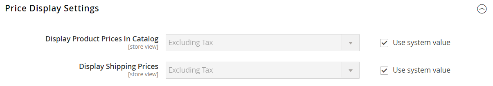

# [!UICONTROL Sales] > [!UICONTROL Tax]

>[!NOTE]
>
>Adobe CommerceおよびMagento Open Sourceリリース 2.4.0 から 2.4.3 には、との統合に使用される、Vertex ベンダーが開発した拡張機能が含まれています [!UICONTROL Vertex Cloud]. 2.4.4 リリース以降、このCommerce Marketplaceはコアリリースにバンドルされなくなり、拡張機能からインストールおよび更新する必要があります。 また、Marketplace では、拡張機能開発者が提供する最新のドキュメントにもアクセスできます。
>  
>バンドルされた拡張機能を有効にして設定してある場合は、2.4.4 のアップグレードプロセスの一環として composer.json ファイルを更新し、今後、拡張機能の更新を管理する必要があります。 参照： [モジュールおよび拡張機能のアップグレード](https://experienceleague.adobe.com/docs/commerce-operations/upgrade-guide/modules/upgrade.html) が含まれる _アップグレードガイド_ を参照してください。

{{config}}

## [!UICONTROL Tax Classes]

<!-- zoom -->

これらの設定の変更の詳細については、を参照してください [税クラス](../../stores-purchase/tax-class.md) が含まれる _店舗および購入エクスペリエンスガイド_.

| フィールド | [範囲](../../getting-started/websites-stores-views.md#scope-settings) | 説明 |
|--- |--- |--- |
| [!UICONTROL Tax Class for Shipping] | Web サイト | 出荷に使用される税クラスを識別します。 オプションには、使用可能なすべての製品税区分が含まれます。 `None` / `Taxable Goods` / `Shipping` / `Tax Exempt` |
| [!UICONTROL Tax Class for Gift Options] | Web サイト |  （Adobe Commerceのみ）ギフトオプションに使用されるデフォルトの税区分を識別します。 |
| [!UICONTROL Default Tax Class for Product] | グローバル | 製品に使用される既定の税区分を識別します。 |
| [!UICONTROL Default Tax Class for Customer] | グローバル | 顧客に使用されるデフォルトの税区分を識別します。 |

{style="table-layout:auto"}

## [!UICONTROL Calculation Settings]

<!-- zoom -->

| フィールド | [範囲](../../getting-started/websites-stores-views.md#scope-settings) | 説明 |
|--- |--- |--- |
| [!UICONTROL Tax Calculation Method Based On] | Web サイト | 注文の税の計算に使用する方法を決定します。 オプション： **`Unit Price`**・税額計算は製品単価により行っている。 **`Row Total`**  – 税金計算は、明細品目合計に基づきます。  **`Total`**– 税金の計算は受注合計に基づきます。  _**&#x200B;注意：**_税金計算拡張機能が Marketplace からインストールされている場合（例：） _頂点クラウド_を選択すると、拡張機能サービスがオプションとして表示されます。 |
| [!UICONTROL Tax Calculation Based On] | Web サイト | 税金計算が出荷先住所、請求先住所、または出荷元に基づくかどうかを決定します。 オプション： `Shipping Address` / `Billing Address` / `Shipping Origin` |
| [!UICONTROL Catalog Prices] | Web サイト | カタログ価格に税を含めるか除外するかを決定します。 オプション： `Excluding Tax` / `Including Tax` |
| [!UICONTROL Shipping Prices] | Web サイト | 配送価格で決定します（税を含む、または税を除外）。 オプション： `Excluding Tax` / `Including Tax` |
| [!UICONTROL Apply Customer Tax] | Web サイト | 税金を割引の前に適用するか、割引の後に適用するかを決定します。 オプション： `Before Discount` / `After Discount` |
| [!UICONTROL Apply Discount on Prices] | Web サイト | 割引価格に税を含めるか除外するかを決定します。 オプション： `Excluding Tax` / `Including Tax` |
| [!UICONTROL Apply Tax On] | Web サイト | 税金を元の価格に適用するか、カスタム価格に適用するかを決定します（使用可能な場合）。 オプション： `Custom price if available` / `Original price only` |
| [!UICONTROL Enable Cross Border Trade] | Web サイト | 有効にすると、異なる税率を持つ地域の境界をまたいで一貫した価格設定が適用されます。 オプション： `Yes` / `No`   **_注意：_**国境を越えた貿易を用いることで、税率別に利益率が調整される。 |

{style="table-layout:auto"}

## [!UICONTROL Default Tax Destination Calculation]

<!-- zoom -->

| フィールド | [範囲](../../getting-started/websites-stores-views.md#scope-settings) | 説明 |
|--- |--- |--- |
| [!UICONTROL Default Country] | ストア表示 | 課税計算の基になる国を決定します。 |
| [!UICONTROL Default State] | ストア表示 | 課税計算の基になる州を決定します。 アスタリスク（*）は、選択した国内のすべての州を示すワイルドカードとして機能します。 |
| [!UICONTROL Default Post Code] | ストア表示 | 税金計算のベースとなる郵便番号を識別します。 アスタリスク （*）は、選択した状態に含まれるすべての郵便番号を示すワイルドカードとして使用できます。 |

{style="table-layout:auto"}

## [!UICONTROL Price Display Settings]

<!-- zoom -->

これらの設定の変更の詳細については、を参照してください [価格表示設定の指定](../../stores-purchase/display-settings.md#configure-price-display-settings) が含まれる _店舗および購入エクスペリエンスガイド_.

| フィールド | [範囲](../../getting-started/websites-stores-views.md#scope-settings) | 説明 |
|--- |--- |--- |
| [!UICONTROL Display Product Prices in Catalog] | ストア表示 | カタログに公開された製品価格に税を含めるか除外するか、または価格の 2 つのバージョン（1 つは税あり、もう 1 つは税なし）を表示するかを決定します。 オプション： `Excluding Tax` / `Including Tax` / `Including and Excluding Tax`   **_注意：_**「製品価格を表示」フィールドを次のように設定した場合 `Including Tax`、税金が表示されるのは、税源に一致する税務処理基準があるか、税務処理基準に一致する顧客所在地がある場合のみです。 照合をトリガーにできるイベントには、顧客アカウントの作成、ログイン、またはショッピング・カート内の税金および出荷見積ツールの使用が含まれます。 |
| [!UICONTROL Display Shipping Prices] | ストア表示 | 配送料に税が含まれているか税が含まれていないかを決定します。または、配送料の 2 つのバージョン （税が含まれているバージョンと税が含まれていないバージョン）を表示します。 オプション： `Excluding Tax` / `Including Tax` / `Including and Excluding Tax` |

{style="table-layout:auto"}

## [!UICONTROL Shopping Cart Display Settings]

<!-- zoom -->

これらの設定の変更の詳細については、を参照してください [買い物かごの表示設定](../../stores-purchase/display-settings.md#step-2-configure-shopping-cart-display-settings) が含まれる _店舗および購入エクスペリエンスガイド_.

| フィールド | [範囲](../../getting-started/websites-stores-views.md#scope-settings) | 説明 |
|--- |--- |--- |
| [!UICONTROL Display Prices] | ストア表示 | 買い物かご価格に税が含まれているか税が含まれていないかを決定するか、または価格の 2 つのバージョン（税が含まれているバージョンと含まれていないバージョン）を表示するかを決定します。 オプション： `Excluding Tax` / `Including Tax` / `Including and Excluding Tax` |
| [!UICONTROL Display Subtotal|Store View] | 買い物かごの小計に税金が含まれているか税金が含まれていないかを判断するか、または小計の 2 つのバージョン（1 つは税金あり、もう 1 つは税金なし）を表示するかを決定します。 オプション： `Excluding Tax` / `Including Tax` / `Including and Excluding Tax` |
| [!UICONTROL Display Shipping Amount] | ストア表示 | 買い物かごの出荷金額に税が含まれているか除外されているかを判断します。または、出荷金額の 2 つのバージョン（税が含まれているバージョンと含まれていないバージョン）を表示します。 オプション： `Excluding Tax` / `Including Tax` / `Including and Excluding Tax` |
| [!UICONTROL Additionally Show Order Total Without Tax] | ストア表示 | 税のない総計を含む追加行を買い物かごに表示するかどうかを決定します。 オプション： `Yes` / `No` |
| [!UICONTROL Display Full Tax Summary] | ストア表示 | 買い物かごに完全な税の概要が含まれるかどうかを決定します。 オプション： `Yes` / `No` |
| [!UICONTROL Display Zero Tax Subtotal] | ストア表示 | 税が 0 の場合に、買い物かごに税の小計が含まれるかどうかを決定します。 オプション： `Yes` / `No` |

{style="table-layout:auto"}

## [!UICONTROL Orders, Invoices, Credit Memos Display Settings]

<!-- zoom -->

これらの設定の変更の詳細については、を参照してください [注文、請求書、およびクレジット メモの表示設定を構成します](../../stores-purchase/display-settings.md#step-3-configure-order-invoice-and-credit-memo-display-settings) が含まれる _店舗および購入エクスペリエンスガイド_.

| フィールド | [範囲](../../getting-started/websites-stores-views.md#scope-settings) | 説明 |
|--- |--- |--- |
| [!UICONTROL Display Prices] | ストア表示 | 売上文書の価格に税が含まれているか、または税が含まれていないか、または各文書に価格の 2 つのバージョンが表示されているかどうかを決定します。 オプション： `Excluding Tax` / `Including Tax` / `Including and Excluding Tax` |
| [!UICONTROL Display Subtotal] | ストア表示 | 営業ドキュメントの小計に税金が含まれているか税金が含まれていないか、または各文書に小計の 2 つのバージョン（1 つは税金あり、もう 1 つは税金なし）が表示されているかを判別します。 オプション： `Excluding Tax` / `Including Tax` / `Including and Excluding Tax` |
| [!UICONTROL Display Shipping Amount] | ストア表示 | 販売ドキュメントの出荷金額に税金が含まれているか税金が含まれていないか、または各文書に小計のバージョンが 2 つ（1 つは税金が含まれているか、もう 1 つは税金が含まれていないか）が表示されるかどうかを決定します。 オプション： `Excluding Tax` / `Including Tax` / `Including and Excluding Tax` |
| [!UICONTROL Additionally Show Order Total Without Tax] | ストア表示 | 税のない総計を含む追加行を販売ドキュメントに表示するかどうかを決定します。 オプション： `Yes` / `No` |
| [!UICONTROL Display Full Tax Summary] | ストア表示 | 販売ドキュメントに完全な税概要を表示するかどうかを決定します。 オプション： `Yes` / `No` |
| [!UICONTROL Display Zero Tax Subtotal] | ストア表示 | 税金が請求されない場合に、販売ドキュメントの小計セクションが表示されるかどうかを決定します。 オプション： `Yes` / `No` |
| [!UICONTROL Display Gift Wrapping Prices] | ストア表示 |  （Adobe Commerceのみ）小計にギフト包装価格を含めるかどうかを指定します。 オプション： `Excluding Tax` / `Including Tax` / `Including and Excluding Tax` |
| [!UICONTROL Display Printed Card Prices] | ストア表示 |  （Adobe Commerceのみ）印刷されたカード価格が小計に含まれるかどうかを指定します。 オプション： `Excluding Tax` / `Including Tax` / `Including and Excluding Tax` |

{style="table-layout:auto"}

## [!UICONTROL Fixed Product Taxes]

<!-- zoom -->

これらの設定の変更の詳細については、を参照してください [固定製品税（FPT）](../../stores-purchase/fixed-product-tax.md) が含まれる _店舗および購入エクスペリエンスガイド_.

| フィールド | [範囲](../../getting-started/websites-stores-views.md#scope-settings) | 説明 |
|--- |--- |--- |
| [!UICONTROL Enable FPT] | Web サイト | FPT が使用可能かどうかを判断します。 オプション： `Yes` / `No` |
| [!UICONTROL Display Prices in Product Lists] | Web サイト | 製品リストでの FPT の表示をコントロールします。 オプション：  **`Including FPT Only`**  – 表示価格には固定製品税が含まれています。 FPT 金額は個別には表示されません。 **`Including FPT and FPT description`**– 表示価格には固定製品税が含まれています。 FPT 金額は個別に表示されます。 **`Excluding FPT. Including FPT description and final price`**  – 表示価格には固定製品税は含まれていません。 FPT 金額は個別に表示されます。 **`Excluding FPT`**– 表示価格には固定製品税は含まれていません。 FPT 金額は個別には表示されません。 |
| [!UICONTROL Display Prices On Product View Page] | Web サイト | 製品ページでの FPT の表示をコントロールします。 オプション：  **`Including FPT Only`**  – 表示価格には固定製品税が含まれています。 FPT 金額は個別には表示されません。 **`Including FPT and FPT description`**– 表示価格には固定製品税が含まれています。 FPT 金額は個別に表示されます。 **`Excluding FPT. Including FPT description and final price`**  – 表示価格には固定製品税は含まれていません。 FPT 金額は個別に表示されます。 **`Excluding FPT`**– 表示価格には固定製品税は含まれていません。 FPT 金額は個別には表示されません。 |
| [!UICONTROL Display Prices in Sales Modules] | Web サイト | 買い物かごおよびチェックアウト時の FPT の表示を制御します。 オプション：  **`Including FPT Only`**  – 表示価格には固定製品税が含まれています。 FPT 金額は個別には表示されません。 **`Including FPT and FPT description`**– 表示価格には固定製品税が含まれています。 FPT 金額は個別に表示されます。 **`Excluding FPT. Including FPT description and final price`**  – 表示価格には固定製品税は含まれていません。 FPT 金額は個別に表示されます。 **`Excluding FPT`**– 表示価格には固定製品税は含まれていません。 FPT 金額は個別には表示されません。 |
| [!UICONTROL Display Prices in Emails] | Web サイト | 電子メールでの FPT の表示を制御します。 オプション：  **`Including FPT Only`**  – 表示価格には固定製品税が含まれています。 FPT 金額は個別には表示されません。 **`Including FPT and FPT description`**– 表示価格には固定製品税が含まれています。 FPT 金額は個別に表示されます。 ** FPT の除外 FPT の説明と最終価格を含む&#x200B;**– 表示価格には固定製品税は含まれていません。 FPT 金額は個別に表示されます。 **`Excluding FPT`**  – 表示価格には固定製品税は含まれていません。 FPT 金額は個別には表示されません。 |
| [!UICONTROL Apply Tax to FPT] | Web サイト | FPT 金額に税金が適用されるかどうかを決定します。 オプション： `Yes` / `No` |
| [!UICONTROL Include FPT in Subtotal] | Web サイト | FPT が買い物かごの小計に含まれるかどうかを決定します。 オプション：  **`Yes`**- ショッピングカートの小計に FPT を含みます。 **`No`** - FPT は小計に含まれず、買い物かごの小計の後に配置されます。 |

{style="table-layout:auto"}
