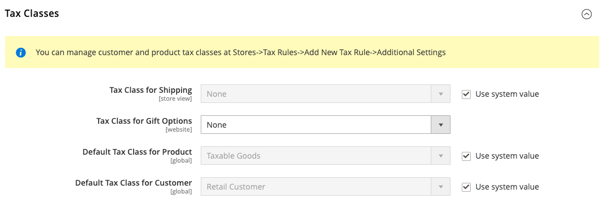
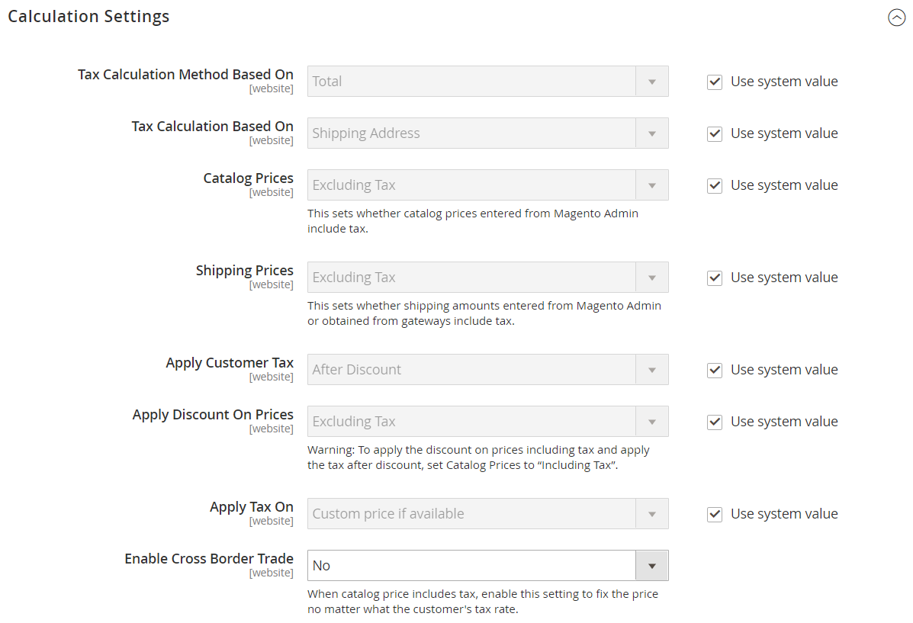
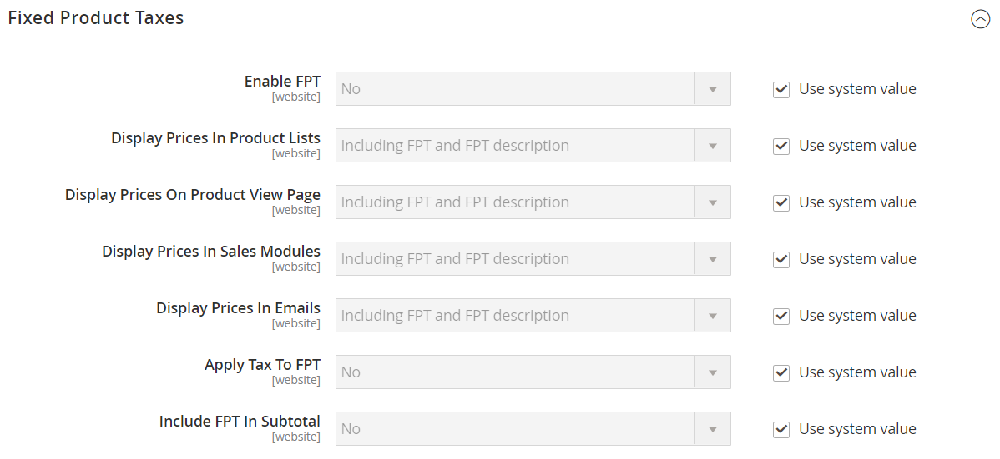

# [!UICONTROL Sales] > [!UICONTROL Tax]

>[!NOTE]
>
>Adobe CommerceおよびMagento Open Source リリース 2.4.0 ～ 2.4.3には、[!UICONTROL Vertex Cloud]との統合に使用するVertex ベンダー開発の拡張機能が含まれています。2.4.4 リリース以降、この拡張機能はコアリリースにバンドルされなくなり、Commerce Marketplaceからインストールして更新する必要があります。Marketplaceでは、拡張機能の開発者が提供する最新のドキュメントにもアクセスできます。
>  > バンドル拡張機能を有効にして設定している場合は、2.4.4 アップグレードプロセスの一環としてcomposer.json ファイルを更新し、拡張機能の更新を今後も管理する必要があります。詳しくは、_アップグレードガイド_&#x200B;の「[ モジュールと拡張機能のアップグレード ](https://experienceleague.adobe.com/docs/commerce-operations/upgrade-guide/modules/upgrade.html)」を参照してください。

{{config}}

## [!UICONTROL Tax Classes]

<!-- zoom -->

これらの設定の変更について詳しくは、_ストアおよび購入エクスペリエンスガイド_&#x200B;の[税区分](../../stores-purchase/tax-class.md)を参照してください。

| フィールド | [範囲](../../getting-started/websites-stores-views.md#scope-settings) | 説明 |
|--- |--- |--- |
| [!UICONTROL Tax Class for Shipping] | web サイト | 配送に使用する税区分を識別します。 オプションには、使用可能なすべての製品税クラスが含まれます：`None` / `Taxable Goods` / `Shipping` / `Tax Exempt` |
| [!UICONTROL Tax Class for Gift Options] | web サイト |  （Adobe Commerceのみ）ギフトオプションに使用されるデフォルトの税区分を指定します。 |
| [!UICONTROL Default Tax Class for Product] | グローバル | 製品に使用されるデフォルトの税区分を識別します。 |
| [!UICONTROL Default Tax Class for Customer] | グローバル | 顧客に使用されるデフォルトの税区分を識別します。 |

{style="table-layout:auto"}

## [!UICONTROL Calculation Settings]

<!-- zoom -->

| フィールド | [範囲](../../getting-started/websites-stores-views.md#scope-settings) | 説明 |
|--- |--- |--- |
| [!UICONTROL Tax Calculation Method Based On] | web サイト | 注文の税金の計算に使用する方法を指定します。 オプション： **`Unit Price`**– 各製品の単価に基づいて税計算を行います。 **`Row Total`** – 税計算は、行項目の合計に基づいています。 **`Total`**– 税金の計算は、注文合計に基づいています。  _**&#x200B;注意：**_税額計算の拡張機能（_Vertex Cloud_など）がMarketplaceからインストールされている場合、拡張機能サービスはオプションとして表示されます。 |
| [!UICONTROL Tax Calculation Based On] | web サイト | 消費税の計算が配送先住所、請求先住所、または配送元に基づくかどうかを指定します。 オプション：`Shipping Address` / `Billing Address` / `Shipping Origin` |
| [!UICONTROL Catalog Prices] | web サイト | カタログ価格に税金が含まれているか除外されているかを指定します。 オプション：`Excluding Tax` / `Including Tax` |
| [!UICONTROL Shipping Prices] | web サイト | 配送価格の決定には税金が含まれるか除外されます。 オプション：`Excluding Tax` / `Including Tax` |
| [!UICONTROL Apply Customer Tax] | web サイト | 税金が割引前または割引後に適用されるかどうかを指定します。 オプション：`Before Discount` / `After Discount` |
| [!UICONTROL Apply Discount on Prices] | web サイト | 割引価格に税金が含まれているか除外されているかを指定します。 オプション：`Excluding Tax` / `Including Tax` |
| [!UICONTROL Apply Tax On] | web サイト | 税金が元の価格に適用されるか、利用可能な場合はカスタム価格に適用されるかを決定します。 オプション：`Custom price if available` / `Original price only` |
| [!UICONTROL Enable Cross Border Trade] | web サイト | 有効にすると、異なる税率を持つ地域の国境を越えて一貫した価格設定が適用されます。 オプション：`Yes` / `No`   **_Note:_** クロスボーダー取引を使用すると、利益率が税率で調整されます。 |

{style="table-layout:auto"}

## [!UICONTROL Default Tax Destination Calculation]

<!-- zoom -->

| フィールド | [範囲](../../getting-started/websites-stores-views.md#scope-settings) | 説明 |
|--- |--- |--- |
| [!UICONTROL Default Country] | ストアビュー | 税計算の基となる国を指定します。 |
| [!UICONTROL Default State] | ストアビュー | 税計算の基となる状態を指定します。 アスタリスク（*）は、選択した国のすべての状態を示すワイルドカードとして機能します。 |
| [!UICONTROL Default Post Code] | ストアビュー | 税計算の基となる郵便番号または郵便番号を識別します。 アスタリスク（*）は、選択した状態のすべての郵便番号を示すワイルドカードとして機能します。 |

{style="table-layout:auto"}

## [!UICONTROL Price Display Settings]

<!-- zoom -->

これらの設定の変更について詳しくは、_ストアおよび購入エクスペリエンスガイド_&#x200B;の「[価格表示設定の設定](../../stores-purchase/display-settings.md#configure-price-display-settings)」を参照してください。

| フィールド | [範囲](../../getting-started/websites-stores-views.md#scope-settings) | 説明 |
|--- |--- |--- |
| [!UICONTROL Display Product Prices in Catalog] | ストアビュー | カタログに掲載されている製品価格に税金が含まれているか除外されているか、または価格の2つのバージョンを表示しているかを指定します。1つは税抜き、もう1つは税抜きです。 オプション：`Excluding Tax` / `Including Tax` / `Including and Excluding Tax`   **_Note:_** 「製品価格を表示」フィールドを`Including Tax`に設定した場合、税金は、税源に一致する税規則がある場合や、税規則に一致する顧客住所がある場合にのみ表示されます。 マッチをトリガーできるイベントには、お客様アカウントの作成、ログイン、ショッピングカートでの税金と送料の見積もりツールの使用などがあります。 |
| [!UICONTROL Display Shipping Prices] | ストアビュー | 送料に税金が含まれているか含まれていないかを判断するか、送料の2つのバージョンを表示します。1つは税抜き、もう1つは税抜きです。 オプション：`Excluding Tax` / `Including Tax` / `Including and Excluding Tax` |

{style="table-layout:auto"}

## [!UICONTROL Shopping Cart Display Settings]

<!-- zoom -->

これらの設定の変更について詳しくは、_ストアと購入エクスペリエンスガイド_&#x200B;の「[ ショッピングカート表示設定の設定](../../stores-purchase/display-settings.md#step-2-configure-shopping-cart-display-settings)」を参照してください。

| フィールド | [範囲](../../getting-started/websites-stores-views.md#scope-settings) | 説明 |
|--- |--- |--- |
| [!UICONTROL Display Prices] | ストアビュー | 買い物かごの価格に税金が含まれているか含まれていないかを判断するか、価格の2つのバージョンを表示します。1つは税抜き、もう1つは税抜きです。 オプション：`Excluding Tax` / `Including Tax` / `Including and Excluding Tax` |
| [!UICONTROL Display Subtotal|Store View] | 買い物かごの小計に税金を含めるか除外するかを指定します。または、小計の2つのバージョンを表示します。1つは税金を含むもの、もう1つは税金を含まないものです。 オプション：`Excluding Tax` / `Including Tax` / `Including and Excluding Tax` |
| [!UICONTROL Display Shipping Amount] | ストアビュー | 買い物かごの配送金額に税金が含まれているか含まれていないかを判断します。または、2つのバージョンの配送金額を表示します。1つは税抜き、もう1つは税抜きです。 オプション：`Excluding Tax` / `Including Tax` / `Including and Excluding Tax` |
| [!UICONTROL Additionally Show Order Total Without Tax] | ストアビュー | 買い物かごに、合計金額が税抜きの余分な行が表示されるかどうかを指定します。 オプション：`Yes` / `No` |
| [!UICONTROL Display Full Tax Summary] | ストアビュー | 買い物かごに税金の概要が含まれているかどうかを判断します。 オプション：`Yes` / `No` |
| [!UICONTROL Display Zero Tax Subtotal] | ストアビュー | 消費税がゼロの場合に、買い物かごに消費税の小計が含まれるかどうかを指定します。 オプション：`Yes` / `No` |

{style="table-layout:auto"}

## [!UICONTROL Orders, Invoices, Credit Memos Display Settings]

<!-- zoom -->

これらの設定の変更について詳しくは、_ストアおよび購入エクスペリエンスガイド_&#x200B;の「[注文、請求書、クレジットメモの表示設定の設定](../../stores-purchase/display-settings.md#step-3-configure-order-invoice-and-credit-memo-display-settings)」を参照してください。

| フィールド | [範囲](../../getting-started/websites-stores-views.md#scope-settings) | 説明 |
|--- |--- |--- |
| [!UICONTROL Display Prices] | ストアビュー | 販売文書の価格に税金が含まれているか除外されているか、または各文書に価格の2つのバージョンが表示されているかを指定します。1つは税抜き、もう1つは税抜きです。 オプション：`Excluding Tax` / `Including Tax` / `Including and Excluding Tax` |
| [!UICONTROL Display Subtotal] | ストアビュー | 販売文書の小計に税金が含まれているか除外されているか、または各文書に小計の2つのバージョンが表示されているかを指定します。1つは税抜き、もう1つは税抜きです。 オプション：`Excluding Tax` / `Including Tax` / `Including and Excluding Tax` |
| [!UICONTROL Display Shipping Amount] | ストアビュー | 販売文書の出荷金額に税金が含まれているか除外されているか、または各文書に小計の2つのバージョンが表示されているかを指定します。1つは税抜き、もう1つは税抜きです。 オプション：`Excluding Tax` / `Including Tax` / `Including and Excluding Tax` |
| [!UICONTROL Additionally Show Order Total Without Tax] | ストアビュー | 売上文書に税抜きの総金額を含む余分な行が表示されるかどうかを指定します。 オプション：`Yes` / `No` |
| [!UICONTROL Display Full Tax Summary] | ストアビュー | 消費税の概要が販売文書に表示されるかどうかを指定します。 オプション：`Yes` / `No` |
| [!UICONTROL Display Zero Tax Subtotal] | ストアビュー | 税金が請求されない場合に、販売文書の小計セクションの決定が表示されます。 オプション：`Yes` / `No` |
| [!UICONTROL Display Gift Wrapping Prices] | ストアビュー |  （Adobe Commerceのみ）ギフト包装の価格が小計に含まれているかどうかを判断します。 オプション：`Excluding Tax` / `Including Tax` / `Including and Excluding Tax` |
| [!UICONTROL Display Printed Card Prices] | ストアビュー |  （Adobe Commerceのみ）印刷されたカードの価格が小計に含まれているかどうかを判断します。 オプション：`Excluding Tax` / `Including Tax` / `Including and Excluding Tax` |

{style="table-layout:auto"}

## [!UICONTROL Fixed Product Taxes]

<!-- zoom -->

これらの設定の変更について詳しくは、_ストアおよび購入エクスペリエンスガイド_&#x200B;の[固定製品税（FPT） ](../../stores-purchase/fixed-product-tax.md)を参照してください。

| フィールド | [範囲](../../getting-started/websites-stores-views.md#scope-settings) | 説明 |
|--- |--- |--- |
| [!UICONTROL Enable FPT] | web サイト | FPTが使用可能かどうかを判断します。 オプション：`Yes` / `No` |
| [!UICONTROL Display Prices in Product Lists] | web サイト | 製品リストでのFPTの表示を制御します。 オプション：  **`Including FPT Only`** – 表示価格には固定商品税が含まれています。 FPT金額は個別に表示されません。 **`Including FPT and FPT description`**– 表示価格には固定商品税が含まれています。 FPT金額は個別に表示されます。 **`Excluding FPT. Including FPT description and final price`**  – 表示価格には固定商品税は含まれていません。 FPT金額は個別に表示されます。 **`Excluding FPT`**– 表示価格には固定商品税は含まれていません。 FPTの金額は個別に表示されません。 |
| [!UICONTROL Display Prices On Product View Page] | web サイト | 製品ページでのFPTの表示を制御します。 オプション：  **`Including FPT Only`** – 表示価格には固定商品税が含まれています。 FPT金額は個別に表示されません。 **`Including FPT and FPT description`**– 表示価格には固定商品税が含まれています。 FPT金額は個別に表示されます。 **`Excluding FPT. Including FPT description and final price`**  – 表示価格には固定商品税は含まれていません。 FPT金額は個別に表示されます。 **`Excluding FPT`**– 表示価格には固定商品税は含まれていません。 FPTの金額は個別に表示されません。 |
| [!UICONTROL Display Prices in Sales Modules] | web サイト | ショッピングカート内およびチェックアウト中のFPTの表示を制御します。 オプション：  **`Including FPT Only`** – 表示価格には固定商品税が含まれています。 FPT金額は個別に表示されません。 **`Including FPT and FPT description`**– 表示価格には固定商品税が含まれています。 FPT金額は個別に表示されます。 **`Excluding FPT. Including FPT description and final price`**  – 表示価格には固定商品税は含まれていません。 FPT金額は個別に表示されます。 **`Excluding FPT`**– 表示価格には固定商品税は含まれていません。 FPTの金額は個別に表示されません。 |
| [!UICONTROL Display Prices in Emails] | web サイト | メールのFPTの表示を制御します。 オプション：  **`Including FPT Only`** – 表示価格には固定商品税が含まれています。 FPT金額は個別に表示されません。 **`Including FPT and FPT description`**– 表示価格には固定商品税が含まれています。 FPTの金額は個別に表示されます。 ** FPTを除外しています。 FPTの説明と最終価格を含む&#x200B;**– 表示価格には固定製品税は含まれていません。 FPT金額は個別に表示されます。 **`Excluding FPT`**  – 表示価格には固定商品税は含まれていません。 FPTの金額は個別に表示されません。 |
| [!UICONTROL Apply Tax to FPT] | web サイト | FPT金額に税金が適用されるかどうかを指定します。 オプション：`Yes` / `No` |
| [!UICONTROL Include FPT in Subtotal] | web サイト | FPTがショッピングカートの小計に含まれているかどうかを判断します。 オプション： **`Yes`**- ショッピングカートの小計にFPTが含まれます。 **`No`** - FPTは小計に含まれず、ショッピングカートの小計の後に配置されます。 |

{style="table-layout:auto"}
