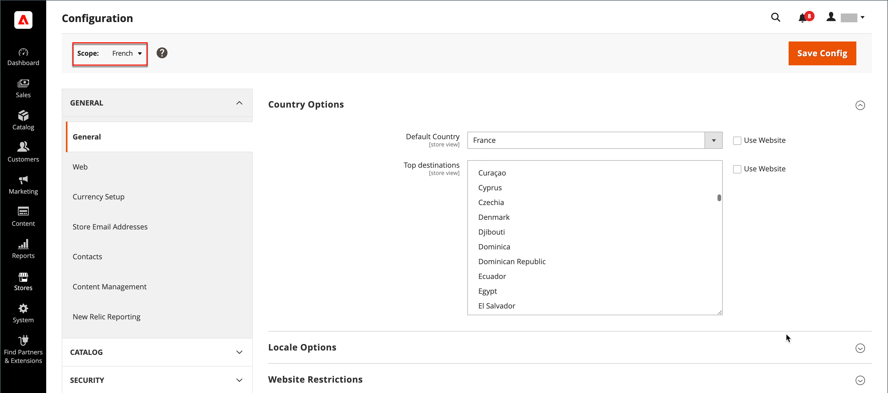

# 設定スコープ

多くの設定ページの左上隅にあるストア表示の選択は、特定の範囲についてページの表示をフィルタリングし、Commerceで使用される一部のエンティティの値を設定します。 階層内の各レベルが名前で一覧表示され、スコープを別のレベルに変更するために使用されます。 現在のスコープを表す設定はすべてグレー表示されるため、現在のスコープ設定を表す設定のみが使用可能になります。 範囲は最初に次のように設定されます。 _デフォルトの設定_. アクセスが制限された管理者ユーザーの場合、使用可能なストア表示のリストには、ユーザーが持っているストア表示のみが含まれます [権限](../systems/permissions.md) アクセスします。

| レベル | 説明 |
|--- |--- |
| [!UICONTROL Default Config] | デフォルトのシステム設定。 |
| [!UICONTROL Main Website] | 最上位の web サイトの名前。 |
| [!UICONTROL Main Website Store] | 親 web サイトに関連付けられているデフォルトストアの名前。 |
| [!UICONTROL Default Store View] | 親ストアに関連付けられているデフォルトのストア表示の名前。 |
| [!UICONTROL Stores Configuration] | を選択した場合と同じように、Stores グリッドにジャンプします。 [!UICONTROL Stores] > [!UICONTROL All Stores] 管理サイドバーから変更します。 |

{style="table-layout:auto"}

{width="700" zoomable="yes"}

## [!UICONTROL Use system value]

この _[!UICONTROL Use System Value]_多くの設定の右側にあるチェックボックスは、現在の設定スコープ内のデフォルトフィールド値を適用または上書きするために使用されます。 チェックボックスが選択されている場合、デフォルトフィールド値は変更できません。 値を変更するには、このチェックボックスをオフにして新しい値を入力します。 システム値を変更するたびに確認を求められます。

チェックボックスのラベルは、現在のスコープに応じて変わり、スコープ階層の 1 ステップ上の親レベルを常に参照します。 親レベルは、そのレベルの下にあるすべての項目のコンテナであるため、親レベルのスコープ設定は上書きされない限り継承されます。

## デフォルト値オプション

| Checkbox | 説明 |
|--- |--- |
| [!UICONTROL Use system value] | このチェックボックスは、設定範囲がに設定されている場合に表示されます `Default Config`. |
| [!UICONTROL Use Default] | このチェックボックスは、設定範囲が「メイン」に設定されている場合に表示されます `Website`、およびは、web サイトに割り当てられるデフォルトのストアを指します。 |
| [!UICONTROL Use Website] | このチェックボックスは、設定範囲が特定のストア表示に設定されている場合に表示されます。 選択した場合は、ストア表示に関連付けられている親 web サイトの設定が使用されます。 この場合、ストアレベルは、web サイトに関連付けられたデフォルトストアに適用されると理解されるので、スキップされます。 |

{style="table-layout:auto"}

## 範囲を設定

特定の web サイト、ストア、ストア表示のみに適用する設定を行う前に、次の操作を行います。

1. 日 _Admin_ サイドバーで、次のいずれかの操作を行います。

   - ほとんどの設定については、次を参照してください： **[!UICONTROL Stores]** > _[!UICONTROL Settings]_>**[!UICONTROL Configuration]**.

   - の場合 [設計関連の設定](../content-design/configuration.md)に移動します。 **[!UICONTROL Content]** > _[!UICONTROL Design]_>**[!UICONTROL Configuration]**. 次に、グリッドで、該当するストア表示を選択します。

1. 変更する設定に移動して、次の手順を実行します。

   - 左上隅にを設定します **[!UICONTROL Store View]** を設定が適用される特定のビューに移動します。 範囲の切り替えを確認するプロンプトが表示されたら、 **[!UICONTROL OK]**.

     各フィールドの後にチェックボックスが表示され、追加のフィールドが使用可能になる場合があります。

   - をクリア **[!UICONTROL Use system value]** 編集する任意のフィールドの後のチェックボックス。 次に、ビューの値を更新します。

   - ページ上で更新する必要があるすべてのフィールドに対して、このプロセスを繰り返します。

   {width="700" zoomable="yes"}

1. 完了したら、 **[!UICONTROL Save Config]**.

## 範囲のクイックリファレンス

| 範囲 | 説明 |
|--- |--- |
| **[!UICONTROL Global]** |  |
| Admin | インストール内のすべての web サイト、ストア、ストア表示は、同じ管理者から管理されます。 |
| デフォルトの設定 | グローバル [デフォルトの設定](../getting-started/websites-stores-views.md#scope-settings) 設定は、下位レベルで上書きされない限り、ストア階層を通じて使用されます。 |
| カタログ | 用語 _カタログ_ 製品データベース全体を指し、インストール全体で使用できます。 |
| 製品価格 | 製品価格は、グローバルレベルまたは web サイトレベルでアプリケーションに対して設定できます。 |
| 製品設定 | として使用される属性 [設定可能な製品](../catalog/product-create-configurable.md) オプションにはグローバル スコープが必要です。 |
| 顧客 | 顧客アカウントは、グローバルレベルまたは web サイトレベルでアプリケーション用に設定できます。 各 web サイトは、次の個別のセットを持つことができます [顧客アカウント](../customers/customer-account-scope.md) または、インストール内の他の web サイトで顧客アカウントを共有します。 |
| **[!UICONTROL Website]** |  |
| ドメイン | 追加 [web サイト](../stores-purchase/introduction.md#store-structure) プライマリドメインのサブドメインとして設定するか、個別の IP アドレスと専用ドメインを持つことができます。 |
| 顧客 | 顧客アカウントは、グローバルレベルまたは web サイトレベルでアプリケーション用に設定できます。 各 web サイトは、次の個別のセットを持つことができます [顧客アカウント](../customers/customer-account-scope.md) または、インストール内の他の web サイトで顧客アカウントを共有します。 |
| 通貨 | Web サイトごとに異なる割り当てを行うことができます [基準通貨](../stores-purchase/currency-configuration.md). 基本通貨は、すべてのトランザクションを処理するために使用されますが、ストア表示のロケールに応じて、異なる表示通貨が顧客に表示される場合があります。 |
| 製品 | 個々の製品は、web サイトレベルで階層に割り当てられます。 製品グリッドには、カタログ内のすべての製品と、それらの製品が使用可能な Web サイトが一覧表示されます。 この [Web サイト内の製品](../catalog/settings-basic-websites.md) を設定すると、製品が使用可能な各 web サイトが識別されます。 |
| 製品価格 | [製品価格](../catalog/catalog-price-scope.md) は、グローバルレベルまたは web サイトレベルでアプリケーション用に設定できます。 |
| 支払い方法 | [支払い方法](../stores-purchase/payments.md) は web サイトレベルで設定されますが、タイトルと手順はストア表示ごとに設定できます。 |
| チェックアウト | この [チェックアウトプロセス](../stores-purchase/checkout-process.md) web サイトレベルで実行されますが、ストアビューごとに設定できる表示オプションもあります。 Web サイトに関連付けられているすべてのストアは同じです [チェックアウト設定](../stores-purchase/checkout-process.md#checkout-options). |
| 許可されている国 | 許可する国は、web サイトレベルで設定できます。 この [許可されている国](../getting-started/store-details.md#country-options) 設定は、顧客の出所を制限するためにチェックアウトで使用されます。 |
| **[!UICONTROL Store]** |  |
| ドメイン | 複数のストアがある場合、各ストアは同じドメイン、サブドメインまたは明確に異なるドメインを持つことができます。 詳しくは、次を参照してください。 [ストアの追加](../stores-purchase/stores.md#add-stores). |
| ルートカテゴリ | 各店舗には、「ルート」カテゴリとサブカテゴリに基づく製品とメインメニューの別々のセットを持つことができます。 各カタログには、 [ルートカテゴリ](../catalog/category-root.md) これはストアレベルで割り当てられます。 |
| **[!UICONTROL Store View]** |  |
| サブカテゴリ | この [サブカテゴリ](../catalog/category-create.md#category-structure) メインメニュー（ルートの下）を構成するノードは、ストア表示レベルで割り当てられます。 |
| Locale | 各ストア表示には、異なる割り当てを行うことができます [locale](../getting-started/store-details.md#locale-options). 表示通貨、測定単位、管理インターフェイスはロケールに固有です。 |
| 言語 | 複数言語をサポートするには、製品の説明を含むすべてのコンテンツを [件翻訳済み](../stores-purchase/store-localize.md#localize-products) （ストア表示ごとに表示）。 |
| 通貨を表示 | 異なる [表示通貨](../stores-purchase/currency-configuration.md) 各ストア表示に使用できますが、トランザクションは基本通貨を使用して web サイトレベルで処理されます。 |

{style="table-layout:auto"}
