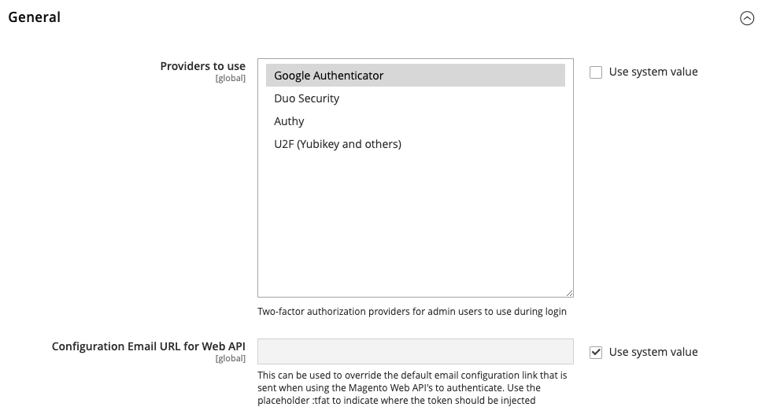
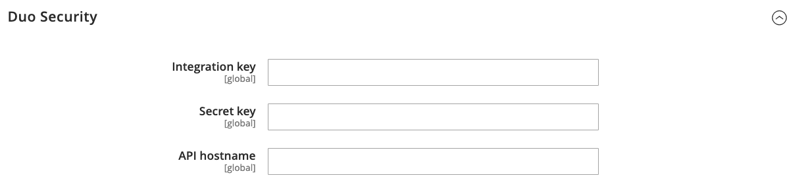

# [!UICONTROL Security] > [!UICONTROL 2FA]

>[!NOTE]
>
>Adobe Identity Management サービス（IMS）認証を有効にしているストアでは、ネイティブ Adobe CommerceとMagento Open Sourceの2要素認証（2FA）が無効になっています。 Adobeの資格情報を使用してAdobe Commerce インスタンスにログインしている管理者ユーザーは、多くの管理者タスクで再認証を行う必要はありません。 認証は、管理者ユーザーが現在のセッションにログインしたときにAdobe IMSによって処理されます。 [Adobe CommerceとAdobe IMSの統合の概要](https://experienceleague.adobe.com/docs/commerce-admin/start/admin/ims/adobe-ims-integration-overview.html)を参照してください。

{{config}}

これらの設定の変更について詳しくは、_管理者システムガイド_&#x200B;の[二段階認証（2FA） &#x200B;](../../systems/security-two-factor-authentication.md)を参照してください。

## [!UICONTROL General]

<!-- zoom -->

| フィールド | [範囲](../../getting-started/websites-stores-views.md#scope-settings) | 説明 |
|--- |--- |--- |
| [!UICONTROL Providers to use] | グローバル | 必要な2要素認証方法を示します。 複数のプロバイダーを選択した場合、各ユーザーは次回ログイン時に各2FA メソッドを設定する必要があります。 |
| [!UICONTROL Configuration Email URL for Web API] | グローバル | カスタム実装の場合、最初のログイン時に&#x200B;_管理者_ ユーザーに送信される代替メール設定リンクのURL。 メールテンプレートで、プレースホルダー`:tfat`を使用して、トークンが挿入される場所を示します。 |
| [!UICONTROL Retry attempt limit for Two-Factor Authentication] | グローバル | 管理者がアカウントを一時的に無効にする前に[!DNL one-time password (OTP)]を入力できる回数を指定します。 既定：`10` |
| [!UICONTROL Two-Factor Authentication lockout time (seconds)] | グローバル | 管理者がアカウントを一時的に無効にするまで[!DNL one-time password (OTP)]の入力を待つことができる時間（秒単位）を指定します。 既定：`300` |

{style="table-layout:auto"}

## [!UICONTROL Google]

<!-- zoom -->

| フィールド | [範囲](../../getting-started/websites-stores-views.md#scope-settings) | 説明 |
|--- |--- |--- |
| [!UICONTROL OTP Window] | グローバル | システムが管理者の[!DNL one-time-password (OTP)]の有効期限を過ぎてからシステムが受け入れる時間（秒単位）を決定します。 1つのOTPの有効期間（通常は30秒）より長くすることはできません。 既定：`29` |

{style="table-layout:auto"}

## [!UICONTROL Duo Security]

<!-- zoom -->

| フィールド | [範囲](../../getting-started/websites-stores-views.md#scope-settings) | 説明 |
|--- |--- |--- |
| [!UICONTROL Client Id] | グローバル | [!DNL Duo Security] アカウントのクライアント ID。 |
| [!UICONTROL Client Secret] | グローバル | [!DNL Duo Security] アカウントのクライアント秘密鍵。 |
| [!UICONTROL Integration Key] | グローバル | [!DNL Duo Security] API アカウントの統合キー。 |
| [!UICONTROL Secret Key] | グローバル | [!DNL Duo Security] API アカウントの秘密鍵。 |
| [!UICONTROL API Hostname] | グローバル | [!DNL Duo Security] アカウントのAPI ホスト名。 |

{style="table-layout:auto"}

## [!UICONTROL Authy]

<!-- zoom -->

| フィールド | [範囲](../../getting-started/websites-stores-views.md#scope-settings) | 説明 |
|--- |--- |--- |
| [!UICONTROL API Key] | グローバル | [!DNL Authy] アカウントのAPI キー。 |
| [!UICONTROL OneTouch Message] | グローバル | ログイン時に[!DNL Authy]認証者に表示されるメッセージ。 既定：`Login request to your Magento Admin` |

{style="table-layout:auto"}

## [!UICONTROL U2F Key]

<!-- zoom -->

| フィールド | [範囲](../../getting-started/websites-stores-views.md#scope-settings) | 説明 |
|--- |--- |--- |
| [!UICONTROL WebApi Challenge Domain] | グローバル | カスタム WebAPI実装の[!DNL WebAuthn]の課題を発行および処理するために使用されるドメイン。 |

{style="table-layout:auto"}
