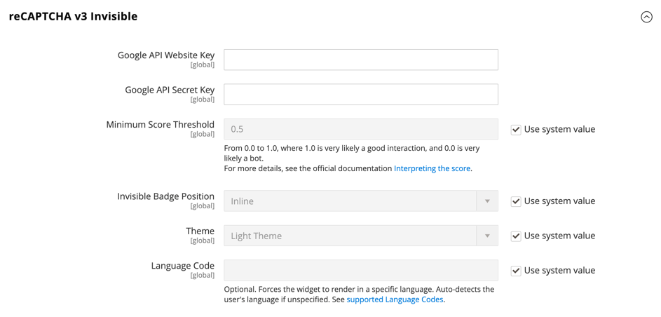

# [!UICONTROL Security] > [!UICONTROL Google reCAPTCHA Admin Panel]

>[!IMPORTANT]
>
>Google reCAPTCHA を設定する前に、`PHP.ini` ファイルに次の設定が含まれていることを確認する必要があります：`allow_url_fopen = 1`。 これには、開発者の支援が必要になる場合があります。 [&#x200B; インストールガイド &#x200B;](https://experienceleague.adobe.com/docs/commerce-operations/installation-guide/prerequisites/php-settings.html) の _必要な PHP 設定_ を参照してください。

{{config}}

これらの設定の変更方法について詳しくは、『 [&#x200B; 管理システムガイド &#x200B;](../../systems/security-google-recaptcha.md) の _Google reCAPTCHA_ を参照してください。

## [!UICONTROL reCAPTCHA v2 ("I am not a robot")]

<!-- zoom -->

| フィールド | [&#x200B; 範囲 &#x200B;](../../getting-started/websites-stores-views.md#scope-settings) | 説明 |
|--|--|--|
| [!UICONTROL Google API Website Key] | グローバル | Google reCAPTCHA アカウントの登録時に作成される web サイトキー。 |
| [!UICONTROL Google API Secret Key] | グローバル | Google reCAPTCHA アカウントに関連付けられた秘密鍵。 |
| [!UICONTROL Size] | グローバル | ログイン時に表示されるGoogle reCAPTCHA ボックスのサイズ。 オプション：`Normal` （デフォルト）/`Compact` |
| [!UICONTROL Theme] | グローバル | Google reCAPTCHA ボックスのスタイルを指定します。 オプション：`Light Theme` （デフォルト）/`Dark Theme` |
| [!UICONTROL Language Code] | グローバル | Google reCAPTCHA テキストおよびメッセージングに使用する言語を指定する [2 文字のコード &#x200B;](https://developers.google.com/recaptcha/docs/language)。 |

{style="table-layout:auto"}

## [!UICONTROL reCAPTCHA v2 Invisible]

<!-- zoom -->

| フィールド | [&#x200B; 範囲 &#x200B;](../../getting-started/websites-stores-views.md#scope-settings) | 説明 |
|--|--|--|
| [!UICONTROL Google API Website Key] | グローバル | Google reCAPTCHA アカウントの登録時に作成される web サイトキー。 |
| [!UICONTROL Google API Secret Key] | グローバル | Google reCAPTCHA アカウントに関連付けられた秘密鍵。 |
| [!UICONTROL Invisible Badge Position] | グローバル | 各ページの非表示の reCAPTCHA バッジの位置。 オプション：`Inline`/`Bottom Right`/`Bottom Left` |
| [!UICONTROL Theme] | グローバル | Google reCAPTCHA ボックスのスタイルを指定します。 オプション：`Light Theme` （デフォルト）/`Dark Theme` |
| [!UICONTROL Language Code] | グローバル | Google reCAPTCHA テキストおよびメッセージングに使用する言語を指定する [2 文字のコード &#x200B;](https://developers.google.com/recaptcha/docs/language)。 |

{style="table-layout:auto"}

## [!UICONTROL reCAPTCHA v3 Invisible]

<!-- zoom -->

| フィールド | [&#x200B; 範囲 &#x200B;](../../getting-started/websites-stores-views.md#scope-settings) | 説明 |
|--|--|--|
| [!UICONTROL Google API Website Key] | グローバル | Google reCAPTCHA アカウントの登録時に作成される web サイトキー。 |
| [!UICONTROL Google API Secret Key] | グローバル | Google reCAPTCHA アカウントに関連付けられた秘密鍵。 |
| [!UICONTROL Minimum Score Threshold] | グローバル | ユーザーインタラクションを潜在的なリスクとして識別する最小スコア。1.0 は一般的なユーザーインタラクションで、0.0 はボットである可能性が高いです。 デフォルト：`0.5` |
| [!UICONTROL Invisible Badge Position] | グローバル | 各ページの非表示の reCAPTCHA バッジの位置。 オプション：`Inline`/`Bottom Right`/`Bottom Left` |
| [!UICONTROL Theme] | グローバル | Google reCAPTCHA ボックスのスタイルを指定します。 オプション：`Light Theme` （デフォルト）/`Dark Theme` |
| [!UICONTROL Language Code] | グローバル | Google reCAPTCHA テキストおよびメッセージングに使用する言語を指定する [2 文字のコード &#x200B;](https://developers.google.com/recaptcha/docs/language)。 |

{style="table-layout:auto"}

## [!UICONTROL reCAPTCHA Failure Messages]

<!-- zoom -->

| フィールド | [&#x200B; 範囲 &#x200B;](../../getting-started/websites-stores-views.md#scope-settings) | 説明 |
|--|--|--|
| [!UICONTROL reCAPTCHA Validation Failure Message] | グローバル | 検証に失敗した場合に管理者に表示されるメッセージ。 既定のテキスト：`reCAPTCHA verification failed.` |
| [!UICONTROL reCAPTCHA Technical Failure Message] | グローバル | reCAPTCHA が検証結果を返さない場合に管理者に表示されるメッセージ。 既定のテキスト：`Something went wrong with reCAPTCHA. Please contact the store owner.` |

{style="table-layout:auto"}

## [!UICONTROL Admin Panel]

<!-- zoom -->

>[!NOTE]
>
>選択する reCAPTCHA タイプは、Google reCAPTCHA アカウントの API キーに関連付けられているタイプと一致する必要があります。

>[!WARNING]
>
>reCAPTCHA バージョン 3 を使用している場合、スコアの低い本物のユーザーは続行できません。 バージョン 2 の場合、スコアの低い正規のユーザーがチャレンジを受け取ります。 スコアの低い正規のユーザーに、課題を解決する機会（バージョン 2）があるか、ブロックされる機会（バージョン 3）がある場合は、慎重に検討します。

| フィールド | [&#x200B; 範囲 &#x200B;](../../getting-started/websites-stores-views.md#scope-settings) | 説明 |
|--|--|--|
| [!UICONTROL Enable for Login] | グローバル | [Admin ログイン &#x200B;](https://experienceleague.adobe.com/docs/commerce-admin/start/admin/admin-signin.html) に対して有効になっている reCAPTCHA のタイプを決定します。 オプション： **`No`**- （デフォルト）管理者ログインを検証しません。 **`reCAPTCHA v2 ("I am not a robot")`** - 「自分はロボットではない _チェックボックスをユーザーが選択する必要が_ ります。 **`Invisible reCAPTCHA v2`**- スコアに基づいてインタラクションを必要とせずに、バックグラウンドでのユーザーの行動を検証します。 **`Invisible reCAPTCHA v3`** - （推奨）インタラクションスコアに基づいて、バックグラウンドでのユーザーの行動を検証します。 |
| [!UICONTROL Enable for Forgot Password] | グローバル | [&#x200B; 管理者パスワードのリセット &#x200B;](https://experienceleague.adobe.com/docs/commerce-admin/start/admin/admin-signin.html#reset-your-password) をリクエストするために有効にする reCAPTCHA のタイプを決定します。 オプション： **`No`**- （デフォルト）パスワードリセットリクエストを検証しません。 **`reCAPTCHA v2 ("I am not a robot")`** - 「自分はロボットではない _チェックボックスをユーザーが選択する必要が_ ります。 **`Invisible reCAPTCHA v2`**- スコアに基づいてインタラクションを必要とせずに、バックグラウンドでのユーザーの行動を検証します。 **`Invisible reCaptcha v3`** - （推奨）インタラクションスコアに基づいて、バックグラウンドでのユーザーの行動を検証します。 |

{style="table-layout:auto"}
