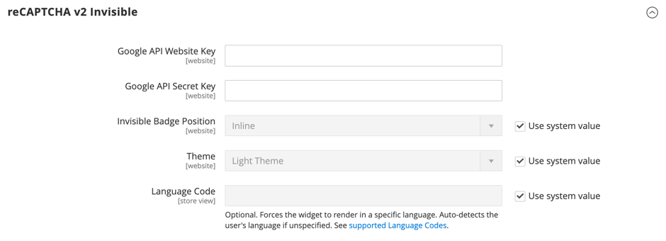

# [!UICONTROL Security] > [!UICONTROL Google reCAPTCHA Storefront]

>[!IMPORTANT]
>
>Google reCAPTCHA を設定する前に、 `PHP.ini` ファイルには次の設定が含まれます。 `allow_url_fopen = 1`. 開発者の支援が必要になる場合があります。 詳しくは、 [PHP 設定](https://experienceleague.adobe.com/docs/commerce-operations/installation-guide/prerequisites/php-settings.html) （内） _インストールガイド_.

{{config}}

Google reCAPTCHA を使用してストアを保護する方法について詳しくは、 Googleを参照してください。 [reCAPTCHA](../../systems/security-google-recaptcha.md) （内） _管理システムガイド_.

## [!UICONTROL reCAPTCHA v2 ("I am not a robot")]

<!-- zoom -->

| フィールド | [範囲](../../getting-started/websites-stores-views.md#scope-settings) | 説明 |
|--|--|--|
| [!UICONTROL Google API Website Key] | Web サイト | Google reCAPTCHA アカウントの登録時に作成される Web サイトキー。 |
| [!UICONTROL Google API Secret Key] | Web サイト | Google reCAPTCHA アカウントに関連付けられた秘密鍵。 |
| [!UICONTROL Size] | Web サイト | 顧客がアカウントにログインしたときに表示されるGoogle reCAPTCHA ボックスのサイズです。 オプション： `Normal` （デフォルト） / `Compact` |
| [!UICONTROL Theme] | Web サイト | Google reCAPTCHA ボックスのスタイルを決定します。 オプション： `Light Theme` （デフォルト） / `Dark Theme` |
| [!UICONTROL Language Code] | ストア表示 | The [2 文字コード](https://developers.google.com/recaptcha/docs/language) Google reCAPTCHA のテキストおよびメッセージに使用する言語を指定します。 |

{style="table-layout:auto"}

## [!UICONTROL reCAPTCHA v2 Invisible]

<!-- zoom -->

| フィールド | [範囲](../../getting-started/websites-stores-views.md#scope-settings) | 説明 |
|--|--|--|
| [!UICONTROL Google API Website Key] | Web サイト | Google reCAPTCHA アカウントの登録時に作成される Web サイトキー。 |
| [!UICONTROL Google API Secret Key] | Web サイト | Google reCAPTCHA アカウントに関連付けられた秘密鍵。 |
| [!UICONTROL Invisible Badge Position] | Web サイト | 各ページ上の非表示の reCAPTCHA バッジの位置。 オプション： `Inline` / `Bottom Right` / `Bottom Left` |
| [!UICONTROL Theme] | グローバル | Google reCAPTCHA ボックスのスタイルを決定します。 オプション： `Light Theme` （デフォルト） / `Dark Theme` |
| [!UICONTROL Language Code] | ストア表示 | A [2 文字コード](https://developers.google.com/recaptcha/docs/language) Google reCAPTCHA のテキストおよびメッセージに使用する言語を指定します。 |

{style="table-layout:auto"}

## [!UICONTROL reCAPTCHA v3 Invisible]

<!-- zoom -->

| フィールド | [範囲](../../getting-started/websites-stores-views.md#scope-settings) | 説明 |
|--|--|--|
| [!UICONTROL Google API Website Key] | Web サイト | Google reCAPTCHA アカウントの登録時に作成される Web サイトキー。 |
| [!UICONTROL Google API Secret Key] | Web サイト | Google reCAPTCHA アカウントに関連付けられた秘密鍵。 |
| [!UICONTROL Minimum Score Threshold] | グローバル | ユーザーのインタラクションを潜在的なリスクとして識別する最小スコア。1.0 は一般的なユーザーのインタラクション、0.0 はボットの可能性が高くなります。 デフォルト： `0.5` |
| [!UICONTROL Invisible Badge Position] | Web サイト | 各ページ上の非表示の reCAPTCHA バッジの位置。 オプション： `Inline` / `Bottom Right` / `Bottom Left` |
| [!UICONTROL Theme] | Web サイト | Google reCAPTCHA ボックスのスタイルを決定します。 オプション： `Light Theme` （デフォルト） / `Dark Theme` |
| [!UICONTROL Language Code] | ストア表示 | A [2 文字コード](https://developers.google.com/recaptcha/docs/language) Google reCAPTCHA のテキストおよびメッセージに使用する言語を指定します。 |

{style="table-layout:auto"}

## [!UICONTROL reCAPTCHA Failure Messages]

<!-- zoom -->

| フィールド | [範囲](../../getting-started/websites-stores-views.md#scope-settings) | 説明 |
|--|--|--|
| [!UICONTROL reCAPTCHA Validation Failure Message] | ストア表示 | 検証が失敗した場合にストアフロントに表示されるメッセージです。 デフォルトのテキスト： `reCAPTCHA verification failed.` |
| [!UICONTROL reCAPTCHA Technical Failure Message] | ストア表示 | reCAPTCHA が検証結果を返さなかった場合にストアフロントに表示されるメッセージ。 デフォルトのテキスト： `Something went wrong with reCAPTCHA. Please contact the store owner.` |

{style="table-layout:auto"}

## [!UICONTROL Storefront]

<!-- zoom -->

>[!NOTE]
>
>選択する reCAPTCHA タイプは、Google reCAPTCHA アカウントの API キーに関連付けられているタイプと一致する必要があります。

>[!WARNING]
>
>reCAPTCHA バージョン 3 を使用する場合、低スコアの本物のユーザーは続行できません。 バージョン 2 では、低スコアの本物のユーザーがチャレンジを受け取ります。 低スコアの正規ユーザーがチャレンジ（バージョン 2）を解決するか、ブロック（バージョン 3）を受ける機会がある場合は、慎重に検討してください。

| フィールド | [範囲](../../getting-started/websites-stores-views.md#scope-settings) | 説明 |
|--|--|--|
| [!UICONTROL Enable for Customer Login] | Web サイト | 顧客が使用する reCAPTCHA のタイプを指定します [サインイン](../../customers/customer-sign-in.md) 顧客の口座に オプション： **`No`**- （デフォルト）ログインリクエストを検証しません。 **`reCAPTCHA v2 ("I am not a robot")`**  — ユーザーが _私はロボットではありません_ チェックボックス。 **`Invisible reCAPTCHA v2`**— スコアに基づいたインタラクションを必要とせずに、バックグラウンドでのユーザーの行動を検証します。 **`Invisible reCAPTCHA v3`** - （推奨）インタラクションスコアに基づいて、バックグラウンドでのユーザーの行動を検証します。 |
| [!UICONTROL Enable for Forgot Password] | Web サイト | 顧客がリクエストした際に使用する reCAPTCHA のタイプを指定します。 [パスワードリセット](../../customers/password-reset.md). オプション： **`No`**- （デフォルト）パスワードのリセット要求を検証しません。 **`reCAPTCHA v2 ("I am not a robot")`**  — ユーザーが _私はロボットではありません_ チェックボックス。 **`Invisible reCAPTCHA v2`**— スコアに基づいたインタラクションを必要とせずに、バックグラウンドでのユーザーの行動を検証します。 **`Invisible reCAPTCHA v3`** - （推奨）インタラクションスコアに基づいて、バックグラウンドでのユーザーの行動を検証します。 |
| [!UICONTROL Enable for Create New Customer Account] | Web サイト | 顧客が [新しいアカウント](../../customers/account-create.md). オプション： **`No`**- （デフォルト）アカウントリクエストを検証しません。 **`reCAPTCHA v2 ("I am not a robot")`**  — ユーザーが _私はロボットではありません_ チェックボックス。 **`Invisible reCAPTCHA v2`**— スコアに基づいたインタラクションを必要とせずに、バックグラウンドでのユーザーの行動を検証します。 **`Invisible reCAPTCHA v3`** - （推奨）インタラクションスコアに基づいて、バックグラウンドでのユーザーの行動を検証します。 |
| [!UICONTROL Enable for Edit Customer Account] | Web サイト | 顧客が変更した際に使用する reCAPTCHA のタイプを指定します。 [アカウント情報](../../customers/account-dashboard-account-information.md). オプション： **`No`**- （デフォルト）アカウントリクエストを検証しません。 **`reCAPTCHA v2 ("I am not a robot")`**  — ユーザーが _私はロボットではありません_ チェックボックス。 **`Invisible reCAPTCHA v2`**— スコアに基づいたインタラクションを必要とせずに、バックグラウンドでのユーザーの行動を検証します。 **`Invisible reCAPTCHA v3`** - （推奨）インタラクションスコアに基づいて、バックグラウンドでのユーザーの行動を検証します。 |
| [!UICONTROL Enable for Create New Company Account] | Web サイト |  (B2B でのみAdobe Commerceで使用可能 ) 新規の [会社アカウント](../../b2b/account-company-create.md) が作成されました。 オプション： **`No`**- （デフォルト）アカウントリクエストを検証しません。 **`reCAPTCHA v2 ("I am not a robot")`**  — ユーザーが _私はロボットではありません_ チェックボックス。 **`Invisible reCAPTCHA v2`**— スコアに基づいたインタラクションを必要とせずに、バックグラウンドでのユーザーの行動を検証します。 **`Invisible reCAPTCHA v3`** - （推奨）インタラクションスコアに基づいて、バックグラウンドでのユーザーの行動を検証します。 |
| [!UICONTROL Enable for Contact Us] | Web サイト | メッセージを送信する際に使用する reCAPTCHA の種類を指定します。 [お問い合わせ](../../getting-started/store-details.md#contact-us-form) ストアのページに貼り付けます。 オプション： **`No`**- （デフォルト）メッセージリクエストを検証しません。 **`reCAPTCHA v2 ("I am not a robot")`**  — ユーザーが _私はロボットではありません_ チェックボックス。 **`Invisible reCAPTCHA v2`**— スコアに基づいたインタラクションを必要とせずに、バックグラウンドでのユーザーの行動を検証します。 **`Invisible reCAPTCHA v3`** - （推奨）インタラクションスコアに基づいて、バックグラウンドでのユーザーの行動を検証します。 |
| [!UICONTROL Enable for Product Review] | Web サイト | 顧客が [製品レビュー](../../merchandising-promotions/product-reviews.md). オプション： **`No`**- （デフォルト）製品レビュー要求を検証しません。 **`reCAPTCHA v2 ("I am not a robot")`**  — ユーザーが _私はロボットではありません_ チェックボックス。 **`Invisible reCAPTCHA v2`**— スコアに基づいたインタラクションを必要とせずに、バックグラウンドでのユーザーの行動を検証します。 **`Invisible reCAPTCHA v3`** - （推奨）インタラクションスコアに基づいて、バックグラウンドでのユーザーの行動を検証します。 |
| [!UICONTROL Enable for Newsletter Subscription] | Web サイト | 顧客が [ニュースレターの購読](../../merchandising-promotions/newsletter-subscribers.md). オプション： **`No`**- （デフォルト）ニュースレターの購読要求を検証しません。 **`reCAPTCHA v2 ("I am not a robot")`**  — ユーザーが _私はロボットではありません_ チェックボックス。 **`Invisible reCAPTCHA v2`**— スコアに基づいたインタラクションを必要とせずに、バックグラウンドでのユーザーの行動を検証します。 **`Invisible reCAPTCHA v3`** - （推奨）インタラクションスコアに基づいて、バックグラウンドでのユーザーの行動を検証します。 |
| [!UICONTROL Enable for Gift Card] | Web サイト |  (Adobe Commerceのみ ) 顧客が [ギフトカード](../../catalog/product-gift-card-create.md) コード。 オプション： **`No`**- （デフォルト）ギフトカードコードの送信を検証しません。 **`reCAPTCHA v2 ("I am not a robot")`**  — ユーザーが _私はロボットではありません_ チェックボックス。 **`Invisible reCAPTCHA v2`**— スコアに基づくインタラクションを必要とせずに、バックグラウンドでのユーザー行動を検証します。 **`Invisible reCAPTCHA v3`** - （推奨）インタラクションスコアに基づいて、バックグラウンドでのユーザーの行動を検証します。 |
| [!UICONTROL Enable for Invitation Create Account] | Web サイト | 顧客がアカウント作成を送信する際に使用する reCAPTCHA のタイプを指定します [招待状](../../merchandising-promotions/invitations.md) コード。 オプション： **`No`**- （デフォルト）招待用の電子メールの送信は検証されません。 **`reCAPTCHA v2 ("I am not a robot")`**  — ユーザーが _私はロボットではありません_ チェックボックス。 **`Invisible reCAPTCHA v2`**— スコアに基づくインタラクションを必要とせずに、バックグラウンドでのユーザー行動を検証します。 **`Invisible reCAPTCHA v3`** - （推奨）インタラクションスコアに基づいて、バックグラウンドでのユーザーの行動を検証します。 |
| [!UICONTROL Enable for Send to Friend] | Web サイト | 顧客が使用する reCAPTCHA のタイプを指定します [製品を共有する](../../stores-purchase/email-a-friend.md) 友人と オプション： **`No`**- （デフォルト）電子メールの送信を検証しません。 **`reCAPTCHA v2 ("I am not a robot")`**  — ユーザーが _私はロボットではありません_ チェックボックス。 **`Invisible reCAPTCHA v2`**— スコアに基づいたインタラクションを必要とせずに、バックグラウンドでのユーザーの行動を検証します。 **`Invisible reCAPTCHA v3`** - （推奨）インタラクションスコアに基づいて、バックグラウンドでのユーザーの行動を検証します。 |
| [!UICONTROL Enable for Wishlist Sharing] | Web サイト | 顧客が使用する reCAPTCHA のタイプを指定します [ウィッシュリストを共有する](../../stores-purchase/wishlist-storefront.md#share-the-wish-list). オプション： **`No`**- （デフォルト）メッセージと電子メールの送信は検証されません。 **`reCAPTCHA v2 ("I am not a robot")`**  — ユーザーが _私はロボットではありません_ チェックボックス。 **`Invisible reCAPTCHA v2`**— スコアに基づくインタラクションを必要とせずに、バックグラウンドでのユーザー行動を検証します。 **`Invisible reCAPTCHA v3`** - （推奨）インタラクションスコアに基づいて、バックグラウンドでのユーザーの行動を検証します。 |
| [!UICONTROL Enable for Coupon Codes] | Web サイト | 顧客が [クーポンコード](../../merchandising-promotions/price-rules-cart-coupon.md). オプション： **`No`**- （デフォルト）クーポンコードの送信を検証しません。 **`reCAPTCHA v2 ("I am not a robot")`**  — ユーザーが _私はロボットではありません_ チェックボックス。 **`Invisible reCAPTCHA v2`**— スコアに基づくインタラクションを必要とせずに、バックグラウンドでのユーザー行動を検証します。 **`Invisible reCAPTCHA v3`** - （推奨）インタラクションスコアに基づいて、バックグラウンドでのユーザーの行動を検証します。 |
| [!UICONTROL Enable for PayPal Payflow Pro payment form] | Web サイト | 顧客がで購入を支払う際に使用する reCAPTCHA のタイプを指定します。 [PayPal Payflow Pro](../../stores-purchase/paypal-payflow-pro.md). オプション： **`No`**- （デフォルト）パスワードのリセット要求を検証しません。 **`reCAPTCHA v2 ("I am not a robot")`**  — ユーザーが _私はロボットではありません_ チェックボックス。 **`Invisible reCAPTCHA v2`**— スコアに基づいたインタラクションを必要とせずに、バックグラウンドでのユーザーの行動を検証します。 **`Invisible reCAPTCHA v3`** - （推奨）インタラクションスコアに基づいて、バックグラウンドでのユーザーの行動を検証します。 |

{style="table-layout:auto"}
