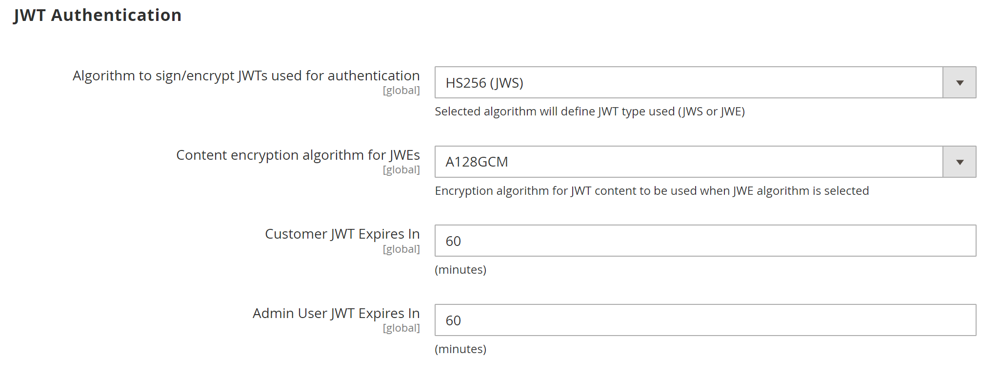

# [!UICONTROL Services] > [!UICONTROL Magento Web API]

{{config}}

<!-- [X-ref](../systems/integrations.md) -->

## [!UICONTROL SOAP Settings]

<!-- zoom -->

| フィールド | [範囲](../../getting-started/websites-stores-views.md#scope-settings) | 説明 |
|--- |--- |--- |
| [!UICONTROL Default Response Charset] | ストアビュー | デフォルトの文字セットを指定します。 空の場合は、UTF-8が使用されます。 |

{style="table-layout:auto"}

## [!UICONTROL GraphQl Input Limits]

<!-- zoom -->

| フィールド | [範囲](../../getting-started/websites-stores-views.md#scope-settings) | 説明 |
|--- |--- |--- |
| [!UICONTROL Enable Input Limits] | ストアビュー | GraphQL呼び出しに対して入力制限が有効かどうかを指定します。 デフォルト値：`No`。 |
| [!UICONTROL Maximum Page Size] | ストアビュー | GraphQL レスポンスでページ分割された検索結果で許可される最大項目数を設定します。 このオプションは、_入力制限を有効にする_ = `No`の場合は使用できません。 |

{style="table-layout:auto"}

## [!UICONTROL Web Api Input Limits]

<!-- zoom -->

| フィールド | [範囲](../../getting-started/websites-stores-views.md#scope-settings) | 説明 |
|--- |--- |--- |
| [!UICONTROL Enable Input Limits] | ストアビュー | Web API呼び出しに対して入力制限が有効かどうかを指定します。 デフォルト値：`No`。 |
| 入力リストの制限 | ストアビュー | Web API リクエストのエンティティ配列プロパティで許可されるアイテムの最大数を設定します。 このオプションは、_入力制限を有効にする_ = `No`の場合は使用できません。 |
| [!UICONTROL Maximum Page Size] | ストアビュー | Web API応答でページ分割された検索結果で許可される項目の最大数を設定します。 このオプションは、_入力制限を有効にする_ = `No`の場合は使用できません。 |
| [!UICONTROL Default Page Size] | ストアビュー | Web API応答のページ分割された検索結果のデフォルトの項目数を設定します。 |

{style="table-layout:auto"}

## [!UICONTROL Web API Security]

<!-- zoom -->

| フィールド | [範囲](../../getting-started/websites-stores-views.md#scope-settings) | 説明 |
|--- |--- |--- |
| [!UICONTROL Allow Anonymous Guest Access] | グローバル | ゲストは、SOAPとREST APIの両方からCMS、カタログ、およびストアリソースに匿名でアクセスできます。 デフォルトでは、匿名ゲストアクセスは許可されていません。 オプション：`Yes` / `No` |

{style="table-layout:auto"}

## [!UICONTROL JWT Authentication]

<!-- zoom -->

| フィールド | [範囲](../../getting-started/websites-stores-views.md#scope-settings) | 説明 |
|--- |--- |--- |
| [!UICONTROL Algorithm to sign/encrypt JWTs used for authentication] | グローバル | JWT （JSON Web Token）暗号化に使用するJWS アルゴリズムまたはJWE アルゴリズムのタイプを指定します |
| [!UICONTROL Content encryption algorithm for JWEs] | グローバル | JWE アルゴリズムが選択されている場合に、JWT暗号化に使用するコンテンツ暗号化アルゴリズムのタイプを指定します。 このオプションは、JWS アルゴリズムでは無視されます。 |
| [!UICONTROL Customer JWT Expires In] | グローバル | 顧客JWT ベアラートークンの有効期限が切れるまでの時間（分単位）を設定します。 顧客JWT ベアラートークンは、このフィールドが空の場合、または負の値を持つ場合、30分で期限切れになります。 デフォルト値：`60` |
| [!UICONTROL Admin User JWT Expires In] | グローバル | Admin JWT ベアラートークンの有効期限が切れるまでの時間（分単位）を設定します。 admin JWT ベアラートークンは、このフィールドが空の場合、または負の値を持つ場合、30分で期限切れになります。 デフォルト値：`60` |

{style="table-layout:auto"}
