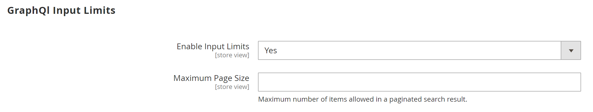
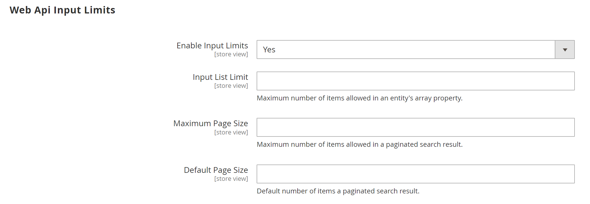

# [!UICONTROL Services] > [!UICONTROL Magento Web API]

{{config}}

<!-- [X-ref](../systems/integrations.md) -->

## [!UICONTROL SOAP Settings]

<!-- zoom -->

| フィールド | [範囲](../../getting-started/websites-stores-views.md#scope-settings) | 説明 |
|--- |--- |--- |
| [!UICONTROL Default Response Charset] | ストア表示 | デフォルトの文字セットを決定します。 空の場合は、UTF-8 が使用されます。 |

{style="table-layout:auto"}

## [!UICONTROL GraphQl Input Limits]

<!-- zoom -->

| フィールド | [範囲](../../getting-started/websites-stores-views.md#scope-settings) | 説明 |
|--- |--- |--- |
| [!UICONTROL Enable Input Limits] | ストア表示 | GraphQL呼び出しで入力の制限を有効にするかどうかを指定します。 デフォルト値： `No`. |
| [!UICONTROL Maximum Page Size] | ストア表示 | GraphQL応答のページ分割された検索結果で許可される項目の最大数を設定します。 このオプションは、 _入力制限を有効にする_ = `No`. |

{style="table-layout:auto"}

## [!UICONTROL Web Api Input Limits]

<!-- zoom -->

| フィールド | [範囲](../../getting-started/websites-stores-views.md#scope-settings) | 説明 |
|--- |--- |--- |
| [!UICONTROL Enable Input Limits] | ストア表示 | Web API 呼び出しに対して入力の制限を有効にするかどうかを決定します。 デフォルト値： `No`. |
| 入力リストの上限 | ストア表示 | Web API リクエストのエンティティ配列プロパティで許可される項目の最大数を設定します。 このオプションは、 _入力制限を有効にする_ = `No`. |
| [!UICONTROL Maximum Page Size] | ストア表示 | Web API 応答のページ分割された検索結果で許可される項目の最大数を設定します。 このオプションは、 _入力制限を有効にする_ = `No`. |
| [!UICONTROL Default Page Size] | ストア表示 | Web API 応答のページ分割された検索結果のデフォルトの項目数を設定します。 |

{style="table-layout:auto"}

## [!UICONTROL Web API Security]

<!-- zoom -->

| フィールド | [範囲](../../getting-started/websites-stores-views.md#scope-settings) | 説明 |
|--- |--- |--- |
| [!UICONTROL Allow Anonymous Guest Access] | グローバル | ゲストが SOAP および REST API の両方から CMS、カタログ、およびリソースを匿名でアクセスできるかを決定します。 デフォルトでは、匿名のゲストによるアクセスは許可されていません。 オプション： `Yes` / `No` |

{style="table-layout:auto"}

## [!UICONTROL JWT Authentication]

<!-- zoom -->

| フィールド | [範囲](../../getting-started/websites-stores-views.md#scope-settings) | 説明 |
|--- |--- |--- |
| [!UICONTROL Algorithm to sign/encrypt JWTs used for authentication] | グローバル | JWT（JSON Web トークン）暗号化に使用する JWS または JWE アルゴリズムの種類を指定します |
| [!UICONTROL Content encryption algorithm for JWEs] | グローバル | JWE アルゴリズムが選択されている場合に、JWT 暗号化に使用するコンテンツ暗号化アルゴリズムの種類を指定します。 このオプションは、JWS アルゴリズムでは無視されます。 |
| [!UICONTROL Customer JWT Expires In] | グローバル | 顧客の JWT ベアラートークンの有効期限が切れるまでの時間（分単位）を設定します。 このフィールドが空または負の値の場合、顧客 JWT ベアラートークンは 30 分後に期限切れになります。 デフォルト値： `60` |
| [!UICONTROL Admin User JWT Expires In] | グローバル | 管理 JWT ベアラートークンの有効期限が切れるまでの時間（分単位）を設定します。 このフィールドが空または負の値の場合、管理 JWT ベアラートークンは 30 分で有効期限が切れます。 デフォルト値： `60` |

{style="table-layout:auto"}
