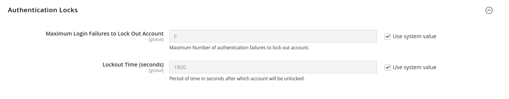

# [!UICONTROL Services] > [!UICONTROL OAuth]

{{config}}

## [!UICONTROL Access Token Expiration]

<!-- zoom -->

| フィールド | [ 範囲 ](../../getting-started/websites-stores-views.md#scope-settings) | 説明 |
|--- |--- |--- |
| [!UICONTROL Customer Token Lifetime (hours]） | グローバル | 顧客 API トークンの有効期限が切れるまでの時間（時間単位）を決定します。 フィールドが空の場合、顧客トークンの有効期限は切れません。 デフォルト値：`1` |
| [!UICONTROL Admin Token Lifetime (hours)] | グローバル | 管理 API トークンの有効期限が切れるまでの時間の長さを時間単位で決定します。 フィールドが空の場合、管理トークンの有効期限は切れません。 デフォルト値：`4` |

{style="table-layout:auto"}

>[!NOTE]
>
>ベアラー顧客および管理者 API トークンの有効期間と暗号化アルゴリズムは、「[JWT 認証 ](magento-web-api.md#jwt-authentication)」設定によって制御されます。

## [!UICONTROL Cleanup Settings]

<!-- zoom -->

| フィールド | [ 範囲 ](../../getting-started/websites-stores-views.md#scope-settings) | 説明 |
|--- |--- |--- |
| [!UICONTROL Cleanup Probability] | グローバル | クリーンアップが開始されるまでの OAuth 要求の数を指定します。 クリーンアップを無効にする場合は、`0` と入力しないでください。 |
| [!UICONTROL Enable WSDL Cache] | グローバル | エントリがクリーンアップされるまでの経過時間を分単位で指定します。 |

{style="table-layout:auto"}

## [!UICONTROL Consumer Settings]

<!-- zoom -->

| フィールド | [ 範囲 ](../../getting-started/websites-stores-views.md#scope-settings) | 説明 |
|--- |--- |--- |
| [!UICONTROL OAuth consumer credentials HTTP Post timeout] | グローバル | 顧客が資格情報を投稿したときにシステムがタイムアウトするまでにかかる秒数を指定します。 |
| [!UICONTROL OAuth consumer credentials HTTP Post maxredirects] | グローバル | 消費者資格情報の投稿に関連するリダイレクトの最大数を指定します。 |
| [!UICONTROL Expiration Period] | グローバル | OAuth トークンの交換が開始されてから、未使用のキーまたは秘密鍵が期限切れになるまでの秒数を決定します。 |

{style="table-layout:auto"}

## [!UICONTROL Authentication Locks]

<!-- zoom -->

| フィールド | [ 範囲 ](../../getting-started/websites-stores-views.md#scope-settings) | 説明 |
|--- |--- |--- |
| [!UICONTROL Maximum Login Failures to Lock Out Account] | グローバル | アカウントをロックアウトする認証エラーの最大数を指定します。 |
| [!UICONTROL Lockout Time (seconds)] | グローバル | アカウントがロック解除されるまでの期間を秒単位で指定します。 |

{style="table-layout:auto"}
