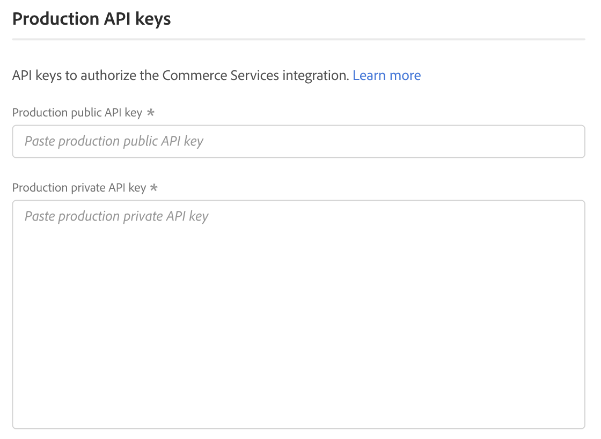

# [!UICONTROL Services] > [!UICONTROL Commerce Services Connector]

ストアをAdobe Commerce サービスに接続する方法については、[Commerce サービス ](https://experienceleague.adobe.com/docs/commerce/user-guides/integration-services/saas.html?lang=ja) を参照してください。

{{config}}

## [!UICONTROL Sandbox API Keys]

<!-- zoom -->

| フィールド | [ 範囲 ](../../getting-started/websites-stores-views.md#scope-settings) | 説明 |
|--- |--- |--- |
| [!UICONTROL Sandbox public API key] | グローバル | 作成者とその使用権限を識別する API キー（存在する場合）。 |
| [!UICONTROL Sandbox private API key] | グローバル | API キーに関連付けられた秘密鍵。 |

{style="table-layout:auto"}

## [!UICONTROL Production Keys]

<!-- zoom -->

| フィールド | [ 範囲 ](../../getting-started/websites-stores-views.md#scope-settings) | 説明 |
|--- |--- |--- |
| [!UICONTROL Production public API key] | グローバル | 作成者とその使用権限を識別する API キー（存在する場合）。 |
| [!UICONTROL Production private API key] | グローバル | API キーに関連付けられた秘密鍵。 |

{style="table-layout:auto"}

## [!UICONTROL SaaS Identifier]

<!-- zoom -->

| フィールド | [ 範囲 ](../../getting-started/websites-stores-views.md#scope-settings) | 説明 |
|--- |--- |--- |
| [!UICONTROL Project] | グローバル | すべての SaaS データ スペースをグループ化する SaaS プロジェクトの名前。 SaaS プロジェクトが存在しない場合は、「_プロジェクトを作成_」ボタンが表示されます。 |
| [!UICONTROL Data Space] | グローバル | 指定した SaaS プロジェクトの SaaS データ スペースを一覧表示します。 SaaS データスペースの数は、[Commerce ライセンスによって異なります ](https://experienceleague.adobe.com/docs/commerce/user-guides/integration-services/saas.html?lang=ja): Adobe Commerce - 1 つの実稼動データスペース；2 つのテスト用データスペース； Magento Open Source - 1 つの実稼動データスペース；テスト用データスペース |

{style="table-layout:auto"}

## [!UICONTROL IMS Organization]

<!-- zoom -->

| フィールド | 説明 |
|--- |--- |
| [!UICONTROL Sign in using Adobe ID] | Adobe IDは通常、メンバーシップを開始したとき、またはAdobe アプリケーションやサービスを購入したときに最初に使用したメールアドレスです。 Adobe IDは、Adobe アカウントにアクセスするために必要なキーです。 |

{style="table-layout:auto"}
