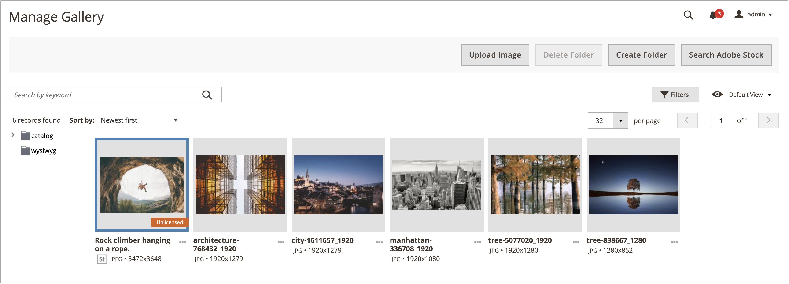
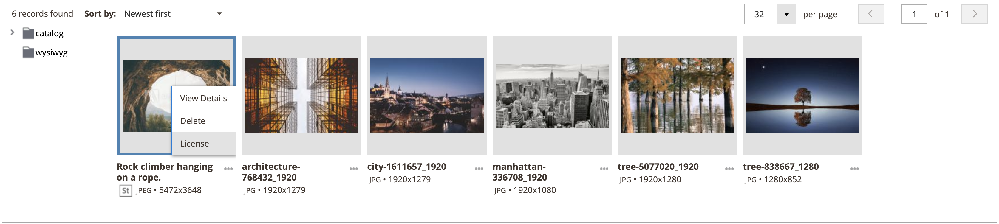
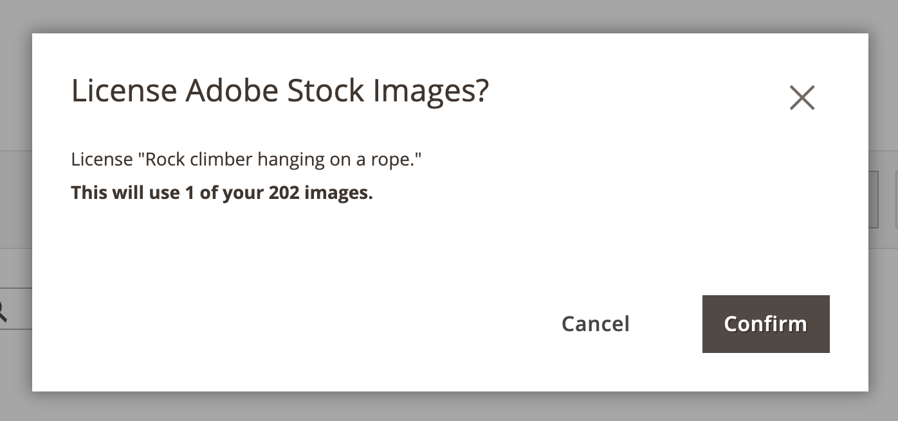

# Adobe Stock画像のライセンス認証

本番環境のAdobe CommerceおよびMagento Open Source ストアに使用するAdobe Stock アセットには、ライセンスが必要です。 このライセンスにより、画像への法的なアクセス権が付与され、すべての[画像プレビュー](./adobe-stock-save-preview.md)に存在するAdobe Stock透かしを削除できます。 画像のライセンスを取得したり、既にライセンス済みの画像を保存したりするには、Adobe アカウントにログインする必要があります。

新しい[[!DNL Media Gallery]](media-gallery.md)では、Adobe Stockとの直接的な統合が可能になり、ギャラリーページから画像を直接ライセンス供与することが容易になります。

>[!BEGINSHADEBOX]

**前提条件**

Adobe Stock ライセンス機能は、[Adobe Stock Integration](./adobe-stock.md)がインストールされ、設定されている場合にのみ使用できます。 [Adobe Stock](https://stock.adobe.com)の画像をライセンスするには、有料のAdobe Stock プランと[Adobe アカウント ](https://helpx.adobe.com/manage-account/using/access-adobe-id-account.html)が必要です。

>[!ENDSHADEBOX]

## 新しい[!DNL Media Gallery]から画像のライセンスを取得

1. _管理者_ サイドバーで、**[!UICONTROL Content]** > _[!UICONTROL Media]_>**[!UICONTROL Media Gallery]**に移動します。

1. [Adobe Stock Images](./adobe-stock-manage.md)を使用してログインし、プレビュー画像を[ メディアストレージ ](./media-storage.md)に保存する手順に従います。

   {width="600" zoomable="yes"}

1. 画像（{width="10" zoomable="no"}）の下にある3つのドットをクリックし、**[!UICONTROL License]**&#x200B;をクリックします。

   {width="600" zoomable="yes"}

   >[!NOTE]
   >
   >ログインしていない場合、ログインフォームが表示されます。 ログインについて詳しくは、[Adobe Stock Imagesの使用](./adobe-stock-manage.md)を参照してください。

1. ライセンス確認ダイアログで、**[!UICONTROL Confirm]**&#x200B;をクリックして画像のライセンスを取得します。

   {width="350" zoomable="yes"}

   >[!NOTE]
   >
   >画像のライセンスを取得するには、アカウントに[Adobe Stock クレジット ](https://helpx.adobe.com/stock/help/credit-packs.html)が必要です。

## 標準メディアストレージから画像のライセンスを取得する

1. [Adobe Stock検索グリッドにアクセス ](adobe-stock-manage.md)。

1. 画像の詳細を[表示](adobe-stock-manage.md#view-image-details)するには、検索グリッド内の画像を順番にクリックします。

1. 画像の現在のライセンス取得状況に応じて、次のいずれかの操作を行います。

   - 画像が既にライセンス済みの場合は、**[!UICONTROL Save]**&#x200B;をクリックします。

   - 画像が&#x200B;_not_ ライセンスの場合は、**[!UICONTROL License and Save]**&#x200B;をクリックします。

     >[!NOTE]
     >
     >画像のライセンスを取得するには、アカウントに[Adobe Stock クレジット ](https://helpx.adobe.com/stock/help/credit-packs.html)が必要です。

   このアクションは、画像を[ メディアストレージ ](./media-storage.md)に保存するために使用するファイル名を指定するためのプロンプトを表示します。 デフォルトのファイル名が指定されますが、好みに合わせて名前をカスタマイズできます。

   {width="550" zoomable="yes"}

1. **[!UICONTROL Confirm]**&#x200B;をクリックします。

   ページがメディアストレージにリダイレクトされ、保存されたプレビューが表示されます。
