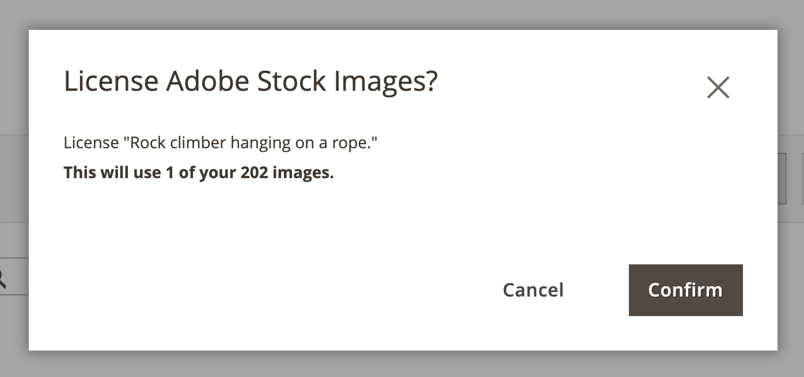

# Adobe Stock画像のライセンスを取得

Adobe CommerceおよびMagento Open Sourceの実稼動用ストアに使用するAdobe Stock アセットには、ライセンスを付与する必要があります。 このライセンスにより、画像への法的アクセスが可能になり、すべての [&#x200B; 画像プレビュー &#x200B;](./adobe-stock-save-preview.md) に存在するAdobe Stock透かしを排除できます。 画像のライセンスを取得したり、既にライセンスを取得している画像を保存したりするには、Adobe アカウントにログインする必要があります。

新しい [[!DNL Media Gallery]](media-gallery.md) はAdobe Stockとの直接統合を提供し、ギャラリーページから直接イメージのライセンスを簡単に取得できます。

>[!BEGINSHADEBOX]

**前提条件**

Adobe Stock ライセンス機能は、[Adobe Stock Integration](./adobe-stock.md) がインストールおよび設定されている場合にのみ使用できます。 [Adobe Stock][adobe-stock] 画像のライセンスを取得するには、有料のAdobe Stock プランと [Adobe アカウント ][adobe-signin] が必要です。

>[!ENDSHADEBOX]

## 新しい [!DNL Media Gallery] ージからの画像のライセンス

1. _管理者_ サイドバーで、**[!UICONTROL Content]**/_[!UICONTROL Media]_/**[!UICONTROL Media Gallery]**&#x200B;に移動します。

1. [Adobe Stock画像の使用 &#x200B;](./adobe-stock-manage.md) の手順に従って、ログインし、プレビューイメージを [&#x200B; メディアストレージ &#x200B;](./media-storage.md) に保存します。

   {width="600" zoomable="yes"}

1. 画像の下にある 3 つのドット（{width="10" zoomable="no"}）をクリックし、「**[!UICONTROL License]**」をクリックします。

   {width="600" zoomable="yes"}

   >[!NOTE]
   >
   >ログインしていない場合は、ログインフォームが表示されます。 ログインについて詳しくは、[Adobe Stock画像の使用 &#x200B;](./adobe-stock-manage.md) を参照してください。

1. ライセンス確認ダイアログで、「**[!UICONTROL Confirm]**」をクリックして画像のライセンスを取得します。

   {width="350" zoomable="yes"}

   >[!NOTE]
   >
   >画像のライセンスを取得するには、アカウントで利用可能な &rbrack;[stock-credits]0&rbrace;Adobe Stock クレジット &rbrace; が必要です。&lbrack;

## 標準メディアストレージからの画像のライセンス取得

1. [Adobe Stock検索グリッドへのアクセス ][access-search]。

1. [ 画像の詳細を表示 ][view-details] するには、検索グリッド内の画像を順番にクリックします。

1. イメージの現在のライセンス ステータスに応じて、次のいずれかの操作を行います。

   - 画像がライセンス済みの場合は、「**[!UICONTROL Save]**」をクリックします。

   - 画像がライセンス済み _ない_ 場合は、「**[!UICONTROL License and Save]**」をクリックします。

     >[!NOTE]
     >
     >画像のライセンスを取得するには、アカウントで利用可能な &rbrack;[stock-credits]0&rbrace;Adobe Stock クレジット &rbrace; が必要です。&lbrack;

   この操作を実行すると、イメージを [&#x200B; メディア ストレージ &#x200B;](./media-storage.md) に保存するために使用するファイル名を指定するよう求めるメッセージが表示されます。 デフォルトのファイル名が提供されますが、この名前は好みに合わせてカスタマイズできます。

   {width="550" zoomable="yes"}

1. 「**[!UICONTROL Confirm]**」をクリックします。

   ページがメディアストレージにリダイレクトされ、保存されたプレビューが表示されます。

[access-search]: adobe-stock-manage.md#access-the-adobe-stock-search-grid
[view-details]: adobe-stock-manage.md#view-image-details
[stock-credits]: https://helpx.adobe.com/jp/stock/help/credit-packs.html
[adobe-stock]: https://stock.adobe.com
[adobe-signin]: https://helpx.adobe.com/jp/manage-account/using/access-adobe-id-account.html
