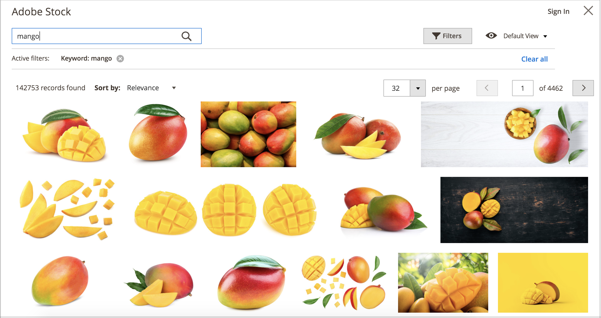
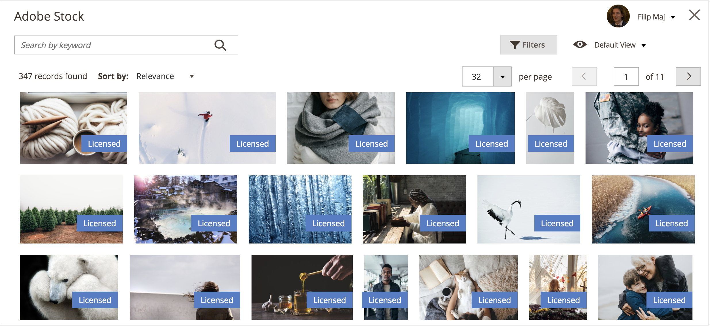
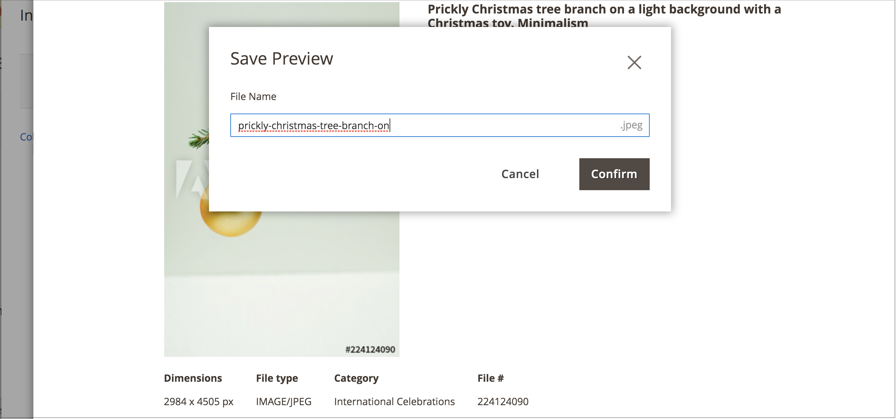

# Adobe Stock画像の使用

[Adobe Stock](https://stock.adobe.com) 独自の画像コンテンツのアップロードの代わりに画像を使用できます。 一般的なユースケースの 1 つは、ページの作成時に画像コンテンツをアップロードして配置することです。

この [[!DNL Media Gallery]](media-gallery.md) は、Adobe Stockと直接統合できるので、ギャラリーページから直接イメージのライセンスを簡単に取得できます。

## Adobe Stock検索グリッドへのアクセス

Adobe Stockの検索パネルには、次のタイミングでアクセスできます [ページの追加または編集](page-add.md)。条件： [カテゴリの作成または編集](../catalog/category-create.md)または次の場合 [コンテンツエディターを使用した画像の挿入](editor-insert-image.md).

**_Adobe Stock アセットを検索してストック画像を追加するには：_**

1. 日 _Admin_ サイドバー、に移動 **[!UICONTROL Content]** > _[!UICONTROL Elements]_>**[!UICONTROL Pages]**.

1. クリック **[!UICONTROL Add a New Page]**.

   既存のページを編集する場合は、 _[!UICONTROL Action]_クリックする列&#x200B;**[!UICONTROL Select]**を選択します&#x200B;**[!UICONTROL Edit]**.

1. を展開  この **[!UICONTROL Content]** を選択し、次の操作を実行します。

   - 次のような場合： [WYSIWYG エディター有効](editor.md)を選択し、 **[!UICONTROL Show/Hide Editor]** 次に、をクリックします **[!UICONTROL Insert Image]**.

   - 以下がある場合： [ページビルダー有効](../page-builder/setup.md)を展開します **[!UICONTROL Media]** パネルを開いてドラッグ **[!UICONTROL Image]** ターゲットコンテナへのプレースホルダー。 次に、 **[!UICONTROL Select from Gallery]**.

     {width="600" zoomable="yes"}

1. クリック **[!UICONTROL Search Adobe Stock]**.

**_Adobe Stock アセットを検索し、カテゴリにストック画像を追加するには：_**

1. 日 _Admin_ サイドバー、に移動 **[!UICONTROL Catalog]** > **[!UICONTROL Categories]**.

1. クリック **[!UICONTROL Add Root Category]** または **[!UICONTROL Add Subcategory]**.

   既存のカテゴリに画像を追加する場合は、左側の一覧でカテゴリ名をクリックします。

1. を展開します。 **[!UICONTROL Content]** セクションおよび下 _[!UICONTROL Category Image]_click **[!UICONTROL Select from Gallery]**.

1. クリック **[!UICONTROL Search Adobe Stock]**.

WYSIWYG エディターを使用してAdobe Stock アセットを検索し、ストック画像を追加するには：

1. click **[!UICONTROL Show/Hide Editor]**.

1. クリック **[!UICONTROL Insert Image]**.

1. クリック **[!UICONTROL Search Adobe Stock]**.

   {width="600" zoomable="yes"}

## Adobe Stock アセットのフィルタリングと検索

この [Adobe Stock検索グリッド](#access-the-adobe-stock-search-grid) には、クエリとフィルタリングの機能が用意されており、自分に最適な画像を見つけることができます [!DNL Commerce] ストア。

デフォルトで表示される検索結果は、Adobe Stockがキュレートした、数百件の結果のギャラリーです。 独自のキーワード検索を適用すると、Adobe Stockで使用可能な数百万のアセットが検索されます。

### キーワードでAdobe Stock アセットを検索

1. [Adobe Stock検索グリッドへのアクセス](#access-the-adobe-stock-search-grid).

1. キーワード検索をに入力します。 **[!UICONTROL Search by keyword]** 左上の入力フィールドで虫眼鏡をクリックするか、を押します **Enter**.

   {width="600" zoomable="yes"}

### Adobe Stock アセットのフィルタリング

1. [Adobe Stock Assets のキーワード検索の実行](#search-for-adobe-stock-assets-by-keywords).

1. クリック **[!UICONTROL Filters]**.

   検索結果を絞り込むために使用できるフィルターはいくつかあります。

   | フィルター | 説明 |
   |---|---|
   | [!UICONTROL Subcategory] | 次のような画像でフィルタリングします **写真** または **実例** |
   | [!UICONTROL Orientation] | サイズ、シェイプ、アスペクトで画像をフィルタリング |
   | [!UICONTROL Color] | カラーパレットを使用してカラーで画像をフィルタリングする |
   | [!UICONTROL Price] | コストに基づく画像のフィルタリング |
   | [!UICONTROL Safe search] | セーフ検索を有効または無効にする |
   | [!UICONTROL Isolated Assets] | 表示を次のみに制限： _分離されたアセット_：対象が単一の背景に表示される |

   {style="table-layout:auto"}

   {width="600" zoomable="yes"}

1. クリック **[!UICONTROL Apply Filters]**.

   絞り込んだ検索で検索結果グリッドが更新されます。

## 画像の詳細を表示

各画像には、表示可能な詳細があります。 その他の画像固有のアクション（など） [画像プレビューの保存](adobe-stock-save-preview.md) または [画像の保存（およびオプションでライセンス）](adobe-stock-license-image.md)は、この詳細ビューから利用できます。

1. [Adobe Stock検索グリッドへのアクセス](#access-the-adobe-stock-search-grid).

1. 検索結果の画像をクリックします。

   次のような画像の詳細が表示されます。

   - 画像の大きいバージョン
   - 画像メタデータ（例：） _[!UICONTROL Dimensions]_,_[!UICONTROL File type]_, _[!UICONTROL Category]_,_[!UICONTROL File]_、および _キーワード_
   - 関連する画像（同じ画像の画像など） _シリーズ_ または _モデル_
   - アクションボタン（例：） [[!UICONTROL Save Preview]](adobe-stock-save-preview.md) および [[!UICONTROL Save (and optionally license) Image]](adobe-stock-license-image.md)

     {width="600" zoomable="yes"}

## Adobeアカウントにログインします

画像に完全にアクセスし、Adobe Stockの透かしを削除するには、次の操作を行います [Adobeアカウントでログイン](https://helpx.adobe.com/manage-account/using/access-adobe-id-account.html) 画像を使用するためのライセンス権に対するクレジットを購入する。

1. [Adobe Stock検索グリッドへのアクセス](#access-the-adobe-stock-search-grid).

1. クリック **[!UICONTROL Sign In]** 右上。

   新しいブラウザーウィンドウのガイドに従って、次の操作を実行できます [Adobeのログインプロセス](https://helpx.adobe.com/manage-account/using/access-adobe-id-account.html).

   ログインプロセスが完了すると、検索結果に、ライセンス済みの画像の状態がラベルとして表示されます。

   {width="600" zoomable="yes"}

### 検索結果のライセンス済み状態の表示

[Adobeアカウントにログインします](#log-in-to-your-adobe-account).

Adobeアカウントに関連付けられているすべてのライセンス済み画像にはラベルが表示され、ライセンスを取得した画像が明確になります。

{width="600" zoomable="yes"}

### 画像をメディアストレージに保存

Adobe Stock統合を使用して検索された画像は、に保存できます [!DNL Commerce] [メディアストレージ](media-storage.md) を簡単に再利用できます。 [!DNL Commerce] ストア。

2 種類の画像を保存できます。 [画像プレビュー](adobe-stock-save-preview.md) または [ライセンス済み画像](adobe-stock-license-image.md).

#### 画像プレビューを保存

画像プレビューは、Adobe Stock アセットに透かしを入れたものです。 画像プレビューは無料で、特定の画像用のライセンスを購入して実稼動ストアで使用する前に、様々な画像を試すのに良い方法です。

1. [Adobe Stock検索グリッドへのアクセス](#access-the-adobe-stock-search-grid).

1. 終了 [画像の詳細の表示](#view-image-details)検索グリッドで画像をクリックします。

1. クリック **[!UICONTROL Save Preview]**.

   この操作を実行すると、イメージをメディア ストレージに保存するために使用するファイル名を指定するようプロンプトが表示されます。 デフォルトのファイル名が提供されますが、この名前は好みに合わせてカスタマイズできます。

   {width="500" zoomable="yes"}

1. クリック **[!UICONTROL Confirm]**.

   ページがメディアストレージにリダイレクトされ、保存されたプレビューが表示されます。

#### ライセンス取得済み画像の保存

実稼動に使用するAdobe Stock アセット [!DNL Commerce] ストアはライセンスが必要です。 ライセンスを取得することで、画像への法的アクセスが可能になり、すべてに存在するAdobe Stockの透かしを排除できます [画像プレビュー](adobe-stock-save-preview.md). 画像のライセンスを取得したり、既にライセンスを取得した画像を保存したりするには、Adobeアカウントにログインする必要があります。

1. [Adobeアカウントにログインします](#log-in-to-your-adobe-account).

1. 終了 [画像の詳細の表示](#view-image-details)検索グリッドで画像をクリックします。

1. イメージの現在のライセンス ステータスに応じて、次のいずれかの操作を行います。

   - 画像がライセンス済みの場合は、 **[!UICONTROL Save]**.

   - 画像がの場合 _ではない_ ライセンス済み、クリック **[!UICONTROL License and Save]**.

     >[!NOTE]
     >
     >利用可能である必要があります [Adobe Stock クレジット](https://helpx.adobe.com/stock/help/credit-packs.html) アカウントでをクリックして、画像のライセンスを取得します。

   この操作を実行すると、イメージをに保存するために使用するファイル名を指定するようプロンプトが表示されます [メディアストレージ](media-storage.md). デフォルトのファイル名が提供されますが、この名前は好みに合わせてカスタマイズできます。

1. クリック **[!UICONTROL Confirm]**.

   ページがメディアストレージにリダイレクトされ、保存されたプレビューが表示されます。
