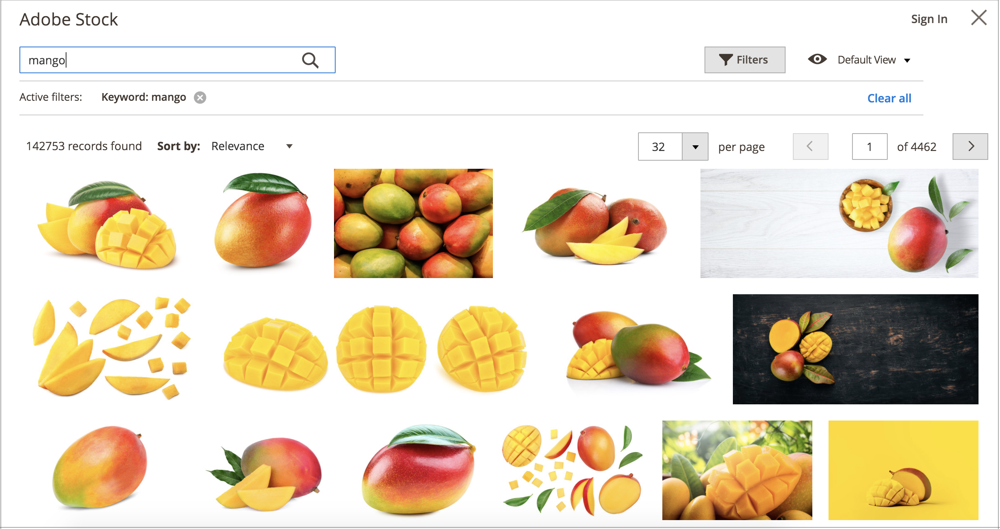
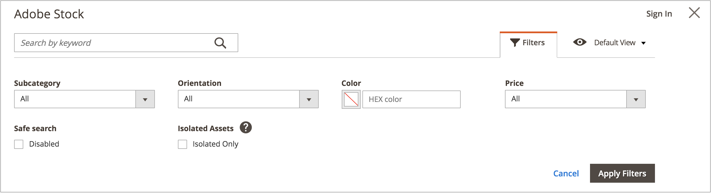
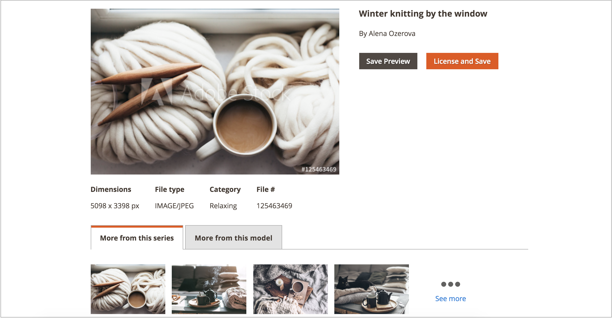
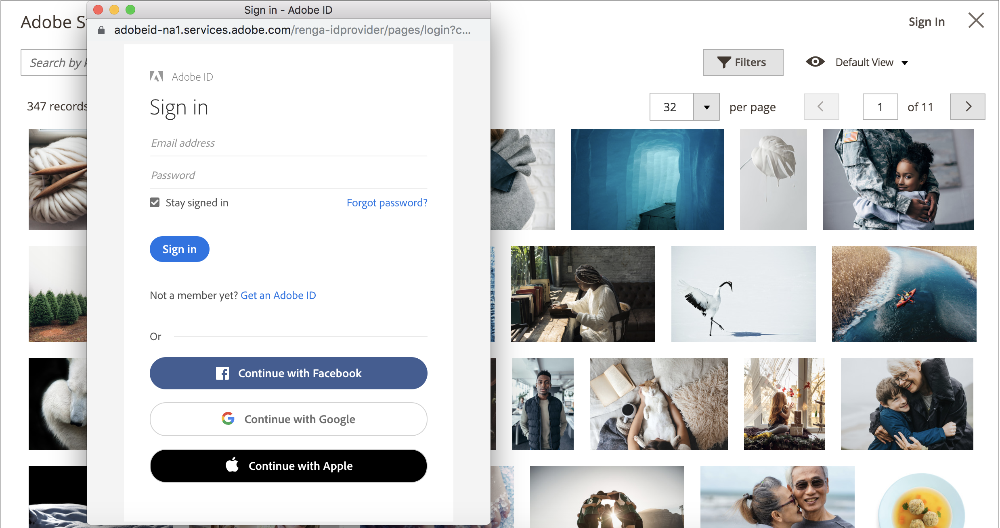
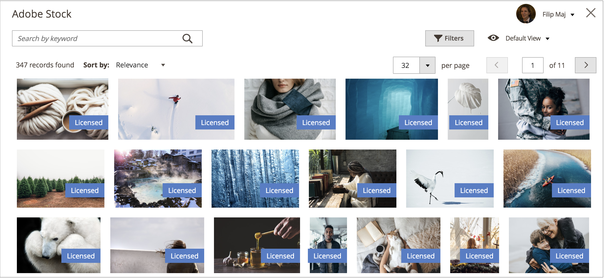

# Adobe Stockの画像を使用

[Adobe Stock](https://stock.adobe.com)の画像は、独自の画像コンテンツをアップロードする代わりに使用できます。 一般的なユースケースのひとつは、ページ作成時に画像コンテンツをアップロードして配置することです。

[[!DNL Media Gallery]](media-gallery.md)は、Adobe Stockとの直接的な統合を提供し、ギャラリーページから画像を直接ライセンス供与することが容易になります。

## Adobe Stockの検索グリッドにアクセス

Adobe Stockの検索パネルには、[&#x200B; ページを追加または編集する](page-add.md)、[&#x200B; カテゴリを作成または編集する](../catalog/category-create.md)、または[&#x200B; コンテンツエディターを使用して画像を挿入する](editor-insert-image.md)ときにアクセスできます。

**_Adobe Stock アセットを検索し、ストック画像をページに追加するには:_**

1. _管理者_ サイドバーで、**[!UICONTROL Content]** > _[!UICONTROL Elements]_>**[!UICONTROL Pages]**&#x200B;に移動します。

1. **[!UICONTROL Add a New Page]**&#x200B;をクリックします。

   既存のページを編集する場合は、_[!UICONTROL Action]_&#x200B;列を使用して&#x200B;**[!UICONTROL Select]**&#x200B;をクリックし、**[!UICONTROL Edit]**&#x200B;を選択できます。

1. **[!UICONTROL Content]** セクションのを展開し、次の操作を行います。

   - [WYSIWYG エディターが有効になっている](editor.md)場合は、**[!UICONTROL Show/Hide Editor]**&#x200B;をクリックし、**[!UICONTROL Insert Image]**&#x200B;をクリックします。

   - [&#x200B; ページビルダーが有効になっている](../page-builder/setup.md)場合は、**[!UICONTROL Media]** パネルを展開し、**[!UICONTROL Image]** プレースホルダーをターゲットコンテナにドラッグします。 次に、**[!UICONTROL Select from Gallery]**&#x200B;をクリックします。

     {width="600" zoomable="yes"}

1. **[!UICONTROL Search Adobe Stock]**&#x200B;をクリックします。

**_Adobe Stock アセットを検索し、ストック画像をカテゴリに追加するには:_**

1. _管理者_ サイドバーで、**[!UICONTROL Catalog]** > **[!UICONTROL Categories]**&#x200B;に移動します。

1. **[!UICONTROL Add Root Category]**&#x200B;または&#x200B;**[!UICONTROL Add Subcategory]**&#x200B;をクリックします。

   画像を既存のカテゴリに追加する場合は、左側のリストのカテゴリ名をクリックします。

1. **[!UICONTROL Content]** セクションを展開し、_[!UICONTROL Category Image]_&#x200B;の下で&#x200B;**[!UICONTROL Select from Gallery]**&#x200B;をクリックします。

1. **[!UICONTROL Search Adobe Stock]**&#x200B;をクリックします。

Adobe Stock アセットを検索し、WYSIWYG エディターからストック画像を追加するには：

1. **[!UICONTROL Show/Hide Editor]**&#x200B;をクリックします。

1. **[!UICONTROL Insert Image]**&#x200B;をクリックします。

1. **[!UICONTROL Search Adobe Stock]**&#x200B;をクリックします。

   {width="600" zoomable="yes"}

## Adobe Stock アセットのフィルタリングと検索

[Adobe Stock検索グリッド &#x200B;](#access-the-adobe-stock-search-grid)には、[!DNL Commerce]店舗に最適な画像を見つけやすくするためのクエリ機能とフィルタリング機能が用意されています。

デフォルトでは、表示される検索結果は、Adobe Stockがキュレートした数百件の検索結果ギャラリーからのものです。 独自のキーワード検索を導入すれば、Adobe Stockを通じて膨大な数のアセットを検索できます。

### キーワードによるAdobe Stock アセットの検索

1. [Adobe Stock検索グリッドにアクセス &#x200B;](#access-the-adobe-stock-search-grid)。

1. 左上の&#x200B;**[!UICONTROL Search by keyword]**&#x200B;入力フィールドにキーワード検索を入力し、拡大鏡をクリックするか、**Enter**&#x200B;を押します。

   {width="600" zoomable="yes"}

### Adobe Stock アセットのフィルタリング

1. [Adobe Stock アセットのキーワード検索を実行](#search-for-adobe-stock-assets-by-keywords)。

1. **[!UICONTROL Filters]**&#x200B;をクリックします。

   検索結果の絞り込みに使用できるフィルターはいくつかあります。

   | フィルター | 説明 |
   |---|---|
   | [!UICONTROL Subcategory] | **写真**&#x200B;または&#x200B;**イラスト**&#x200B;の画像のフィルター |
   | [!UICONTROL Orientation] | サイズ、形状、アスペクトによる画像のフィルタリング |
   | [!UICONTROL Color] | カラーパレットを使用して、画像をカラーでフィルタリングする |
   | [!UICONTROL Price] | コストに基づいて画像をフィルタリング |
   | [!UICONTROL Safe search] | セーフ検索を有効または無効にする |
   | [!UICONTROL Isolated Assets] | 表示を単色の背景に被写体が表示される&#x200B;_孤立アセット_&#x200B;のみに制限します |

   {style="table-layout:auto"}

   {width="600" zoomable="yes"}

1. **[!UICONTROL Apply Filters]**&#x200B;をクリックします。

   検索結果グリッドが、洗練された検索で更新されます。

## 画像の詳細を表示

各画像には、表示できる詳細があります。 [画像プレビューの保存](adobe-stock-save-preview.md)や[画像の保存（およびオプションでライセンス認証）など、画像固有の追加のアクションは、この詳細ビューから利用できます。](adobe-stock-license-image.md)

1. [Adobe Stock検索グリッドにアクセス &#x200B;](#access-the-adobe-stock-search-grid)。

1. 検索結果で画像をクリックします。

   次のような詳細な画像が表示されます。

   - 画像の大きなバージョン
   - _[!UICONTROL Dimensions]_、_[!UICONTROL File type]_、_[!UICONTROL Category]_、_[!UICONTROL File]_、_キーワード_&#x200B;などの画像メタデータ
   - 関連する画像（同じ&#x200B;_シリーズ_&#x200B;または&#x200B;_モデル_&#x200B;の画像など）
   - [[!UICONTROL Save Preview]](adobe-stock-save-preview.md)や[[!UICONTROL Save (and optionally license) Image]](adobe-stock-license-image.md)などのアクション ボタン

     {width="600" zoomable="yes"}

## Adobe アカウントにログインします

画像への完全なアクセス権を取得し、Adobe Stockの透かしを削除するには、[Adobe アカウントでログイン &#x200B;](https://helpx.adobe.com/jp/manage-account/using/access-adobe-id-account.html)し、画像を使用するライセンス権を購入する必要があります。

1. [Adobe Stock検索グリッドにアクセス &#x200B;](#access-the-adobe-stock-search-grid)。

1. 右上の「**[!UICONTROL Sign In]**」をクリックします。

   新しいブラウザーウィンドウが[Adobe サインインプロセス &#x200B;](https://helpx.adobe.com/jp/manage-account/using/access-adobe-id-account.html)を案内します。

   サインインプロセスが完了すると、画像のライセンス状態が検索結果にラベルとして表示されます。

   {width="600" zoomable="yes"}

### 検索結果のライセンス状態を表示

[Adobe アカウントにログイン &#x200B;](#log-in-to-your-adobe-account)。

Adobe アカウントに関連付けられたすべてのライセンス済み画像にはラベルが表示され、ライセンス済みの画像が明確になります。

{width="600" zoomable="yes"}

### 画像をメディアストレージに保存

Adobe Stock統合を使用して検索された画像は、[!DNL Commerce] [&#x200B; メディアストレージ &#x200B;](media-storage.md)に保存して、[!DNL Commerce] ストア全体で簡単に再利用できます。

[画像プレビュー](adobe-stock-save-preview.md)と[&#x200B; ライセンス画像](adobe-stock-license-image.md)の2種類の画像を保存できます。

#### 画像プレビューを保存

画像プレビューは、Adobe Stock アセットの透かし入りのバージョンです。 画像プレビューは無料で、特定の画像のライセンスを購入して実稼動ストアで使用する前に、様々な画像を試してみることができます。

1. [Adobe Stock検索グリッドにアクセス &#x200B;](#access-the-adobe-stock-search-grid)。

1. 画像の詳細を[表示](#view-image-details)するには、検索グリッドの画像をクリックします。

1. **[!UICONTROL Save Preview]**&#x200B;をクリックします。

   このアクションは、画像をメディアストレージに保存するために使用するファイル名を指定するためのプロンプトを表示します。 デフォルトのファイル名が指定されますが、好みに合わせて名前をカスタマイズできます。

   {width="500" zoomable="yes"}

1. **[!UICONTROL Confirm]**&#x200B;をクリックします。

   ページがメディアストレージにリダイレクトされ、保存されたプレビューが表示されます。

#### ライセンス済み画像を保存

実稼動[!DNL Commerce] ストアに使用するAdobe Stock アセットは、ライセンス認証が必要です。 ライセンスにより、画像への法的なアクセス権が付与され、すべての[画像プレビュー](adobe-stock-save-preview.md)に存在するAdobe Stock透かしを削除できます。 画像のライセンスを取得したり、既にライセンス済みの画像を保存したりするには、Adobe アカウントにログインする必要があります。

1. [Adobe アカウントにログイン &#x200B;](#log-in-to-your-adobe-account)。

1. 画像の詳細を[表示](#view-image-details)するには、検索グリッドの画像をクリックします。

1. 画像の現在のライセンス取得状況に応じて、次のいずれかの操作を行います。

   - 画像が既にライセンス済みの場合は、**[!UICONTROL Save]**&#x200B;をクリックします。

   - 画像が&#x200B;_not_ ライセンスの場合は、**[!UICONTROL License and Save]**&#x200B;をクリックします。

     >[!NOTE]
     >
     >画像のライセンスを取得するには、アカウントに[Adobe Stock クレジット &#x200B;](https://helpx.adobe.com/jp/stock/help/credit-packs.html)が必要です。

   このアクションは、画像を[&#x200B; メディアストレージ &#x200B;](media-storage.md)に保存するために使用するファイル名を指定するためのプロンプトを表示します。 デフォルトのファイル名が指定されますが、好みに合わせて名前をカスタマイズできます。

1. **[!UICONTROL Confirm]**&#x200B;をクリックします。

   ページがメディアストレージにリダイレクトされ、保存されたプレビューが表示されます。
