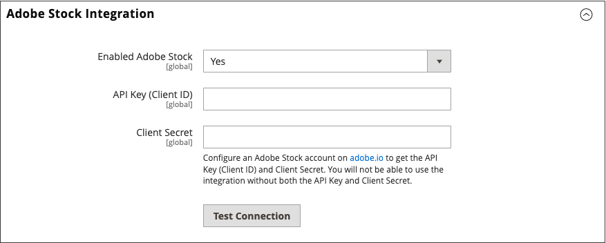

# Adobe Stockとの連携

ストアで使用する無数のメディアアセットにアクセスするには、[Adobe Stock](https://stock.adobe.com)を[!UICONTROL Commerce]と統合します。

{width="700" zoomable="yes"}

Adobe Stockサービスを利用すれば、あらゆるクリエイティブプロジェクトに必要な数百万もの高品質で厳選されたロイヤリティフリーの写真、ベクター、イラスト、ビデオ、テンプレート、3D アセットにアクセスできます。 [!DNL Commerce]人のユーザーが、Adobe Stock アセットをすばやく検索、プレビュー、ライセンス認証できます。 ユーザーは、管理者ワークスペースを離れることなく、これらを[&#x200B; メディアストレージ &#x200B;](./media-storage.md)に保存することもできます。

## 前提条件

この統合には次が必要です。

- [Adobe Developer](https://developer.adobe.com/console/home) アカウント
- Adobe CommerceまたはMagento Open Source、2.3.4以降

Adobe Stock画像のライセンスを取得するには、次の操作が必要です。

- [Adobe アカウント &#x200B;](https://helpx.adobe.com/manage-account/using/access-adobe-id-account.html)
- アカウントに関連付けられた有料[Adobe Stock](https://stock.adobe.com) プラン

## [!DNL Commerce]とAdobe Stockの統合

Adobe CommerceのAdobe Stock統合の設定は、次の2つの手順で行います。

1. [adobe.developer統合を作成](#create-an-adobe-developer-integration)してAPI キーを生成します
1. [Commerce AdminでのAdobe Stock統合の設定](#configure-the-adobe-stock-integration)

### Adobe Developerとの連携の構築

1. [Adobe Developer Console](https://developer.adobe.com/console/home)に移動します。

1. _[!UICONTROL Quick Start]_&#x200B;で、**[!UICONTROL Create new project]**&#x200B;をクリックします。

1. _[!UICONTROL Project overview]_&#x200B;ブロックで、**[!UICONTROL Add API]**&#x200B;をクリックします。

1. 統合リストから&#x200B;**[!UICONTROL Adobe Stock]**&#x200B;を選択し、**[!UICONTROL Next]**&#x200B;をクリックします。

1. OAuth 2.0 **[!UICONTROL Web App]**&#x200B;を選択します。

1. **[!UICONTROL redirect URI]**&#x200B;を指定します。

   デフォルトのリダイレクト URIは、`https://store.myshop.com/admin_hgkq1l/adobe_ims/oauth/callback/`などの形式の`${HOST}/${ADMIN_URI}/adobe_ims/oauth/callback/`です。ここで次のようになります。

   - `${HOST}`は[!DNL Commerce]の完全修飾ドメイン名です（例：`https://store.myshop.com`）。
   - `${ADMIN_URI}`は[!DNL Commerce]の管理者URI （`admin_hgkq1l`など）です。`magento info:adminuri`を実行すると取得できます。

1. **[!UICONTROL Redirect URI pattern]**&#x200B;を指定します。これは、リダイレクト URIと同じで、次の2つの違いがあります。

   - 任意のピリオド （`.`）を2つのバックスラッシュ （`\\`）でエスケープする必要があります。
   - パターンの最後に`.*`を追加します。

   前のデフォルトのリダイレクト URIの例を使用すると、パターンは`https://store\\.myshop\\.com/admin_hgkq1l/adobe_ims/oauth/callback/.*`になります

1. **[!UICONTROL Next]**&#x200B;をクリックします。

1. 使用可能な範囲を確認し、**[!UICONTROL Save configured API]**&#x200B;をクリックします。

1. 次のページで、**[!UICONTROL Client ID]** （API キー）と&#x200B;**[!UICONTROL Client secret]**&#x200B;をコピーします。

   この情報は、次の節の手順で使用します。

### Adobe Stock統合の設定

[!DNL Commerce]管理者でシステム構成を設定するには、[前のセクション &#x200B;](#create-an-adobeio-integration)で生成された&#x200B;_API キー_&#x200B;および&#x200B;_クライアントシークレット_&#x200B;を使用します。

1. _管理者_ サイドバーで、**[!UICONTROL Stores]** > _[!UICONTROL Settings]_>**[!UICONTROL Configuration]**&#x200B;に移動します。

1. 左側のパネルで、**[!UICONTROL Advanced]**&#x200B;を展開し、**[!UICONTROL System]**&#x200B;を選択します。

1.  **[!UICONTROL Adobe Stock Integration]**&#x200B;を展開し、次の操作を行います。

   - **[!UICONTROL Enabled Adobe Stock]**&#x200B;を`Yes`に設定します。

   - **[!UICONTROL API Key (Client ID)]**&#x200B;を入力します。

   - **[!UICONTROL Client Secret]**&#x200B;を入力します。

   - **[!UICONTROL Test Connection]**&#x200B;をクリックしてキーを検証します。

   {width="600" zoomable="yes"}

   検証に数秒間を費やします。 資格情報が有効な場合は、緑色の&#x200B;_接続が成功しました！_&#x200B;が表示されます メッセージ：

1. 完了したら、**[!UICONTROL Save Config]**&#x200B;をクリックします。
